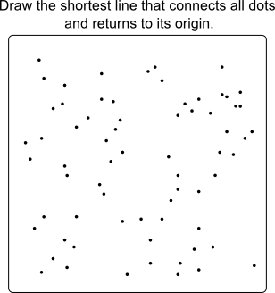

= How good are human planners?
ge0ffrey
2015-06-03
:page-interpolate: true
:jbake-type: post
:jbake-tags: insight, tsp, vehicle routing

Are we smarter than machines when it comes to planning? Or can automated planning beat humans?
I did an experiment with a group of innocent software engineers. These are the results.

== Methodology

During my last 2 deep dive trainings, I asked the attendees to manually solve a simple planning problem,
to introduce them to the difficulty of planning optimization.

I gave them a Traveling Salesman Problem (TSP) and asked them to *connect the dots* to find the shortest tour possible:

They laughed. _Isn't this a kids game? Yes, except that the dots are not numbered and you're not looking for Mickey Mouse._

Calculating a trip's distance on paper is not practical,
so they recreated their trips in the TSP example in OptaPlanner examples (only since `6.3.0.Beta1`) to calculate the distance automatically.
You can try this assignment yourself: right-click in the example's UI to manually create a trip.

Their first attempt and their best attempt in a time window of almost 30 minutes was recorded.
This is the optimal solution that we hoped to find:

image::humanPlannersTspGoalBlog.png[align="center"]

== Results

No one found the optimal solution. Most people didn't even find a near optimal solution (including me):

|===
||First attempt|Best attempt

|Optimal|674|674
|Average human|752|732
|Average human worse than optimal|12%|9%
|===

*On average, a human's best result was 9% worse than the optimal solution.
That means it roughly takes 9% more time and 9% more fuel to visit those locations. That's expensive.*

That's just on a small problem with only 1 constraint!
In the real world, other constraints need to be taken into account,
such as https://www.optaplanner.org/blog/2013/08/06/FalseAssumptionsForVRP.html[vehicle capacity],
https://www.optaplanner.org/blog/2015/03/20/3BugsInTheUltimateAmericanRoadTrip.html[real road networks]
and custom business constraints. All of these make it harder.

Below are the individual results:

image::humanPlannerTspResults.png[align="center"]

|===
|First attempt|Best attempt

|825|825
|821|821
|813|813
|892|807
|802|802
|792|792
|772|772
|762|762
|798|757
|765|743
|758|742
|727|727
|765|714
|755|714
|712|712
|712|712
|729|710
|759|710
|723|706
|705|705
|796|702
|738|702
|702|702
|720|701
|725|700
|717|699
|699|699
|701|693
|692|692
|735|688
|692|676
|===

The best attempt of the best human was only 0.3% worse than optimal. That's a very nice result.
If I recall correctly, he did take longer than 30 minutes to find it.
Was this skill or luck (or a combination of both)? The second best human (out of 31 people) was 2% worse than optimal.

With automated planning, such as https://www.optaplanner.org/[OptaPlanner], we can beat the human results, in far less time.
We can also scale to bigger datasets with more constraints. Does this mean we can get rid of the human planner?

== Do we need a human planner?

We still need a human planner: not to search for the best plan, but _to define what to search for_.
A search engine like Google can search the web, but it needs to be told what to look for.
Similarly, any automated solver (including https://www.optaplanner.org/[OptaPlanner]) can optimize a planning,
but it needs to be told what to optimize for.

In a non-trivial enterprise, defining what the business wants/needs to optimize, is not a simple task.
It involves talking to the business departments and iteratively tweaking those constraints.
We still need a human to that.
And as the business changes (market changes, labor regulations changes, ...) those constraints will change too.
Again, we need a human to watch over the planner.
We also need someone to input the data and validate the results.
Furthermore, https://www.optaplanner.org/blog/2013/10/11/WillSkynetControlOurSchedule.html[the human needs to stay in control].

But ask yourself: Who of these 2 contenders will win a knowledge quiz?

* The smartest person on the planet
* An average graduate with internet and Wikipedia access

Similarly, who do you want to optimize the planning in your organization? Someone with or without automated planning assistance?
