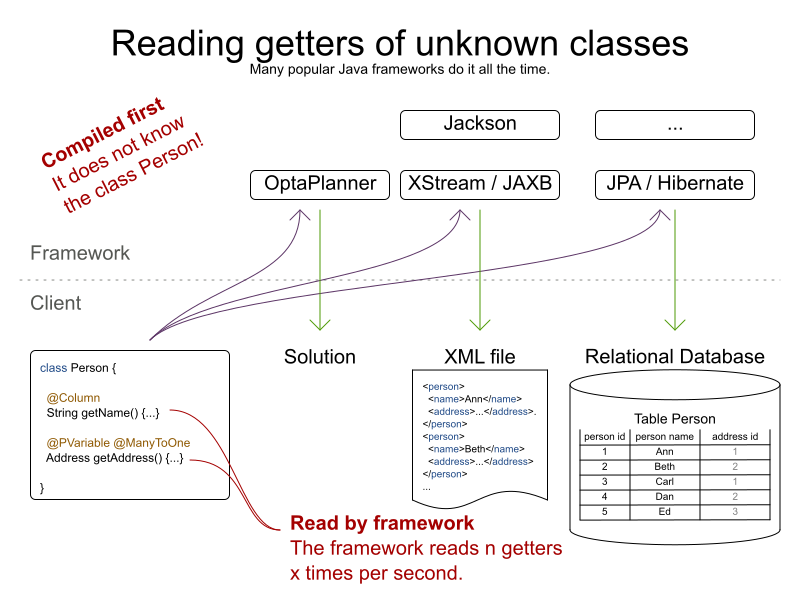

= Java Reflection, but much faster
ge0ffrey
2018-01-09
:page-interpolate: true
:jbake-type: post
:jbake-tags: coding, benchmark
:jbake-social_media_share_image: reflectionButFasterUseCase.png

What is the fastest way to read a getter from a Java class without knowing the class at compilation time?
Java frameworks often do this. A lot. And it can directly influence their performance.
So let's benchmark different approaches, such as reflection, method handles and code generation.

== The use case

Presume we have a simple `Person` class with a name and an address:

[source,java]
----
public class Person {
   ...

   public String getName() {...}
   public Address getAddress() {...}

}
----

and we want to use frameworks such as:

- http://x-stream.github.io/[XStream], JAXB or https://github.com/FasterXML/jackson[Jackson] to serialize instances to XML or JSON.
- http://hibernate.org/[JPA/Hibernate] to store persons in a database.
- https://www.optaplanner.org/[OptaPlanner] to assign addresses (in case they're tourists or homeless).

_None of these frameworks know the `Person` class._ So they can't simply call `person.getName()`:

[source,java]
----
   // Framework code
   public Object executeGetter(Object object) {
      // Compilation error: class Person is unknown to the framework
      return ((Person) object).getName();
   }
----

Instead, the code uses reflection, method handles or code generation.

But _such code is called an awful lot_:

* If you insert 1000 different persons in a database, JPA/Hibernate probably calls such code 2000 times:
** 1000 calls to `Person.getName()`
** another 1000 calls to `Person.getAddress()`
* Similarly, if you write 1000 different persons to XML or JSON, there are likely 2000 calls by XStream, JAXB or Jackson.

Obviously, when such code is called x times per second, *its performance matters*.

== The benchmarks

Using JMH, I ran a set of micro benchmarks using OpenJDK 1.8.0_111 on Linux
on a 64-bit 8-core Intel i7-4790 desktop with 32GB RAM.
The JMH benchmark ran with 3 forks, 5 warmup iterations of 1 second and 20 measurement iterations of 1 second.
All warmup costs are gone: increasing the length of an iteration to 5 seconds has little or no impact on the numbers reported here.

The source code of https://github.com/ge0ffrey/ge0ffrey-presentations/blob/master/code/fasterreflection/fasterreflection-client/src/main/java/be/ge0ffrey/presentations/fasterreflection/client/FasterReflectionClientBenchmark.java[that benchmark]
is in https://github.com/ge0ffrey/ge0ffrey-presentations/tree/master/code/fasterreflection[this GitHub repository].

== The TL;DR results

* *Java Reflection is slow.* (*)
* *Java MethodHandles are slow too.* (*)
* *Generated code with `javax.tools.JavaCompiler` is fast.* (*)
* *LambdaMetafactory is pretty fast.* (*)

(*) On the use cases I benchmarked with the workload I used. Your mileage may vary.

So the devil is in the details.
Let's go through the implementations,
to confirm I applied typical magical tricks (such as `setAccessible(true)`).

== Implementations

=== Direct access (baseline)

I've used a normal `person.getName()` call as the baseline:

[source,java]
----
public final class MyAccessor {

    public Object executeGetter(Object object) {
        return ((Person) object).getName();
    }

}
----

This takes about 2.6 nanoseconds per operation:

[source, txt]
----
Benchmark           Mode  Cnt  Score   Error  Units
===================================================
DirectAccess        avgt   60  2.590 ± 0.014  ns/op
----

*Direct access is naturally the fastest approach at runtime, with no bootstrap cost.
But it imports `Person` at compilation time, so it's unusable by every framework.*

=== Reflection

The obvious way for a framework read that getter at runtime, without knowing it in advance,
is through Java Reflection:

[source,java]
----
public final class MyAccessor {

    private final Method getterMethod;

    public MyAccessor() {
        getterMethod = Person.class.getMethod("getName");
        // Skip Java language access checking during executeGetter()
        getterMethod.setAccessible(true);
    }

    public Object executeGetter(Object bean) {
        return getterMethod.invoke(bean);
    }

}
----

Adding `setAccessible(true)` call makes these reflection calls faster,
but even then it takes 5.5 nanoseconds per call.

[source, txt]
----
Benchmark           Mode  Cnt  Score   Error  Units
===================================================
DirectAccess        avgt   60  2.590 ± 0.014  ns/op
Reflection          avgt   60  5.275 ± 0.053  ns/op
----

*Reflection is 104% slower than direct access (so about twice as slow).*
It also takes longer to warm up.

This wasn't a big surprise to me,
because when I profile (using sampling) an artificially simple
https://www.optaplanner.org/learn/useCases/vehicleRoutingProblem.html[Traveling Salesman Problem]
with 980 cities in https://www.optaplanner.org/[OptaPlanner],
the reflection cost sticks out like a sore thumb:

image::reflectionTspIncrementalCalculationSamplingProfiler.png[link="reflectionTspIncrementalCalculationSamplingProfiler.png" role="thumbnail"]

=== MethodHandles

MethodHandle was introduced in Java 7 to support _invokedynamic_ instructions.
According to the Javadoc, it's _a typed, directly executable reference to an underlying method._
Sounds fast, right?

[source,java]
----
public final class MyAccessor {

    private final MethodHandle getterMethodHandle;

    public MyAccessor() {
        MethodHandles.Lookup lookup = MethodHandles.lookup();
        // findVirtual() matches signature of Person.getName()
        getterMethodHandle = lookup.findVirtual(Person.class, "getName", MethodType.methodType(String.class))
            // asType() matches signature of MyAccessor.executeGetter()
            .asType(MethodType.methodType(Object.class, Object.class));
    }

    public Object executeGetter(Object bean) {
        return getterMethodHandle.invokeExact(bean);
    }

}
----

Well unfortunately, *MethodHandle is even slower than reflection* in OpenJDK 8.
It takes 6.1 nanoseconds per operation, so 136% slower than direct access.

[source, txt]
----
Benchmark           Mode  Cnt  Score   Error  Units
===================================================
DirectAccess        avgt   60  2.590 ± 0.014  ns/op
Reflection          avgt   60  5.275 ± 0.053  ns/op
MethodHandle        avgt   60  6.100 ± 0.079  ns/op
----

Using `lookup.unreflectGetter(Field)` instead of `lookup.findVirtual(...)` has no notable difference.
I do hope that MethodHandle will become as fast as direct access in future Java versions.

=== Static MethodHandles (update on 2018-01-11)

I also ran a benchmark with MethodHandle in a static field.
The JVM can do more magic with static fields, https://shipilev.net/jvm-anatomy-park/17-trust-nonstatic-final-fields/[as explained by Aleksey Shipilёv].
Aleksey and John O'Hara correctly pointed out that the original benchmark didn't use static fields correctly,
so I fixed that. Here are the amended results:

[source, txt]
----
Benchmark           Mode  Cnt  Score   Error  Units
===================================================
DirectAccess        avgt   60  2.590 ± 0.014  ns/op
MethodHandle        avgt   60  6.100 ± 0.079  ns/op
StaticMethodHandle  avgt   60  2.635 ± 0.027  ns/op
----

Yes, *a static MethodHandle is as fast as direct access, but it's still useless*, unless we want to write code like this:

[source,java]
----
public final class MyAccessors {

    private static final MethodHandle handle1; // Person.getName()
    private static final MethodHandle handle2; // Person.getAge()
    private static final MethodHandle handle3; // Company.getName()
    private static final MethodHandle handle4; // Company.getAddress()
    private static final MethodHandle handle5; // ...
    private static final MethodHandle handle6;
    private static final MethodHandle handle7;
    private static final MethodHandle handle8;
    private static final MethodHandle handle9;
    ...
    private static final MethodHandle handle1000;

}
----

If our framework deals with a domain class hierarchy with 4 getters, it would fill up the first 4 fields.
However, if it deals with 100 domain classes with 20 getters each, totaling 2000 getters,
it will crash due to a lack of static fields.

Besides, if I wrote code like this, even first year students would come tell me that _I am doing it wrong_.
Static fields shouldn't be used for instance variables.

=== Generated code with javax.tools.JavaCompiler

In Java, it's possible to compile and run generated Java code at runtime.
So with the `javax.tools.JavaCompiler` API, we can generate the direct access code at runtime:

[source,java]
----
public abstract class MyAccessor {

    // Just a gist of the code, the full source code is linked in a previous section
    public static MyAccessor generate() {
        final String String fullClassName = "x.y.generated.MyAccessorPerson$getName";
        final String source = "package x.y.generated;\n"
                + "public final class MyAccessorPerson$getName extends MyAccessor {\n"
                + "    public Object executeGetter(Object bean) {\n"
                + "        return ((Person) object).getName();\n"
                + "    }\n"
                + "}";
        JavaFileObject fileObject = new ...(fullClassName, source);

        JavaCompiler compiler = ToolProvider.getSystemJavaCompiler();
        ClassLoader classLoader = ...;
        JavaFileManager javaFileManager = new ...(..., classLoader)
        CompilationTask task = compiler.getTask(..., javaFileManager, ..., singletonList(fileObject));
        boolean success = task.call();
        ...
        Class compiledClass = classLoader.loadClass(fullClassName);
        return compiledClass.newInstance();
    }

    // Implemented by the generated subclass
    public abstract Object executeGetter(Object object);

}
----

The full source code is much longer and available in https://github.com/ge0ffrey/ge0ffrey-presentations/tree/master/code/fasterreflection[this GitHub repository].
For more information on how to use `javax.tools.JavaCompiler`,
take a look at http://www.informit.com/articles/article.aspx?p=2027052&seqNum=2[page 2 of this article]
or https://www.ibm.com/developerworks/library/j-jcomp/index.html[this article].
In Java 8, it requires the `tools.jar` on the classpath, which is there automatically in a JDK installation.
In Java 9, it requires the module `java.compiler` in the modulepath.
Also, proper care needs to be taken that it doesn't generate a `classlist.mf` file in the working directory
and that it uses the correct `ClassLoader`.

Besides `javax.tools.JavaCompiler`, similar approaches can use ASM or CGLIB,
but those infer maven dependencies and might have different performance results.

In any case, *the generated code is as fast as direct access*:

[source, txt]
----
Benchmark           Mode  Cnt  Score   Error  Units
===================================================
DirectAccess        avgt   60  2.590 ± 0.014  ns/op
JavaCompiler        avgt   60  2.726 ± 0.026  ns/op
----

So when I ran that
https://www.optaplanner.org/learn/useCases/vehicleRoutingProblem.html[Traveling Salesman Problem]
again in https://www.optaplanner.org/[OptaPlanner],
this time using code generation to access planning variables, _the score calculation speed was 18% faster overall_.
And the profiling (using sampling) looks much better too:

image::codeGenerationTspIncrementalCalculationSamplingProfiler.png[link="codeGenerationTspIncrementalCalculationSamplingProfiler.png" role="thumbnail"]

Note that in normal use cases, that performance gain will hardly be detectable,
due to massive CPU needs of a realistically complex score calculation...

One downside of code generation at runtime is that it infers a noticeable bootstrap cost (as discussed later),
especially if the generated code isn't compiled in bulk.
So I am still hoping that some day MethodHandles will get as fast as direct access,
just to avoid that bootstrap cost and the dependency pain.

=== LambdaMetafactory (update on 2018-01-11)

On Reddit, I received an eloquent suggestion to use `LambdaMetafactory`:

image::lambdaMetafactoryRedditResponse.png[]

Getting `LambdaMetafactory` to work on a non-static method turned out to be challenging
(due to lack of documentation and StackOverflow questions), but it does work:

[source,java]
----
public final class MyAccessor {

    private final Function getterFunction;

    public MyAccessor() {
        MethodHandles.Lookup lookup = MethodHandles.lookup();
        CallSite site = LambdaMetafactory.metafactory(lookup,
                "apply",
                MethodType.methodType(Function.class),
                MethodType.methodType(Object.class, Object.class),
                lookup.findVirtual(Person.class, "getName", MethodType.methodType(String.class)),
                MethodType.methodType(String.class, Person.class));
        getterFunction = (Function) site.getTarget().invokeExact();
    }

    public Object executeGetter(Object bean) {
        return getterFunction.apply(bean);
    }

}
----

And it looks good: *LambdaMetafactory is almost as fast as direct access.*
It's only 33% slower than direct access, so much better than reflection.

[source, txt]
----
Benchmark           Mode  Cnt  Score   Error  Units
===================================================
DirectAccess        avgt   60  2.590 ± 0.014  ns/op
Reflection          avgt   60  5.275 ± 0.053  ns/op
LambdaMetafactory   avgt   60  3.453 ± 0.034  ns/op
----

When I ran that
https://www.optaplanner.org/learn/useCases/vehicleRoutingProblem.html[Traveling Salesman Problem]
again in https://www.optaplanner.org/[OptaPlanner],
this time using LambdaMetafactory to access planning variables, _the score calculation speed was 9% faster overall_.
However, the profiling (using sampling) still shows a lot of `executeGetter()` time, but less than with reflection.

The metaspace cost seems to be about 2kb per lambda in a non-scientific measurement
and it gets garbage collected normally.

== Bootstrap cost (update on 2018-01-25)

The runtime cost matters most, as it's not uncommon to retrieve a getter on thousands of instances per second.
However, the bootstrap cost matters too,
because we need to create a `MyAccessor` for every getter in the domain hierarchy that we want to reflect over,
such as `Person.getName()`, `Person.getAddress()`, `Address.getStreet()`, `Address.getCity()`, ...

Reflection and MethodHandle have a neglectable bootstrap cost.
For LambdaMetafactory it is still acceptable: my machine creates about 25k accessors per second.
But for JavaCompiler it is not: my machine creates only about 200 accessors per second.

[source, txt]
----
Benchmark                    Mode  Cnt        Score        Error  Units
=======================================================================
Reflection Bootstrap         avgt   60      268.510 ±     25.271  ns/op //    0.3µs/op
MethodHandle Bootstrap       avgt   60     1519.177 ±     46.644  ns/op //    1.5µs/op
JavaCompiler Bootstrap       avgt   60  4814526.314 ± 503770.574  ns/op // 4814.5µs/op
LambdaMetafactory Bootstrap  avgt   60    38904.287 ±   1330.080  ns/op //   39.9µs/op
----

This benchmark does not do caching or bulk complication.

== Conclusion

In this investigation, reflection and (usable) MethodHandles are twice as slow as direct access in OpenJDK 8.
Generated code is as fast as direct access, but it's a pain.
LambdaMetafactory is almost as fast as direct access.

[source, txt]
----
Benchmark           Mode  Cnt  Score   Error  Units
===================================================
DirectAccess        avgt   60  2.590 ± 0.014  ns/op
Reflection          avgt   60  5.275 ± 0.053  ns/op // 104% slower
MethodHandle        avgt   60  6.100 ± 0.079  ns/op // 136% slower
StaticMethodHandle  avgt   60  2.635 ± 0.027  ns/op //   2% slower
JavaCompiler        avgt   60  2.726 ± 0.026  ns/op //   5% slower
LambdaMetafactory   avgt   60  3.453 ± 0.034  ns/op //  33% slower
----

Your mileage may vary.
