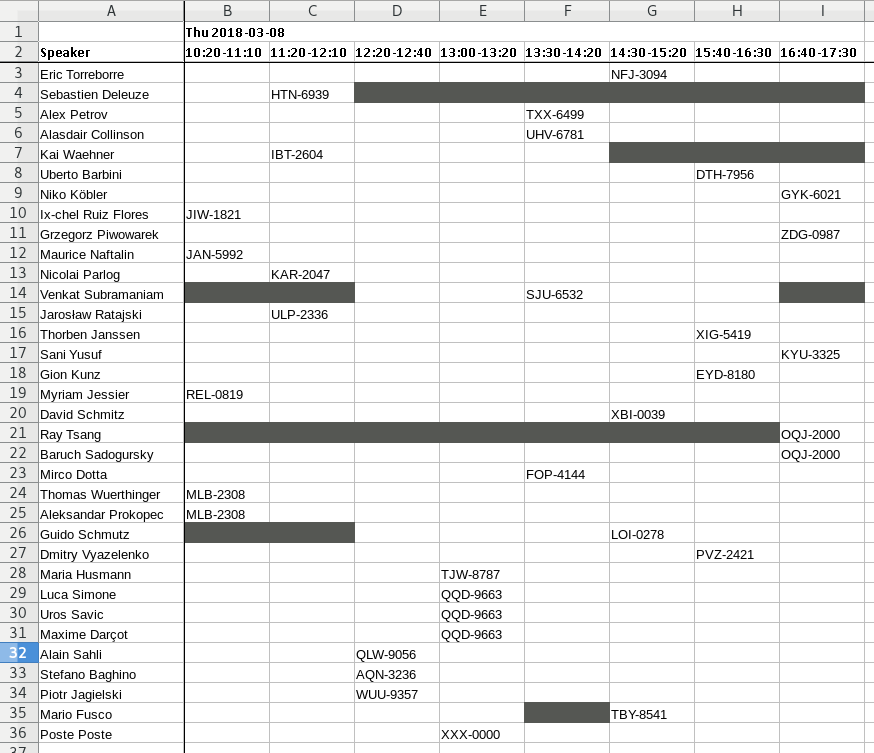

= Scheduling Voxxed Days Zurich 2018 with OptaPlanner
mariofusco
2018-02-19
:page-interpolate: true
:jbake-type: post
:jbake-tags: use case, conference scheduling
:jbake-social_media_share_image: voxxedZurichConferenceSchedulingApp.png
:jbake-canonical_url: "https://developers.redhat.com/blog/2018/02/19/voxxed-days-zurich-2018/"

My name is Mario Fusco and I’m honored to be the Program Committee Lead of https://voxxeddays.com/zurich/[Voxxed Days Zurich]
for the third year in a row.
Reading, evaluating, discussing, and selecting from the 200+ proposals that arrive every year
is a long and challenging process. I must admit, I largely underestimated the task the first year I started doing it.
It’s necessary to evaluate not only the quality of every submission, but also how they fit together.
In the end, the worst part is having to reject so many incredible proposals because there are a limited number of slots.

However, once all the talks have been selected and all the approval and rejection emails have been sent,
the process is still not complete. Now it is time to take all the accepted talks and schedule the actual program.
Even for a moderate sized event like https://voxxeddays.com/zurich/[Voxxed Days Zurich]
(the conference lasts only one day and we have four parallel tracks), this is not a trivial task.
There are many constraints and nice-to-haves that you may need to consider.
For example, some speakers will arrive late in the morning or will have to leave early in the afternoon.
Some talks require different room capacities.
Two talks belonging to the same track must not be scheduled at the same time.
There are many more variables to this process.

The past two years I spent an entire Sunday afternoon having one or two whiskeys
(it’s really important to hit the https://xkcd.com/323/[Ballmer peak] during the process),
and moving the talks on an Excel spreadsheet until I reach a situation that is sufficiently satisfying.

This year I decided to take a different approach.
My colleague, Geoffrey De Smet, is the Project Lead of https://www.optaplanner.org/[OptaPlanner].
I found out that he was developing, among the many examples already available in his project,
an application to optimize conference scheduling.
Geoffrey recommended that I give it a try and provide him feedback based on my prior experience.

== Setting Up the Conference Data

I accepted the challenge and added the talks which were approved by the program committee to a spreadsheet
using the format expected by the conference scheduling application, thus obtaining the following:

image::voxxedZurichExcelOverview.png[link="voxxedZurichExcelOverview.png" role="thumbnail"]

Here, together with the track which each talk belongs to, you can also specify additional tags:

. Difficulty of the talk – you may want to assure that less technical attendees will always have at least one interesting talk for them.
. Topic – in this case there were a few talks on functional programming belonging to different tracks which shouldn’t be scheduled at the same time.
. Language of the talk –  in Zurich, all talks are in English, so I don’t have any problems with language.
However, I organize another Voxxed Days event in Ticino, located in the Italian-speaking area of Switzerland.
For this event I want to make sure that both English and Italian-speaking guests will always have a talk that they can attend.

There are a few other tabs in the spreadsheet that allow you to configure the different rooms for the conference and tag them,
to list all the speakers together with their timing constraints,
and to specify that a talk should be scheduled in a room with a specific tag.
An example of this would be the largest room capacity or the room where talks are being recorded.

== Running OptaPlanner

Once you have everything configured in the spreadsheet, you’re ready to launch the conference scheduling application
and feed it into the spreadsheet.
Then wait a few seconds, until OptaPlanner has calculated the perfect schedule for your conference.
Note: the time may vary significantly, depending on the dimension of your problem and the number of hard and soft constraints that you set:

image::voxxedZurichConferenceSchedulingApp.png[link="voxxedZurichConferenceSchedulingApp.png" role="thumbnail"]

I took the former screenshot while OptaPlanner was still calculating the optimal solution.
Note that the current score displays: -2hard/-50soft.
After a few more seconds, OptaPlanner found the optimal solution reaching a score of 0hard/0soft.
It is possible to export this solution as a second spreadsheet showing the resulting optimal schedule.
In this case the rooms view looks like the following:

image::voxxedZurichExcelZoom1.png[link="voxxedZurichExcelZoom1.png" role="thumbnail"]

While in the speakers view, you can figure out with a single glance when and where each speaker will have his/her session:

== Conclusion

In conclusion, I ended up with a very satisfying schedule which was published to the conference website.
Overall, it’s been a great experience being able to abandon the old completely manual process and give OptaPlanner a try.
It not only allowed me to schedule the entire conference in only a few minutes with minimal effort
(which previously took a half day of headaches), but also enabled me to perform many simulations with different sets of constraints.
Questions like: "`what happens if I want this speaker in a larger room?`",
or "`could I avoid having these two talks at the same time even if they belong to different tracks?`",
would have been very difficult with the traditional approach I had been using.

Now the https://cfp-vdz.exteso.com/2018/byday/thursday[definitive conference schedule] is in place
and all my work as Program Committee Lead is complete.
I’ll be able to enjoy the event and learn as much as possible from the amazing speakers we selected.

_This article was originally published on https://developers.redhat.com/blog/2018/02/19/voxxed-days-zurich-2018/[developers.redhat.com]._

== Related video

video::R0JizNdxEjU[youtube]
