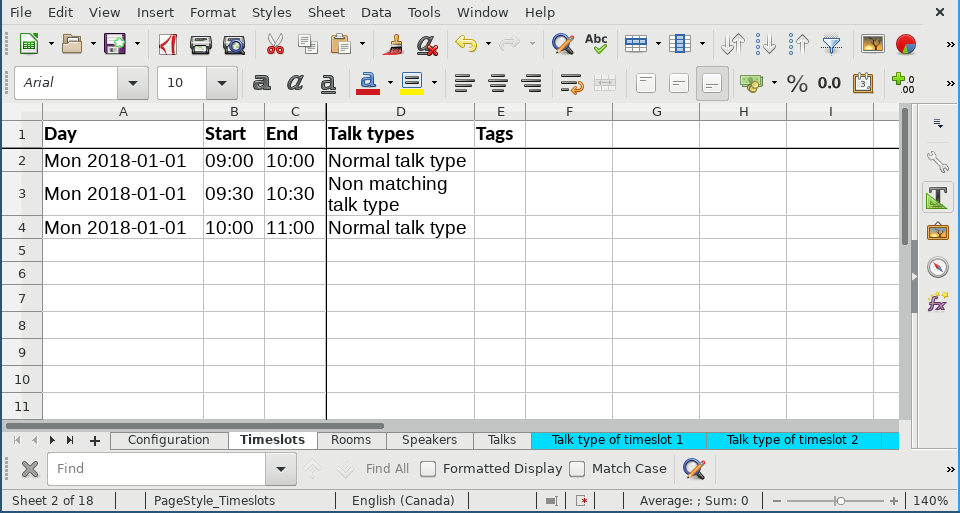
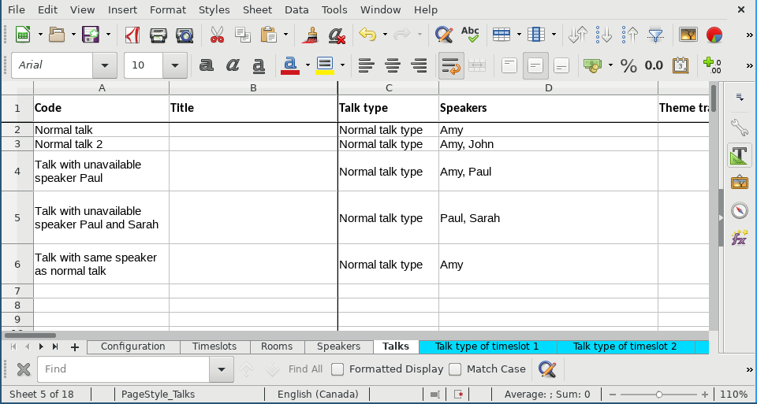
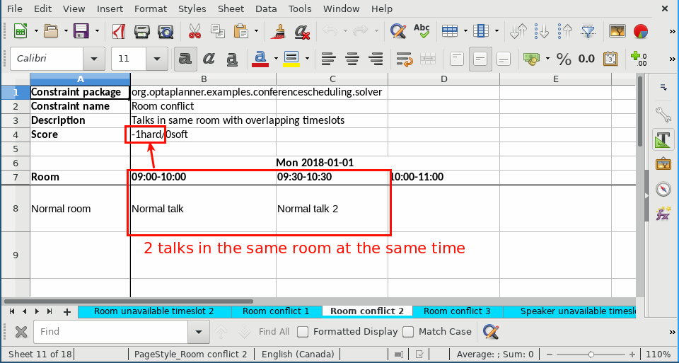

= Unit testing constraints with business input from Excel or LibreOffice
MusaTalluzi
2018-08-21
:page-interpolate: true
:jbake-type: post
:jbake-tags: use case, conference scheduling
:jbake-social_media_share_image: xlsxUnitTestingRoomConflict1.png

The business experts explain the business constraints to us, the developers. But how can we be sure that we understood
them correctly? Or worse, how can we test that they agree among themselves once the constraints are formalized?

Well, there's one great way to do that: JUnit tests populated by `*.xlsx` data. We allow them to recreate a small subset of
the solution in Excel/LibreOffice and let them decide how many constraints match.
Then our JUnit tests check if our constraint implementations adhere to those requirements.

== Traditional unit tests

In https://www.optaplanner.org/learn/useCases/conferenceScheduling.html[Conference Scheduling example],
to test room conflict constraint (hard penalty per pair of talks in the same room in overlapping timeslots) write:

[source,java]
----
@Test
public void roomConflict() {
    TalkType talkType = new TalkType(0L, "type1");
    Talk talk1 = new Talk(1L)
            .withTalkType(talkType)
            .withSpeakerList(Collections.emptyList())
            .withRequiredRoomTagSet(Collections.emptySet())
            ...
    Talk talk2 = new Talk(2L)
            ...
    LocalDateTime start1 = LocalDateTime.of(2018, 1, 1, 9, 0);
    LocalDateTime end1 = LocalDateTime.of(2018, 1, 1, 10, 0);
    LocalDateTime start2 = LocalDateTime.of(2018, 1, 1, 9, 30);
    LocalDateTime end2 = LocalDateTime.of(2018, 1, 1, 10, 30);
    LocalDateTime start3 = LocalDateTime.of(2018, 1, 1, 10, 0);
    LocalDateTime end3 = LocalDateTime.of(2018, 1, 1, 11, 0);
    Timeslot slot1 = new Timeslot(1L)
            .withTalkTypeSet(Collections.singleton(talkType))
            .withStartDateTime(start1)
            .withEndDateTime(end1);
    Timeslot slot2 = new Timeslot(2L)
            ...
    Timeslot slot3 = new Timeslot(3L)
            ...
    Room room1 = new Room(1L)
            .withTalkTypeSet(Collections.singleton(talkType))
            .withUnavailableTimeslotSet(Collections.emptySet());
    ConferenceSolution solution = new ConferenceSolution(1L)
            .withTalkTypeList(Collections.singletonList(talkType))
            ...
    scoreVerifier.assertHardWeight(ROOM_CONFLICT, 0, solution);
    // Talks in same room without overlapping time slots
    talk1.withRoom(room1).withTimeslot(slot1);
    talk2.withRoom(room1).withTimeslot(slot3);
    scoreVerifier.assertHardWeight(ROOM_CONFLICT, 0, solution);
    // Talks in same room with overlapping time slots
    talk2.withTimeslot(slot2);
    scoreVerifier.assertHardWeight(ROOM_CONFLICT, -10, solution);
}
----

In order to test room conflict, you need to initialize two talks, three timeslots and one room.
However, the previous snippet of code is too long for such a simple unit test, most of the boilerplate code is for
initializing required fields for the conference solution that you do not need for the unit test, and you must do that for every single unit test.
For more complex constraints, it gets too cumbersome to write traditional unit tests and reason about them.

== Unit tests in `xlsx` files

In order to avoid initializing unwanted fields, you can take advantage of https://github.com/kiegroup/optaplanner/blob/main/optaplanner-examples/src/main/java/org/optaplanner/examples/conferencescheduling/persistence/ConferenceSchedulingXlsxFileIO.java[ConferenceSchedulingXlsxFileIO]
to initialize them for you, and only write what you use in that test or in other tests in the same spreadsheet.

To test room conflict using an `xlsx` file, create three timeslots, two talks and one room:

image::xlsxUnitTestingRooms.png[link="xlsxUnitTestingRooms.png"]

After you initialize the required fields, create a separate sheet for every score verification of each constraint.
For example, these 2 sheets check the room conflict constraint:

image::xlsxUnitTestingRoomConflict1.png[link="xlsxUnitTestingRoomConflict1.png"]

In every test sheet (blue color), specify the constraint package, constraint name, description of current test scenario
and expected score. Then assign the talks to rooms and timeslots to visualize them easily.
Note that you do not need to list all the timeslots and rooms declared in Timeslots and Rooms sheets.

== Conclusion

Instead of writing unit tests in code, business experts can specify how they want the constraints to be matched in
an Excel/LibreOffice file. Developers then implement the constraints to pass these tests. This provides a more efficient way of
communication between developers and domain experts.

To test score rules in an `xlsx` file:

1. List all the required fields for your tests in the setup sheets.
2. For every score verification, create a separate blue test sheet with the constraint package, constraint name and expected score.
3. List only the fields that you want to use for the corresponding rule.
4. Set _testFileName_ in https://github.com/kiegroup/optaplanner/blob/main/optaplanner-examples/src/test/java/org/optaplanner/examples/conferencescheduling/optional/score/ConferenceSchedulingConstraintsXlsxTest.java[ConferenceSchedulingConstraintsXlsxTest] and run the test file.

== Related material

https://www.optaplanner.org/blog/2018/02/19/SchedulingVoxxedDaysZurich2018.html[Scheduling Voxxed Days Zurich 2018 with OptaPlanner]

video::R0JizNdxEjU[youtube]
