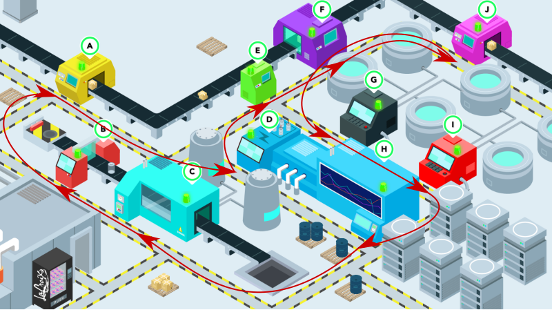
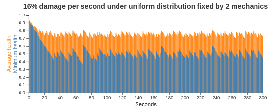
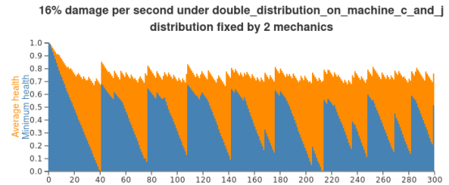
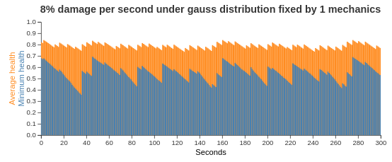
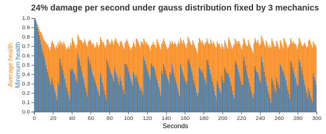

= Mechanic scheduling (part 3) - Simulation and load testing
rsynek
2019-05-09
:page-interpolate: true
:jbake-type: post
:jbake-tags: production, benchmark, algorithm
:jbake-social_media_share_image: RHSummit2019OptaPlanner2MechanicsDance.gif

The goals of the RH Summit 2019 Keynote Demo was showing multiple Red Hat products working together on OpenShift,
demonstrating how OptaPlanner can schedule mechanics repair machines in an assembly line, with the audience sensing
machine damage by shaking their smartphones.
And of course, not to fail in front of several thousands of people.

To learn more about the Summit Keynote Demo, https://www.optaplanner.org/blog/2019/05/09/RHSummit2019Part1.html[read Geoffrey's article].
Also, to find out more about the architecture and the integration with other technologies,
https://www.optaplanner.org/blog/2019/05/09/RHSummit2019Part2.html[read Musa's article].

The application is running and working. But how are players going to enjoy it? Is the game going to be boring,
as no machine will ever get close to being broken? Or is it going to be the opposite - will players break all
the machines in just a few seconds?

Actually, if too many players connect, will the entire platform fall apart?

The answer to all these questions is: __measure, don't guess!__

== Simulations

How much damage can a single mechanic handle? And how much can two mechanics handle? In this section, we are going
to run simulations to find that out.

image::assemblyLine.png[]

Each machine has its location and there are different distances between individual machines, for example:

----
A->B is 665.08 px

B->C is 235.82 px

C->J is 2486.04 px
----

Fixing all the machines takes 62 seconds (10 * 2 seconds for fixing each machine plus a travelling time between
them using the shortest path).

=== Uniform distribution

Uniform distribution means hitting every machine with the same amount of damage, which is proportional to the total
damage and number of machines.

[source,java]
----
damagePerSecond = totalDamagePerSecond / numberOfMachines;
----

See how a single mechanic behaves under the uniform damage distribution:

The mechanic starts running in a loop over time.
With two mechanics this happens too and they start dancing:

image::RHSummit2019OptaPlanner2MechanicsDance.gif[]

=== Life does not know such a thing as a uniform distribution

A pessimist is just a realist provided with more accurate information.

Let's start with the worst-case scenario. Distance between machines C-J is the longest one, so we're going to assume
that these two machines are hit double the damage than any other machines. Mechanics are going to have quite a busy day,
running from one side of the factory to the other one.

For any machine other than C or J:

[source,java]
----
damagePerSecond = totalDamagePerSecond / (numberOfMachines + 2);
----

For machines C and J:

[source,java]
----
damagePerSecond = 2 * totalDamagePerSecond / (numberOfMachines + 2);
----

Note: as the goal is to deal double damage to machines C and J, these machines have to be counted into number of machines
twice. As a result, the total damage per second is split into 12 equal parts, from which C and J receive 4 parts
and remaining 8 machines get one part each.

That's a difference!

On the other hand, there is no need to be pessimistic every day. Normal (Gaussian) distribution represents “reality” better.

[source,java]
----
damagePerSecondBase = totalDamagePerSecond / numberOfMachines;
deviation = random.nextGaussian() * damagePerSecondBase / 2;
damagePerSecond = damagePerSecondBase + deviation;

if (damagePerSecond < 0) {
   damagePerSecond = 0;
} else if (damagePerSecond > damagePerSecondBase * 2) {
   damagePerSecond = damagePerSecondBase * 2;
}
----

image::gauss_2_mech_16_damage.png[]

Again, machines can get easily broken with normal (Gaussian) distribution, although 16% damage per second under uniform
distribution was perfectly possible to fix by just two mechanics.

Let's now find where the limits are with the normal (Gaussian) distribution.

image::gauss_1_mech_10_damage.png[]

8% damage per second didn't lead to any single machine being broken. With 10% damage per second, after 100 seconds,
there is the first broken machine.

Let's take a look what amount of damage two mechanics can handle.

image::gauss_2_mech_12_damage.png[]
image::gauss_2_mech_16_damage.png[]

16% damage per second seems not be manageable, even that the first failure occurred just after 3 minutes of simulation.
Let's add one more mechanic.

image::gauss_3_mech_32_damage.png[]

8% damage per second seems to be manageable by a single mechanic. Does it mean that 2 mechanics can handle 16% of damage?
The simulation figures above show they could not. On the other hand, 3 mechanics were able to fix machines receiving
24% damage per second. In contrast to the uniform damage distribution, with the normal distribution, we cannot just
blindly hope that the amount of damage mechanics can handle is proportional to their count.

== Lessons learned from load testing

The purpose of load testing is to tell if the system under test is able to handle certain load. If there are
requirements regarding expected throughput, these can be verified based on the results. With no such requirements,
load testing can help to find limits of the system in terms of load.

Let me share in the lines below what we learned from load testing and what issues we had to fix.

Load testing of this application was realized by sending simulated motion data to Node.js component from multiple pods
in the cluster. During several sessions, with people responsible for individual components and technologies of the demo
attending, we tested from 100 to 3000 simulated players being connected and sending motion data to the application.

In the very first load tests, we noticed that mechanics take way too long fixing broken machines. Something went wrong,
as the period of time to fix a machine had been set to 2 seconds. Apparently, OptaPlanner was not able to dispatch
mechanics on time. Looking at the Grafana dashboard, that shows resource utilisation in the OpenShift cluster, revealed
that OptaPlanner pod had only 0.6 CPU, which means it got only 60% of a single CPU core's execution time.
Taking into account that the OptaPlanner itself usually kept entire CPU core busy and there was another thread
in the pod - a keeper of time, responsible for timely sending events to other components, 0.6 CPU was definitely not enough.
It turned out that our OpenShift template didn't declare any resource requests, so OptaPlanner pod got just
breadcrumbs - after Tensor Flow and other components took most of the cluster's resources.

*Lesson one: always declare your required resources and limits.*

So, template fixed and ready for another load test! Which only revealed that mechanics were again not being
dispatched on time. What did go wrong this time, we asked ourselves? We had enough CPU and memory resources, but still
we saw the same issue.

The devil was hidden in Infinispan and also in the way we contacted Infinispan for machines`' health every 40 milliseconds.
Having only 4 infinispan nodes trying to handle all the requests from multiple components didn't scale
because of the network traffic. Involving more Infinispan notes did help for the network part of the issue,
as the traffic was balanced between more nodes. Using a separate thread to query for each machine's health did
help on OptaPlanner part of the issue, as the timekeeper thread was not blocked anymore, waiting for the information
about machines`' health to be retrieved from Infinispan.

*Lesson two: despite you've read one hundred times that you should do I/O in separate threads, make sure you do I/O in separate threads.*

== Conclusion

Once we are supposed to present such a complex platform in front of several thousands of people, we need to avoid
being surprised. To minimize the risk, we gather as much data as possible to confirm our expectation, our hypothesis.
Both the simulations and load testing proved an invaluable source of information.
They helped us understand what we could expect and built a good level of confidence about what we wanted to show.

'''

Let me thank the entire team for their great work
and specifically in this part, a big thanks to
Guilherme Baufaker Rego and Ben Browning
for load testing the platform.
And of course, a big thanks to our one and only captain, Burr Sutter,
who can set up a show like no other!

View the recording of our show:

video::FUu4kMc0PL8[youtube, start=5785]
