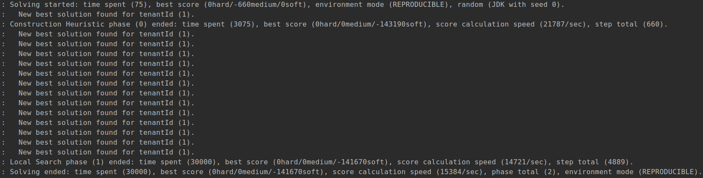

= Exploring the new OptaWeb Employee Rostering backend
jucui
2019-10-22
:page-interpolate: true
:jbake-type: post
:jbake-tags: employee rostering, coding, algorithm, production

To help you solve employee shift rostering challenges,
we maintain an end-to-end web application called OptaWeb Employee Rostering.
It is a web application that optimizes shift scheduling for maximum efficiency and fairness for employees.
Scheduling guards is very different from scheduling nurses, therefore you can fork and customize the code to your requirements.

Recently, we rewrote the frontend and backend in modern technologies.
In this post I'll give an overview of the new backend and the key features that were added.

== The Problem

Let's start with the problem we're trying to solve.
Here is a visual overview of the https://www.optaplanner.org/learn/useCases/employeeRostering.html[Employee Rostering problem]:

image::employeeRosteringValueProposition.png[]

Many company workplaces need solutions to this problem, from hospitals to call centers.
There are many factors to consider when assigning shifts to employees, such as required skills, employee availabilities, and employee fairness.
So how do we find the best solution?
With https://www.optaplanner.org[OptaPlanner], of course!

== Domain Model

Before we dive into the code, we first need a domain model.
A domain model represents the entities (Java objects) and how they relate with other entities in the application.
It tells us the behaviour of the objects and how they change during solving.
Here's a class diagram of the Employee Rostering model, where employees are nurses:

image::optaWebEmployeeRosteringClassDiagram.png[]

Each of the blocks above represents a Java entity object in our application, which are saved in a database for solving.
We use JPA (Hibernate) as our persistence layer.
The arrows show how certain entities map to others, so changing one during the solving process may affect another.
The `*` and `1` symbols on the arrows represent a many-to-one mapping of the entities in the database.

Here's a simple example of the `Skill` entity:

[source,java]
----
@Entity
@Table(uniqueConstraints = @UniqueConstraint(columnNames = {"tenantId", "name"}))
public class Skill {

    @NotNull
    @Size(min = 1, max = 120)
    @Pattern(regexp = "^(?!\\s).*(?<!\\s)$", message = "Name should not contain any leading or trailing whitespaces")
    private String name;

    @SuppressWarnings("unused")
    public Skill() {

    }

    public Skill(Integer tenantId, String name) {
        super(tenantId);
        this.name = name;
    }

    // Getters and setters
}
----

This Java object stores the name of the skill and the id of the Tenant (the user, such as a hospital or a call center) it belongs to.
The `@Entity` annotation represents a table in the JPA database, where each instance of the `Skill` entity has its own row.
The `@Table` annotation specifies the columns of the table (we'll see this in the next section).

== H2 Database

To test the database, we use the H2 Database Console to run SQL statements and view the saved entities on a user interface.
Here's an example of executing a SQL statement that selects every `Skill` entity:

image::skillsConsole.png[]

Notice that the autogenerated demo data is saved in the H2 database when the application starts up.
This console makes it convenient to test and modify the in-memory database.

Ok, so having data generated on startup is nice for demoing the application.
But what if we wanted to use the application in production and start with no demo data?
To solve this, we added a feature that gives the user the option to start the application with no persisted data.
This was implemented by adding an additional system property called `InitialData`:

[source,java]
----
public static final String INITIAL_DATA_PROPERTY = "optaweb.generator.initial.data";

public enum InitialData {
    EMPTY,
    DEMO_DATA // default
}
----

In `RosterGenerator.java`, we use the system property to determine whether to generate data or not.
Notice that if `initialData = EMPTY`, the method returns without generating any data:

[source,java]
----
SystemPropertiesRetriever.InitialData initialData = SystemPropertiesRetriever.determineInitialData();

switch (initialData) {
    case EMPTY:
        return;
    case DEMO_DATA:
        // Generate demo data
}
----

To configure the system properties and start with an empty database, add this to the `applications.properties` file:

[source,properties]
----
optaweb.generator.initial.data=EMPTY
----

This sets the `optaweb.generator.initial.data` system property for the application when it starts.

== REST API

Now let's actually interact with the backend application.
An easy way to test the REST API is to use the Swagger framework, which OptaWeb Employee Rostering supports.

As an example, here are the `Tenant` REST methods shown in the Swagger user interface:

image::tenantMethods.png[]

As we can see, each method has documentation, the relative path URL, and its corresponding HTTP request.
The Swagger UI makes it very easy to test any method in the backend.
Let's say we wanted a list of all the Tenants in the application.
We start by selecting the corresponding method to display the method details:

image::getTenantsMethod.png[]

Here, the `Example Value` field shows a sample value of a Tenant list, serialized to JSON format.
We see that each Tenant contains the `id`, `name`, and `version` fields, which are saved in the database whenever a Tenant is added.
Also note the `Try it out` button in the top right corner.
We can use it to send HTTP requests with ease for testing purposes.
Let's try it out:

image::executeGetTenants.png[]

Sending the GET request returns all the saved Tenants.
We can see them in JSON format above.

Nice, we just sent our first HTTP request!
But the Employee Rostering application does much more than just getting entities.
There are methods for creating, deleting, and updating various entities (remember the Domain Model above), which the application uses to modify the database, as well as methods that interact with the OptaPlanner API.

Let's try a more interesting method:

image::solveMethod.png[]

This method is the core of the OptaWeb Employee Rostering application.
It starts the OptaPlanner solver that assigns work shifts to employees for a specific Tenant.
The solver uses heuristics and algorithms to find the most optimal solution under time and resource constraints.
To learn more about how OptaPlanner finds better solutions, read about https://docs.optaplanner.org/latestFinal/optaplanner-docs/html_single/index.html#localSearch[Local Search] in the OptaPlanner docs.

Let's try out the solver for the Tenant with `id = 1`:

image::executeSolverMethod.png[]

After clicking `Execute`, the solver starts evaluating possible solutions for arranging shifts, and finds the shift roster with the best score.
The score is calculated using the Drools business constraint rules that we configured in the application.
As the algorithm finds new solutions, the engine evaluates the score of each solution and compares it with the score of the current best solution.
If the score is higher, the new solution becomes the new best solution.
Notice the log messages in the console during solving:

Notice the medium score when solving starts versus when solving ends.
In our application, each unassigned shift has a score of `-1medium`, which means for every unassigned shift a particular solution has, the medium score of that solution would decrease by 1.
In this case, the starting shift arrangement had a medium score of -660, so there were 660 shifts that were not assigned to any employee.
After solving, the shift arrangement had a medium score of 0, which means every shift was assigned to an employee.

Congratulations!
You've just found an optimal employee shift arrangement given the time and business constraints for this Tenant.

== Conclusion

In the process of migrating the OptaWeb Employee Rostering backend application to another Java framework,
we added and used various tools for better user and developer experience.
The most notable tools included the H2 Database Console for JPA persistence testing,
adding the `InitialData` system property to configure the startup demo data, and Swagger for REST API testing and documentation.

Of course, we don't expect users to interact with the application through H2 and Swagger, that's what a user interface is for!
The UI for this application was implemented in the Employee Rostering Frontend Application, written in React.js.

*To build and run the application for yourself, check out the https://github.com/kiegroup/optaweb-employee-rostering[source code].*
