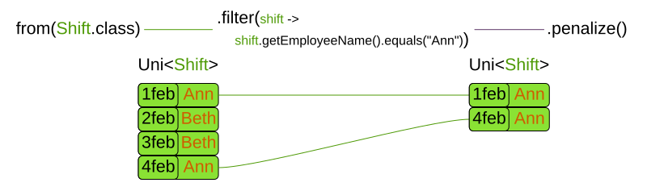

= Constraint Streams - Modern Java constraints without the Drools Rule Language
ge0ffrey
2020-04-07
:page-interpolate: true
:jbake-type: post
:jbake-tags: feature, coding, constraint
:jbake-social_media_share_image: constraintStreamGroupBy.png

Traditionally, to scale out with https://www.optaplanner.org/[OptaPlanner],
you had to learn DRL. _No more._
With the new _Constraints Streams_ API, inspired by Java 8 Streams and SQL,
you can now *write your constraints in Java* (or Kotlin or Scala)
and still benefit from incremental calculation.

Underneath, Constraints Streams (CS) still use the powerful https://www.drools.org/[Drools] engine.
We also still fully support score DRLs too. They are _not_ deprecated.

Let's start with an example.
In nurse rostering, to avoid assigning shifts to employee `Ann`,
you would write this constraint in DRL:

[source,drl]
----
rule "Don't assign Ann"
    when
        Shift(getEmployee().getName() == "Ann")
    then
        scoreHolder.addSoftConstraintMatch(kcontext, -1);
end
----

This is the same constraint in Java using Constraint Streams:

[source,java]
----
Constraint constraint = constraintFactory
        .from(Shift.class)
        .filter(shift -> shift.getEmployee().getName().equals("Ann"))
        .penalize("Don't assign Ann", HardSoftScore.ONE_SOFT);
----

If you're familiar with SQL or Java 8 streams, this should look familiar.
Given a potential solution with four shifts (two of which are assigned to `Ann`),
those shifts flow through the Constraint Stream like this:

This new approach to writing constraints has several benefits:

== Incremental calculation

First off, unlike an `EasyScoreCalculator`,
Constraint Streams still apply incremental score calculation to scale out, just like DRL.
For example, when a move swaps the employee of two shifts, only the delta is calculated.
That's a huge scalability gain:

image::constraintStreamIncrementalCalculation.png[]

== Indexing

When joining multiple types, just like an SQL `JOIN` operator,
Constraint Streams apply hash lookups on indexes to scale better:

image::constraintStreamJoinWithJoiners.png[]

== IDE support

Because ConstraintsStreams are written in the Java language,
they piggy-back on very strong tooling support.

Code highlighting, code completion and debugging just work:

=== Code highlighting

DRL code in IntelliJ IDEA Ultimate:

image::codeHighlightingDRL.png[]

Java code using Constraint Streams in IntelliJ IDEA Ultimate, for the same constraints:

image::codeHighlightingConstraintStreams.png[]

=== Code completion

Code completion for Constraint Streams:

image::codeCompletionConstraintStreams.png[]

Of course, all API methods have Javadocs.

=== Debugging

Add a breakpoint in ConstraintStream's `filter()`:

image::codeDebuggingConstraintStreams1.png[]

To diagnose issues while debugging:

image::codeDebuggingConstraintStreams2.png[]

== Java syntax

Constraints written in Java with Constraint Streams follow the Java Language Specification (JLS), for good or bad.
Similar logic applies when using Constraint Streams from Kotlin or Scala.

When migrating between DRL and Constraint Streams, be aware of some differences between DRL and Java:

* A DRL's `==` operator translates  to `equals()` in Java.
* Besides getters, DRL also allows MVEL expressions that translate into getters in Java.

For example, this DRL has `name` and `==`:

[source,drl]
----
rule "Don't assign Ann"
    when
        Employee(name == "Ann")
    then ...
end
----

But the Java variant for the exact same constraint has `getName()` and `equals()` instead:

[source,java]
----
constraintFactory.from(Employee.class)
        .filter(employee -> employee.getName().equals("Ann"))
        .penalize("Don't assign Ann", ...);
----

== Advanced functions

The Constraint Streams API allows us to add syntactic sugar
and powerful new concepts, specifically tailored to help you build complex constraints.

Just to highlight one of these, let's take a look at the powerful `groupBy` method:

image::constraintStreamGroupBy.png[]

Similar to an SQL `GROUP BY` operator or a Java 8 Stream `Collector`,
it supports `sum()`, `count()`, `countDistinct()`, `min()`, `max()`, `toList()`
and even custom functions, again without loss of incremental score calculation.

== Future work for Constraint Streams

First off, a big thanks to https://github.com/triceo[Lukáš Petrovický]
 for all his work on Constraints Streams!

But this is just the beginning.
We envision more advanced functions,
such as load balancing/fairness methods
to make such constraints easier to implement.

Right now, our first priority is to make it easier to unit test constraints in isolation.
Think Test Driven Design. Stay tuned!
