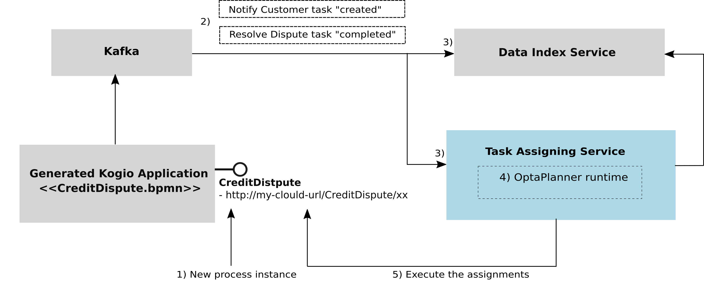

= Let's OptaPlan your jBPM tasks (part 2) - BPM Task assigning in the cloud
wmedvede
2021-07-26
:page-interpolate: true
:jbake-type: post
:jbake-tags: feature, task assignment, cloud
:jbake-social_media_share_image: CreditDisputeProcessDiagram.png

In the following paragraphs we will show that by combining the https://kogito.kie.org/[Kogito] business processes with OptaPlanner optimization, it is possible to automatically assign tasks to users. Furthermore, we can optimize those assignments, for example, to ensure that every user has the right skills for executing a task, a fair workload between users is produced, tasks are assigned according priorities, and other criteria. Finally, all this will take place in the cloud.

But, wait! Isn't this _task assigning problem_ already solved in https://www.optaplanner.org/blog/2020/07/03/LetsOptaPlanYourJbpmTasksPart1.html[Let's OptaPlan your jBPM tasks (part 1)]?

Yes…, but this time we challenged OptaPlanner to solve it by coordinating independent business processes that execute as cloud-native services, and this last definitely means https://kogito.kie.org/[Kogito]!

== Not yet familiar with Kogito?

To summarize, https://kogito.kie.org/[Kogito] is the cloud-native business automation ecosystem for building modern applications.

Essentially, when you use https://kogito.kie.org/[Kogito] you are building a cloud-native application as a set of independent domain-specific services. These services can be constructed by using business processes, business rules, decisions and constraints solving, as well as other https://kogito.kie.org/[Kogito] supporting services.

As a user, you simply focus on creating your business processes, rules, etc. and https://kogito.kie.org/[Kogito] will take care of the most difficult part of the job: _to make these assets work as cloud-native services_.

Finally, by using any of the OptaPlanner https://www.optaplanner.org/compatibility/quarkus.html[Quarkus] or https://www.optaplanner.org/compatibility/springBoot.html[SpringBoot] extensions, your optimization problems can be easily solved in your cloud-application.

== The new context

To make comparison with the previous results easy, we'll use the same "Credit Dispute" process presented in: https://www.optaplanner.org/blog/2020/07/03/LetsOptaPlanYourJbpmTasksPart1.html[Let's OptaPlan your jBPM tasks (part 1)].

But let's take a look at how things look like when we move to https://kogito.kie.org/[Kogito]:

=== Business Processes with Kogito

. When your https://kogito.kie.org/[Kogito] project is built, several processings are realized and finally a cloud-native https://kogito.kie.org/[Kogito] application is automatically generated for you.

. For assets like the business processes, different services are generated, and proper REST endpoints are automatically provided for executing and interacting with the process instances and human tasks of that process.

. Granularity is determined by the user, i.e., you decide how many business processes to include in your project, and thus it's very easy to move to a microservices approach too. For example, you could decide to group the processes related with the Hiring Procedure of your company in one project, and the processes related with the Support Procedure in another. By doing this, two different cloud-native applications with the corresponding business processes services will be generated. In this way, two different logical units will be present along the CI/CD pipeline, for example, the Hiring Procedure related processes will execute at the same OpenShift/Kubernetes Pod, etc.

. Additionally, by combining different https://kogito.kie.org/[Kogito] building blocks, called add-ons, you can make your services to be automatically plugged with persistence, additional administration endpoints, kafka based cloud events generation, and many more.

In the following image we can see a simplified diagram of the generated Kogito Application for the *task-assigning-demo* project, which contains the *CreditDispute.bpmn* process and includes the *kogito-addons-quarkus-events-smallrye* to connect with Kafka.

=== OptaPlanner with Kogito

On the other hand, when the OptaPlanner https://www.optaplanner.org/compatibility/quarkus.html[Quarkus] or https://www.optaplanner.org/compatibility/springBoot.html[SpringBoot] extension is included in your application, the following actions take place:

. When your project is built, OptaPlanner definitions like the Solver configuration file, the PlanningSolution, the PlanningEntities, etc., are processed and proper ready for cloud runtime components are automatically generated.

. Your application can simply use these components when needed, typically by using CDI and OptaPlanner standard APIs. All the rest is managed by OptaPlanner runtime.

In the following image we show a simplified diagram of the *task-assigning-service* project, which contains the *taskAssigningDefaultSolverConfig.xml* (Solver configuration), the *TaskAssigningSolution* (PlanningSolution), the *TaskAssignment* and *User* (PlanningEntities) and includes the *optaplanner-quarkus* extension.

See how these elements can be used in your code:

=== The Task Assigning Service

Finally, we can see all the building blocks working together:

{empty} +

When the CreditDispute process is executed the following actions takes place:

. A process instance is created by using the corresponding endpoints.

. When the human tasks are created/completed/etc. Cloud Events are produced and delivered to Kafka thanks to the inclusion of the kogito-addons-quarkus-events-smallrye.

. Different https://kogito.kie.org/[Kogito] supporting services like the https://docs.kogito.kie.org/latest/html_single/#con-data-index-service_kogito-configuring[Data Index Service] or the https://docs.kogito.kie.org/latest/html_single/#con-kogito-task-assigning-service_kogito-configuring[Task Assigning Service] receives these events.

. At the https://docs.kogito.kie.org/latest/html_single/#con-kogito-task-assigning-service_kogito-configuring[Task Assigning Service], OptaPlanner takes immediate control on these events, and the new task assignments plan is calculated and optimized.

. Finally, by using the generated process endpoints the necessary assignments are produced.

This cycle is repeated over and over.

For more information see: https://docs.kogito.kie.org/latest/html_single/#con-kogito-task-assigning-service_kogito-configuring[Task Assigning Service]

== Process execution

Let's now execute the Credit Dispute process in the https://kogito.kie.org/[Kogito] ecosystem.

{empty} +

The following image shows how a new process instance is created by using the Kogito generated endpoints:

Analogous the previous use case (see: https://www.optaplanner.org/blog/2020/07/03/LetsOptaPlanYourJbpmTasksPart1.html[Let's OptaPlan your jBPM tasks (part 1)]), this information combined with the user's configuration is used to establish which of the available users are best suited for each task.

This time, the following user's configuration is used:

[cols="10%,40%,50%" frame="all", options="header"]
|===
|User
|Belongs the group
|Has skills in

|katy | CreditAnalyst | CITI and MASTER cards.
|emily | CreditAnalyst | VISA and AMERICAN_EXPRESS cards.
|bob | ClientRelations | Spanish and English languages.
|frank | ClientRelations | Chinese language.

|===

So, when the process is started a new instance of the ResolveDispute task is created and automatically assigned:

The task requires "a CreditAnalyst user with skills in the MASTER credit card". This is why it was automatically assigned to katy.

As soon this task is completed, a new instance of the NotifyCustomer task is created.

The following image shows the new instance information:

The task requires "a ClientRelations user with skills in the Spanish language", and this is why this new task is assigned to bob.

Again, the example above is quite linear, a few users are defined, and the possible assignments are direct. This was done intentionally to show how the assignment decisions are made accordingly with the configured users, the tasks configurations and also the related business data. The real power of this solution can be seen when we move to real environments, where many tasks are in progress and many users are available for selection. In those cases, OptaPlanner can really make his job and produce the optimized assignments.

== Conclusions

We started by formulating an already solved problem, but using a completely different underlying ecosystem. This time, our business processes are cloud-native services. All this is facilitated by https://kogito.kie.org/[Kogito] .

To integrate OptaPlanner in your cloud application is straightforward: you instruct OptaPlanner with the model, and the Solver configuration to use, and that’s all ;), OptaPlanner https://www.optaplanner.org/compatibility/quarkus.html[Quarkus] or https://www.optaplanner.org/compatibility/springBoot.html[SpringBoot] extensions will manage all the complexity of the Solver instantiation and management. This has represented a very important simplification for building the https://docs.kogito.kie.org/latest/html_single/#con-kogito-task-assigning-service_kogito-configuring[Task Assigning Service].

Lastly, former conclusions still apply, that is: by integrating OptaPlanner the responsibility of the task assignments and decision-making is transferred from humans to optimization algorithms.

