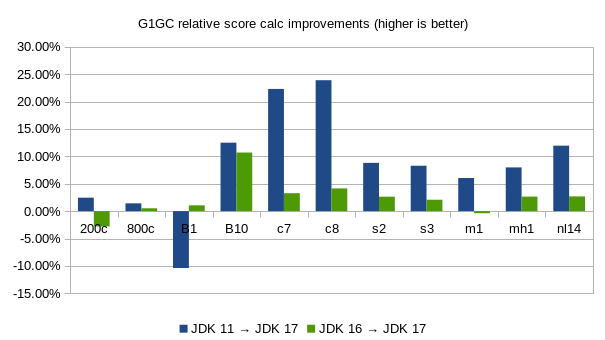
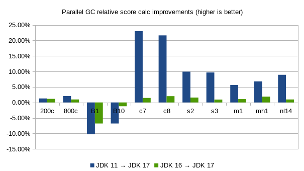
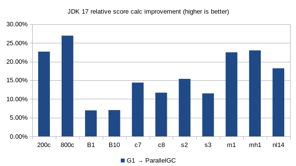

= How much faster is Java 17?
ge0ffrey
2021-09-15
:page-interpolate: true
:jbake-type: post
:jbake-tags: production, benchmark
:jbake-social_media_share_image: comparison-G1GC-ParallelGC-java17.png

Java 17 (released yesterday) comes with many new features and enhancements.
However, most of those require code changes to benefit from.
_Except for performance._
Simply switch your JDK installation and you get a free performance boost.
But how much? Is it worth it?
Let's find out by comparing the benchmarks of JDK 17, JDK 16 and JDK 11.

== Benchmark methodology

* Hardware: A stable machine without any other computational demanding processes running and with
`Intel® Xeon® Silver 4116 @ 2.1 GHz (12 cores total / 24 threads)` and `128 GiB` RAM memory, running `RHEL 8 x86_64`.

* JDKs (used to both compile and run):

** JDK 11
+
----
openjdk 11.0.12 2021-07-20
OpenJDK Runtime Environment Temurin-11.0.12+7 (build 11.0.12+7)
OpenJDK 64-Bit Server VM Temurin-11.0.12+7 (build 11.0.12+7, mixed mode)
----

** JDK 16
+
----
openjdk 16.0.2 2021-07-20
OpenJDK Runtime Environment (build 16.0.2+7-67)
OpenJDK 64-Bit Server VM (build 16.0.2+7-67, mixed mode, sharing)
----

** JDK 17 (downloaded 2021-09-06)
+
----
openjdk 17 2021-09-14
OpenJDK Runtime Environment (build 17+35-2724)
OpenJDK 64-Bit Server VM (build 17+35-2724, mixed mode, sharing)
----

* JVM options: `-Xmx3840M` and explicitly specify a garbage collector:

** `-XX:+UseG1GC` for G1GC, the low latency garbage collector (the default in all three JDKs).

** `-XX:+UseParallelGC` for ParallelGC, the high throughput garbage collector.

* Main class: `org.optaplanner.examples.app.GeneralOptaPlannerBenchmarkApp`
from the module `optaplanner-examples` in OptaPlanner `8.10.0.Final`.

** Each run solves 11 planning problems with OptaPlanner, such as
https://www.optaplanner.org/learn/useCases/employeeRostering.html[employee rostering],
https://www.optaplanner.org/learn/useCases/schoolTimetabling.html[school timetabling] and
https://www.optaplanner.org/learn/useCases/cloudOptimization.html[cloud optimization].
Each planning problem runs for 5 minutes. Logging is set to `INFO`.
The benchmark starts with a 30 second JVM warm up which is discarded.

** Solving a planning problem involves *no IO* (except a few milliseconds during startup to load the input). *A single
CPU is completely saturated.* It constantly creates many short-lived objects, and the GC collects them afterwards.

** The benchmarks measure the number of scores calculated per second. Higher is better. Calculating
a score for a proposed planning solution is non-trivial: it involves many calculations, including checking for
conflicts between every entity and every other entity.

* Runs: Each JDK and each garbage collector combination is run 3 times sequentially.
The results below is the average of those 3 runs.

link:runBenchmarkJDKComparison.sh.txt[Here is the shell script to reproduce these results.]

== Results

=== Java 11 (LTS) and Java 16 versus Java 17 (LTS)

.Score calculation count per second with G1GC on different JDKs
|===
| ^|*Average* 2+^.^|Cloud balancing 2+^.^|Machine reassignment 2+^.^|Course scheduling 2+^.^|Exam scheduling 2+^.^|Nurse rostering ^.^|Traveling Tournament
|Dataset ^| ^|200c ^|800c ^|B1 ^|B10 ^|c7 ^|c8 ^|s2 ^|s3 ^|m1 ^|mh1 ^|nl14
|JDK 11 >| >|103,606 >|96,700 >|274,103 >|37,421 >|11,779 >|13,660 >|14,354 >|8,982 >|3,585 >|3,335 >|5,019
|JDK 16 >| >|109,203 >|97,567 >|243,096 >|38,031 >|13,950 >|16,251 >|15,218 >|9,528 >|3,817 >|3,508 >|5,472
|JDK 17 >| >|106,147 >|98,069 >|245,645 >|42,096 >|14,406 >|16,924 >|15,619 >|9,726 >|3,802 >|3,601 >|5,618
|11 → 17 >|*8.66%* >|2.45% >|1.42% >|-10.38% >|12.49% >|22.30% >|23.90% >|8.81% >|8.28% >|6.05% >|7.98% >|11.95%
|16 → 17 >|*2.41%* >|-2.80% >|0.51% >|1.05% >|10.69% >|3.27% >|4.14% >|2.63% >|2.08% >|-0.39% >|2.65% >|2.67%
|===

.Score calculation count per second with ParallelGC on different JDKs
|===
| ^|*Average* 2+^.^|Cloud balancing 2+^.^|Machine reassignment 2+^.^|Course scheduling 2+^.^|Exam scheduling 2+^.^|Nurse rostering ^.^|Traveling Tournament
|Dataset ^| ^|200c ^|800c ^|B1 ^|B10 ^|c7 ^|c8 ^|s2 ^|s3 ^|m1 ^|mh1 ^|nl14
|JDK 11 >| >|128,553 >|121,974 >|292,761 >|48,339 >|13,397 >|15,540 >|16,392 >|9,887 >|4,409 >|4,148 >|6,097
|JDK 16 >| >|128,723 >|123,314 >|281,882 >|45,622 >|16,243 >|18,528 >|17,742 >|10,744 >|4,608 >|4,348 >|6,578
|JDK 17 >| >|130,215 >|124,498 >|262,753 >|45,058 >|16,479 >|18,904 >|18,023 >|10,845 >|4,658 >|4,430 >|6,641
|11 → 17 >|*6.54%* >|1.29% >|2.07% >|-10.25% >|-6.79% >|23.00% >|21.64% >|9.95% >|9.68% >|5.63% >|6.80% >|8.92%
|16 → 17 >|*0.37%* >|1.16% >|0.96% >|-6.79% >|-1.24% >|1.45% >|2.03% >|1.59% >|0.94% >|1.08% >|1.89% >|0.96%
|===

[NOTE]
====
Looking at the raw data of the 3 individual runs (not shown here),
the Machine Reassignment numbers (B1 and B10) fluctuate a lot between runs on the same JDK and GC.
Often by more than 10%. The other numbers don't suffer from this unreliability.

_It's arguably better to ignore the Machine Reassignment numbers_.
But to avoid cherry-picking data concerns, these results and averages do include them.
====

=== G1GC versus ParallelGC on Java 17

.Score calculation count per second on JDK 17 with different GCs
|===
| ^|*Average* 2+^.^|Cloud balancing 2+^.^|Machine reassignment 2+^.^|Course scheduling 2+^.^|Exam scheduling 2+^.^|Nurse rostering^.^|Traveling Tournament
|Dataset ^| ^|200c ^|800c ^|B1 ^|B10 ^|c7 ^|c8 ^|s2 ^|s3 ^|m1 ^|mh1 ^|nl14
|G1GC >| >|106,147 >|98,069 >|245,645 >|42,096 >|14,406 >|16,924 >|15,619 >|9,726 >|3,802 >|3,601 >|5,618
|ParallelGC >| >|130,215 >|124,498 >|262,753 >|45,058 >|16,479 >|18,904 >|18,023 >|10,845 >|4,658 >|4,430 >|6,641
|G1 → ParallelGC >|*16.39%* >|22.67% >|26.95% >|6.96% >|7.04% >|14.39% >|11.69% >|15.39% >|11.50% >|22.50% >|23.01% >|18.20%
|===

== Executive summary

On average, for OptaPlanner use cases, these benchmarks indicate that:

* *Java 17 is 8.66% faster than Java 11* and 2.41% faster than Java 16 for G1GC (default).

* Java 17 is 6.54% faster than Java 11 and 0.37% faster than Java 16 for ParallelGC.

* The Parallel Garbage Collector is 16.39% faster than the G1 Garbage Collector.

No big surprises here: the latest JDK is faster
and the high throughput garbage collector is faster than the low latency garbage collector.

== Wait a minute here...

When https://www.optaplanner.org/blog/2021/01/26/HowMuchFasterIsJava15.html[we benchmarked JDK 15],
we saw that Java 15 was 11.24% faster than Java 11. Now, the gain of Java 17 over Java 11 is less.
Does that mean that Java 17 is slower than Java 15?

Well, no. _Java 17 is faster than Java 15 too._
Those previous benchmarks were run on a different codebase (OptaPlanner 7.44 instead of 8.10).
Don't compare apples and oranges.

== Conclusion

In conclusion, the performance gained in the JDK17 version is well worth the upgrade - at least for https://www.optaplanner.org/[OptaPlanner] use cases.

In addition, the fastest garbage collector for these use cases is still `ParallelGC`, instead of `G1GC` (the default).
