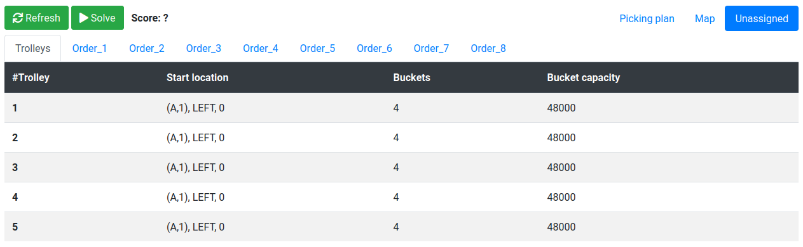

= Order picking optimization in warehouses and supermarkets with OptaPlanner
wmedvede
2021-10-14
:page-interpolate: true
:jbake-type: post
:jbake-tags: use case, order picking, quarkus
:jbake-social_media_share_image: orderPickingSocialMedia.png

During the pandemic year, we saw many stores and supermarkets adapt their business in several ways. Sometimes these changes occurred from day to day.
For example, as a consequence of the sharp decrease in customer physical visits, online orders increased exponentially.

How many of them were prepared to deal optimally with this increase...?

In this blog post, we present the new OptaPlanner https://github.com/kiegroup/optaplanner-quickstarts/tree/development/use-cases/order-picking[order-picking quickstart] that shows how to complete online orders in an optimized way!

== The order picking problem

The order picking problem consists of a set of orders that need to be prepared for delivery to various customers. Each order is composed of a set of order items (the requested products). These products are located on shelves in the warehouse or in the supermarket and occupy a specific volume of space.

To complete the orders, there is a set of available trolleys that follow a calculated path in the supermarket and pick the order items. One order item is picked on each step of this path.
The location of the products within the warehouse determine the path of the trolley, and the space in each trolley is divided into a number of buckets with a specified capacity.

The goal of the order picking problem is to calculate a picking plan that provides the path for each trolley and considers the following constraints:

* The distance to travel by the trolleys is minimized.

* All the order items must be picked.

* Items from different orders mustn't be mixed in the same bucket, so enough buckets must be reserved for each of the orders that will be prepared on the same trolley.

* The bucket's capacity is not exceeded by the total volume of the items on it.

* The splitting of an order into different trolleys should be minimized.

The following image shows a simplified view of the order picking problem input data and calculated picking plan:

image::orderPickingProblem.png[]

=== Warehouse structure

To formulate the problem, the warehouse is defined as a set of shelves organized into columns and rows.
Products are located on the left or right side of a specific shelf, on a specific row. The shelf, side, and row determine the product location.

image::orderPickingSimplifiedWarehouseStructure.png[]

== The new quickstart

=== Project structure

The following image shows the maven project that comprises the quickstart:

image::orderPickingProjectStructure.png[]

The server side code is in the `src/main/java` directory and is organized in four packages:

bootstrap::
Helper classes for generating the randomized (but reproducible) data set used by the quickstart on application startup.

domain::
Contains the domain model for representing the problem, and the planning classes used by OptaPlanner, for example the `@PlanningSolution` and the `@PlanningEntity`.

solver::
Contains the `ConstraintProvider` implementation.

rest::
Contains the REST API used by the client-side code to start and stop solving, and to retrieve the best solution to display.

The client code is in the `src/main/resources/META-INF/resources/` directory.
This directory has an `index.html` file that contains the basic HTML structure and loads the `app.js` file that calls the server's REST API and makes the web page dynamic.

=== Planning domain model

image::orderPickingClassDiagram.png[]

===  Order picking constraints

The order picking constraints are implemented using the Constraint Streams API, and they can be found in the `org.acme.orderpicking.solver.OrderPickingConstraintProvider` class.

The following constraints are provided:

requiredNumberOfBuckets::
Hard constraint to enforce the requirement that a trolley has a sufficient number of buckets for holding all of the elements picked along the path for each order, while at the same time the bucket’s capacity is not exceeded, and items from different orders are not mixed in the same bucket.

minimizeDistanceFromPreviousTrolleyStep::
Soft constraint to enforce the requirement that the distance between the current trolley step, and the previous step in the calculated path is minimized.

minimizeDistanceFromLastTrolleyStepToPathOrigin::
Soft constraint to enforce the requirement that the distance between the first trolley stop (the path origin), and the last trolley stop in the calculated path is minimized.

The conjunction of the `minimizeDistanceFromPreviousTrolleyStep` constraint applied to every step on the path, and the `minimizeDistanceFromLastTrolleyStepToPathOrigin` constraint, enforces the entire path minimization.

minimizeOrderSplitByTrolley::
Soft constraint to minimize the orders splitting into different trolleys.

== Execution explained

When you first start the order picker, you will see that no picking plan or paths are calculated. No worries, it's perfectly fine because the solver isn't executed yet.

Let's take a moment to take a look at the initial data set before starting the solver. You use the Unassigned tab to do this.

=== Unassigned entities

The information about the unassigned trolleys and orders is shown on the different sub-tabs.

Before starting the solver, you can view all of the elements in the initial data set on this tab. However, as soon the solver starts solving, you will see that elements start disappearing from this tab. Good news, they're becoming part of the picking plan!.

*Unassigned trolleys*

*Unassigned Order_1*

image::orderPickingUnassignedOrders.png[]

=== Solver execution

Click the Start button to start the solver. When the solver is started, you'll see that the Picking plan tab will start showing the information about the calculated plan.

image::orderPickingPlan.png[]

NOTE: While the solver is running, the calculated plan is refreshed every 2 seconds, causing a screen refresh effect. You can use the stop solving button to mitigate this effect.

=== Trolley navigation

Use the Map tab to view a representation of how the different trolleys navigate the warehouse according to the calculated paths.

image::orderPickingTrolleyPaths.png[]

== Running the quickstart

To run the quickstart, follow these steps:

. Clone the optaplanner-quickstarts repository:
[source, shell]
----
$ git clone https://github.com/kiegroup/optaplanner-quickstarts
----
[start=2]
. Switch to the `development` branch with the following commands:
[source, shell]
----
$ cd optaplanner-quickstarts
$ git checkout development
----
[start=3]
. Navigate to the `use-cases/order-picking` directory.
[source, shell]
----
$ cd use-cases/order-picking
----
[start=4]
. Start the Order Picking quick start in Quarkus development mode:
[source, shell]
----
$ mvn quarkus:dev
----
[start=5]
. Open http://localhost:8080 in your browser and click on the *Solve* button.