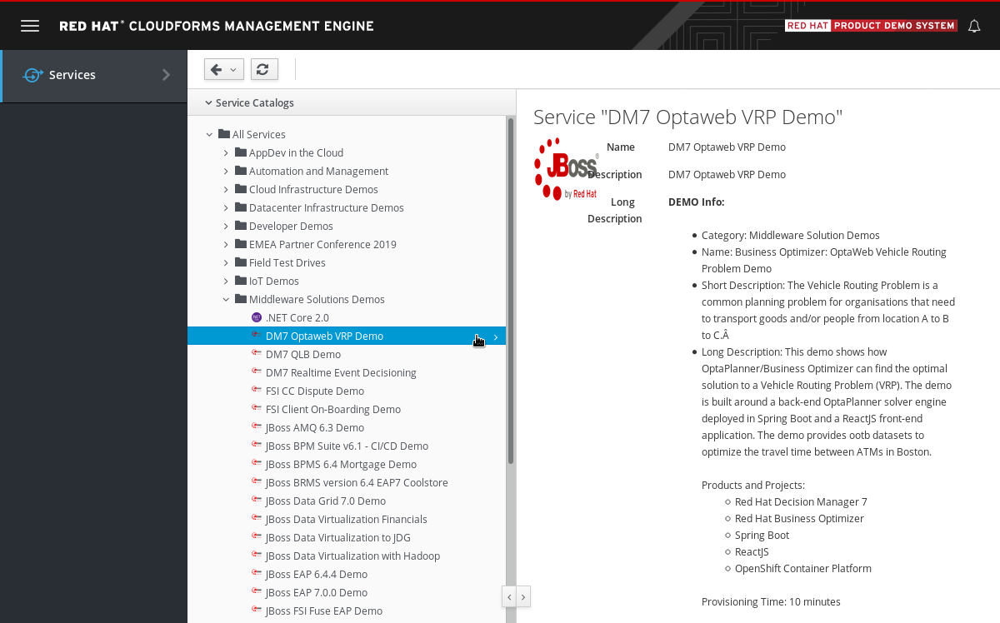
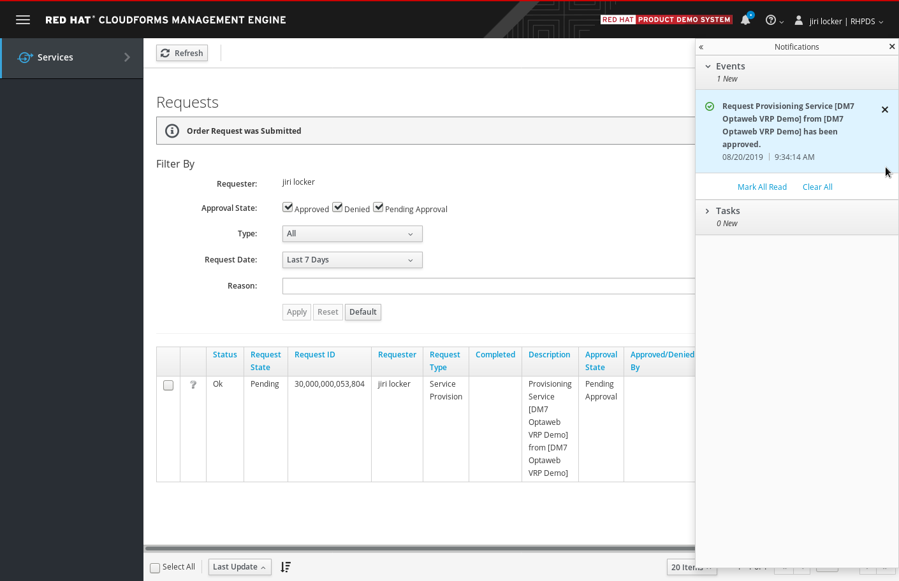

=== Using RHPDS

Log in at https://rhpds.redhat.com/.
If you don't have an account follow instructions at the login page.
Upon successful login you'll see the RHPDS landing page:

image::cfme_goto_catalog.png[]

Open service catalog using the left side navigation menu.

Expand *Middleware Solutions Demos* folder and select *{demo-catalog-item}* catalog item.

Read the catalog item description and open the link to a usage guide that will walk you through the demo once it is provisioned.

Click *Order* button at the bottom of the service details section
(not visible on the screenshot above).
You'll be presented with an ordering form:

image::cfme_submit.png[]

Fill in the form and submit it.
You'll be taken to a request list page.
Wait until the request is approved.
This should happen automatically within a few seconds and you'll be notified in the management console.

At this point, provisioning of an OpenShift cluster with the demo will start.
You'll be notified about the progress several times via email.
The environment should be provisioned in about 10 minutes.
Wait for a final confirmation with a subject
*Your shared environment <id> on Red Hat Product Demo System has completed deployment*.

In this final email, you'll receive a URL of the cluster.
Open the cluster URL in your web browser and log in using your OPENTLC credentials.

Once you've logged into the OpenShift environment, open the *{demo-app-name}-GUID* project
(GUID is a random string unique for each ordered demo).
Then open the *Networking* section on the left hand side menu and click *Routes*.

image::ocp_routes.png[]

Follow the walk-through document you have previously opened from the catalog item description.
