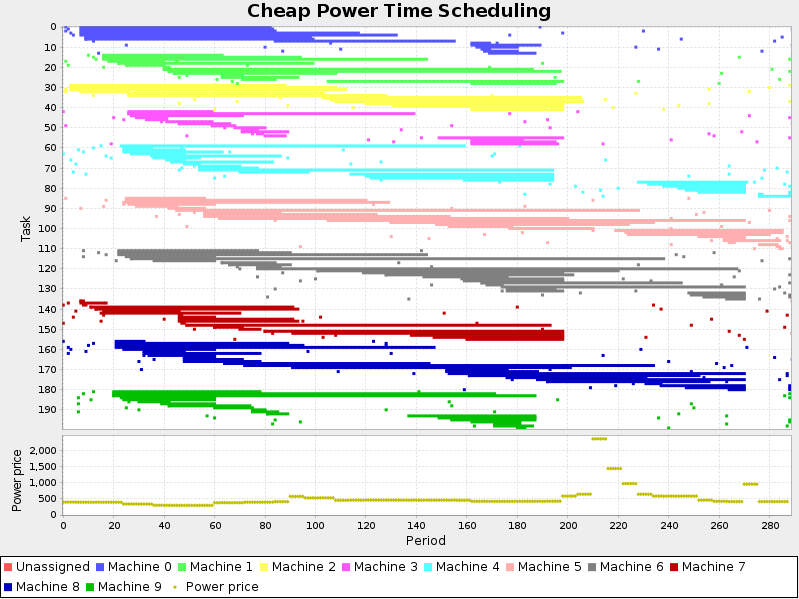

= Release Notes 6.2
:awestruct-layout: base
:showtitle:

== OptaPlanner 6.2 (currently still Beta)

We are happy to announce a 6.2 Beta release of OptaPlanner.

OptaPlanner is a lightweight, embeddable planning engine written in Java™
to solve constraint satisfaction problems efficiently. +
Together with the Drools rule engine and the jBPM workflow engine,
it is a strong and flexible foundation for knowledge management.

*link:../../download/download.html#NonFinalReleases[Download it now]*, link:../../learn/documentation.html#NonFinalReleases[read the docs]
or link:#NewAndNoteWorthy[scroll to the new and noteworthy].

=== Demo videos

Each of these videos demonstrates an example and a feature:

* http://www.youtube.com/watch?v=u_bl6E7aiNY&list=PLJY69IMbAdq0uKPnjtWXZ2x7KE1eWg3ns[Exam timetabling]: User defined score parametrization
* http://www.youtube.com/watch?v=L98J6HhSCXQ&list=PLJY69IMbAdq0uKPnjtWXZ2x7KE1eWg3ns[Dinner party scheduling]: Decision tables
* http://www.youtube.com/watch?v=K084NKRZqkg&list=PLJY69IMbAdq0uKPnjtWXZ2x7KE1eWg3ns[Cloud optimization]: Decision tables
* http://www.youtube.com/watch?v=xhCtuM-Hiic&list=PLJY69IMbAdq0uKPnjtWXZ2x7KE1eWg3ns[Cloud optimization]: Real time planning
* http://www.youtube.com/watch?v=4meWIhPRVn8&list=PLJY69IMbAdq0uKPnjtWXZ2x7KE1eWg3ns[Course scheduling]: Immovable planning entities
* http://www.youtube.com/watch?v=_2zweB9JD7c&list=PLJY69IMbAdq0uKPnjtWXZ2x7KE1eWg3ns[Project job scheduling]: Build-in hard constraints
* http://www.youtube.com/watch?v=IB2CxfLhHG4&list=PLJY69IMbAdq0uKPnjtWXZ2x7KE1eWg3ns[Tennis club scheduling]: Fairness and load balancing constraints
* http://www.youtube.com/watch?v=BxO3UFmtAPg&list=PLJY69IMbAdq0uKPnjtWXZ2x7KE1eWg3ns[Vehicle routing with time windows]: Shadow variables and real-time planning
* http://www.youtube.com/watch?v=4hp_Qg1hFgE&list=PLJY69IMbAdq0uKPnjtWXZ2x7KE1eWg3ns[Vehicle routing scoring]: Score function flexibility
* http://www.youtube.com/watch?v=7nPagqJK3bs&list=PLJY69IMbAdq0uKPnjtWXZ2x7KE1eWg3ns[Employee rostering]: Continuous planning

=== Status

OptaPlanner is:

* *Stable*: Heavily tested with unit, integration and stress tests.
* *Reliable*: Used across the world. See link:../../learn/testimonialsAndCaseStudies.html[case studies].
* *Scalable*: One of the examples handles 50 000 entities with 5 000 variables each, multiple constraint types and billions of possible constraint matches.
* *Documented*: See link:../../learn/documentation.html[the detailed reference manual] or one of the many examples.
* *Open source*: Released under link:../../code/license.html[the Apache Software License].

[[NewAndNoteWorthy]]
=== New and noteworthy

==== Strategic Oscillation Tabu Search

Strategic Oscillation Tabu Search is often an improvement over normal Tabu Search.
Instead of picking the accepted move with the highest score, it employs a different mechanism:
If there's an improving move, it picks it. If there's no improving move however,
it prefers moves which improve a softer score level, over moves which break a harder score level less.

To enable it, do this:

[source,xml]
----
  <localSearch>
    ...
    <acceptor>
      <entityTabuSize>7</entityTabuSize>
    </acceptor>
    <forager>
      <acceptedCountLimit>1000</acceptedCountLimit>
      <finalistPodiumType>STRATEGIC_OSCILLATION</finalistPodiumType>
    </forager>
  </localSearch>
----

==== New example: Cheap time scheduling

Schedule all tasks in time and on a machine to minimize the power cost.
Each machine must have enough hardware to run all of its tasks.
Each task and machine consumes power. The power price differs over time.

Based on contributions by Lukáš Petrovický.

==== New benchmarker statistics: Constraint Match Total Best/Step score

These new statistics visualize how the individual constraint types change over time.

image:6.2/constraintMatchTotalBestScoreStatistic.png[]

==== Other improvements

* Construction Heuristics: new pick early type: +FIRST_FEASIBLE_SCORE+ which is useful for scaling.
