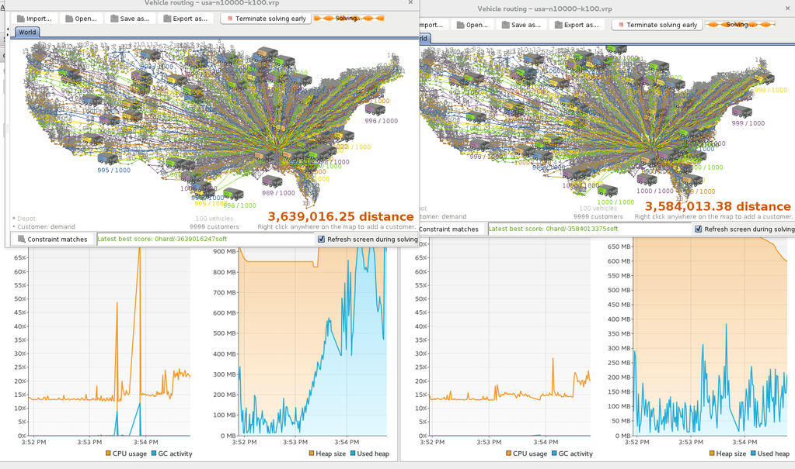

= Release Notes 6.4
:awestruct-description: New and noteworthy, demos and status for OptaPlanner 6.4.
:awestruct-layout: releaseNotesBase
:awestruct-priority: 1.0
:awestruct-release_notes_version: 6.4
:awestruct-release_notes_version_qualifier: Beta

[[NewAndNoteWorthy]]
== New and noteworthy

=== Generic API

The `SolverFactory` and `Solver` now optionally support a generic type parameter,
to avoid the awkward cast to your `Solution` implementation:

[source,java]
----
    // Build solver
    SolverFactory<CloudBalance> solverFactory = SolverFactory.createFromXmlResource(
            "org/.../cloudBalancingSolverConfig.xml");
    Solver<CloudBalance> solver = solverFactory.buildSolver();

    // Solve it
    CloudBalance solvedCloudBalance = solver.solve(unsolvedCloudBalance);
----

The old style still works too, of course.

=== Statistical benchmarking

Statistical benchmarking allows you to rerun your single benchmarks multiple times.
This can be useful to eliminate influences of the environment and verify the results of your benchmarks.

The report visualizes the results of the runs in the "Best score" table,
and also compares the results of sub single benchmarks for each problem benchmark in a box plot chart:

image:6.4/subSingleBenchmarkSummaryStatistic.png[sub single benchmark summary statistic]

To enable it, add the following line with a positive integer as a parameter to your `<inheritedSolverBenchmark>`
or to individual `<solverBenchmark>` elements.

[source,xml]
----
<inheritedSolverBenchmark>
  <name>...</name>
  <solver>
    ...
  </solver>
  <subSingleCount>N</subSingleCount>
</inheritedSolverBenchmark>
----

=== Nearby Selection memory consumption reduced

When Nearby Selection is used in Local Search, it's memory consumption is heavily reduced,
especially when scaling out:

It can now scale above 10k+ entities on normal hardware, as long as any `distributionSizeMaximum` is configured.

Furthermore, it's bootstrap performance is much better too for Local Search.

=== Kjar and KieContainer support

OptaPlanner now supports kjars, so it can
consume a kjar produced by OptaPlanner Workbench
or deploy a kjar to OptaPlanner Execution Server
at runtime.

A kjar can now contain Solver configurations and the `SolverFactory` can now load them from it with a `KieContainer`.
This allows to load a solver configuration or score rules at runtime that are not in the original classpath:

[source, java]
----
        KieServices kieServices = KieServices.Factory.get();
        ReleaseId releaseId = kieServices.newReleaseId("org.nqueens", "nqueens-kjar", "1.0.0");
        KieContainer kieContainer = kieServices.newKieContainer(releaseId);
        SolverFactory<NQueens> solverFactory = SolverFactory.createFromKieContainerXmlResource(
                kieContainer, "org/nqueens/solverConfig.solver");
        Solver<NQueens> solver = solverFactory.buildSolver();
----

A ksession defined in `META-INF/kmodule.xml` can now be referenced from a Solver configuration:

[source, java]
----
<solver>
  ...
  <scoreDirectorFactory>
    ...
    <ksessionName>nqueensKsession</ksessionName>
  </scoreDirectorFactory>
</solver>
----

=== New example: Meeting scheduling

Assign meetings of different durations to starting times and rooms.
See http://www.youtube.com/watch?v=wLK2-4IGtWY[this video].

=== Other improvements

* Benchmark warm ups now run in parallel threads, just like the actual benchmarks.
* Apache Camel's camel-optaplanner 2.16 supports async solving, daemon mode and ProblemFactChange processing. Contributed by Bilgin Ibryam.
* A `SolverFactory` can now be cloned with `cloneSolverFactory()` to concurrently configure it dynamically per user request without parsing the solver config XML each time.
* The examples application has switched to a more modern look and feel.
* Several design patterns to deal with scheduling in time have been documented in the manual.
* New Construction Heuristic: Allocate To Value From Queue
* Various bugs resolved. See https://issues.jboss.org/projects/PLANNER?selectedItem=com.atlassian.jira.jira-projects-plugin:release-page&status=released[our issue tracker].
