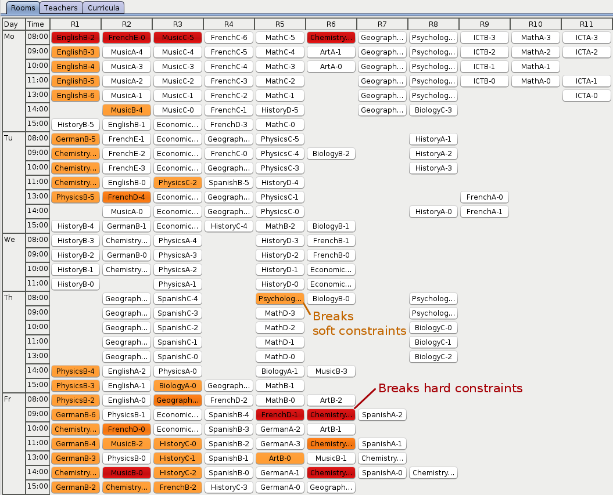
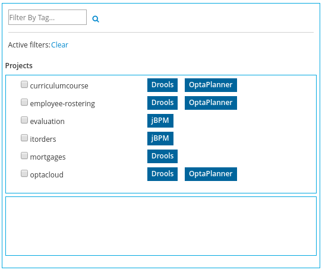
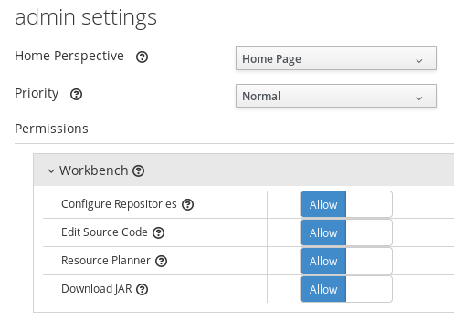

= Release Notes 7.0
:awestruct-description: New and noteworthy, demos and status for OptaPlanner 7.0.
:awestruct-layout: releaseNotesBase
:awestruct-priority: 1.0
:awestruct-release_notes_version: 7.0
:awestruct-release_notes_version_qualifier: Beta

[[NewAndNoteWorthy]]
== New and noteworthy

=== Java 8 or higher

OptaPlanner 7.x now requires Java 8 or higher to run. The 6.x releases remain compatible with Java 6 or higher.

The API and implementation now make use of Java 7 and Java 8 features (such as lamdba's).

=== Multi-threaded partitioned search

OptaPlanner now has out of the box support for solving a single dataset by partitioning across multiple threads.
So it makes use of multiple CPU cores for a single problem.

Partitioned Search can implement geo-fencing for Vehicle Routing use cases.
For example, we can split up Great Britain into 4 parts and solve those parts separately:

image:7.0/partitionedSearchThreading.png[Partitioned Search Threading]

This can potentially https://www.optaplanner.org/blog/2014/03/03/CanMapReduceSolvePlanningProblems.html[reduce solution quality],
but for big datasets (usually above 5000 entities) the performance gains normally outweighs the long-term quality loss,
because when a result is needed within hours or less, the solution quality is still higher.

Especially for Construction Heuristics, it can deliver an initial, feasible solution in a fraction of the time.
For example, *we've benchmarked a 30 time speed increase by partitioning Construction Heuristics in 4 parts
running on 4 CPU cores*, on an 8 core machine for a dataset with 4800 entities and 1200 planning values.
This speeds is attributed not just to the utilization of more CPU cores (at most a times 4 increase),
but mainly to the problem search space size reduction per part thread.

Partitioned Search is configured like any other solver phase:

[source,xml,options="nowrap"]
----
<solver>
  ...
  <partitionedSearch>
    <!-- The SolutionParititioner splits a dataset into parts -->
    <solutionPartitionerClass>...CloudBalancePartitioner</solutionPartitionerClass>

    <!-- Optionally configure which phaes to run on each part -->
    <constructionHeuristic>...</constructionHeuristic>
    <localSearch>...</localSearch>
  </partitionedSearch>
</solver>
----

There is support to limit the number CPU cores OptaPlanner consumes (to avoid CPU starving other processes and thread)
through `runnablePartThreadLimit`. Furthermore, it is also possible to configure a `threadFactoryClass`.

For now, you still need to implement the `SolutionPartitioner` interface,
but we'll add out of the box strategies (such as geo-fencing) soon:

[source,java,options="nowrap"]
----
public interface SolutionPartitioner<Solution_> {

    List<Solution_> splitWorkingSolution(ScoreDirector<Solution_> scoreDirector, Integer runnablePartThreadLimit);

}
----

=== Heat map to visualize the score

To explain a score in your UI, use the `Indictment` API to visualize the broken constraints:

Call `ScoreDirector.getIndictmentMap()` to extract the score per planning entity:

[source,java,options="nowrap"]
----
Map<Object, Indictment> indictmentMap = guiScoreDirector.getIndictmentMap();
for (Lecture lecture = courseSchedule.getLectureList()) {
    Indictment indictment = indictmentMap.get(lecture);
    if (indictment != null) {
        // The score impact of that lecture
        Score scoreTotal = indictment.getScoreTotal();
        ...
    }
}
----

It's even possible to break it down further,
to see which specific constraints that lecture actually triggered.

=== No longer needed to implement the `Solution` interface

Your solution class no longer needs both have the `@PlanningSolution` annotation and implement the `Solution` interface.
No need to repeat yourself any more.
The `Solution` interface is now deprecated (but still works for backwards compatibility):
only the `@PlanningSolution` annotation suffices.

Instead of implementing the old interface methods, annotate your `Score` getter with `@PlanningScore`.
If you're using Drools score calculation, annotate all problem fact getters (or fields)
with `@ProblemFactCollectionProperty` or `@ProblemFactProperty`.

[source, java]
----
@PlanningSolution
public class CloudBalance {

    private List<CloudComputer> computerList;
    ...

    private HardSoftScore score;

    @ValueRangeProvider(id = "computerRange")
    @ProblemFactCollectionProperty
    public List<CloudComputer> getComputerList() {...}

    @PlanningScore
    public HardSoftScore getScore() {...}
    public void setScore(HardSoftScore score) {...}

}
----

Solving hasn't changed:

[source,java]
----
    SolverFactory<CloudBalance> solverFactory = SolverFactory.createFromXmlResource(...);
    Solver<CloudBalance> solver = solverFactory.buildSolver();
    CloudBalance solvedCloudBalance = solver.solve(unsolvedCloudBalance);
----

Contributed by Lukáš Petrovický.

=== No longer needed to define the score type in the solver configuration

Planner now picks it up automatically from the domain model.

=== New JAXB and Jackson support and improved XStream support

To marshall a `Score` from or to XML or JSON, use the appropriate binder
for XStream, JAXB or Jackson in `optaplanner-persistence-xstream`, `optaplanner-persistence-jaxb` and `optaplanner-persistence-jackson`.

These will create pretty XML:

[source,xml]
----
<CloudBalance>
   ...
   <score>0hard/-200soft</score>
</CloudBalance>
----

And beautiful JSON:

[source,json]
----
{
   ...
   "score":"0hard/-200soft"
}
----

See the documentation on how to configure them.

=== New module `optaplanner-test` with JUnit testing support

To test each score rule individually, to assure it does what the business expects it to do,
use the new `ScoreVerifier` support classes in `optaplanner-test`.

=== New example: Task assigning

Assign tasks to employee and take into account required skills, affinity with the customer and task priority.
This example also demonstrates real-time producing and consuming of tasks.

+++
<iframe width="853" height="480" src="https://www.youtube.com/embed/ksXjQ851RAU?rel=0" frameborder="0" allowfullscreen></iframe>
+++

=== Other improvements

* Booleans are now supported by `ValueRangeFactory` too: `createBooleanValueRange()`
* Dates and time are now supported by `ValueRangeFactory` too: `createTemporalValueRange()`. Contributed by Kevin Wallis.
* `@ValueRangeProvider` now supports methods that return an array too.
* The log now outputs the score calculation speed for each solver phase too.
* The documentation is now in AsciiDoc, which improves output quality and makes it easier to contribute.
* `HardMediumSoftBigDecimalScore`: 3 score levels of BigDecimal scores. Contributed by Brad Hards.
* The public API is now a solid foundation for the 7.x years.

== Workbench

=== Enhanced solver editor

OptaPlanner Solver editor screen now supports adding all termination types, including composite termination.
Phase configuration section allows to tweak Construction Heuristic settings and select Local Search algorithm
to optimize your planning problem.

image:7.0/solverEditorScreen.png[Solver editor screen]

=== Guided rule editor integration

OptaPlanner now integrates with the Guided rule editor. Modify the score by build-in OptaPlanner actions.

image:7.0/guidedRule.png[Guided rule editor]

=== Difficulty comparator definition

OptaPlanner domain editor can now specify a planning entity difficulty. Navigate through the object hierarchy and define
sorting attributes.
Several Construction Heuristic algorithms require this information in order to construct a good initial solution.

image:7.0/difficultyComparator.png[Difficulty comparator]

=== Improved example import dialog

Examples are now part of the Workbench and they work offline too.
Leverage tag-based filtering to quickly access projects from the field you are interested in.

=== Other
* OptaPlanner Workbench now fully supports bendable score types
* It is no longer required to define `plannermgmt` role for the Workbench user to access OptaPlanner UI items.
Use a role-based permission management screen instead to control the access.

* Two new examples have been added. A course scheduling example models lecture scheduling at universities.
Employee rostering example optimizes task assigning to employees based on their skill.

== Execution server

=== Simplified REST API

`ServiceResponse` wrapper has been removed from OptaPlanner service responses returned by KIE Execution Server.
This allows an easier processing of the responses on the client side.

[source,xml,options="nowrap"]
----
<solver-instance>
    ...
    <status>SOLVING</status>
    <score scoreClass="org.optaplanner.core.api.score.buildin.hardsoft.HardSoftScore">0hard/-10soft</score>
    <best-solution class="curriculumcourse.curriculumcourse.CourseSchedule">
        ...
    </best-solution>
</solver-instance>
----
