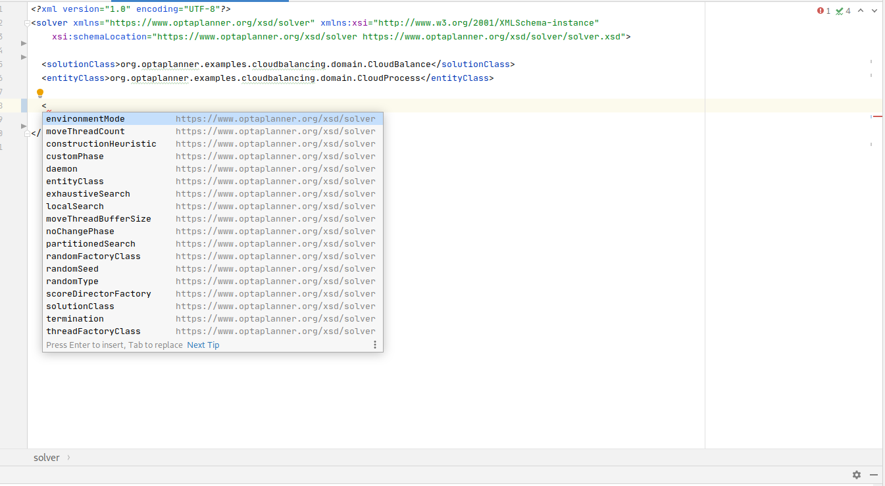

= Release Notes 8
:awestruct-description: New and noteworthy, demos and status for OptaPlanner 7.
:awestruct-layout: releaseNotesBase
:awestruct-priority: 1.0
:awestruct-release_notes_version: 8
:awestruct-release_notes_version_qualifier: Final

== New and noteworthy: Engine 8.0.0.Final

=== XML Schema Definition for both solverConfig.xml and benchmarkConfig.xml

In this release, we are introducing XML Schema Definition for an XML configuration of both the solver and the benchmark.
IDEs can now offer code completion of the solver and the benchmark configuration.

We encourage everyone to check out our link:../upgradeRecipe/upgradeRecipe8.html[updated upgrade recipe] to adapt accordingly.
