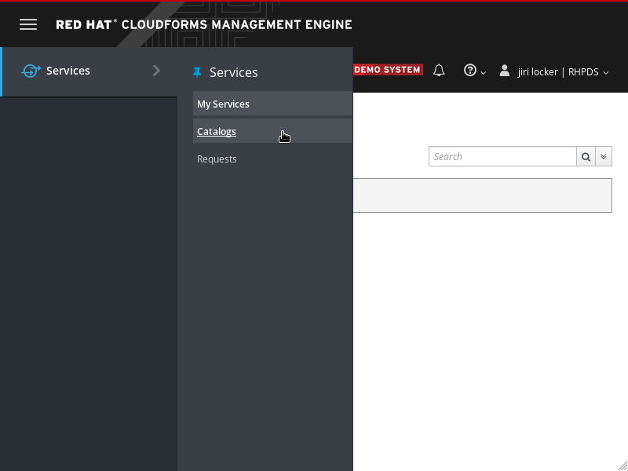
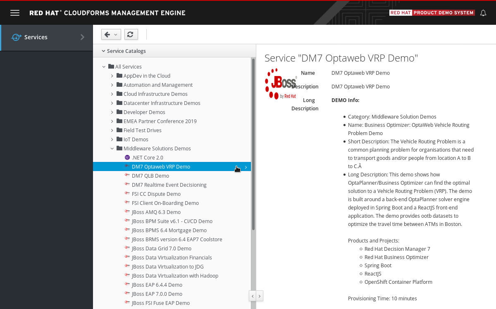
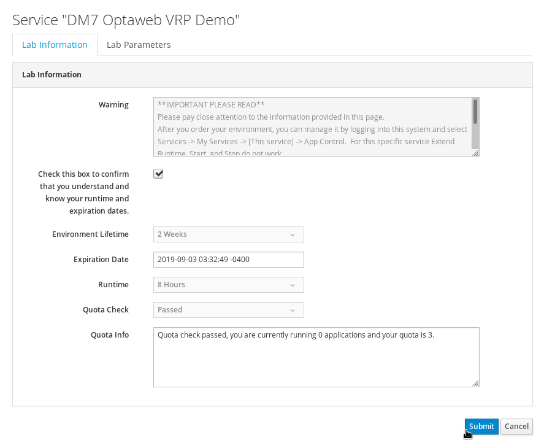
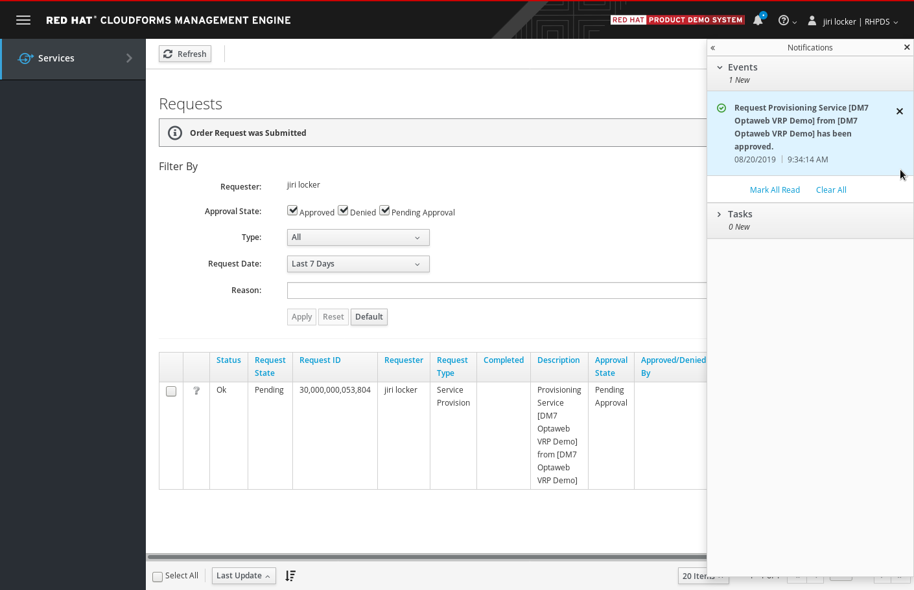
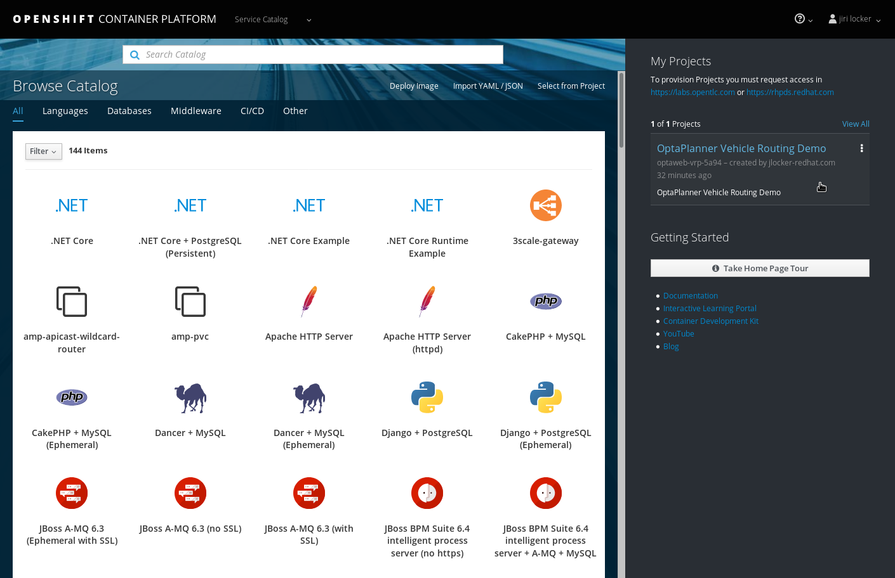
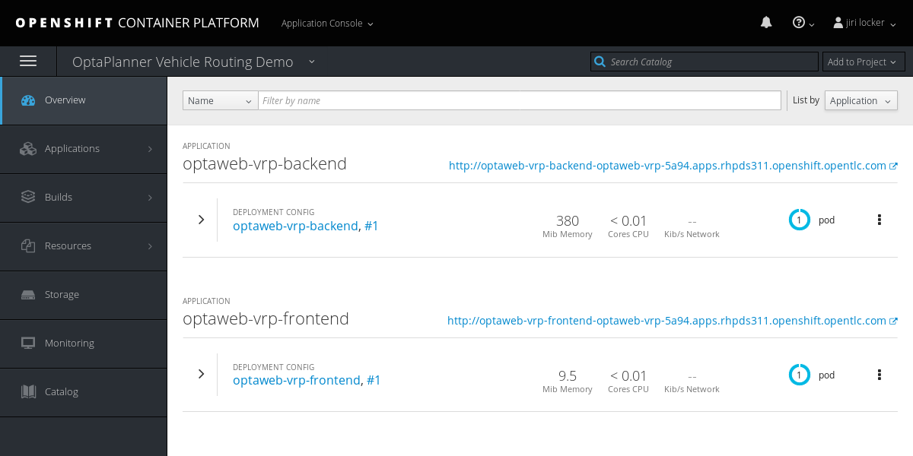

= RHPDS instructions for OptaWeb Vehicle Routing
:awestruct-description: How to demo OptaWeb Vehicle Routing with RHPDS
:awestruct-layout: normalBase
:awestruct-priority: 0.1
:showtitle:

== Video instructions

+++
<iframe class="youtube" src="https://www.youtube.com/embed/ylPEIf7Mc2M" frameborder="0" allowfullscreen></iframe>
+++

== Written instructions

=== Using RHPDS

Log in at https://rhpds.redhat.com/.
If you don't have an account follow instructions at the login page.
Upon successful login you'll see the RHPDS landing page:

Open service catalog using the left side navigation menu.

Expand *Middleware Solutions Demos* folder and select *DM7 OptaWeb VRP Demo*.
Click *Order* button at the bottom of the service details section
(not visible on the screenshot above).
You'll be presented with an ordering form:

Fill in the form and submit it.
You'll be taken to a request list page.
Wait until the request is approved.
This should happen automatically within a few seconds and you'll be notified in the management console.

At this point, provisioning of an OpenShift cluster with the demo will start.
You'll be notified about the progress several times via email.
The environment should be provisioned in about 10 minutes.
Wait for a final confirmation with a subject
*Your shared environment <id> on Red Hat Product Demo System has completed deployment*.

In this final email, you'll receive a URL of the cluster.
Open the cluster URL in your web browser and log in using your OPENTLC credentials.

Open the *OptaPlanner Vehicle Routing Demo* project on the right side.
You'll see the project overview with two applications:

Open URL of the `optaweb-vrp-frontend` application.
You'll see an empty landing page with a navigation bar at the top.
Navigate to the *Demo* screen and start adding locations or import a built-in data-set.
