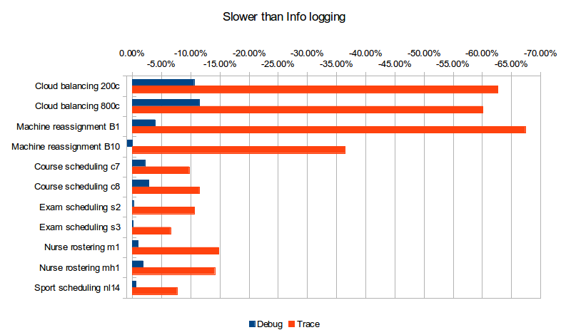
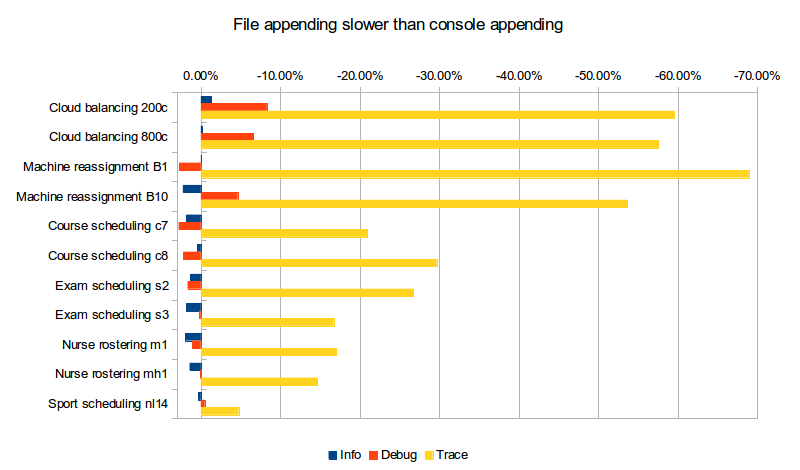

= How fast is logging?
ge0ffrey
2015-02-23
:page-interpolate: true
:jbake-type: post
:jbake-tags: production, benchmark

What's the cost of trace/debug logging in production? What's the performance cost of logging to a file?
In these benchmarks, I compare the performance impact of logging levels (`error`, `warn`, `info`, `debug`, `trace`)
and logging appenders (console appender, file appender) on several realistic https://www.optaplanner.org[OptaPlanner]
use cases.

== Benchmark methodology

* Logging implementation: http://www.slf4j.org/[SFL4J] `1.7.2` with http://logback.qos.ch/[Logback] `1.0.9` (Logback is the spiritual successor of Log4J 1)

* Logging configuration (`logback.xml`):

[source, xml]
----
<?xml version="1.0" encoding="UTF-8"?>
<configuration>

  <appender name="appender" class="ch.qos.logback.core.ConsoleAppender">
    <encoder>
      <pattern>%d [%t] %-5p %m%n</pattern>
    </encoder>
  </appender>

  <logger name="org.optaplanner" level="info"/>

  <root level="warn">
    <appender-ref ref="appender"/>
  </root>

</configuration>
----

Which results in output like this:

----
2015-02-23 08:07:35,310 [main] INFO  Solving started: time spent (18), best score (uninitialized/0hard/0soft), environment mode (REPRODUCIBLE), random (JDK with seed 0).
2015-02-23 08:07:35,363 [main] INFO  Construction Heuristic phase (0) ended: step total (6), time spent (71), best score (0hard/-5460soft).
2015-02-23 08:07:35,641 [main] INFO  Local Search phase (1) ended: step total (1), time spent (349), best score (0hard/-5460soft).
2015-02-23 08:07:35,652 [main] INFO  Solving ended: time spent (360), best score (0hard/-5460soft), average calculate count per second (905), phase total (2), environment mode (REPRODUCIBLE).
----

* VM arguments: `-Xmx1536M -server` +
Software: `Linux 3.2.0-59-generic-pae` +
Hardware: `Intel® Xeon(R) CPU W3550 @ 3.07GHz`

* Each run solves 13 planning problems with https://www.optaplanner.org[OptaPlanner].
Each planning problem runs for 5 minutes. It starts with a 30 second JVM warm up which is discarded.

* Solving a planning problem involves *no IO* (except a few milliseconds during startup to load the input).
*A single CPU is completely saturated.*
It constantly creates many short-lived objects, and the GC collects them afterwards.

* The benchmarks measure the number of scores that can be calculated per millisecond. Higher is better.
Calculating a score for a proposed planning solution is non-trivial:
it involves many calculations, including checking for conflicts between every entity and every other entity.

To reproduce these benchmarks locally, https://www.optaplanner.org/code/sourceCode.html[build optaplanner from source]
and run the main class
https://github.com/kiegroup/optaplanner/blob/main/optaplanner-examples/src/main/java/org/optaplanner/examples/app/GeneralOptaPlannerBenchmarkApp.java[GeneralOptaPlannerBenchmarkApp].

== Logging levels: `error`, `warn`, `info`, `debug` and `trace`

I ran the same benchmark set several times with a different https://www.optaplanner.org[OptaPlanner] logging level:

[source, xml]
----
  <logger name="org.optaplanner" level="error|warn|info|debug|trace"/>
----

All other libraries (including https://www.drools.org[Drools]) were set to `warn` logging.
The logging verbosity of OptaPlanner differs greatly per level:

* *`error`* and *`warn`*: *0 lines*
* *`info`*: 4 lines per benchmark, so *less than 1 line per minute*.
* *`debug`*: 1 line per step, so *about 1 line per second for Tabu Search and more for Late Acceptance*
* *`trace`*: 1 line per move, so *between 1k and 120k lines per second*

These are the raw benchmark numbers, measured in average score calculation count per second (higher is better):

|===
|Logging level |Cloud balancing 200c |Cloud balancing 800c |Machine reassignment B1 |Machine reassignment B10 |Course scheduling c7 |Course scheduling c8 |Exam scheduling s2 |Exam scheduling s3 |Nurse rostering m1 |Nurse rostering mh1 |Sport scheduling nl14

|Error |66065 |61866 |119230 |32759 |6282 |8370 |10330 |7121 |4001 |3718 |1248
|Warn |66943 |62191 |122678 |32688 |6297 |8303 |10517 |7182 |3942 |3660 |1278
|Info |67393 |63192 |123734 |32461 |6188 |8299 |10330 |7108 |3944 |3654 |1252
|Debug |60254 |55938 |118917 |32735 |6054 |8062 |10310 |7104 |3904 |3586 |1244
|Trace |25159 |25214 |40346 |20629 |5585 |7347 |9229 |6642 |3360 |3138 |1156
|Dataset scale |120k |1920k |500k |250000k |217k |145k |1705k |1613k |18k |12k |4k
|Algorithm |Late Acceptance |Late Acceptance |Tabu Search |Tabu Search |Late Acceptance |Late Acceptance |Tabu Search |Tabu Search |Tabu Search |Tabu Search |Tabu Search
|===

I'll ignore the difference between error, warn and info logging: The difference is at most 4%,
the runs are 100% reproducible and I didn't otherwise use the computer during the benchmarking,
so I presume the difference can be blamed on the JIT hotspot compiling or CPU luck.

*What does turning on Debug or Trace logging cost us in performance (versus Info logging)?*

|===
|Logging level |Cloud balancing 200c |Cloud balancing 800c |Machine reassignment B1 |Machine reassignment B10 |Course scheduling c7 |Course scheduling c8 |Exam scheduling s2 |Exam scheduling s3 |Nurse rostering m1 |Nurse rostering mh1 |Sport scheduling nl14

|Debug |-10.59% |-11.48% |-3.89% |0.84% |-2.17% |-2.86% |-0.19% |-0.06% |-1.01% |-1.86% |-0.64%
|Trace |-62.67% |-60.10% |-67.39% |-36.45% |-9.74% |-11.47% |-10.66% |-6.56% |-14.81% |-14.12% |-7.67%
|Dataset scale |120k |1920k |500k |250000k |217k |145k |1705k |1613k |18k |12k |4k
|Algorithm |Late Acceptance |Late Acceptance |Tabu Search |Tabu Search |Late Acceptance |Late Acceptance |Tabu Search |Tabu Search |Tabu Search |Tabu Search |Tabu Search
|===

*Trace logging is up to almost 4 times slower!* The impact of Debug logging is far less, but still clearly noticeable in many cases.
The use cases that use Late Acceptance (Cloud balancing and Course scheduling), which therefore do more debug logging,
seem to have a higher performance loss (although that might be in the eye of the beholder).

But wait a second! Those benchmarks use a console appender. What if they use a file appender, like in production?

== Logging appenders: appending to the console or a file

On a production server, appending to the console often means losing the log information as it gets piped into `/dev/null`.
Also during development, the IDE's console buffer can overflow, causing the loss of log lines.
One way to avoid these issues is to configure a file appender.
To conserve disk space, I used a rolling file appender which compresses old log files in zip files of 5MB:

[source, xml]
----
  <appender name="appender" class="ch.qos.logback.core.rolling.RollingFileAppender">
    <file>local/log/optaplanner.log</file>
    <rollingPolicy class="ch.qos.logback.core.rolling.FixedWindowRollingPolicy">
      <fileNamePattern>local/log/optaplanner.%i.log.zip</fileNamePattern>
      <minIndex>1</minIndex>
      <maxIndex>3</maxIndex>
    </rollingPolicy>
    <triggeringPolicy class="ch.qos.logback.core.rolling.SizeBasedTriggeringPolicy">
      <maxFileSize>5MB</maxFileSize>
    </triggeringPolicy>
    <encoder>
      <pattern>%d [%t] %-5p %m%n</pattern>
    </encoder>
  </appender>
----

These are the raw benchmark numbers, measured again in average score calculation count per second (higher is better):

|===
|Logging appender and level |Cloud balancing 200c |Cloud balancing 800c |Machine reassignment B1 |Machine reassignment B10 |Course scheduling c7 |Course scheduling c8 |Exam scheduling s2 |Exam scheduling s3 |Nurse rostering m1 |Nurse rostering mh1 |Sport scheduling nl14

|Console Info |67393 |63192 |123734 |32461 |6188 |8299 |10330 |7108 |3944 |3654 |1252
|File Info |66497 |63065 |123758 |33195 |6302 |8338 |10467 |7238 |4022 |3706 |1256
|Console Debug |60254 |55938 |118917 |32735 |6054 |8062 |10310 |7104 |3904 |3586 |1244
|File Debug |55248 |52261 |122144 |31220 |6223 |8241 |10482 |7118 |3945 |3589 |1238
|Console Trace |25159 |25214 |40346 |20629 |5585 |7347 |9229 |6642 |3360 |3138 |1156
|File Trace |10162 |10708 |12528 |9555 |4416 |5167 |6764 |5532 |2789 |2678 |1101
|===

*What does file appender cost us in performance (versus console appender)?*

|===
|Logging level |Cloud balancing 200c |Cloud balancing 800c |Machine reassignment B1 |Machine reassignment B10 |Course scheduling c7 |Course scheduling c8 |Exam scheduling s2 |Exam scheduling s3 |Nurse rostering m1 |Nurse rostering mh1 |Sport scheduling nl14

|Info |-1.33% |-0.20% |0.02% |2.26% |1.84% |0.47% |1.33% |1.83% |1.98% |1.42% |0.32%
|Debug |-8.31% |-6.57% |2.71% |-4.63% |2.79% |2.22% |1.67% |0.20% |1.05% |0.08% |-0.48%
|Trace |-59.61% |-57.53% |-68.95% |-53.68% |-20.93% |-29.67% |-26.71% |-16.71% |-16.99% |-14.66% |-4.76%
|===

For info logging, it doesn't really matter. For debug logging, there's a noticeable slowdown for a minority of the cases.
*Trace logging is an extra up to almost 4 times slower!* And it stacks with our previous observation:
In the worst case (Machine reassignment B1), trace logging to a file is 90% slower than info logging to the console.

== Conclusion

Like all diagnostic information, logging comes at a performance cost.
Good libraries carefully select the logging level of each statement
to balance out diagnostic needs, verbosity and performance impact.

Here's my recommendation for https://www.optaplanner.org[OptaPlanner] users:
In development, use `debug` (or `trace`) logging with a console appender by default, so you can see what's going on.
In production, use `warn` (or `info`) logging with a file appender by default, so you retain important information.
