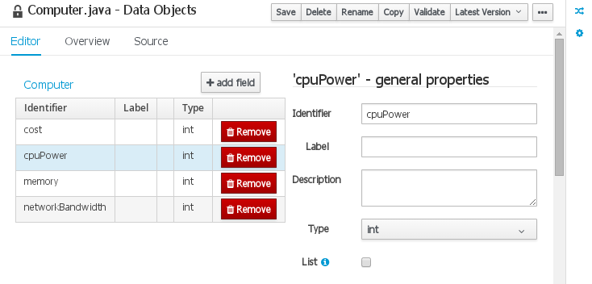
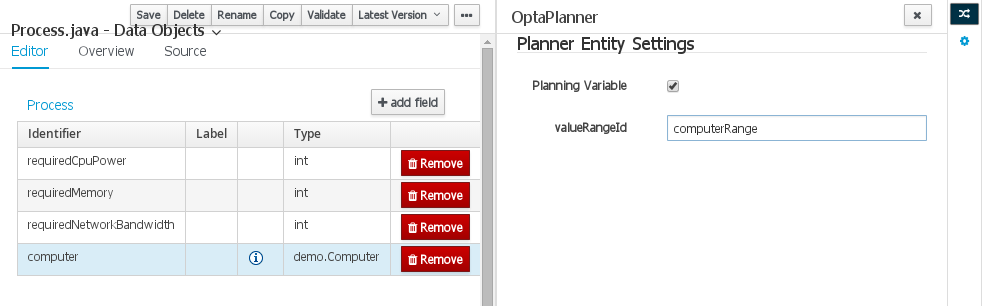
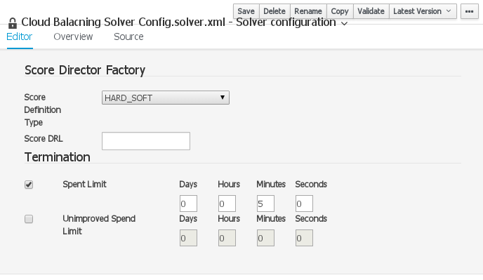
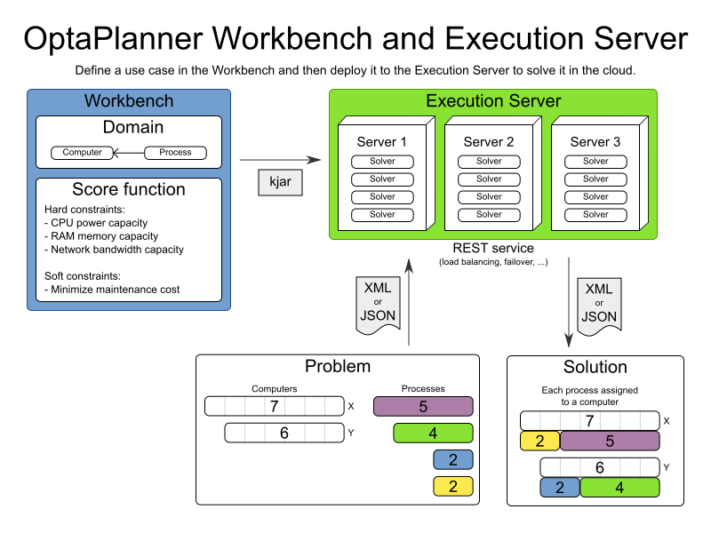

= Sneak peek at OptaPlanner Workbench
ge0ffrey
2015-10-01
:page-interpolate: true
:jbake-type: post
:jbake-tags: workbench

One critical bit missing for OptaPlanner is a web application to define an optimization problem in a web UI
and to deploy it to the cloud.
Drools and jBPM both already have such a web application: _Drools Workbench_ and _jBPM Workbench_.
So it's no big surprise that the OptaPlanner version of this will be called _OptaPlanner Workbench_.

On the side line, we've built **a quick prototype** to investigate what OptaPlanner Workbench could do (thanks Walter, Toni and Michael).
Let's take a sneak peek at that.

== Video

video::XB1_juPoWiU[youtube]

== The CloudBalancing example

OptaPlanner's Quick Start shows how to implement the Cloud Balancing example with only the OptaPlanner engine.
Let's take a look how that example could look like in the OptaPlanner Workbench:

=== Define the data objects

Here's how we'd define the `Computer` data object:

The `Process` data object is special because its `computer` field changes during planning,
so we annotate that `computer` field as a _planning variable_.

=== Define the Solver configuration

In the Solver Configuration Editor we can pick the Score type and define how long to solve.

In the future, we would add support for all termination types, optimization algorithm tweaking and far more.

=== Deploy to the Execution Server

Once all bits are ready, we would deploy it to the OptaPlanner Execution Service,
which opens a REST service in the cloud:

When a client sends a problem to this REST service as XML or JSON,
then the Execution Server solves it on one of its servers and returns the solution to the client.

== Conclusion

OptaPlanner Workbench is built on top of the OptaPlanner engine, but it will not replace it, nor curtail it:
You'll still be able to embed the OptaPlanner engine as before, without the Workbench, if you so desire.
But the Workbench will offer new opportunities for many use cases.

We're still looking into how and when we'll fracture the Workbench development into our schedule,
but in time, the OptaPlanner Workbench will offer a business user-friendly web interface to define an optimization problem.
It will be part of the KIE Workbench (also known as Business Central) and seamlessly integrate with Drools and jBPM.
