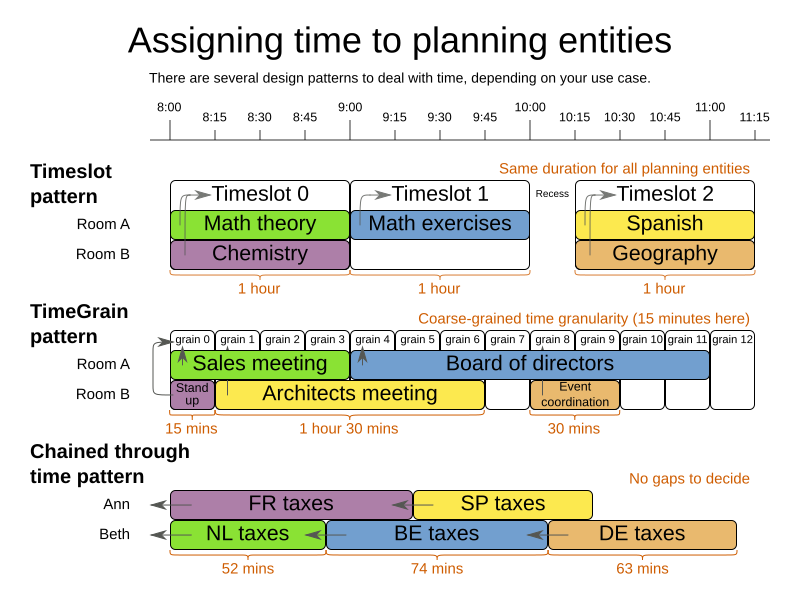

= Time scheduling design patterns
ge0ffrey
2015-12-01
:page-interpolate: true
:jbake-type: post
:jbake-tags: design, algorithm

Designing an efficient domain model for a scheduling problem that involves time (or dates) can seem difficult.
Typical use cases are course timetabling, meeting scheduling, vehicle routing with time windows and TV advertisement scheduling.
Let's take a look at design patterns to model such problems in OptaPlanner.

== Is starting time a planning variable?

In some cases, the starting time of planning entities doesn't change during planning.
For example in the hospital bed planning example, the arrival date of each patient is already fixed in advance
(potentially by another planning stage).
Therefore, none of the design patterns below apply, because the starting time is not a planning variable.

However, in many cases it does change and we do need to decide the starting time of each planning entity.
In such cases, normally one of these 3 design patterns applies:

== Timeslot pattern

In the _Timeslot_ pattern, all entities have *the same duration*. For example in course timetabling, all lecture take 1 hour.
Each lecture is assigned to 1 room and 1 timeslot.

video::4meWIhPRVn8[youtube]

== TimeGrain pattern

In the _TimeGrain_ pattern, the entities have different durations, but they start at *a course-grained time unit*, such as 15 minutes.
For most human activities, scheduling on second or subsecond accuracy is pointless:
for example in meeting scheduling, expecting people to show up at exactly 3 seconds after 9 o'clock for a meeting is overly optimistic.
Therefore scheduling on such a fine-grained accuracy would actually be counter-productive.

video::wLK2-4IGtWY[youtube]

== Chained Through Time pattern

In the _Chained Through Time_ pattern, a person or machine continuously works on 1 planning entity at time in sequence.
For example in vehicle routing with time windows, each vehicle drives from customer to customer, so it handles 1 customer at a time.
The starting time of each planning entity is calculated based on the ending time of the previous planning entity.

video::BxO3UFmtAPg[youtube]

This pattern also works well for scheduling TV advertisements, because each advertisement starts when the previous ends.

== Conclusion

When facing a time scheduling problem, take a look which of the design patterns best fits your requirements.
It will improve your development speed as well as solver efficiency and scalability.

For more information about the flexibility, advantages and disadvantages of each design pattern,
read https://www.optaplanner.org/learn/documentation.html[the documentation] (`6.4.0.Beta1` or later).
