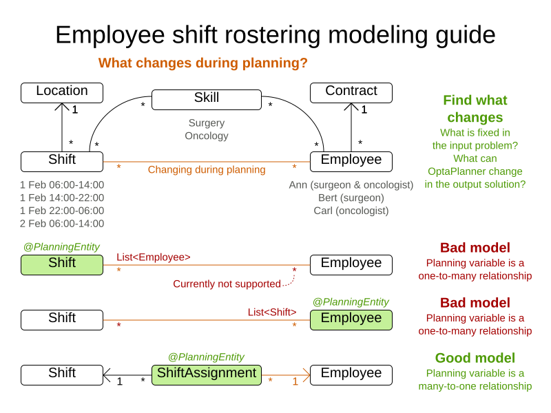

= Domain modeling guide
ge0ffrey
2016-10-26
:page-interpolate: true
:jbake-type: post
:jbake-tags: howto, design

New OptaPlanner users sometimes struggle to create a good domain model,
especially if their use case is complex.
But a good domain model can go a long way.
It can simplify the constraints, improve performance and increase flexibility for future needs.
So how do we design a good domain model for OptaPlanner cases?

== The goal

The goal is simple: determine which classes are planning entities
and which of their properties are planning variables.
Often, there is only one planning entity class with only one planning variable.
The other classes are problem facts. The other properties are problem properties.

Ideally, we want to impact the existing domain as little as possible, so we can reuse existing code.
So we'll mainly only add a few OptaPlanner annotations.

== The guide

A more up-to-date version of this guide is part of the documentation (in `7.0.0.Beta3` or later),
in the chapter _Design Patterns_.

. *Draw a class diagram* of your domain model. _Normalize_ it get rid of duplicate data.
** Write down some sample instances for each class.
*** For example in employee rostering, the samples for the `Employee` class are _Ann_, _Bert_ and _Carl_.

. *Determine which relationships (or fields) change during planning*. Color them orange.
Often there is only 1 such relationship (or field).
One side of these relationships will become a planning variable later on.
** For example in employee rostering, the `Shift` to `Employee` relationship changes during planning,
so it is orange.
Other relationships, such as from `Employee` to `Skill`, are immutable during planning
because OptaPlanner can't decide to give an employee an extra skill.

. If there are multiple relationships (or fields): *check for shadow variables*.
A shadow variable does change during planning,
but its value can be calculated based on one or more genuine planning variables, without dispute.
Color those shadow relationships (or fields) purple.
** Only one side of a bi-directional relationship can be a genuine planning variable,
the other side will become an inverse relation shadow variable later on.
Keep those relationships in orange.

. *Check for chained planning variables*.
In a chained variable design, the focus lies on deciding the order of a set of planning entity instances,
instead of assigning them to a date/time (although there can be an assigned date/time as a shadow variable).
A typical use case is vehicle routing.

. If there is an orange _many-to-many_ relationship, *replace that _many-to-many_ relationship*
with a _one-to-many_ and a _many-to-one_ relationship to a new intermediate class.
** OptaPlanner currently doesn't support a `@PlanningVariable` on a collection.
Although a future version will support it for flexibility reasons,
it probably has an inherent performance and complexity cost, so it might be better to avoid it anyway.
** For example in employee rostering the `ShiftAssignment` class is
the _many-to-many_ relationship between the `Shift` and `Employee`.
It's effectively every spot that needs to be filled with an employee.
+

. In a _many-to-one_ relationship, *usually the _many_ side is the planning entity class*.
Annotate it with a `@PlanningEntity` annotation.
** For example in employee rostering, the `ShiftAssignment` class has a `@PlanningEntity` annotation.

. The planning entity class should have *at least one problem property*.
So a planning entity class cannot consist of only planning variables
(or even an id and only planning variables).
Remove a surplus `@PlanningVariable` so it becomes a problem property.
This heavily decreases the search space size and heavily increases solving efficiency.
** For example in employee rostering, the `ShiftAssignment` class should not annotate
both the shift and employee relationship with `@PlanningVariable`.
** When all planning variables are `null` (which occurs when the planning solution is still uninitialized),
a planning entity instance should still be describable to the business people.
*** So a surrogate ID does not suffice as the required minimum of one problem property.
** This way, there is no need to add a hard constraint to assure that two planning entities are different:
they are already different due to their problem properties.
** In some cases, multiple planning entity instances have the same set of problem properties.
In such cases, it can be useful to create an extra problem property to distinguish them.
*** For example in employee rostering, the `ShiftAssignment` class has besides the problem property `Shift`
also the problem property `indexInShift` (which is an `int`).

. Choose the model in which *the number of planning entities is fixed during planning*.
** For example in employee rostering, it's impossible to know in advance how many shifts each employee will have
before OptaPlanner solves it (and it can even differ per best solution found).
On the other hand, the number of employees per shift is known in advance,
so it's better to make the `Shift` relationship a problem property
and the `Employee` relationship a planning variable.
+
image::employeeShiftRosteringModelingGuideB.png[]

== Going further

To find more inspiration on modeling your domain, take a look at the examples.
Also check out the details of shadow variables and chained variables in https://www.optaplanner.org/learn/documentation.html[the documentation].

Does this guide help you to create a better model?
