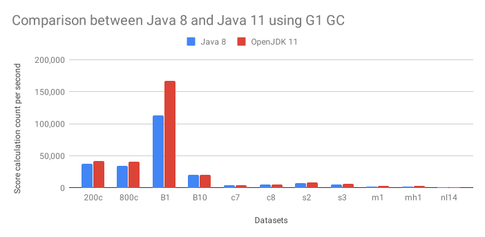
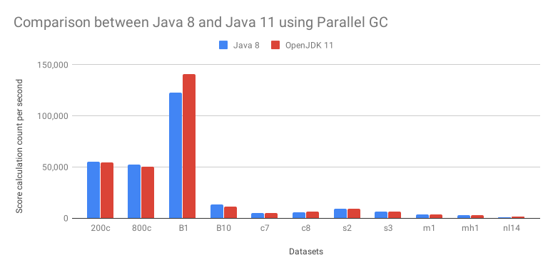

= How much faster is Java 11?
rsynek
2019-01-17
:page-interpolate: true
:jbake-type: post
:jbake-tags: production, benchmark

Java 11 was released some time ago, although the https://www.baeldung.com/java-in-2018[majority of developers stay on Java 8].
Let's see which one of them is faster for https://www.optaplanner.org/[OptaPlanner]. The best way to find out is
of course running OptaPlanner benchmarks.
This article is a follow-up on https://www.optaplanner.org/blog/2014/03/20/HowMuchFasterIsJava8.html[our similar article for Java 8].

== Benchmark methodology

To run the benchmark we used:

* A stable machine without any other computational demanding processes running and with
`2 x Intel® Xeon® CPU E5-2609 0 @ 2.4 GHz (8 cores total)` and `31.3 GiB` RAM memory, running RHEL 6.

* Both G1 and Parallel GC for both Java versions to compare the impact of garbage collection.
Java executed with the parameters `-Xmx1536M -server -XX:+UseG1GC` and `-Xmx1536M -server -XX:+UseParallelGC` respectively.

* Both Oracle Java 8:

  java version "1.8.0_191"
  Java(TM) SE Runtime Environment (build 1.8.0_191-b12)
  Java HotSpot(TM) 64-Bit Server VM (build 25.191-b12, mixed mode)
+
and OpenJDK 11:

  openjdk version "11.0.1" 2018-10-16
  OpenJDK Runtime Environment 18.9 (build 11.0.1+13)
  OpenJDK 64-Bit Server VM 18.9 (build 11.0.1+13, mixed mode)

* OptaPlanner `7.14.0.Final`

* Solving a planning problem involves *no IO* (except a few milliseconds during startup to load the input). *A single
CPU is completely saturated.* It constantly creates many short-lived objects, and the GC collects them afterwards.

* Each run solves 11 planning problems with OptaPlanner. Each planning problem runs for 5 minutes and starts with a
30 second JVM warm up which is discarded.

* The benchmarks measure the number of scores calculated per millisecond. Higher is better. Calculating
a score for a proposed planning solution is non-trivial: it involves many calculations, including checking for
conflicts between every entity and every other entity.

== Executive summary

With Java 11, the average improvement is *16.1%* for G1 and *4.5%* for Parallel GC. Although Parallel GC is oriented towards
throughput, whereas G1 focuses rather on low-latency garbage collection, the significant improvement of G1 in
Java 11 leads to a direct <<table3,comparison of these two garbage collection algorithms>>.
For more information about difference between various GC algorithms, please see
https://dzone.com/articles/choosing-the-right-gc[this article].

This shows that Parallel GC is still the preferred GC for OptaPlanner, as throughput is much more important
for solving optimization problems with OptaPlanner than the latencies introduced by the GC.

== Results

=== Java 8 vs. Java 11

[#table1]
.Score calculation count per second with G1 GC
|===
| 2+^.^|Cloud balancing 2+^.^|Machine reassignment 2+^.^|Course scheduling 2+^.^|Exam scheduling 2+^.^|Nurse rostering^.^|Traveling Tournament
|JDK ^|200c ^|800c ^|B1 ^|B10 ^|c7 ^|c8 ^|s2 ^|s3 ^|m1 ^|mh1 ^|nl14
|Java 8 >|38,074 >|34,870 >|113,490 >|20,398 >|4,296 >|4,840 >|7,003 >|5,437 >|2,385 >|2,021 >|812
|OpenJDK 11 >|41,753 >|41,282 >|166,676 >|20,363 >|4,473 >|5,466 >|8,157 >|5,927 >|2,772 >|2,536 >|957
|Difference >|9.7% >|18.4% >|46.9% >|-0.2% >|4.1% >|12.9% >|16.5% >|9.0% >|16.2% >|25.5% >|17.9%
|Average 11+^.^|*16.1%*
|===

Almost every data set improves on Java 11 over Java 8 using the G1 garbage collector. On average, there's a
16% improvement just by switching to Java 11. A possible explanation for this improvement could be the
http://openjdk.java.net/jeps/307[JEP 307: Parallel Full GC for G1], introduced in Java 10.

.Score calculation count per second with Parallel GC
|===
| 2+^.^|Cloud balancing 2+^.^|Machine reassignment 2+^.^|Course scheduling 2+^.^|Exam scheduling 2+^.^|Nurse rostering^.^|Traveling Tournament
|JDK ^|200c ^|800c ^|B1 ^|B10 ^|c7 ^|c8 ^|s2 ^|s3 ^|m1 ^|mh1 ^|nl14
|Java 8 >|54,990 >|52,514 >|122,611 >|13,382 >|4,821 >|5,880 >|8,775 >|6,170 >|3,234 >|2,682 >|880
|OpenJDK 11	>|54,316 >|50,120 >|140,816 >|11,129 >|4,927 >|6,071 >|8,996 >|6,383 >|3,336 >|3,087 >|1,125
|Difference >|-1.2% >|-4.6% >|14.8% >|-16.8% >|2.2% >|3.2% >|2.5% >|3.5% >|3.2% >|15.1% >|27.8%
|Average 11+^.^|*4.5%*
|===

With the Parallel Garbage Collector, the results are less definite than G1. There is an improvement for some data sets,
while others remain intact or show even a performance drop. However, on average, the Java 11 performs over 4% better.

=== Parallel GC vs. G1 GC on Java 11

[#table3]
.Comparison of score calculation count per second on Java 11 with Parallel GC and G1 GC being used
|===
| 2+^.^|Cloud balancing 2+^.^|Machine reassignment 2+^.^|Course scheduling 2+^.^|Exam scheduling 2+^.^|Nurse rostering^.^|Traveling Tournament
|Java 11 ^|200c ^|800c ^|B1 ^|B10 ^|c7 ^|c8 ^|s2 ^|s3 ^|m1 ^|mh1 ^|nl14
|OpenJDK 11 Parallel GC	>|54,316 >|50,120 >|140,816 >|11,129 >|4,927 >|6,071 >|8,996 >|6,383 >|3,336 >|3,087 >|1,125
|OpenJDK 11 G1 GC >|41,753 >|41,282 >|166,676 >|20,363 >|4,473 >|5,466 >|8,157 >|5,927 >|2,772 >|2,536 >|957
|Difference >|-23.1% >|-17.6% >|18.4% >|83.0% >|-9.2% >|-10.0% >|-9.3% >|-7.1% >|-16.9% >|-17.8% >|-14.9%
|Average 11+^.^|*-2.3%*
|===

Although G1 GC shows a clear improvement from Java 8, compared to Parallel GC it's less beneficial GC strategy
for OptaPlanner on the majority of the data sets. The only exception is Machine Reassignment, which shows that
the G1 OptaPlanner is able to compute score calculation 83% faster.
This applies to Java 8 too, as shown in <<table1>>.

== Conclusion

Java 11 brings additional improvements, which vary across different https://www.optaplanner.org/[OptaPlanner] examples and data sets.
On average, it is 4.5% faster when using Parallel GC and 16.1% faster with G1 GC.
Despite the significant improvement for G1 GC, Parallel GC is still faster for most data sets in this benchmark.
