= Workflow processes with AI scheduling
Christopher-Chianelli
2020-05-05
:page-interpolate: true
:jbake-type: post
:jbake-tags: use case, quarkus
:jbake-social_media_share_image: FinalBPMN.png

A BPMN diagram models a Business Process. When the Business
Process involves optimization at some step,
https://www.optaplanner.org/[OptaPlanner] can help you quickly find an optimal solution.
Now with https://kogito.kie.org/[Kogito], it is easier than ever before to integrate
OptaPlanner into your BPMN diagrams! It is so simple, that by the end of this blog,
you will create a Business Process for scheduling a flight in an airline from scratch using
OptaPlanner, BPMN and Quarkus in 15 minutes.

== Project Setup

Create a new folder to hold this project. Run the following command to
create a new Quarkus project:

[source]
----
mvn io.quarkus:quarkus-maven-plugin:1.4.1.Final:create \
    -DprojectGroupId=com.company \
    -DprojectArtifactId=airline-bpmn-optaplanner \
    -Dextensions="resteasy, resteasy-jackson, optaplanner, \
                  optaplanner-jackson, kogito-quarkus, smallrye-openapi"
----

== Creating your BPMN file

We will be creating a simple BPMN that models the following process:

. Airline creates a flight
. While the flight is open for boarding:
.. When a passenger order a ticket, create a task for security to approve/deny
   them
... If approved, add the passenger to the flight
... Otherwise, do nothing
. Send the flight with the finalized passenger list to OptaPlanner
. Send the optimized seat assignments to the airline for final approval

Go to the https://bpmn.new[Kogito BPMN Editor],
a free online editor for editing and creating BPMN files, no account required.
You should be greeted with the following screen:

image::BPMNNewFile.png[]

Click on the edit button next to `new-file.bpmn` and name it something more
appropriate, like `flight-process`. Now click the "Properties" button
on the right sidebar

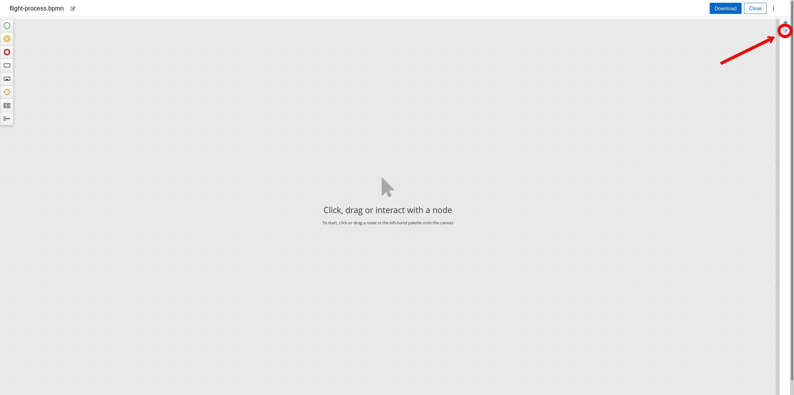

Replace the auto-generated name in the "Name" field with "Flight Process" and
the auto-generated id in the "Id" field with "flightProcess". Enter "com.company"
into the "Package" field.

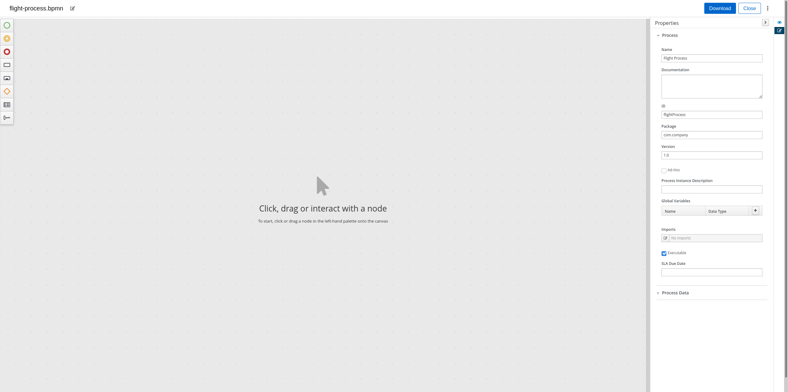

Before proceeding, we need to know our business process`' variables (that is,
what data is processed by the business process). Expand the "Process Data"
tab in the Properties Sidebar and click the "+" icon in the "Process Variable"
table. In this case, we only have one process variable: the flight we are
planning. Enter "flight" into the "Name" field, and in the "Type" field,
select "Custom..." and enter "com.company.Flight".

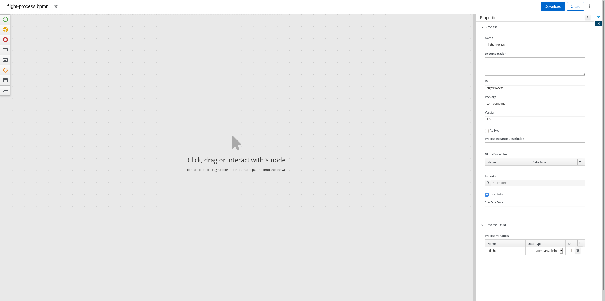

Now we get to design the actual business process. Create a start node
by clicking on the Green Circle in the toolbar on the left, and drag the
"Start" row somewhere on the canvas.

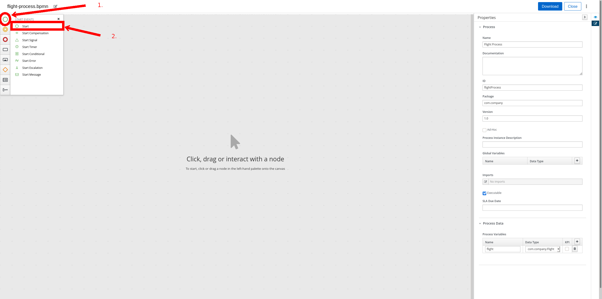

Now we are going to create a User Task to finalize the passenger list.
Click on the Rectangle in the toolbar on the left, then drag the
"User Task" row next to the start node.

image::BPMNCreateFinalizedPassengerListTask.png[]

Click on the start node, then click on the solid arrow icon, then
click on the newly created User Task to create a sequence flow
from "Start" to "Task" (this tell the process that after it is
started, to go to the "Task" node).

image::BPMNCreateSequenceFlow.png[]

Click on the "Task" node to open up its properties (if you closed
the properties panel from earlier, you can open it up again by clicking on
the properties icon). Rename the task to "Finalize Passenger List". Open
its "Implementation/Execution" tab. Change the "Task Name" field to
"finalizePassengerList"; this field will be used to determine the REST endpoint
for this task.

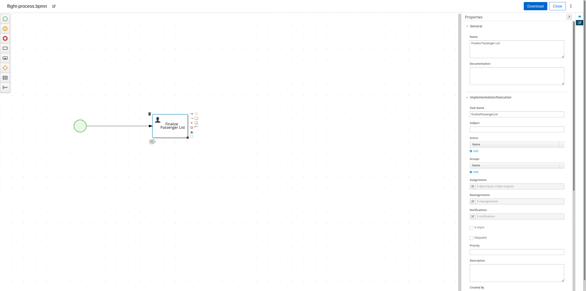

Now we are going to model passengers ordering tickets for the flight.
Create an Event-based subprocess by clicking on the Rectangle with an inner
filled rectangle on the left toolbar, and drag the "Event" row above
the start node and task.

image::BPMNCreateEventBasedSubprocess.png[]

If the Event-based subprocess is covering other nodes, you can move it by
dragging the Event-based subprocess. Open the Event-based subprocess properties
by clicking on it (opening the properties sidebar if necessary), and rename it
to "Passenger Requests Ticket Subprocess". This subprocess can have its own
variables, and also inherits the main process`' variables. In this case, we
need two additional variables:

- The passenger who requested a ticket
- The response from security

Expand the "Process Data" tab and create two new variables in the same manner
you created the "flightProcess" variable:

- "passenger", of type "com.company.Passenger" (use Custom type)
- "isPassengerApprovedBySecurity", of type "Boolean" (use the type in the dropdown)

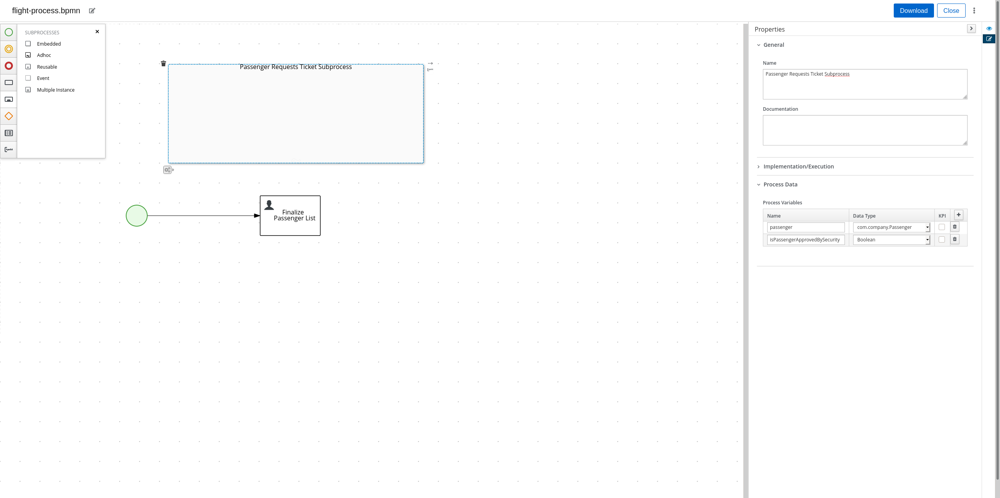

Now we need to model the event of a passenger requesting a ticket. This can
be modelled by a "Start Signal" event. Click the green circle on the left
toolbar and drag the "Start Signal" row into
"Passenger Requests Ticket Subprocess".

image::BPMNCreateStartSignal.png[]

Click on the "Start Signal" event you just created and open its properties.
Rename the event to "Passenger Request Ticket". In the Implementation/Execution
section, select "New..." in the "Signal" field and enter "passengerRequestTicket".
Finally, in the "Data Assignment" section, click on the Edit icon beneath
"Assignments" to open a Task Data I/O modal. Click the "Add" button in the
modal to add a new assignment. Put "passenger" for Name, select "Custom..."
and enter "com.company.Passenger" for Type, and select "passenger" for Target.
Click save to add the assignment.

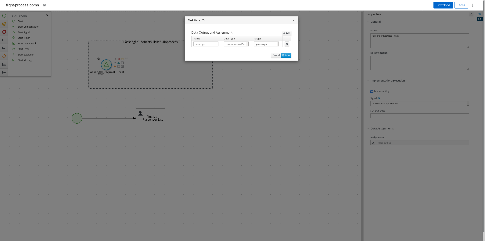

Now create a new User Task and drag it into the
"Passenger Requests Ticket Subprocess". Rename it to "Approve Passenger for
Flight". In its "Implementation/Execution" tab, change "Task Name"
to "approvePassengerForFlight". Click on the edit icon beneath "Assignments"
and add a row for both "Data Inputs and Assignments" and
"Data Outputs and Assignments". For the "Data Inputs and Assignments"
row, put "passenger" for Name, "com.company.Passenger" for Type and
select "passenger" for source. For the "Data Outputs", put
"isPassengerApprovedBySecurity" for Name, select "Boolean" for Type,
and select "isPassengerApprovedBySecurity" for Target.

image::BPMNApprovePassengerForFlightProperties.png[]

Now we need to model a decision being made in the process: should we add
the passenger to the flight or not? We model decisions in the process
with "Exclusive" Gateways. Click on the diamond in the left toolbar and
drag the "Exclusive" row into "Passenger Requests Ticket Subprocess".

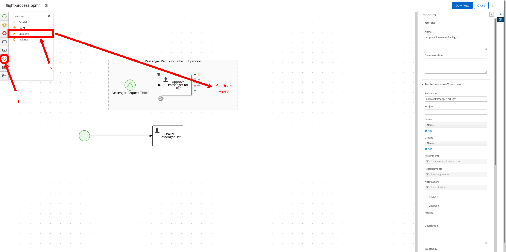

The "Passenger Requests Ticket Subprocess" might be running out of space now,
so drag the subprocess to a place that has more room and increase it size
by dragging the dot on the bottom-right corner of the subprocess.

image::BPMNMoveResizeSubprocess.png[]

Now we need to create the two potential outcomes of the decision: either
we end the process immediately or we add the passenger to the flight. We are
going to model adding a passenger to the flight first. Create a "Service Task"
by clicking the rectangle icon in the left toolbar and dragging the
"Service Task" row into "Passenger Requests Ticket Subprocess".

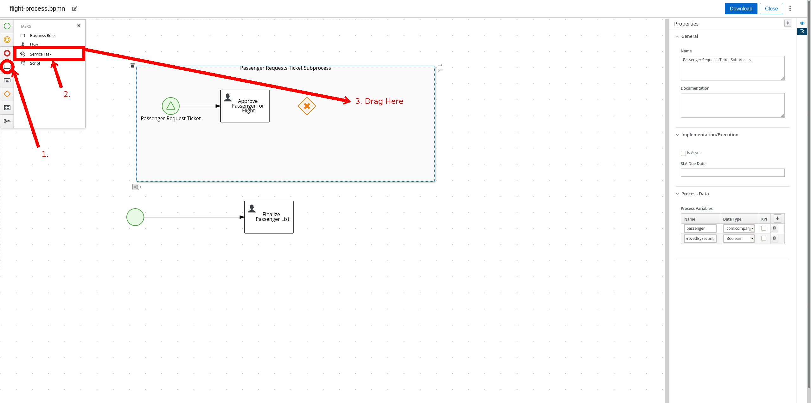

Rename the "Service Task" to "Add Passenger To Flight". In the
"Implementation/Execution" section, put "com.company.FlightService"
for "Interface", "addPassengerToFlight" for "Operation". And add the following
two input assignments (in the same manner you did input assignments for
"Approve Passenger for Flights"):

- Name: "flight", Type: "com.company.Flight", Source: "flight"
- Name: "passenger", Type: "com.company.Passenger", Source: "passenger"

image::BPMNAddPassengerToFlightProperties.png[]

Now create two "End" nodes; one for the "Passenger is not approved" path
and the other for the passenger is approved path. Click the red circle and
drag the "End" row underneath the "Exclusive Gateway" and again under
"Add Passenger To Flight".

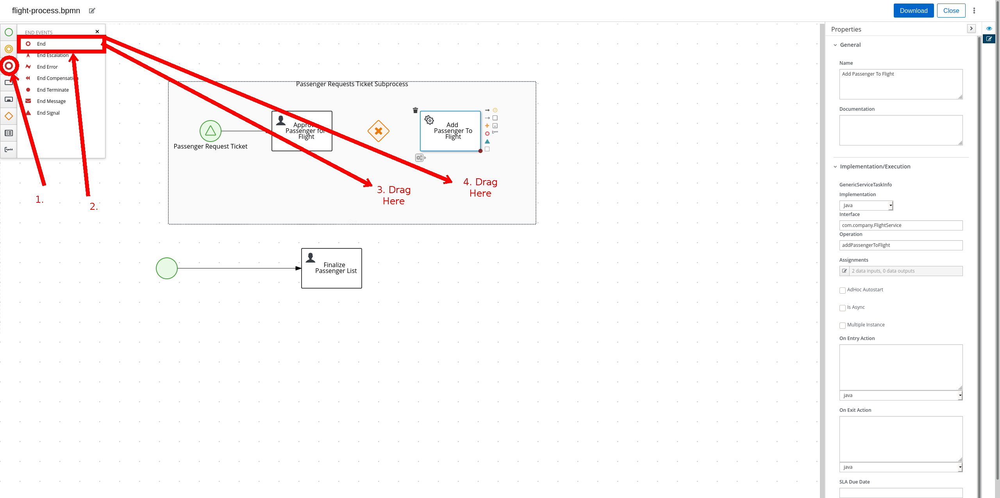

Now create the following sequence flows (click on the "From" node, then click
the arrow, then click the "To" node):

- From: "Approve Passenger To Flight", To: "Exclusive Gateway"
- From: "Exclusive Gateway", To: "First End"
- From: "Exclusive Gateway", To: "Add Passenger To Flight"
- From: "Add Passenger To Flight", To: "Second End"

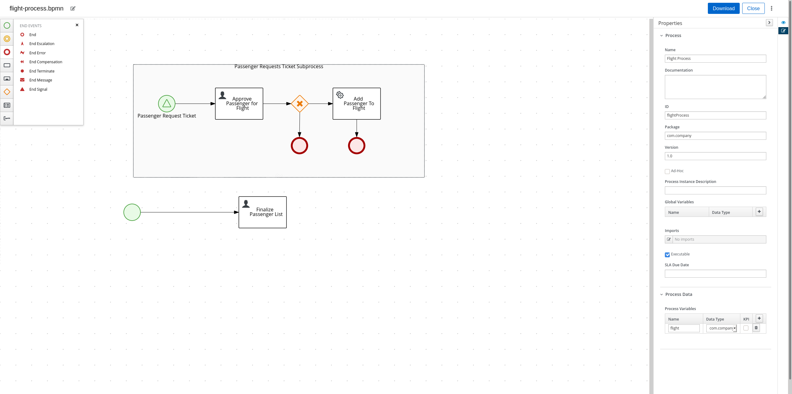

Click on the arrow from "Exclusive Gateway" to "Add Passenger To Flight".
In its "Implementation/Execution" section, put in the following code in the "Expression"
text box:
[source,java]
----
return isPassengerApprovedBySecurity;
----

image::BPMNPassengerApprovedPath.png[]

Now click on the arrow from "Exclusive Gateway" to "First End". In its
"Implementation/Execution" section, put in the following code in the "Expression"
text box:
[source,java]
----
return !isPassengerApprovedBySecurity;
----

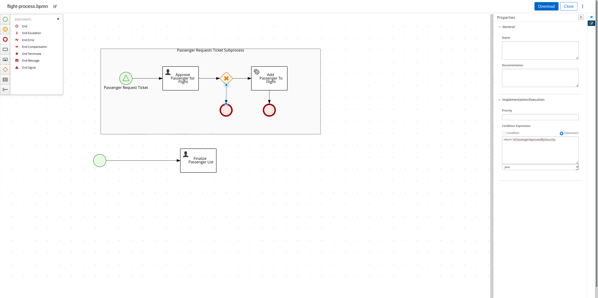

We are now done with the "Passenger Requests Ticket Subprocess". Since we
can add passengers to our flight, it is now time to integrate OptaPlanner into
our BPMN. Create a new "Service Task" in the main process (*not* in
"Passenger Requests Ticket Subprocess") and create a sequence flow
from "Finalize Passenger List" to it. Rename it to "Create Seat Assignments", and
in the "Implementation/Execution" section, put "com.company.FlightService"
for "Interface", "createSeatAssignments" for "Operation". Add the following
input and output assignments:

- Input:
** Name: "flight", Type: "com.company.Flight", Source: "flight"
- Output:
** Name: "flight", Type: "com.company.Flight", Target: "flight"

(Yes, both input and output have the same values for their respective columns;
this is not an error)

image::BPMNCreateSeatAssignments.png[]

We are almost finished with the BPMN. Create an "End" node in the main process
and create a sequence flow from "Create Seat Assignments" to it. Here is the
final BPMN diagram:

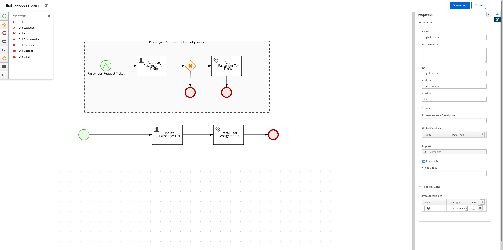

Click on the "Download" button at the top right of the page to download the
BPMN diagram. Create the directories "src/main/resources/com/company" and
move the downloaded file there.

== Creating the Java Interfaces

In our BPMN, we referenced Java classes and services we still need to create.
In particular:

* We referenced `com.company.Flight` which is used when creating, modifying
  and getting the seat assignments of a flight.

* We referenced `com.company.Passenger` which is used when we add a passenger
  to a flight.

* We referenced the operation `addPassengerToFlight` of
  `com.company.FlightService` when we add a passenger to the flight.

* We referenced the operation `createSeatAssignments` of
  `com.company.FlightService` when we create the seat assignments.

We'll be using the following domain model for our classes:

image::flightSeatAssignmentClassDiagram.png[]

* A seat has a seat identifier (ex: "3A") and what type it is.

[source,java]
----
public class Seat {
    @PlanningId
    public String seatIdentifier;
    public Type type;

    public enum Type {
        WINDOW, AISLE, OTHER
    }
}
----

* A Passenger has a name and a preferred seat type (Window, Aisle, etc.) and
  is assigned a seat on the flight.

[source,java]
----
@PlanningEntity
public class Passenger {
    @PlanningId
    public String name;

    @PlanningVariable(valueRangeProviderRefs = "seatRange")
    public Seat seat;

    public Seat.Type preferredSeatType;
}
----

* A Flight has an id, a list of passengers on the flight, and the number
  of rows of columns on the plane.

[source,java]
----
@PlanningSolution
public class Flight {

    public String id;

    @PlanningScore
    public HardSoftScore score;

    @PlanningEntityCollectionProperty
    public List<Passenger> passengerList;

    public int rowCount;
    public int columnCount;

    @ValueRangeProvider(id = "seatRange")
    private List<Seat> calculateSeatList() {
        List<Seat> out = new ArrayList<>(rowCount * columnCount);
        final int MIDDLE_OF_ROW = columnCount / 2;
        for (int column = 0; column < columnCount; column++) {
            for (int row = 0; row < rowCount; row++) {
                Seat seat = new Seat();
                // 'A' + n = nth letter of the alphabet
                seat.seatIdentifier = (row + 1) + String.valueOf((char)('A' + column));
                seat.type = (column == 0 || column == columnCount - 1)? Seat.Type.WINDOW :
                    (column == MIDDLE_OF_ROW || column == MIDDLE_OF_ROW + 1)? Seat.Type.AISLE :
                        Seat.Type.OTHER;
                out.add(seat);
            }
        }
        return out;
    }
}
----

Now that we have our domain model, we can create our services. For the
`addPassengerToFlight` service, we can simply add the passenger to the
flight's passenger list. For the `createSeatAssignments` service,
we can use `SolverManager` to create a `Solver` for us and wait for the
final best solution.

[source,java]
----
@ApplicationScoped
public class FlightService {
    @Inject
    SolverManager<Flight, String> solverManager;

    public void addPassengerToFlight(Flight flight, Passenger passenger) {
        flight.passengerList.add(passenger);
    }

    public Flight createSeatAssignments(Flight flight) {
        try {
            return solverManager.solve(flight.id, flight).getFinalBestSolution();
        } catch (InterruptedException | ExecutionException e) {
            e.printStackTrace();
            return null;
        }
    }
}
----

Finally, we need to modify `application.properties` so the `Solver` know
when to terminate. Modify your `application.properties` to look like the following:

[source,properties]
----
# The solver runs only for 5 seconds to avoid a HTTP timeout in this simple implementation.
# It's recommended to run for at least 5 minutes ("5m") otherwise.
quarkus.optaplanner.solver.termination.spent-limit=5s
----

== Creating the Constraints

We can use the Constraint Stream API to create the constraints of our
application in Java. We'll have two constraints:

* No two passengers can be in the same seat.
* Maximize the number of passengers who get seats they prefer.

To do this, we create a `ConstraintProvider` that implements these constraints:

[source,java]
----
public class FlightSeatingConstraintProvider implements ConstraintProvider {

    @Override
    public Constraint[] defineConstraints(ConstraintFactory constraintFactory) {
        return new Constraint[] {
            onlyOnePassengerPerSeat(constraintFactory),
            seatTypePreference(constraintFactory)
        };
    }

    private Constraint onlyOnePassengerPerSeat(ConstraintFactory constraintFactory) {
        return constraintFactory.fromUniquePair(Passenger.class, Joiners.equal(p -> p.seat))
                   .penalize("Only one passenger per seat", HardSoftScore.ONE_HARD);
    }

    private Constraint seatTypePreference(ConstraintFactory constraintFactory) {
        return constraintFactory.from(Passenger.class)
                   .join(Seat.class, Joiners.equal(p -> p.seat, s -> s))
                   .filter((p,s) -> p.preferredSeatType != null && p.preferredSeatType != s.type)
                   .penalize("Seat type preference", HardSoftScore.ONE_SOFT);
    }

}
----

== Testing the Flight Application

Now we are ready to test out the Flight Application we just created!
Run the following command in the terminal to start the server:

[source]
----
./mvnw quarkus:dev
----

You can see the generated API methods by copying
http://localhost:8080/openapi to https://editor.swagger.io[The Swagger Editor].
Let's try creating a flight. Run the following command :

[source]
----
curl -X POST "localhost:8080/flightProcess" -H  "accept: application/json" -H  "Content-Type: application/json" -d "{\"flight\":{\"id\":\"string\",\"passengerList\":[],\"rowCount\":4,\"columnCount\":4}}"
----

You should get a response that looks like the following:
[source,json]
----
{
  "id":"${id}",
  "flight":{
    "id":"string",
    "score":null,
    "passengerList":[],
    "rowCount":4,
    "columnCount":4
  }
}
----

Let add a few passengers to our flight (replace ${id} with the id you got from
the previous command).

[source]
----
curl -X POST "localhost:8080/flightProcess/${id}/passengerRequestTicket" -H  "accept: application/json" -H  "Content-Type: application/json" -d "{\"name\":\"Amy Cole\",\"preferredSeatType\":\"WINDOW\"}"
curl -X POST "localhost:8080/flightProcess/${id}/passengerRequestTicket" -H  "accept: application/json" -H  "Content-Type: application/json" -d "{\"name\":\"John Smith\",\"preferredSeatType\":\"AISLE\"}"
curl -X POST "localhost:8080/flightProcess/${id}/passengerRequestTicket" -H  "accept: application/json" -H  "Content-Type: application/json" -d "{\"name\":\"Bad Guy\"}"
----

Now let look at our tasks:

[source]
----
curl -X GET "localhost:8080/flightProcess/${id}/tasks" -H  "accept: application/json"
----

You should get a response that look like this:

[source,json]
----
{
  "b484124e-e015-488a-8ee2-4643199a32c5":"approvePassengerForFlight",
  "8d7710d5-e67c-4b3d-bcbb-5e545373560a":"approvePassengerForFlight",
  "c27c6e51-7599-4ab3-879c-105c5e27190d":"approvePassengerForFlight",
  "dd8d9039-9375-4040-96da-89926ce16f93":"finalizePassengerList"
}
----

Let looks at one of our passengers (replace ${taskId} with the id of the "approvePassengerForFlight" you want to inspect):

[source]
----
 curl -X GET "localhost:8080/flightProcess/${id}/approvePassengerForFlight/${taskId}" -H  "accept: application/json"
----

[source,json]
----
{
  "passenger":{
    "name":"John Smith",
    "seat":null,
    "preferredSeatType":"AISLE"
  },
  "name":"approvePassengerForFlight",
  "id":"b484124e-e015-488a-8ee2-4643199a32c5"
}
----

Let approve "Amy Cole" and "John Smith":

[source]
----
curl -X POST "localhost:8080/flightProcess/${id}/approvePassengerForFlight/${taskId}" -H  "accept: application/json" -H  "Content-Type: application/json" -d "{\"isPassengerApprovedBySecurity\":true}"
----
(run the command twice; one for the "approvePassengerForFlight" task for Amy Cole,
and one for the "approvePassengerForFlight" task for John Smith).

And let deny "Bad Guy":

[source]
----
curl -X POST "localhost:8080/flightProcess/${id}/approvePassengerForFlight/${taskId}" -H  "accept: application/json" -H  "Content-Type: application/json" -d "{\"isPassengerApprovedBySecurity\":false}"
----
(replace ${taskId} with Bad Guy's "approvePassengerForFlight" task id)

Finally, let create the seat assignments:

[source]
----
curl -X POST "localhost:8080/flightProcess/${id}/finalizePassengerList/${taskId}" -H  "accept: application/json" -H  "Content-Type: application/json" -d "{}"
----
(Use "finalizePassengerList" task's id here)

This request will take several seconds to return as it waits for OptaPlanner
to optimize the flight seating. It will return a JSON containing the process
variables, including the optimized seat assignments in the "flight" field:

[source,json]
----
{
  "id":"61210009-8f75-4bf7-9221-d5c92d7d1be3",
  "flight":{
    "id":"string",
    "score":{
      "initScore":0,
      "hardScore":0,
      "softScore":0,
      "feasible":true,
      "solutionInitialized":true
    },
    "passengerList":[
      {
        "name":"Amy Cole",
        "seat":{"seatIdentifier":"1A","type":"WINDOW"},
        "preferredSeatType":"WINDOW"
      },
      {
        "name":"John Smith",
        "seat":{"seatIdentifier":"1B","type":"AISLE"},
        "preferredSeatType":"AISLE"
      }
    ],
    "rowCount":4,
    "columnCount":4
  }
}
----

In the above example, "Amy Cole" is assigned to seat "1A" and
"John Smith" is assigned to seat "1B".

== What Next?

Now we have a fully functional REST service, we can easily extend it by:

* Creating a UI frontend to the service
* Signaling the BPMN process when OptaPlanner is finished solving instead of
waiting for solving to finish, and poll the latest solutions client-side
* Send Kafka messages whenever OptaPlanner finds a new solution and consume
them in the BPMN process

You can find an extended version of the flight example created in this blog
at https://github.com/kiegroup/kogito-examples/tree/main/process-optaplanner-quarkus[the Kogito Examples repository],
which has a full UI and poll for the latest solution from the solver instead of
waiting for solving to finish.
