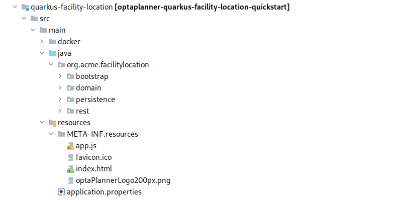
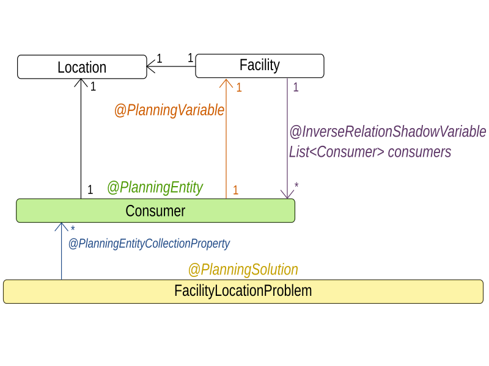
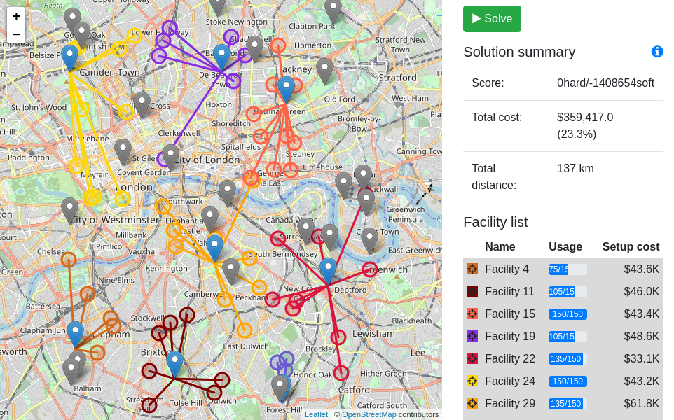
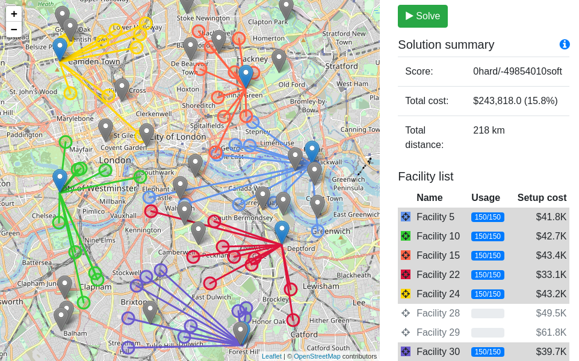
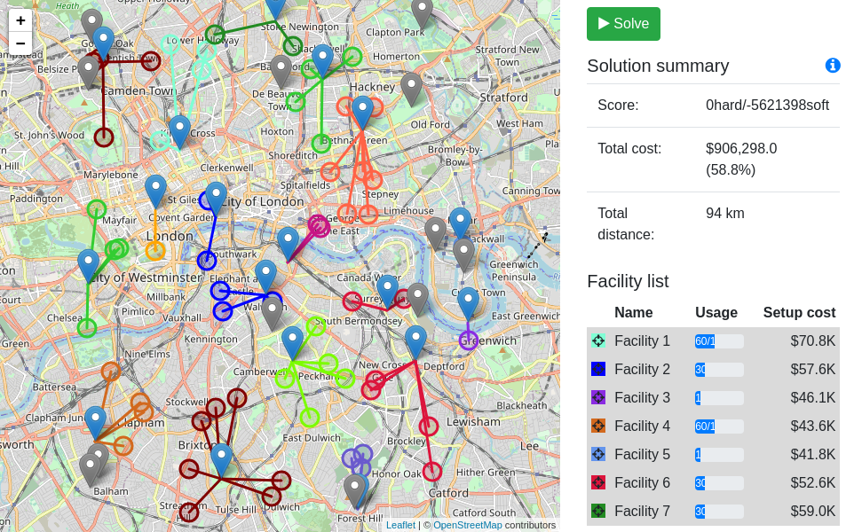

= Solve the facility location problem
yurloc
2020-10-09
:page-interpolate: true
:jbake-type: post
:jbake-tags: use case, facility location problem, quarkus
:jbake-social_media_share_image: facilityLocationProblemSolved.png

We have created a new https://github.com/kiegroup/optaplanner-quickstarts/tree/stable/use-cases/facility-location[quickstart] that extends OptaPlanner use case portfolio with the https://en.wikipedia.org/wiki/Facility_location_problem[facility location problem] and also demonstrates building a cloud-native application using https://quarkus.io/[Quarkus], the new Java Native stack.

== The facility location problem

The facility location problem consist of a set of potential facility locations and a set of consumer points that need to be served by the facilities.
The goal is to select a subset of the potential facility locations, to minimize the sum of distances from consumers to their assigned facilities, and to minimize the total cost of establishing the selected facilities.

You can see a sample facility location problem on the picture below.
Blue circles represent the consumers and grey pins represent potential facility locations.

.An unsolved facility location problem
image::facilityLocationProblemUninitialized.png[Facility location problem]

To understand the problem better, let's use a concrete use case to illustrate it.
Imagine you are starting a network of coffee roasteries with the goal to supply coffeehouses all over the country.
Coffeehouses are the *consumers* and roasteries are the *facilities*.

A single roastery has a producing *capacity* that only allows it to cover a limited number of coffeehouses, so you will have to establish a number of roasteries.
You have been given a list of places that you can buy and run a roastery there.
These are the potential *locations* where you can place a facility.
Each place has a different price that you need to pay before opening a roastery there.
The price represents the facility *setup cost*.

The challenge is to select a set of places to buy, minimize the total buying cost by preferring cheaper places and, at the same time, minimizing the sum of distances between roasteries and the coffeehouses that they supply.

== The new quickstart

=== Project structure

.Quickstart project structure

The server side code is in the `src/main/java` directory and is organized in four packages.

bootstrap::
Generates a randomized (but reproducible) data set and populates the repository with it on application startup.

domain::
Contains the domain model used by OptaPlanner.
The `@PlanningSolution`, `@PlanningEntity` and `ConstraintProvider` are in the `domain` package.

persistence::
Takes care of persisting the facility location problem data set.

rest::
Contains the REST API used by the client-side code to start and stop solving and to retrieve the best solution.

The client code is in the `src/main/resources/META-INF/resources/` directory.
It has an `index.html` file that contains the basic HTML structure and loads the `app.js` file that calls server's REST API and makes the web page dynamic.

=== Planning domain model

.Planning domain diagram

=== Constraints

The constraints are implemented using the Constraint Streams API.
You can find them in the `org.acme.facilitylocation.domain.FacilityLocationConstraintProvider` class.
It defines the following constraints:

facilityCapacity::
Hard constraint that penalizes the demand of consumers assigned to a facility if the total demand exceeds the facility's capacity.

setupCost::
Soft constraint that penalizes the setup cost of used facility locations.

distanceFromFacility::
Soft constraint that penalizes the distance of a consumer from its assigned facility.

Notice that there are two soft constraints that "`compete`" against each other because they affect the same score level.
You can control how each constraint affects the score by tweaking the constraint weights in `org.acme.facilitylocation.domain.FacilityLocationConstraintConfiguration`.
The more weight you put on a constraint, the more it will affect the score when it is broken, and the more will OptaPlanner try to avoid it.

[source,java]
----
@ConstraintConfiguration
public class FacilityLocationConstraintConfiguration {
    ...
    @ConstraintWeight(FACILITY_SETUP_COST)
    HardSoftLongScore facilitySetupCost = HardSoftLongScore.ofSoft(2);
    @ConstraintWeight(DISTANCE_FROM_FACILITY)
    HardSoftLongScore distanceFromFacility = HardSoftLongScore.ofSoft(5);
}
----

Use constraint weights to find a balance between minimizing the distance from consumers to facilities, and minimizing the total setup cost.
If you put too much weight on the distance constraint you might end up using unnecessarily expensive facilities.
If you put too much weight on the setup cost constraint the vehicles providing service from facilities to consumers might spend too much time traveling.

==== Balanced solution

.Balanced solution

This screenshot of the quickstart app shows a balanced solution.
Notice the total setup cost spent on facilities and the total distance, and compare the values with the other solutions where you put an extreme weight on just one of the soft constraints.

==== Priority on minimal setup cost

.Solution focused on minimal setup cost

The cheapest facility locations are selected, and they are utilized to 100% of their capacity, so we use a minimal number of facilities that can serve all the consumers.

The distance is also minimized but the weight of the distance constraint is negligible compared to the setup cost constraint so it doesn't affect the choice of facility locations.
You could achieve the same result by making setup cost a medium constraint while leaving the distance constraint on the lower, soft level.

==== Priority on minimal distance

.Solution focused on minimal distance

Consumers are assigned to the closest facilities, paying only a little attention to the facility cost and utilization efficiency.
If you look closely, you can find a few places where the distance could be reduced even more.
It is just a matter of deciding the distance constraint weight.

=== Running the quickstart

Run the quickstart yourself:

. Git clone https://github.com/kiegroup/optaplanner-quickstarts.
. Descend into the directory `quarkus-facility-location`.
. Run `mvn quarkus:dev`.
. Open http://localhost:8080 in your browser and click on the *Solve* button.
