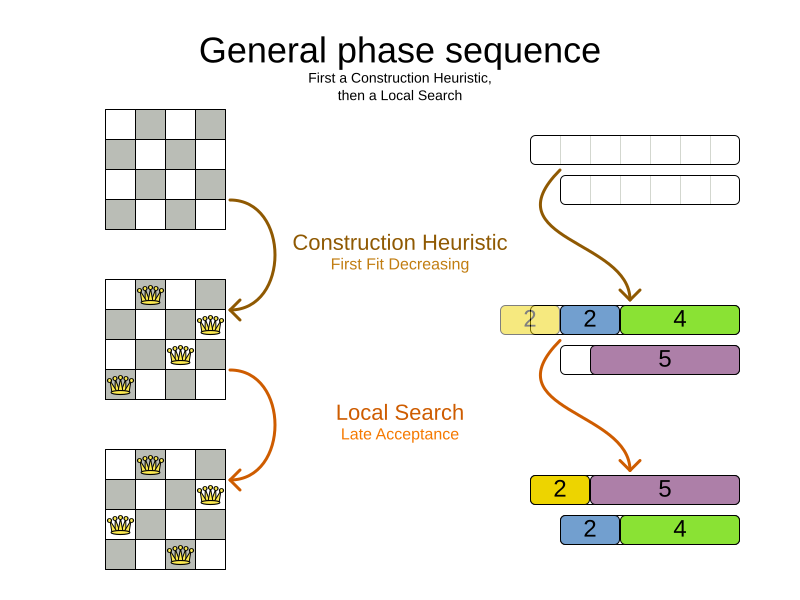

= The path to OptaPlanner enlightenment starts in the logs
ge0ffrey
2021-05-06
:page-interpolate: true
:jbake-type: post
:jbake-tags: algorithm, insight, production
:jbake-social_media_share_image: generalPhaseSequence.png

Do you want to understand what OptaPlanner is doing while it is solving?
Which decisions it makes? When? And why?
Do you want to open the box and take a look inside?
If so, keep reading.

_The Age of Enlightenment centered on the use of reason and the evidence of the senses.
Similarly, OptaPlanner enlightenment starts with the use of reason and the evidence in the logs._

OK. That's enough philosophy for this article... It's time to open the box.
Take a look at the log for https://youtu.be/7IuOA9n6kh0[the school timetabling AI quickstart]:

----
12:18:04 INFO Solving started: time spent (196), best score (-38init/0hard/0soft), environment mode (REPRODUCIBLE), move thread count (NONE), random (JDK with seed 0).
12:18:04 INFO Construction Heuristic phase (0) ended: time spent (330), best score (0hard/-11soft), score calculation speed (4358/sec), step total (19).
12:18:34 INFO Local Search phase (1) ended: time spent (30000), best score (0hard/10soft), score calculation speed (12786/sec), step total (26654).
12:18:34 INFO Solving ended: time spent (30000), best score (0hard/10soft), score calculation speed (12663/sec), phase total (2), environment mode (REPRODUCIBLE), move thread count (NONE).
----

This is a lot of information, even on the `INFO` level.
Let's investigate each nugget of information in there, one by one:

== When did the solver run?

The log shows when the solver started and when it ended:

----
12:18:04 INFO Solving started ...
...
12:18:34 INFO Solving ended ...
----

That's useful in complex applications with other log lines intertwined.

== What is the solver doing?

It also displays what the solver did while solving:

----
12:18:04 INFO Solving started ...
12:18:04 INFO Construction Heuristic phase (0) ended ...
12:18:34 INFO Local Search phase (1) ended ...
12:18:34 INFO Solving ended ...
----

It ran two algorithm phases sequentially:

* Phase 0: a _Construction Heuristic_ to provide an initial solution for the problem
* Phase 1: a _Local Search_ to improve the solution further

Here's an illustration of those phases on the N-Queens and the Cloud Balancing examples:

If the Local Search log line is missing (after the solver ends),
the Construction Heuristic did not have enough time to initialize the entire solution,
leaving no time for the Local Search algorithm.
That returns an incomplete or infeasible solution.

== Time spent

The log also exhibits how long each of those phases took, in milliseconds, relevant to the start of the solver:

----
12:18:04 INFO Solving started time spent (196) ...
12:18:04 INFO Construction Heuristic ended ... time spent (330) ...
12:18:34 INFO Local Search ended ... time spent (30000) ...
12:18:34 INFO Solving ended time spent (30000), ...
----

* The Solver initialization took `196` milliseconds.
* The Construction Heuristic took `330 - 196` = `134` milliseconds.
** For big datasets, if the CH takes more than one minute,
it's worth investigating why, even if the solver runs for hours.
* The Local Search took `30000 - 330` = `29670` milliseconds.
** LS gets the lion's share of the time, as it should be.

== Score quality

The log also reveals the solution quality after each algorithm:

----
INFO Solving started ... best score (-38init/0hard/0soft) ...
INFO Construction Heuristic ended ... best score (0hard/-11soft) ...
INFO Local Search ended ... best score (0hard/10soft) ...
INFO Solving ended ... best score (0hard/10soft) ...
----

* The starting score `-38init/0hard/0soft` indicates there are 38 unassigned planning variables.
That's because there are 19 lessons, each with 2 planning variables to initialize.
* The Construction Heuristic ends with a solution of score `0hard/-11soft`, which is already feasible (no hard constraints broken). That's not always the case.
* The Local Search improves the score further to score `0hard/10soft`. That's a difference of `+21soft` in 29 seconds.

== Performance

There's also performance information to discover in the log.
First ensure it's an apples-to-apples comparison:

----
12:18:04 INFO Solving started ... environment mode (REPRODUCIBLE), move thread count (NONE) ...
...
12:18:34 INFO Solving ended ... environment mode (REPRODUCIBLE), move thread count (NONE).
----

* If the environment mode is any `ASSERT` mode, performance is irrelevant,
because the extra assertions are very expensive performance wise.
* The move thread count indicates how many extra CPU cores it can consume.
** `NONE` means all move calculations happen inside the solver's thread, so only 1 CPU is exploited.

Both of these affect the _score calculation speed_,
which shows how many moves were evaluated, normalized _per second_,
for the solver entirely, but also each phase separately:

----
12:18:04 INFO Solving started ...
12:18:04 INFO Construction Heuristic ended ... score calculation speed (4358/sec) ...
12:18:34 INFO Local Search ... score calculation speed (12786/sec) ...
12:18:34 INFO Solving ended ... score calculation speed (12663/sec) ...
----

* The Construction Heuristic evaluated over 4000 moves per second.
** That's actually pretty low, but it only ran for 134 milliseconds, so the overhead weighs in too much,
lowering the number significantly. It should be run with a bigger dataset instead.
** Normally, the score calculation speed of the Construction Heuristic is higher than that of the Local Search,
because it's faster to calculate the score when half of the entities aren't initialized yet.
* The Local Search evaluated over 12000 moves per second.
** That's good. The LS score calculation speed should always be above 10 000 per second, even for big datasets.
** Do note that it ran for 29 seconds and a JVM can take a minute to warm up.

*Keep an eye on the score calculation when adding/editing constraints*,
running the solver for same amount of time (typically 1 minute), to discover performance bottlenecks early.
For more accurate performance investigations, use `optaplanner-benchmark` which supports warming up.

== Steps

In essence, both the Construction Heuristic phase and Local Search phase run a double loop:

[source, java]
----
   for (Step step : steps) { // Outer loop
       for (Move move : moves) { // Inner loop
           // Evaluate move
       }
       // Take step
   }
----

The outer, step loop executes the best move found by the inner, move loop.
Of course, this is a gross simplification:
there are dozens of orthogonal AI subsystems on top of it.
It's only the tip of the iceberg. But it's an honest simplification.

The `INFO` log shows how many of these outer loop iterations both phases did:

----
...
12:18:04 INFO Construction Heuristic ended ... step total (19).
12:18:34 INFO Local Search ended ... step total (26654).
...
----

* The Construction Heuristic did 19 steps.
That's because there are 19 lessons in the dataset.
Each step assigns one lesson.
* The Local Search did over 26 000 steps.
It continues iterating until the termination condition is hit.
Each step modifies (often improves) the current solution.

Turn on `DEBUG` logging to get a log line per step too:

----
INFO  Solving started: time spent (619), best score (-38init/0hard/0soft), environment mode (REPRODUCIBLE), move thread count (NONE), random (JDK with seed 0).
DEBUG     CH step (0), time spent (650), score (-36init/0hard/0soft), selected move count (30), picked move ([Biology(18) {null -> Room A}, Biology(18) {null -> MONDAY 09:30}]).
DEBUG     CH step (1), time spent (661), score (-34init/0hard/0soft), selected move count (30), picked move ([Chemistry(28) {null -> Room A}, Chemistry(28) {null -> MONDAY 10:30}]).
DEBUG     CH step (2), time spent (672), score (-32init/0hard/0soft), selected move count (30), picked move ([Chemistry(17) {null -> Room A}, Chemistry(17) {null -> MONDAY 13:30}]).
...
DEBUG     CH step (17), time spent (741), score (-2init/0hard/-10soft), selected move count (30), picked move ([Spanish(22) {null -> Room B}, Spanish(22) {null -> TUESDAY 10:30}]).
DEBUG     CH step (18), time spent (744), score (0hard/-11soft), selected move count (30), picked move ([Spanish(23) {null -> Room B}, Spanish(23) {null -> TUESDAY 14:30}]).
INFO  Construction Heuristic phase (0) ended: time spent (768), best score (0hard/-11soft), score calculation speed (3910/sec), step total (19).
DEBUG     LS step (0), time spent (790), score (0hard/-5soft), new best score (0hard/-5soft), accepted/selected move count (1/1), picked move (Physics(27) {Room B, MONDAY 08:30} <-> Math(14) {Room A, MONDAY 08:30}).
DEBUG     LS step (1), time spent (791), score (0hard/-7soft),     best score (0hard/-5soft), accepted/selected move count (1/2), picked move (Spanish(33) {Room B -> Room C}).
...
DEBUG     LS step (19071), time spent (29996), score (0hard/7soft),     best score (0hard/10soft), accepted/selected move count (1/25), picked move (Geography(30) {Room C -> Room B}).
DEBUG     LS step (19072), time spent (30000), score (0hard/5soft),     best score (0hard/10soft), accepted/selected move count (0/25), picked move (English(20) {Room A, MONDAY 10:30} <-> Math(14) {Room A, MONDAY 14:30}).
INFO  Local Search phase (1) ended: time spent (30000), best score (0hard/10soft), score calculation speed (7927/sec), step total (19073).
INFO  Solving ended: time spent (30000), best score (0hard/10soft), score calculation speed (7858/sec), phase total (2), environment mode (REPRODUCIBLE), move thread count (NONE).
----

Again, this is a lot of information to digest.

The `DEBUG` lines display when a Local Search step improves the best solution:

----
INFO  Construction Heuristic ... best score (0hard/-11soft) ...
DEBUG     LS step (0) ... score (0hard/-5soft), new best score (0hard/-5soft) ...
DEBUG     LS step (1) ... score (0hard/-7soft),     best score (0hard/-5soft) ...
...
----

* LS step 0 improved the best solution from `-11soft` to `-5soft`.
* LS step 1 didn't improve the best solution of `-5soft`.
** It actually accepted a worse solution of `-7soft`, which is mechanism to escape local optima,
to improve the best solutions in later steps.

The `DEBUG` log even shows the winning move:

----
DEBUG     LS step (0) ... picked move (Physics(27) {Room B, MONDAY 08:30} <-> Math(14) {Room A, MONDAY 08:30}).
----

This move swapped the `Physics` lesson with the `Math` lesson.
The `toString()` method of your domain classes should return a short string (typically a name and/or ID)
to keep the logs readable.

== Moves

The `DEBUG` log reveals the number of moves selected per step,
which is the number of inner loop iterations:

----
...
DEBUG     CH step (17) ... selected move count (30) ...
DEBUG     CH step (18) ... selected move count (30) ...
INFO  Construction Heuristic ended ...
DEBUG     LS step (0) ... accepted/selected move count (1/1) ...
DEBUG     LS step (1) ... accepted/selected move count (1/2) ...
...
INFO  Local Search phase (1) ended ...
----

Turn on `TRACE` logging to get a log line per move too,
which exposes the score of each move evaluation:

----
INFO  Construction Heuristic ... time spent (395), best score (0hard/-11soft) ...
TRACE         Move index (0), score (0hard/-5soft) ...
DEBUG     LS step (0) ... score (0hard/-5soft), new best score (0hard/-5soft) ...
TRACE         Move index (0), score (-2hard/-6soft) ...
TRACE         Move index (1), score (0hard/-7soft) ...
DEBUG     LS step (1) ... score (0hard/-7soft),     best score (0hard/-5soft) ...
TRACE         Move index (0), score (-3hard/-7soft) ...
TRACE         Move index (1) not doable, ignoring move ...
TRACE         Move index (2), score (-2hard/-9soft) ...
TRACE         Move index (3), score (-2hard/-6soft) ...
TRACE         Move index (4), score (-2hard/-7soft) ...
TRACE         Move index (5), score (-1hard/-8soft) ...
TRACE         Move index (6), score (0hard/-4soft) ...
DEBUG     LS step (2) ... score (0hard/-4soft), new best score (0hard/-4soft) ...
----

Again, each `TRACE` line also shows the selected move:

----
TRACE         Move index (0) ... move (Chemistry(28) {Room C -> Room A}).
----

This move changed the room of the `Chemistry` lesson.

== Get started

Get started on your OptaPlanner enlightenment path today!

Turn on logging in:

* *Plain Java*: Add a dependency on `logback-classic` and the `logback.xml` file:
+
[source, xml]
----
<configuration>
  <logger name="org.optaplanner" level="debug"/>
</configuration>
----
+
Or instead, add a dependency on an `slf4j` bridge to your favorite logging system.

* https://quarkus.io[*Quarkus*]: Add this line in `application.properties`:
+
[source, properties]
----
quarkus.log.category."org.optaplanner".level=DEBUG
----

* *Spring Boot*: Add this line in `application.properties`:
+
[source, properties]
----
logging.level.org.optaplanner=DEBUG
----

The log is your friend! It tells you what https://www.optaplanner.org/[OptaPlanner] is doing.
Keep an eye on it.
