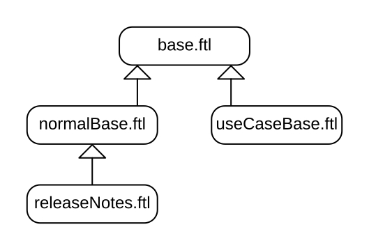

= Static website generation with Java, Maven and JBake
ge0ffrey
2021-06-09
:page-interpolate: true
:jbake-type: post
:jbake-tags: community
:jbake-social_media_share_image: staticWebsiteTemplateHierarchy.png

Did you notice?
Last week, we migrated the entire https://www.optaplanner.org/[www.optaplanner.org] website (1399 files)
to build with Java and Maven, instead of Ruby and Rake.
On the face of it, nothing changed.
But in the sources, for our team of Java developers, it is a game changer.

Our Java team can now contribute to the website easily.
Within hours of completing the migration, there was already a commit of one of our developers
who would _rather not touch the previous source code with a ten-foot pole_.

[quote]
We built this site. +
We built this site on Java and Maven. +
We built this site. +
We built this site on JBake and FreeMarker.

== Why a static website generator?

A static website generator transforms templates and content files into a static HTML/JS/CSS website.
This has many advantages over a Content Management System (CMS) for projects such as ours:

* *Hosting* is cheap. https://pages.github.com/[GitHub pages] even hosts static websites for free.
* The source files go into Git for *backup* and *history*.
* The source files are in *plain text*:
** Changes come in as a Pull Request for proper *review* and CI validation.
** The sources are open in our IDEs, which encourages refactoring them alongside the code.
This results in *less stale* content.

For many years, Awestruct has served us well.
But due to lack of activity, it was time to upgrade.

== Why JBake?

Because we're Java programmers.

There are several good static website generators out there, such as Jekyll (Ruby) and Hugo (Go).
We choose https://jbake.org/[JBake] (Java), because:

. Our website now *builds with Maven* (`mvn generate-resources`).
+
_No need to install anything. Not even JBake._
Everyone builds with the same version of JBake, as declared in the `pom.xml`.
+
And it's fast: even a `mvn clean` build of 150 output pages only takes 20 seconds on my machine.

. It's all *Java underneath*.
+
Writing conditional expressions is straightforward.
The APIs (`String.substring()`, ...) are familiar.
Date formatting (`d MMMM yyyy`) and regular expressions behave as expected.
+
And most importantly, error messages are clear.

For 8 years, I wrote the website with Awestruct (Ruby).
But I never took the time to decently learn Ruby, so every change entailed hours of trial and error.
I couldn't just read the error message and fix it.
This isn't Ruby's fault. It was because I never took a few days to actually learn Ruby.
With JBake, I fix errors in a fraction of time: no more trial and error.

== What is JBake?

JBake is a static website generator with many options:

* Build with Maven or Gradle.
+
We choose https://maven.apache.org/[Maven], because all our repos build with Maven
(although two https://github.com/kiegroup/optaplanner-quickstarts[OptaPlanner Quickstarts] also build with Gradle because OptaPlanner supports Gradle too).

* Write content in Asciidoc, Markdown or HTML.
+
We choose https://asciidoc.org/[Asciidoc]
because it's https://docs.asciidoctor.org/asciidoc/latest/asciidoc-vs-markdown/[richer and more reliable] than Markdown.
Also, all our documentation is written in Asciidoc.

* Create templates with FreeMarker, Thymeleaf or Groovy.
+
We choose https://freemarker.apache.org/[FreeMarker]
because it's a powerful, battle-tested templating engine.

== Tips and tricks

These are common tasks to build an advanced static website
and how to implement each task in JBake-FreeMarker.
You might even call these _JBake Design Patterns_:

=== Use a macro to render shared content

Almost all our templates show the same _Latest releases_ panel:

image::staticWebsiteMacroLatestReleases.png[Latest releases screenshot]

A FreeMarker template is perfect to avoid repeating yourself (DRY):

. Create `templates/macros.ftl` with a macro that outputs the HTML:
+
[source]
----
<#macro latestReleases>
    

        
Latest release

        ...
    

</#macro>
----

. Then use it in the `*.ftl` templates:
+
[source]
----
<#import "macros.ftl" as macros>
...

    

        ...
    

    

        <@macros.latestReleases/>
    

----

=== Use data files to add videos, events or other volatile data

Some data changes too often to maintain in a content or template file:

image::staticWebsiteDataVideos.png[Videos screenshot]

A data file, for example a simple `*.yml` file, works well to hold such volatile data:

. Create `data/videos.yml`:
+
[source, yaml]
----
- youtubeId: blK7gxqu2B0
  title: "Unit testing constraints"
  ...

- youtubeId: gIaHtATz6n8
  title: "Maintenance scheduling"
  ...

- youtubeId: LTkoaBk-P6U
  title: "Vaccination appointment scheduling"
  ...
----

. Then use it in `ftl` templates:
+
[source]
----
<#assign videos = data.get('videos.yml').data>

    
Latest videos

    

        <ul>
            <#list videos[0..6] as video>
                <li>
                    <a href="https://youtu.be/${video.youtubeId}">${video.title}</a>
                </li>
            </#list>
        </ul>
    

----

=== Layout inheritance

All HTML pages typically share the same HTML head (metadata), header (navigation) and footer.
These fit well into a `base.ftl` layout, extended by all other templates:

Even though most content uses the `normalBase.ftl`,
there's separate `useCaseBase.ftl` template for all the use case pages,
such as the https://www.optaplanner.org/learn/useCases/vehicleRoutingProblem.html[Vehicle Routing Problem (VRP)],
https://www.optaplanner.org/learn/useCases/maintenanceScheduling.html[Maintenance Scheduling]
and https://www.optaplanner.org/learn/useCases/employeeRostering.html[Shift Rostering].

Use a macro with the `<#nested>` directive to build layout inheritance:

. Create `templates/base.ftl`:
+
[source]
----
<#macro layout>
    <html>
        <head>
          ...
        </head>
        <body>
            

                ... <#-- header -->
            

            <#nested>
            

              ... <#-- footer -->
            

        </body>
    </html>
</#macro>
----

. Extend it in `templates/useCaseBase.ftl` and introduce the custom attribute `related_tag`:
+
[source]
----
<#import "base.ftl" as parent>

<@layout>${content.body}</@layout>

<#macro layout>
    <@parent.layout>
        <h1>${content.title}</h1>
        <#nested>
        <h2>Related videos</h2>
        <#assign videos = data.get('videos.yml').data>
        <#assign relatedVideos = videos?filter(video -> video.tags.contains(content.related_tag))>
        <ul>
            <#list relatedVideos as video>
                <li><a href="https://youtu.be/${video.youtubeId}">${video.title}</a></li>
            </#list>
        </ul>
    </@parent.layout>
</#macro>
----

. Create the use case page `content/vehicleRoutingProblem.adoc` that uses that template
and sets that `related_tag` attribute:
+
[source, asciidoc]
----
= Vehicle Routing Problem
:jbake-type: useCaseBase
:jbake-related_tag: vehicle routing

The Vehicle Routing Problem (VRP) optimizes the routes of delivery trucks,
cargo lorries, public transportation (buses, taxis and airplanes)
or technicians on the road, by improving the order of the visits.
This routing optimization heavily reduces driving time and fuel consumption compared to manual planning:

...
----

== Get started

Try it yourself. To build the https://www.optaplanner.org/[www.optaplanner.org] website, run these commands:

[source, shell]
----
$ git clone https://github.com/kiegroup/optaplanner-website.git
...
$ cd optaplanner-website
$ mvn clean generate-resources
...
$ firefox target/website/index.html
----

Or https://github.com/kiegroup/optaplanner-website[take a look at the source code].
