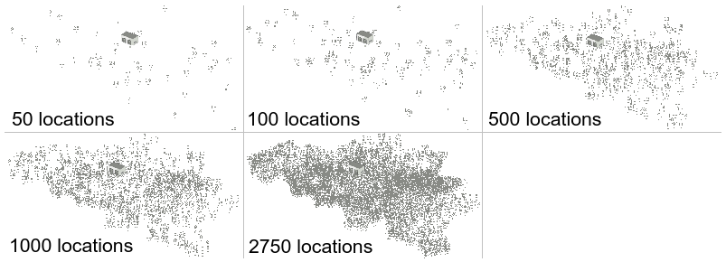
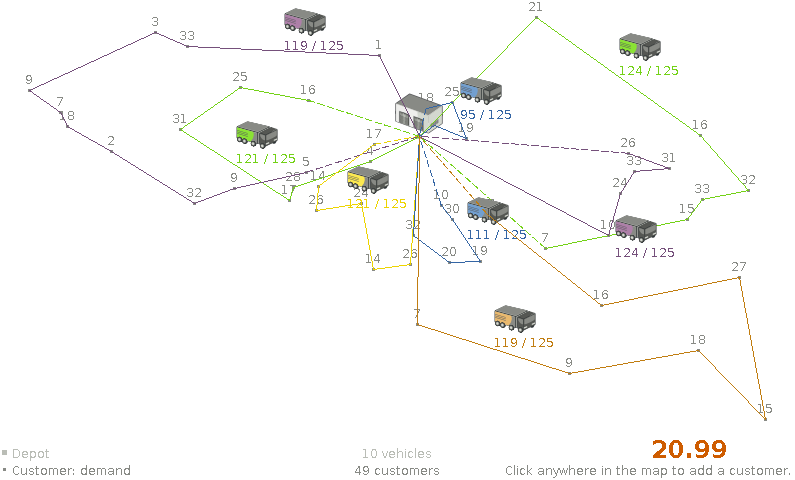
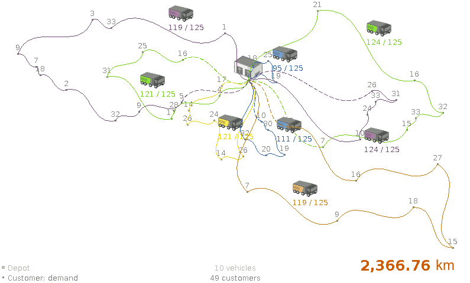
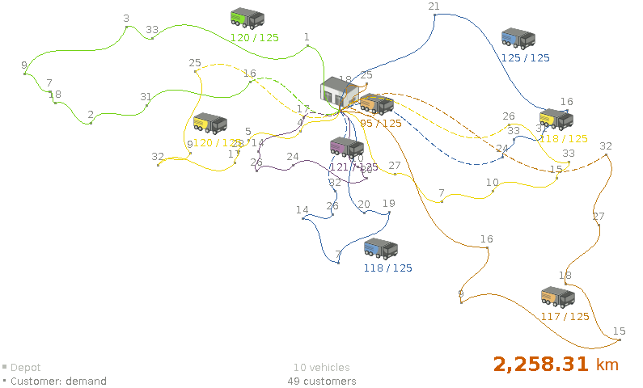

= Vehicle routing with real road distances
ge0ffrey
2014-09-02
:page-interpolate: true
:jbake-type: post
:jbake-tags: vehicle routing, insight

In the real world, vehicles in a Vehicle Routing Problem (VRP) have to follow the roads:
they can't travel in a straight line from customer to customer.
Most VRP research papers and demos happily ignore this implementation detail. As did I, in the past.
Although using road distances (instead of air distances) doesn't impact the NP-hard nature of a VRP much,
it does result in a few extra challenges. Let's take a look at those challenges.

== Datasets with road distances

First off, we need realistic datasets.
Unfortunately, public VRP datasets with road distances are scarce in the VRP research community.
The http://neo.lcc.uma.es/vrp/[VRP Web] has few small ones, such as a dataset of Bavaria with 29 locations,
but nothing serious. So I had to generate some realistic datasets myself with the following requirements:

. Use _Google Maps like_ roads with real distances in `km` between every pair of locations in the dataset.
    * For example, use highways when reasonable over small roads.
. For every dataset, generate an air distance variant and a road distance variant, to compare results.
. Generate a similar dataset in multiple orders of magnitude, to compare scalability.
. Add reasonable vehicle capacities and customer demands, for the vehicle capacity constraint in VRP.

I ended up generating datasets of Belgium with a location for cities, towns and subtowns.
The biggest one has 2750 locations.
I might add a road variant of the USA datasets later, those go up to 100 000 locations.

By using the excellent Java library https://graphhopper.com/[GraphHopper],
based on http://www.openstreetmap.org[OpenStreetMap], querying practical road distances was relatively easy.
It's also fast, as long as the entire road network (only 200MB for Belgium) can be loaded into memory.
Loading the entire road network of North-America (6GB) is a bit more challenging.
I'll submit these datasets to the VRP Web, so others researchers can use them too.

All this happens _before_ https://www.optaplanner.org/[OptaPlanner]'s VRP example starts solving it.
During solving, the distances are already available in a lookup table.
Once we start generating datasets with `1000` locations or more,
pre-calculating all distances between every location pair can introduce memory and performance issues.
I'll explain those and the remedies in my next blog.

== Air distance vs Road distance

For clarity, I'll focus on the dataset `belgium-n50-k10.vrp` which has `50` locations and `10` vehicles with capacity `125` each.
OptaPlanner was given 5 minutes to solve both variants (air and road distance).

Using *air distances* (which calculates the euclidean distance based on latitude and longitude) results in:

The total distance, `22.99` doesn't mean much because it's not in a common unit of measurement
and because our vehicles can't fly from point to point anyway.
We need to apply *this air distance solution on the real road network* (shown below), to know the real distance:

Now, let's compare that air distance solution above with the *road distance* solution below.

*The road distance solution takes `108.45` km less, so it's almost 5% better!*
And that's on one of the most dense road networks in the world (Belgium's road network):
on more sparse road networks the gain might be more.

== Conclusion

Using real distances instead of air distances does matter.
Solving an VRP with air distances and then apply road distances is suboptimal.

But can we really pre-calculate every locations pair in big datasets? Stay tuned.
