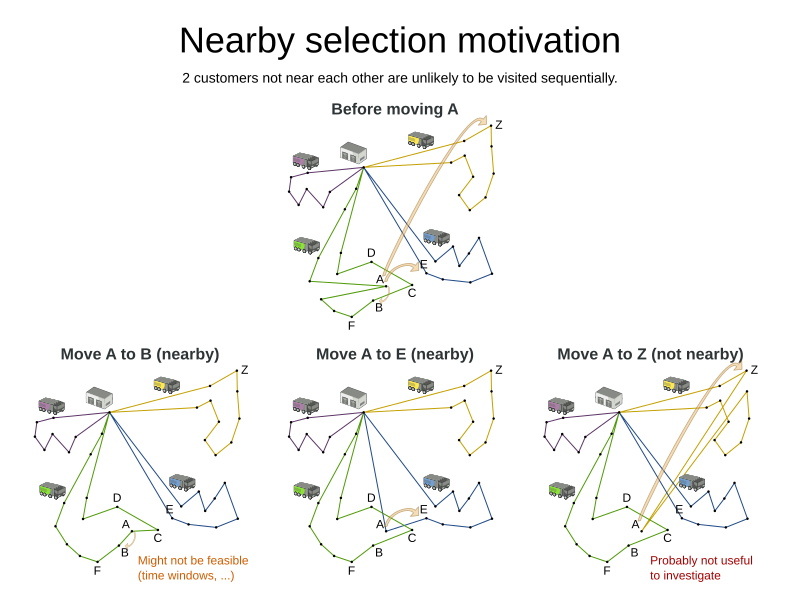
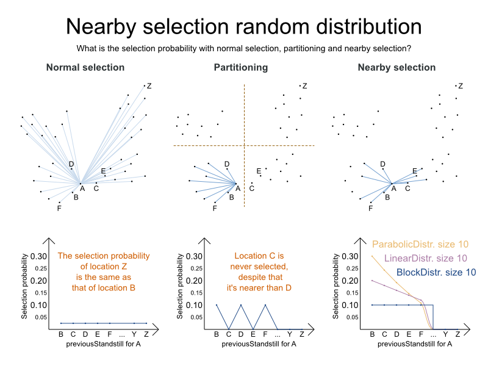
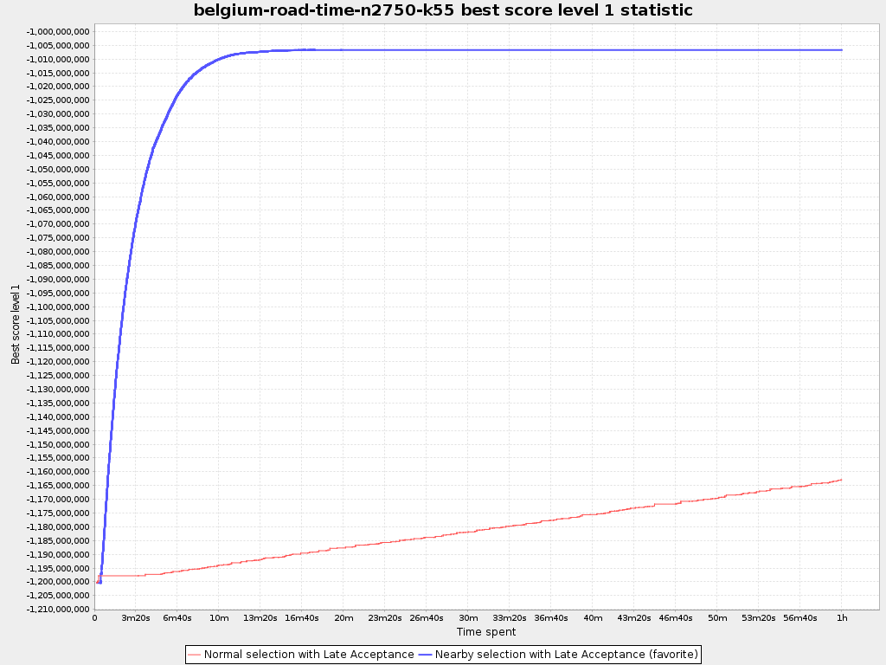

= Scaling Vehicle Routing with Nearby Selection
ge0ffrey
2015-01-27
:page-interpolate: true
:jbake-type: post
:jbake-tags: vehicle routing, algorithm, feature

https://www.optaplanner.org[OptaPlanner] 6.2 has made a big step forward for the Vehicle Routing Problem (VRP),
Traveling Salesman Problem (TSP) and similar use cases.
The new feature *_nearby selection_ enables it to scale to bigger problems much more efficiently*
without sacrificing potential optimal solutions (which is common for inferior techniques).

Let's take a closer look at nearby selection with the Vehicle Routing Problem.
In this use case, we have to deliver items to a number of geographic locations with a number of vehicles.
Each vehicle must respect its capacity (hard constraint) and we need to minimize the total travel time (soft constraint).
Of course, there will be additional business specific constraints in practice.

== Nearby locations

The metaheuristic algorithms try to improve the current solution by changing it (which is called _a move_)
to investigate other solutions. For example, here we have a VRP solution and we try 3 different moves on it,
in the hope to find a better solution:

With normal move selectors, each of these 3 moves has the same chance of being selected. Some observations:

* Moving location `A` behind the *nearby* location `B` is likely to be an improvement.
Still, we need to consider other moves too, because other constraints (such as time windows)
might make this an infeasible (or a less rewarding) solution.

* Moving location `A` behind the *nearby* location `E` is likely to be an improvement over the original solution.
Due to other constraints (such as vehicle capacity), it can even be the best move.

* Moving location `A` behind the *non-nearby* location `Z` (in the yellow chain) is unlikely to be an improvement.
Although we should note that we can't rule it out entirely, because other constraints (such as time windows)
might make it to only move that leads to a feasible solution.

In general, we observe that *moving to nearby locations is usually more profitable*.
Do notice that the set of nearby locations differ from location to location.

== Scaling problem

Suppose we have `2 000` locations in our VRP problem. That results in `4 000 000` moves to change a single location.
If we can evaluate `100 000` moves per second, we need `40` seconds to try all moves of just 1 location.
Our algorithms will need to change each location multiple times: let's presume just `4` times,
resulting in `8 000` steps, which results in `320 000` seconds or over `3` days.
And it gets worse when the dataset grows:
the number of moves per location grows, evaluation time drops and the number of steps increases too...

In practice, benchmarks show that uniform distribution (which is giving the same selection probability for `B` and `Z`)
doesn't scale well.

== Partitioning, Geo-fencing, MapReduce, etc.

One traditional way to deal with this scaling issue is partitioning (also called geo-fencing):
Before solving, the locations are divided in clusters and the vehicles are distributed across them.
As https://www.optaplanner.org/blog/2014/03/03/CanMapReduceSolvePlanningProblems.html[demonstrated in a previous blog],
_partitioning heavily sacrifices solution quality for speed_.

The big problem with this approach is the inherent _Catch 22_:
Decide which locations will be visitable by each vehicle before solving it and knowing which locations each vehicle visits...

== Nearby selection

So I've implemented a different approach called nearby selection: for each location we favor moving to nearby locations.

Notice that unlike in normal selection, the chance to select `B` or `C` is much higher.
And unlike in partitioning, we can still select `C` or `E`.

OptaPlanner supports different forms of probability distributions:

* Block distribution: Only the n nearest are selected, with an equal probability.

* Linear distribution: Nearest elements are selected with a higher probability. The probability decreases linearly.

* Parabolic distribution (recommended): Nearest elements are selected with a higher probability.

* Beta distribution: Selection according to a beta distribution. Slows down the solver.

== Benchmark results

Below are the results in a big VRP dataset with real-world time distances (collected from OpenStreetMap with GraphHopper)
with 2750 locations. In the nearby selection configuration, I've used a parabolic distribution of the 40 nearest locations.

*The scalability gain by nearby selection is huge.*

== Conclusion

If you're working on a VRP use case and it needs to scale better,
upgrade to https://www.optaplanner.org[OptaPlanner] 6.2 and use nearby selection!
