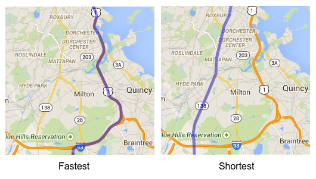

= 3 Bugs in The Ultimate American Road Trip of The Washington Post
ge0ffrey
2015-03-20
:page-interpolate: true
:jbake-type: post
:jbake-tags: tsp, vehicle routing

Earlier this week, The Washington Post published an article about how
http://www.washingtonpost.com/blogs/wonkblog/wp/2015/03/10/a-data-genius-computes-the-ultimate-american-road-trip/[a data genius has computed the ultimate American road trip].
The only problem... it contains several mistakes! *It's not the optimal route, nor the shortest route, nor the fastest route.*
Let's take a look at the problems and how we can fix each of them.

== The goal

The Ultimate American Road Trip stops at 50 national natural landmarks, national historic sites and national monuments in the US.
The goal is to find the fastest trip to visit all of these locations.
This is known as a Traveling Salesman Problem.

== The original solution (Olson's algorithm)

Here's the original solution based on http://www.randalolson.com/2015/03/08/computing-the-optimal-road-trip-across-the-u-s/[Randy Olson's blog]
shown with Google Maps:

image::americanRoadTrip-road-time-asymmetric-olson.png[]

Note that I had to https://github.com/kiegroup/optaplanner/tree/main/optaplanner-examples/data/tsp/import/usa[recreate the datasets].
I've used exact latitude longitude coordinates (instead of location names) to avoid ambiguity and get more accurate routes.

The Washington Post even claims that the trip above is the fastest trip (Olson's blog doesn't make this claim), but it's not:

== Bug 1: Better optimization algorithms give better results

A few days ago, William J. Cook http://www.math.uwaterloo.ca/tsp/usa50/index.html[already proved with Concorde]
that there's a shortest and faster path near Iowa. With https://www.optaplanner.org[OptaPlanner] I come to the same conclusion:

image::americanRoadTrip-iowa-comparison.png[]

This reduces the total time by `1h 35m 40s` and the total distance by `34km 515m`.

== Bug 2: Ghost driving (driving on the wrong side of the road) is illegal

Road distances are not symmetric. Driving from `A` to `B` is not the same as driving from `B` to `A`
(if you adhere to traffic rules, of course):

image::roads-are-asymmetric.png[]

If we take this into account, the fastest path near Carolina changes:

image::americanRoadTrip-carolina-comparison.png[]

On the left is the path found by both Olson and Cook (and by myself when using Olson's symmetrical distances).
On the right is my path, which reduces the total time by another `49m 36s` (if both paths are computed using asymmetric distances),
but increases the distance by `805m`.

== Bug 3: Google Maps does not return the shortest routes

Do we want the shortest or the fastest trip?
We used Google Maps to calculate the fastest route between every pair of locations.
So if we're aiming for the fastest trip, that's fine.

However, if we're aiming for the shortest trip, then we should be asking Google Maps for the shortest routes,
which can be drastically different:

Contrary to popular belief, *the shortest trip on the fastest routes is not the shortest trip.*
https://docs.optaplanner.org/latestFinal/optaplanner-docs/html_single/images/Chapter-Use_cases_and_examples/roadDistanceTriangleInequality.png[Here's my elaborate proof of that.]

Most people tend to prefer highways over dirt roads, so they prefer the fastest trip over the shortest trip.
In more advanced use cases, we would also want to take additional constraints into account:

* Not all routes are equally beautiful or equally safe.
* Consider optional places to visit, as long as they don't impact the length of our trip too much.
* Consider time constraints: to see that sunset at the ocean, we'll need to arrive there before the evening.

That's when a customizable solver such as https://www.optaplanner.org[OptaPlanner] becomes really useful.

== Conclusion

By using better algorithms and a more accurate model (without ghost driving), *our trip is `2h 25m 16s` faster*:

|===
|Dataset |Time |Total time gain |Distance |Total distance gain

|Olson (Clockwise) |`232h 43m 10s` | |`22'602km 201m` |
|Iowa fix (Clockwise) |`231h 7m 30s` |`1h 35m 40s` |`22'567km 686m` |`34km 515m`
|Iowa and Carolina fix (Clockwise) |*`230h 17m 54s` (best)* |*`2h 25m 16s`* |`22'568km 491m` |`33km 710m`
|===

Interestingly enough, if we're looking for the shortest trip (and we ignore bug 3 because we prefer highways),
we notice that the same trip (with both fixes) in the reverse direction is the shortest:

|===
|Dataset |Time |Total time gain |Distance |Total distance gain

|Olson (Counterclockwise) |`232h 46m 58s` | |`22'612km 070m` |
|Iowa fix (Counterclockwise) |`231h 16m 52s` |`1h 30m 06s` |`22'562km 668m` |`49km 402m`
|Iowa and Carolina fix (Counterclockwise) |`230h 27m 26s` |`2h 19m 32s` |*`22'560km 688m` (best)* |`51km 382m`
|===

This is my solution to the Ultimate American Road Trip (with those fixes):

image::americanRoadTrip-road-time-asymmetric-optaplanner.png[]

Drive it clockwise to optimize time!
