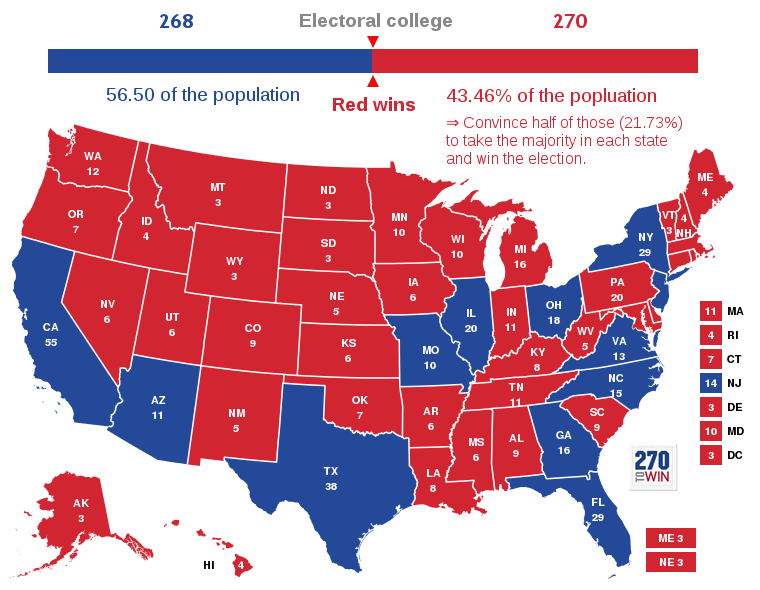
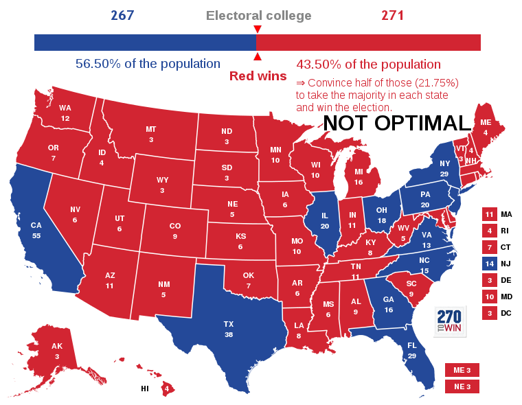

= How to become US president with less than a quarter of the votes
ge0ffrey
2016-12-06
:page-interpolate: true
:jbake-type: post
:jbake-tags: use case

The US presidential election has an interesting voting system.
The winner is not the most popular candidate (he or she that has the most votes)
but the one that collects the most EC electors.
So I wonder, how could I become the least popular US president?
That's a constraint satisfaction problem!

It occurred https://en.wikipedia.org/wiki/United_States_presidential_elections_in_which_the_winner_lost_the_popular_vote[a few times already]
that the president-elect didn't have the popular vote, most recently last month with Clinton vs. Trump.
But the difference in total votes wasn't that big. What would be the biggest possible gap?
If everyone voted against me by default, what's the minimum number of people I'd have to convince to vote for me to become US president?

== How is this possible?

This is due to the winner-takes-all system per state.
Any candidate that has the majority in one state (so at least 50% of the votes),
gets all Electoral College votes of that state.
So it doesn't matter if I get 51% or 99% of the votes in one state: I get the same number of EC votes.

Furthermore, the EC votes for one state do not represent its population accurately.
The EC votes are rounded to an integer and each state gets at least 3 out of 538 votes.
For example, https://en.wikipedia.org/wiki/Electoral_College_(United_States)[an electoral vote represents nearly four
times as many people in California as in Wyoming].

Let's not elaborate on the fairness or unfairness of this system - I am sure we all have an opinion, but it is what it is.
Instead, let me put on my megalomaniac hat and see how I can *game the system to win the US elections with the least possible votes*.

== Constraints

I'll presume everyone votes, so my victory is assured regardless if they do or not.
If no one voted, I could in theory win the elections with 11 votes: 1 vote per state in each of the 11 most populous states.

I'll also presume no one votes for 3rd party candidates, so my victory is also assured regardless if anyone does or doesn't.

That leaves me with 2 constraints:

. Hard constraint: Collect at least 270 EC votes.
. Soft constraint: Minimize the number of votes for me.

To win a state, I'll just convince exactly half of its population plus one to vote for me.
The population data is from 2015 and https://github.com/kiegroup/optaplanner-training/blob/master/optaplanner-training-lab901-solution/data/election/import/president2016.txt[available in this file].

Now, let's solve this constraint satisfaction problem with https://www.optaplanner.org[OptaPlanner]!

== How to guarantee election victory with a quarter of the votes

*If I win these states with `21.73%` of the US population voting for me,
I am the next US president, regardless of how the other `78.27%` of the population votes!*

Here's the raw data:

----
Wyoming                3 EC:     293,054 of     586,107 voters (50.00%).
District of Columbia   3 EC:     300,884 of     601,767 voters (50.00%).
Vermont                3 EC:     313,022 of     626,042 voters (50.00%).
Alaska                 3 EC:     369,217 of     738,432 voters (50.00%).
North Dakota           3 EC:     378,464 of     756,927 voters (50.00%).
South Dakota           3 EC:     429,235 of     858,469 voters (50.00%).
Delaware               3 EC:     472,968 of     945,934 voters (50.00%).
Montana                3 EC:     516,475 of   1,032,949 voters (50.00%).
Rhode Island           4 EC:     528,150 of   1,056,298 voters (50.00%).
Maine                  4 EC:     664,665 of   1,329,328 voters (50.00%).
New Hampshire          4 EC:     665,305 of   1,330,608 voters (50.00%).
Hawaii                 4 EC:     715,802 of   1,431,603 voters (50.00%).
Idaho                  4 EC:     827,466 of   1,654,930 voters (50.00%).
West Virginia          5 EC:     922,065 of   1,844,128 voters (50.00%).
Nebraska               5 EC:     948,096 of   1,896,190 voters (50.00%).
New Mexico             5 EC:   1,042,555 of   2,085,109 voters (50.00%).
Nevada                 6 EC:   1,445,423 of   2,890,845 voters (50.00%).
Kansas                 6 EC:   1,455,821 of   2,911,641 voters (50.00%).
Arkansas               6 EC:   1,489,103 of   2,978,204 voters (50.00%).
Mississippi            6 EC:   1,496,167 of   2,992,333 voters (50.00%).
Utah                   6 EC:   1,497,960 of   2,995,919 voters (50.00%).
Iowa                   6 EC:   1,561,950 of   3,123,899 voters (50.00%).
Connecticut            7 EC:   1,795,444 of   3,590,886 voters (50.00%).
Oklahoma               7 EC:   1,955,670 of   3,911,338 voters (50.00%).
Oregon                 7 EC:   2,014,489 of   4,028,977 voters (50.00%).
Kentucky               8 EC:   2,212,547 of   4,425,092 voters (50.00%).
Louisiana              8 EC:   2,335,363 of   4,670,724 voters (50.00%).
Alabama                9 EC:   2,429,490 of   4,858,979 voters (50.00%).
South Carolina         9 EC:   2,448,074 of   4,896,146 voters (50.00%).
Colorado               9 EC:   2,728,288 of   5,456,574 voters (50.00%).
Minnesota             10 EC:   2,744,798 of   5,489,594 voters (50.00%).
Wisconsin             10 EC:   2,885,669 of   5,771,337 voters (50.00%).
Maryland              10 EC:   3,003,201 of   6,006,401 voters (50.00%).
Tennessee             11 EC:   3,300,150 of   6,600,299 voters (50.00%).
Indiana               11 EC:   3,309,841 of   6,619,680 voters (50.00%).
Massachusetts         11 EC:   3,397,212 of   6,794,422 voters (50.00%).
Washington            12 EC:   3,585,176 of   7,170,351 voters (50.00%).
Michigan              16 EC:   4,961,289 of   9,922,576 voters (50.00%).
Pennsylvania          20 EC:   6,401,252 of  12,802,503 voters (50.00%).

TOTAL                270 EC:  69,841,800 of 321,348,359 voters (21.73%).
----

So even if everyone votes and no one votes for 3rd party candidates,
I am still guaranteed to win the US presidential election with less than a quarter of the total votes to my name.
I just need to win http://www.270towin.com/maps/7A3OW[the correct states] by one vote above half each.

== How did I find that solution?

I created a model in which all of 50 federal states are assigned to 1 out of 2 candidates.
I didn't try all `2^50` possible combinations, as that would take too long.

A simple Construction Heuristic that just takes the states with the highest votes to population ratio first,
gives me http://www.270towin.com/maps/wJpBe[this result]:

That's not optimal: it requires `0.02%` of the population too much.
By doing a Local Search algorithm on top of that, I get the better solution as shown earlier.
This algorithm basically swaps Arizona and Missouri for Pennsylvania.

The implementation is part of https://www.optaplanner.org/learn/training.html[the training zip].
This is really just a variant of https://en.wikipedia.org/wiki/Knapsack_problem[the knapsack problem].

== Conclusion

Even in political elections, constraint solvers are (ab)useful.
Not just for this use case, but also for https://en.wikipedia.org/wiki/Gerrymandering[gerrymandering].

Note: The premise of this story is hypothetical: I have no actual ambitions to become US president.

== Update

There's https://youtu.be/7wC42HgLA4k?t=4m30s[a video] that claims that the optimal combination is different:

----
Wyoming                3 EC:     293,054 of     586,107 voters (50.00%).
District of Columbia   3 EC:     300,884 of     601,767 voters (50.00%).
Vermont                3 EC:     313,022 of     626,042 voters (50.00%).
Alaska                 3 EC:     369,217 of     738,432 voters (50.00%).
North Dakota           3 EC:     378,464 of     756,927 voters (50.00%).
South Dakota           3 EC:     429,235 of     858,469 voters (50.00%).
Delaware               3 EC:     472,968 of     945,934 voters (50.00%).
Montana                3 EC:     516,475 of   1,032,949 voters (50.00%).
Rhode Island           4 EC:     528,150 of   1,056,298 voters (50.00%).
Maine                  4 EC:     664,665 of   1,329,328 voters (50.00%).
New Hampshire          4 EC:     665,305 of   1,330,608 voters (50.00%).
Hawaii                 4 EC:     715,802 of   1,431,603 voters (50.00%).
Idaho                  4 EC:     827,466 of   1,654,930 voters (50.00%).
West Virginia          5 EC:     922,065 of   1,844,128 voters (50.00%).
Nebraska               5 EC:     948,096 of   1,896,190 voters (50.00%).
New Mexico             5 EC:   1,042,555 of   2,085,109 voters (50.00%).
Nevada                 6 EC:   1,445,423 of   2,890,845 voters (50.00%).
Kansas                 6 EC:   1,455,821 of   2,911,641 voters (50.00%).
Arkansas               6 EC:   1,489,103 of   2,978,204 voters (50.00%).
Mississippi            6 EC:   1,496,167 of   2,992,333 voters (50.00%).
Utah                   6 EC:   1,497,960 of   2,995,919 voters (50.00%).
Iowa                   6 EC:   1,561,950 of   3,123,899 voters (50.00%).
Connecticut            7 EC:   1,795,444 of   3,590,886 voters (50.00%).
Oklahoma               7 EC:   1,955,670 of   3,911,338 voters (50.00%).
Oregon                 7 EC:   2,014,489 of   4,028,977 voters (50.00%).
Kentucky               8 EC:   2,212,547 of   4,425,092 voters (50.00%).
Louisiana              8 EC:   2,335,363 of   4,670,724 voters (50.00%).
Alabama                9 EC:   2,429,490 of   4,858,979 voters (50.00%).
South Carolina         9 EC:   2,448,074 of   4,896,146 voters (50.00%).
Colorado               9 EC:   2,728,288 of   5,456,574 voters (50.00%).
Minnesota             10 EC:   2,744,798 of   5,489,594 voters (50.00%).
Wisconsin             10 EC:   2,885,669 of   5,771,337 voters (50.00%).
Maryland              10 EC:   3,003,201 of   6,006,401 voters (50.00%).
Missouri              10 EC:   3,041,837 of   6,083,672 voters (50.00%).
Tennessee             11 EC:   3,300,150 of   6,600,299 voters (50.00%).
Indiana               11 EC:   3,309,841 of   6,619,680 voters (50.00%).
Massachusetts         11 EC:   3,397,212 of   6,794,422 voters (50.00%).
Arizona               11 EC:   3,414,033 of   6,828,065 voters (50.00%).
Virginia              13 EC:   4,191,497 of   8,382,993 voters (50.00%).
New Jersey            14 EC:   4,479,007 of   8,958,013 voters (50.00%).

TOTAL                270 EC:  70,020,457 of 321,348,359 voters (21.79%).
----

Instead of Pennsylvania, Michigan and Washington, it includes Missouri, Arizona, Virginia and New Jersey.
But as you can easily see, it's suboptimal because it needs `21.79%` of the votes,
which is higher than my earlier result of `21.73%`.
This is an apples to apples comparison on the 2015 population data,
so earlier population data might yield different results (and it might have been optimal at the time).
