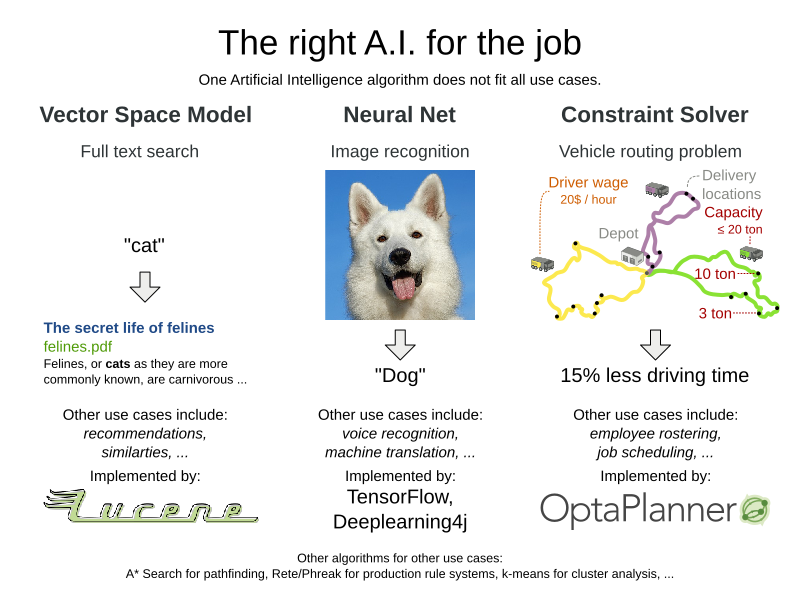

= Does A.I. include constraint solvers?
ge0ffrey
2017-09-07
:page-interpolate: true
:jbake-type: post
:jbake-tags: community, insight
:jbake-social_media_share_image: theRightAIForTheJob.png

The A.I. winter is over.
For a few years now, the interest in Artificial Intelligence technologies is growing again.
Not just from us, A.I. geeks. Business sees the potential to invest.
To acquire new funding, many research projects are rebranding themselves as A.I. technology.
Often justified. But not always.
Can Constraint Solvers use the A.I. tag too?

== A little history: the fifth generation project

For almost two decades, A.I. was a dirty word.
To understand why, we need to go back to 1982,
when Japan decided to invest massively in https://en.wikipedia.org/wiki/Fifth_generation_computer[the fifth generation computer],
an Artificial Intelligence platform which would leapfrog the existing computers of the time and break IBM's monopoly.
In a reaction, other countries funded similar projects.
Suddenly research money fell out of the sky. The 80's summer of A.I.

It failed. Despite decadent funding for almost 10 years,
the fifth generation research had little practical use to show for.
Some of the research was ahead of its time:
lacking big data, smartphones and faster computers, it couldn't work yet.
Other research was completely useless.

In the aftermath of that failure, in the 90's and early 2000's, the term A.I. was tainted.
_A.I. didn't work._ Developers quickly stopped branding their technologies as such.
Constraint solvers strengthened their Operations Research affiliation.
Search engines acted as if they're a simple dictionary lookup.
Rule engines focused on decision tables.
They all avoided mentioning their A.I. affiliation. Except for neural nets.

== Neural nets: one tech fits all?

The last few years, neural nets made Artificial Intelligence cool again.
A neural net mimics the neurons in our brain (not as much as you'd think).
It's a black box that transforms input data into output data,
by pushing it through a number of neural layers of mostly sum and multiply arithmetic.
For decades, its accuracy was too low,
but that changed dramatically, with the recent rise of big data
and the discovery of better backpropagation methods.
The latter enables more layers. More layers equals _deep learning_.

Nowadays, neural nets can recognize faces and voices.
And in a hybrid combination with other A.I. technologies (such as minimax),
they can even beat the world's champion of Go.
Sounds like magic. But *these are all pattern recognition problems.
They can't handle other problems.*
Neural nets can't find the fastest route from La Louvre to the Colosseum.
They can't build https://www.optaplanner.org/blog/2015/03/20/3BugsInTheUltimateAmericanRoadTrip.html[the ultimate American road trip].

== The right A.I. for the job

Neural nets aren't an AGI (artificial general intelligence).
Neither are constraint solvers or production rule systems, for that matter.
Each one can only solve one subset of A.I. problems.
That's probably a good thing: none can become Skynet and pose a treat to humanity.

So to solve business problems with intelligent software,
*use the algorithm that fits the use case*:

This hasn't stopped academics from trying.
There's plenty of research with neural nets to solve https://www.optaplanner.org/learn/useCases/vehicleRoutingProblem.html[vehicle routing]
or https://www.optaplanner.org/learn/useCases/employeeRostering.html[employee rostering],
it's just consistency inferior to constraint solving algorithms such as Tabu Search and Simulated Annealing.
Why settle for a 1% reduction in driving time when you can have 15%?

Visa versa, constraints solvers can't even solve
https://www.youtube.com/watch?v=ACmydtFDTGs[the infamous image recognition of a hot dog].

== Do all algorithms produce intelligence?

Multiplying `1234` by `5678` isn't easy, yet we don't consider this artificial intelligence.
Similarly, sorting algorithms aren't A.I. either. Why is that?

Maybe it's because those problems don't have an error margin.
A.I. problems do:
Given an image of a husky dog, some people recognize a wolf instead.
Given a TSP problem to draw the shortest tour,
people submit https://www.optaplanner.org/blog/2015/06/03/HowGoodAreHumanPlanners.html[unique results of varying quality].

Maybe it's because the calculation and sorting algorithms are understandable.
There is no black box.
It's relatively easy to see how the computer transforms the input, instruction by instruction, into the output.

== What about constraint solvers?

Historically, constraint solvers (such as https://www.optaplanner.org[OptaPlanner]) are definitely part of the field of Operations Research,
but that doesn't exclude them from other fields.

I'd argue that constraints solvers also fall into the field of Artificial Intelligence.
Not just because http://blog.athico.com/2017/09/is-optimization-ai-or-or.html[papers and books say so].
Mainly because https://www.optaplanner.org/learn/useCases/index.html[constraint solving use cases] are _inherently complex problems to master_.
There's great variation in solution quality, both by human planners and specialized algorithms alike.
Given a sufficiently large dataset, the optimal solution is https://www.optaplanner.org/blog/2014/03/27/IsTheSearchSpaceOfAnOptimizationProblemReallyThatBig.html[impossible to find].
Furthermore, researchers still discover https://en.wikipedia.org/wiki/Late_acceptance_hill_climbing[new algorithms],
even though https://en.wikipedia.org/wiki/Simulated_annealing[other algorithms] are almost 40 years old.

What do you think? Are constraint solvers part of the field of Artificial Intelligence?
