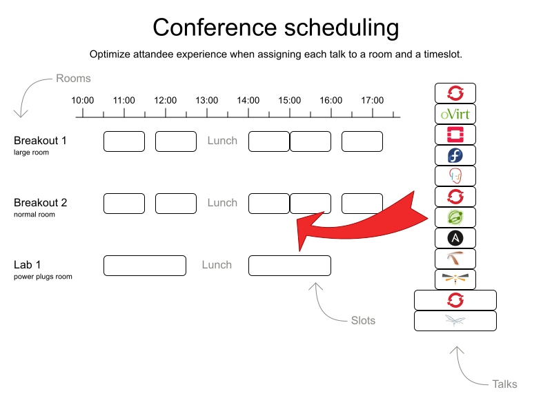
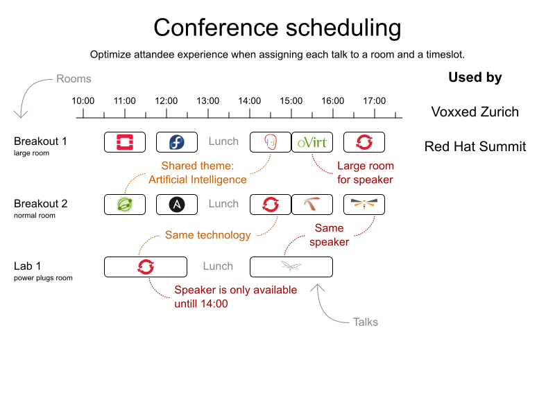

= Behind the scenes of Red Hat Summit 2018 scheduling
ge0ffrey
2018-05-23
:page-interpolate: true
:jbake-type: post
:jbake-tags: use case, conference scheduling
:jbake-social_media_share_image: summitConferenceScheduling_0.png

Earlier this month, Red Hat organized its annual Summit conference in San Francisco for more than 7000 attendees.
As https://youtu.be/r8e4bT0-zhU?t=1m47s[Jim Whitehurst explained in his opening keynote],
OptaPlanner optimized attendee experience by scheduling all of the 325 non-keynote sessions.
Let's take a look behind the scenes.

== The challenge (in theory)

A few weeks after the CFP closed and the program group decided which talks to accepts,
Arrie Brown (main coordinator of Summit, the business expert) and me (the technical expert) started the automatic scheduling.
So for everyone wondering why your brilliant talk wasn't accepted: _it's not OptaPlanner's fault!_

Instead, it had to assign a timeslot and room to each talk.
So for everyone wondering why your brilliant talk didn't get a better time: _it is OptaPlanner's fault!_
My own talk was on the last timeslot of the first day, from 16:30 until 17:15.
Traitor. 12 years of dedication to its code and this how it repays me?

Anyway, given this kind of input:

We generated this kind of output:

Seems easy, right?

Of course, there's a long list of constraints.
For starters, there are 5 different talk types (Breakout, Panel, Birds of a Feather, Lab, Workshops, Mini Session)
with different durations and different room requirements.
A 2 hour Lab doesn't fit in a 20 minute timeslot. But a Mini Session does.
And that's just the tip of the constraints iceberg:

Arrie created a Google Docs spreadsheet, uploaded the data from the CFP application
and ran it through the https://www.optaplanner.org/learn/useCases/conferenceScheduling.html[OptaPlanner Conference Scheduling example].

== The challenge (in practice)

=== The pigeonhole principle

The first road bump we encountered was that OptaPlanner couldn't find a feasible schedule.
It scheduled dozens of talks in the same room at the same time. That's a problem.
https://www.optaplanner.org/blog/2018/02/19/SchedulingVoxxedDaysZurich2018.html[Voxxed Zurich 2018],
didn't run into this problem, but it only had 1 talk type.
It took us a while to figure out the cause, due to talk type complexity, the sheer size of the conference and especially the poor visualization at the time.
I even got side-tracked on trying to fix the feasibility, instead of prioritizing the visualization first, for more insight into the result quality.

Once I improved the visualization in the output spreadsheet, the real problem surfaced immediately:
https://en.wikipedia.org/wiki/Pigeonhole_principle[not enough pigeonholes].
There were 325 talks and only 300 slots to put them in.

We added the 2 missing rooms in the input data and got our first feasible solution.
But we didn't just want a workable schedule: we wanted a great schedule.

=== Garbage in, garbage out

The CFP application is pretty lenient.
During the first import of that data into the OptaPlanner example,
Arrie already fixed a bunch of data issues (such as duplicate speaker rows), to get the spreadsheet to import successfully.

But not all data issues can be detected automatically.
For example, it doesn't automatically know which talks are popular and need a bigger room.
Two rooms were already tagged as `Large`.
Based on experience of previous editions, she identified 7 talks that required such a `Large` room.
She configured their `Required room tags` accordingly.

This kind of experienced, human input is vital to get a good schedule.

=== Tweaking the constraint weights

Attendees should be able to see all talks that they want to see.
Ideally, we'd use the mobile app data to know which talks each attendee bookmarked,
but that data is only available shortly before the conference, long after the schedule is published.
That's a catch 22.
Instead, we avoid scheduling talks at the same time if they cover the same theme track, sector or content,
so every attendee can attend all talks on a particular topic.

These 3 tag types (theme track, sector, content) are not equally important.
Some conflicts (2 talks at the same time) are worse than others.
There are only a few theme tracks and each talk has multiple of those, so theme track conflicts are common.
Therefore, a conflict of 2 talks with the _Containers_ theme track is less important
than a conflict of 2 talks with the _Kubernetes_ content tag.

The spreadsheet defines the weight of each constraint,
allowing to simulate the impact of different weights on the generated schedule.
After some tweaking, avoiding content tag conflicts ended up 50 times as important as avoiding theme track conflicts.

Some content tags were very common. For example, 46 talks included the content tag `OpenShift`.
Others only appeared 2 or 3 times.
I'd now argue that a conflict with 2 (out of 46) `OpenShift` talks is less important
than a conflict with the _only_ 2 talks of another content tag.
So for next year, we might want to normalize the impact of every content tag, based on the number of talks with that tag.

== Pinning as a workaround

There was one talk that gave us grief, at least for a moment: 2 breakout sessions that were part 1 and part 2 of the same talk.
Part 2 needed to start when part 1 ended, in the same room.
To proceed quickly, we just _pinned_ those 2 session manually to a room and timeslots, before solving it. It worked.
OptaPlanner scheduled all other talks while respecting those 2 pre-set assignments.

Of course, if we do see more of these 2-part session cases, I'll add a new constraint to deal with it properly.

== Conclusion

We generated a good, fair schedule with the https://www.optaplanner.org/learn/useCases/conferenceScheduling.html[OptaPlanner Conference Scheduling example].
Similar to Google Search, we only had to define what we want, not how to look for it.

Once we got the input data in a good state, we just had to press the _Solve_ button and give it some time.
Next year, we'll be able to reuse this code.
If you're organizing a conference, take a look at the video below to try it out yourself.

== Related video

video::R0JizNdxEjU[youtube]
