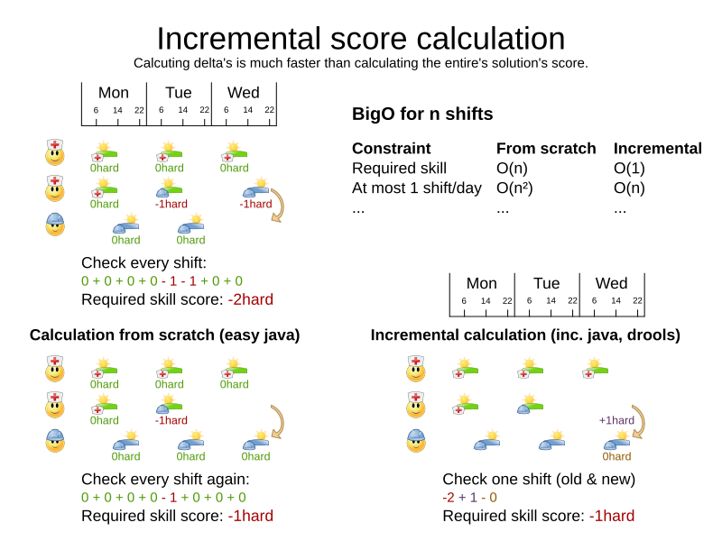
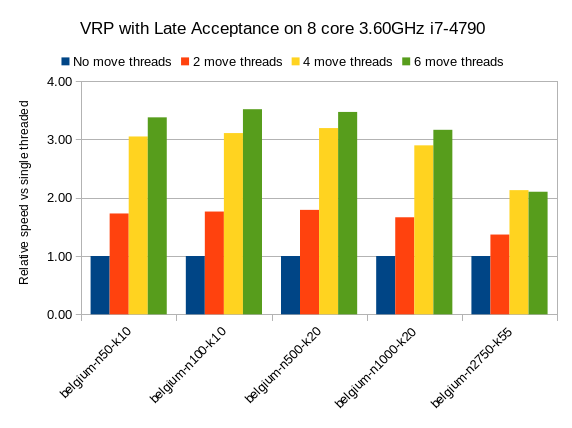
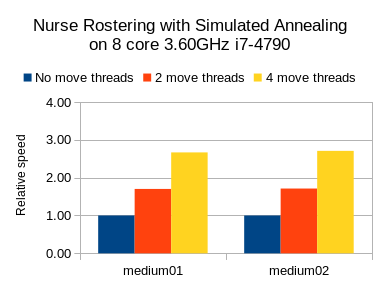
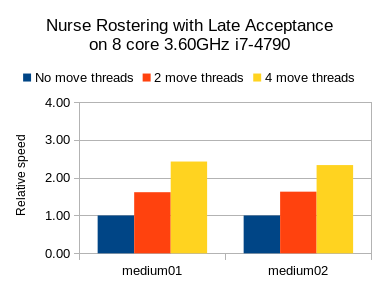

= A giant leap forward with multithreaded incremental solving
ge0ffrey
2018-07-03
:page-interpolate: true
:jbake-type: post
:jbake-tags: algorithm, benchmark
:jbake-social_media_share_image: multithreadedSolvingVrpTabuSearch.png

OptaPlanner finally supports _multithreaded incremental solving_.
*The speedup is spectacular. Even with just a few CPU cores, it triples the score calculation speed.*
See the results below. To activate it, a single extra line in the configuration suffices.

https://issues.redhat.com/browse/PLANNER-76[The original feature request] stems from 2007.
Throughout the years, step by step, we diligently prepared the internal architecture for it.
So now, after 10 years, we fully support it from `7.9.0.Final` onwards.

But why did it take so long to implement?

== Requirements

Let's take a look at the requirements for multithreaded incremental solving:

* Horizontally scale an algorithm across CPUs.
* Don't ruin the speedup of incremental score calculation.
* Runs must be reproducible.

=== Horizontally scale an algorithm across CPUs

There are several ways to use multiple threads without doing real multithreaded solving:

* *Multitenancy*: Solve multiple datasets, one per thread.
** Works since the first OptaPlanner version.
** Doesn't do horizontal scaling on 1 dataset.

* *Multi bet solving*: Solve one dataset in multiple ways, completely independent of each other. Take the best result.
** Works since the first OptaPlanner version.
** It's usually a waste of resources: use the Benchmarker during development instead to find the best algorithm in advance.
** Doesn't scale horizontally: the best result is marginally better than a single-threaded result and takes equally long.

* *Partitioned Search*: Split up one dataset and solve each one separately.
** Fully supported since OptaPlanner 7.0.
** Scales horizontally at an expensive trade-off of solution quality,
because https://www.optaplanner.org/blog/2014/03/03/CanMapReduceSolvePlanningProblems.html[partitioning excludes optimal solutions].

But none of these are real parallel heuristics, as shown in the bottom right corner below:

image::multiThreadingStrategies.png[]

In real multithreaded solving, we solve 1 dataset, without partitioning,
by offloading heavy calculations of 1 algorithm (which could be a composition of multiple algorithms)
to multiple threads on separate CPU cores.

In OptaPlanner's Construction Heuristics and Local Search,
the most CPU-expensive work is calculating the score of a move.
For example in Tabu Search, each step (the outer iteration) evaluates around a 1000 moves.
That's measured as the _score calculation speed_.
It usually varies between 1k evaluated moves per second and 500k evaluated moves per second.

_Multithreaded solving is just a matter of distributing the move evaluations of a step across multiple threads._
That's straightforward. There are even a few users that did this (most notably a space agency supplier), by hacking our code.
But they didn't see a performance gain. Quite the opposite actually (except with an easy score calculator).
Those changes broke incremental score calculation.
*Multithreaded solving is easy. But multithreaded _incremental_ solving is hard.*

=== Don't ruin the speedup of incremental score calculation

Ah, this brings us to incremental score calculation. The key to performance.
It is the rocket science at the heart of OptaPlanner that brings massive scalability.
And -- for the few that have seen them -- the cause of the notorious score corruption exception.

What is incremental score calculation?
For each move, we calculate the score of the solution state after applying that move.
With non-incremental score calculation, the entire score is calculated from scratch.
But with incremental score calculation, we only calculate the delta, as shown below.
That's far more efficient.

To put this in perspective: an incremental score calculator on a vehicle routing problem with 1000 locations,
is theoretically around 500 times faster than a non-incremental score calculator.
*To offset the loss of an incremental solver on a dataset of a 1000 planning entities,
a multithreaded non-incremental solver would need around 500 CPU cores (in theory).*
In practice, the numbers vary, but the gain of incremental solving always outweighs the gain of multithreaded solving.

Of course, now, we can have our cake and eat it too.

Each incremental score calculator is inherently single threaded,
so each move thread has its own score calculator and its own solution state.
Cloning either is too expensive.
To evaluate a move on a move thread, with incremental score calculation,
we must reuse the score calculator of the previous evaluation.
This implies that the working solution must be in the exact same state to begin with.
But because the outer step iterations change the solution state constantly,
the move threads must sync up with the main solver thread after every step.

It's similar to any real-time multiplayer game (such as StarCraft),
in which multiple hosts need to sync up to show the same game state,
but can't afford to transmit the entire game state for every change.

As soon as one thread goes out of sync, all calculations of that thread are corrupted,
and the entire system is affected.
But through a well-designed orchestration of concurrent components
(and multi-day test runs), we prevent race conditions. And it works. Like a charm.

Furthermore, the threads must be able to send moves to each other,
even if it's only to share the winning move.
This too, posed a challenge. _OptaPlanner is an object-oriented constraint solver_,
so its decision variables can be any valid Java type (not just booleans, numbers and floats), such as `Employee` or `Foo`.
Those variables can sit in any domain class (called planning entities), such as `Shift` or `Bar`.
The move instances reference those class instances. When a solution gets cloned to initiate a move thread,
those planning entities, such as `Shift` get cloned too.
So when a move from thread A gets sent to thread B, OptaPlanner rebases the move on the solution state of thread B.
This replaces the references from the move instance to thread A's solution state
with the equivalent references of thread B's solution state. Pretty nifty.

=== Runs must be reproducible

Reproducibility is king. The ability to run the same dataset through OptaPlanner twice
and get the exact same result after the same number of steps (and at every step), is worth its weight in gold.
To lose that, would make debugging, issue tracking and production audits extremely difficult.

The inherent unpredictable nature of thread execution order on multi-core machines, makes reproducibility an interesting requirement.
Combine that with the reliance of many optimization algorithms on a seeded random number generator (which is not thread-safe),
for a real challenge.

But we did it. We have 100% reproducibility. This involves several ingenious mechanisms, such as
using a main seeded random to generate a seeded random per thread,
generating a predictable number of selected, buffered moves (because move generation often relies on the random generator too)
and reordering evaluated moves in their originally selected order when they come back from the move threads.

== The configuration

Multithreaded incremental solving is easy to activate.
Just add a `<moveThreadCount>` line in your solver config:

[source,xml,options="nowrap"]
----
<solver>
  <moveThreadCount>4</moveThreadCount>
  ...
</solver>
----

This basically donates 4 extra CPU cores to the solver.
Use `AUTO` to have OptaPlanner deduce it automatically.
Optionally, specify a `<threadFactoryClass>` for environments that don't like arbitrary thread creation.

It combines with every other feature, including other multithreading strategies (such as multitenancy, Partitioned Search, ...),
if you have enough CPU cores to pull it off.

== The benchmarks

=== Methodology

Using optaplanner-benchmark, I ran a set of macro benchmarks:

* On a 64-bit *8-core* Intel i7-4790 desktop with 32GB physical RAM.
* Using OpenJDK 1.8.0_171 on Linux.
* With the JVM max heap (`-Xmx`) set to 4GB.
** I also tried 2GB and those results were worse, especially for a higher number of move threads.
** So when increasing the number of move threads, it's important to increase the max memory too.
* With logging set to `info` logging.
** I also tried `debug` logging and those results were clearly worse (because the faster it runs, the more debug logging it does).
** It's recommended to https://www.optaplanner.org/blog/2015/02/23/HowFastIsLogging.html[avoid debug logging in production] anyway.
* With score DRL.
** I also tried with the incremental Java calculator and those results had more moves per second,
but a lower relative gain per move thread (due to higher congestion).
* 5 minutes per dataset.

=== Results on the vehicle routing problem (VRP)

Below are the results on different VRP datasets for a First Fit Decreasing (the Construction Heuristic)
followed by Tabu Search (the Local Search). Higher is better.

image::multithreadedSolvingVrpTabuSearch.png[]

The blue bar is the traditional, single-threaded OptaPlanner.
It has an average score calculation speed of `26,947` moves per second.
That goes up to `45,565` with 2 move threads, to `80,757` with 4 move threads and to `88,410` with 6 move threads.

*So by donating more CPU cores to OptaPlanner, it uses a fraction of the time to reach the same result.*

On other Local Search algorithms, such as Late Acceptance, we see similar results:

Late Acceptance is a fast stepping algorithm (especially in the beginning), which implies that it has fewer moves per step.
Yet, it has a similar relative speed gain for the Vehicle Routing Problem.

We also see a slight reduction of the relative speed gain on the biggest dataset with 2750 VRP locations,
but I suspect this might be because the 4GB max heap memory is too low for it to function at full efficiency.
I'll investigate this further.

=== Results on nurse rostering

I also ran benchmarks on the nurse rostering use case, but with a JVM max heap (`-Xmx`) set to 2GB.
Here I tried Tabu Search, Simulated Annealing and Late Acceptance:

image::multithreadedSolvingNurseRosteringTabuSearch.png[]

In all 3 case, we see a welcome speed gain, but Tabu Search (a slow stepping algorithms) has a bigger relative gain
than the others (which are fast stepping algorithms).

In any case, it's clear that _your mileage may vary_, depending on the use case and other factors.

== Future improvements

As we increase the number of move threads or decrease the time to evaluate a single move on one thread,
we see a higher congestion on the inter-thread communication queues, leading to a lower relative scalability gain.
There are several ways to deal with that and we'll be investigating such internal improvements in the future.

== Conclusion

_All your CPU are belong to OptaPlanner._ https://en.wikipedia.org/wiki/All_your_base_are_belong_to_us[[1\]]

With a single extra configuration line, https://www.optaplanner.org/[OptaPlanner] can reach the same high-quality solution in a fraction of the time.
If you have CPU cores to spare, of course.
