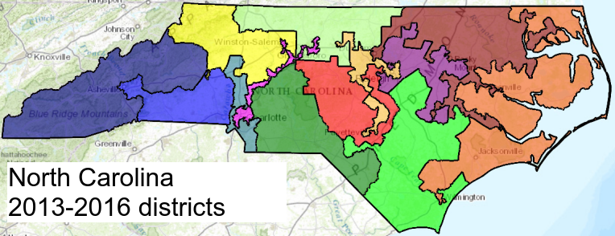
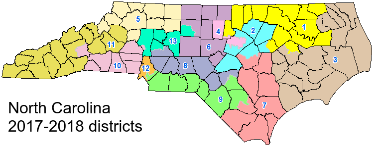
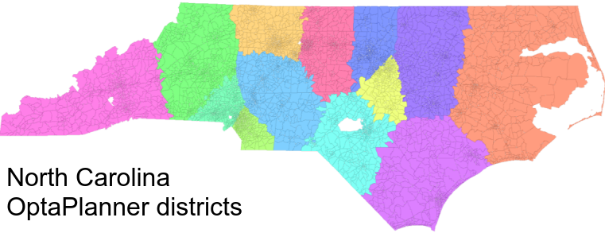

= How to defeat gerrymandering and create fair elections
jgoldsmith613
2018-07-25
:page-interpolate: true
:jbake-type: post
:jbake-tags: use case
:jbake-social_media_share_image: NorthCarolinaDistrictsOptaPlanner.png

Over the years, politicians have redrawn electoral voting lines to gain an unfair advantage.
This has led to district boundaries with shapes that have no obvious pattern or reason other than political gain.
When districts are redrawn you can sway an election's results without changing a single voter’s mind.
Can OptaPlanner draw fair electoral boundaries and save democracy?

Gerrymandering hits the headlines:

* _How gerrymandering has skewed Virginia's congressional delegation_ - Roanoke Times
* _What Extreme Partisan Gerrymandering Could Mean For 2018 Midterms_ - NPR
* _Don't let politicians choose their voters_ - USA Today

It is easy to criticize boundary lines and claim gerrymandering, but it is a difficult topic to solve,
especially when humans with their own motives pick the boundaries of the legislative borders.
Should a "`fair`" district include an equal mix of underrepresented racial groups?
Do you define borders based on competitiveness of party lines? Should geography constrain borders?

Using OptaPlanner we can treat drawing congressional districts as an optimization problem.
Obviously our constraints could also be a point of political tension,
but at least with software our constraints can be public and not hidden behind politicians private motives.
For the sake of this experiment with OptaPlanner, I am only taking into account two constraints:

* Equalize the population count across districts
* Make the districts as compact as possible.

== North Carolina Example

North Carolina has been one of the states with recent court cases around this topic.
Here is the district map both before and after they redrew the districts to try to make it seem fair
(https://en.wikipedia.org/wiki/North_Carolina%27s_congressional_districts[source]).

While it does seem like it did get better, there are still seemingly random shapes in the 2018 map, that do not seem fair.
For example *look at the pink district 4 in the middle of the map*.
It almost seems like two separate areas snaking between other districts.

Here is OptaPlanner's result:

The shapes in this image are much more regular.
The small blocks you see are based of the US 2010 decennial census.
There are about 8000 of them in North Carolina and they are the Planning Entity in this example, with the Planning Variable being just an integer 1-13 representing the districts.
The average population in each district is about 714,000 people.
Each district in this example is about plus or minus 2,000 from each other.
Depending on how we want to weight the constraints, we can make the population in each district closer to the average.
To get this good of an answer, the problem was run for about 6 minutes.
https://github.com/jgoldsmith613/NC_Gerrymandering/[Take a look at the source code.]

There are definitely still a lot of improvements to be made to this solution,
but all of this was done in a few days work as a side project.
With some more time, maybe one day https://www.optaplanner.org/[OptaPlanner] can solve this contentious political issue.
