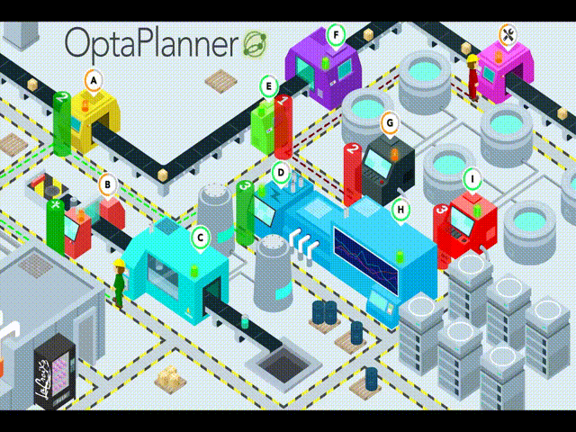
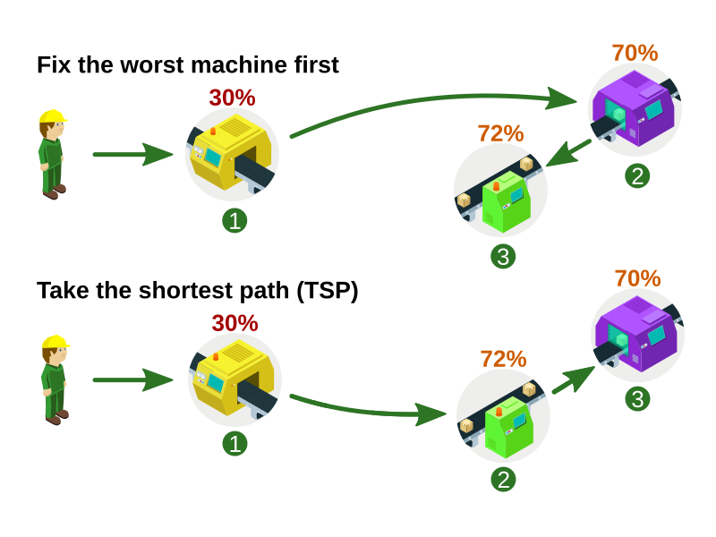
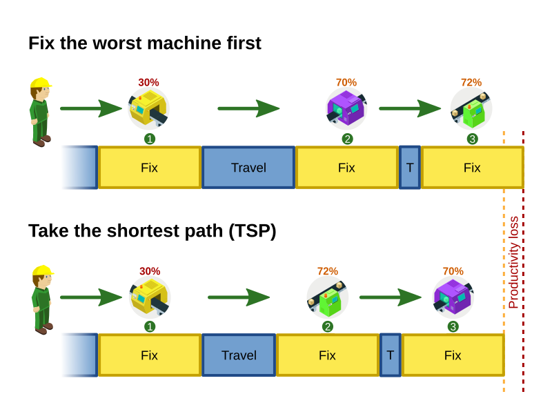
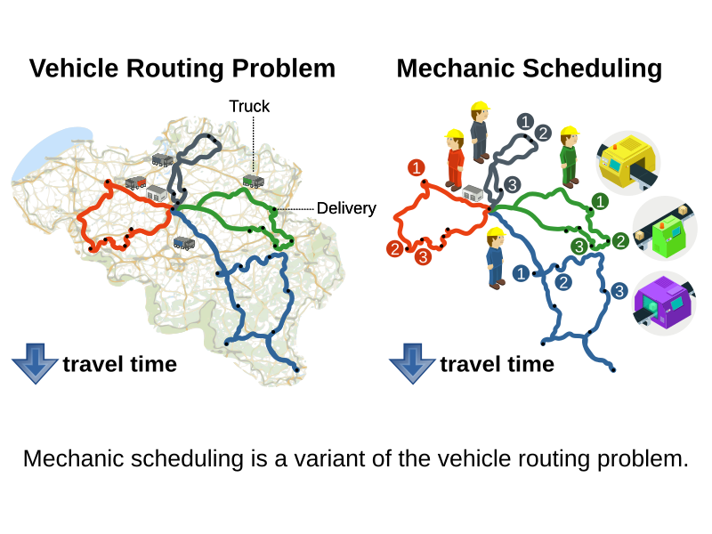

= Mechanic scheduling (part 1) - Can OptaPlanner keep up with a keynote audience of thousands?
ge0ffrey
2019-05-09
:page-interpolate: true
:jbake-type: post
:jbake-tags: use case, vehicle routing, maintenance scheduling, insight
:jbake-social_media_share_image: RHSummit2019OptaPlanner2MechanicsDance.gif

This year, my team and I participated in the Red Hat Summit keynote.
In front of 7000 people, we demonstrated real-time scheduling,
reacting on input coming from the audience's smartphones.
In the past 2 months, we created this application together with the other middleware teams
and under the excellent guidance of Burr Sutter.
It integrates various technologies
such as Android/iPhone accelerometers, OpenShift/Kubernetes, Quarkus,
KNative, TensorFlow, Kafka/Strimzi, Camel, Node.js, Godot, Infinispan, Drools and of course OptaPlanner.

We wrote a simulation of a typical manufacturing floor, involving machines at assembly lines.
This led to an interesting conversation when I first showed it to my wife:

[quote]
____
"`Look, darling. This is the keynote demo we've been working on the past few weeks.`"

"`That looks like a video-game... Is that Mario and Luigi running around?`"

"`Well, notice how OptaPlanner optimizes their traveling time so they can spend more time fixing machines.`"

"`Are you really going to show this to 7000 business people?`"

"`Yes, of course. It's going to be beautiful.`"
____

This is how it turned out:

The machines (A-J) suffer attrition, which is detected by movements sensors.
With the help of the audience, we simulate those sensors, by capturing accelerometer data from their phones.
_When things go shaky, things go breaky._
So as the audience shake their phone - or do more complex gestures - their machines receive damage.
Each part of the audience is damaging one machine,
and if the health of their machine drops to zero, it falls apart.

Now, those machines require maintenance before they break, which is where OptaPlanner comes in.
There are only 2 or 3 mechanics to fix them.
And while mechanics are traveling to a machine or fixing it, all machines continue to lose health.
Deciding the order in which to fix them, as damage comes in concurrently, is difficult.
Luckily, OptaPlanner schedules those mechanics for us.
It reacts to health changes in real-time, as shown in this video:

video::Y4wyPU_B2gU[youtube]

== The planning challenge

There is only one goal: _don't let any machine reach 0%_.
This might seem like one simple constraint,
but it's actually two adversarial constraints:

. *Fix the most damaged machine first*,
because that has the highest risk of dying.
. To fix machines as quickly as possible, *take the shortest path*.
** The mechanics are either fixing machines or walking around,
so by reducing their travel time, we increase their productivity.
** If this was the only constraint, this would be a Traveling Salesman Problem (TSP).

These 2 constraints are in competition with each other. They lead to different solutions:

What's less obvious is how this impacts the _makespan_,
which is the amount of time the mechanics need to fix all the machines one time.
A longer makespan reduces productivity:

So we ended up having to weigh these two constraints against each other.
We implemented that by penalizing, per machine,
the amount of attrition multiplied by the duration until the machine is fixed.
So the more damage, or the longer it takes to fix a machine,
the less likely that OptaPlanner's solution will schedule that.

== It's just a Vehicle Routing Problem

In the academic Operations Research world, this problem is known as the Vehicle Routing Problem (VRP),
in which we need to send a number of vehicles (such as trucks) to a number of locations:

It's the same problem, with a few variations on the constraints.

Now, OptaPlanner is really good at optimizing vehicle routing problems at scale:
*it saves some of our customers hundreds of millions of dollars per year*
by reducing their overall travel time by 15% or more.
This also heavily reduces their fuel consumption,
decreases their carbon footprint, which is great for the environment too!

https://www.optaplanner.org/learn/useCases/vehicleRoutingProblem.html[Learn more about optimizing VRPs with OptaPlanner]
or take a look at Jiri's latest demo of the https://github.com/kiegroup/optaweb-vehicle-routing[optaweb-vehicle-routing] reference architecture:

video::ylPEIf7Mc2M[youtube]

== The real challenges

Implementing this variation of vehicle routing was pretty straightforward at first,
but we faced bigger challenges to get this interactive demonstration running well enough.
After all, we couldn't risk that it crashes during the keynote, in front of the audience
(including all our bosses, all the way up to our CEO, Jim Whitehurst).

* To learn more about *our architecture and the integration with all those other technologies*,
https://www.optaplanner.org/blog/2019/05/09/RHSummit2019Part2.html[read Musa's article (part 2)].
* To learn more about the scaling challenges and *the benchmarks on simulations and load tests we ran*,
https://www.optaplanner.org/blog/2019/05/09/RHSummit2019Part3.html[read Radovan's article (part 3)].

To run it yourself, download https://github.com/rhdemo/2019-demo4-optaplanner[the source code]
and follow the readme instructions.

'''

Let me thank the entire team for their great work
and specifically in this part, a big thanks to
Luke Dary, Matthew Carleton, Evan Shortiss and Christopher Chase
for building a beautiful dashboard UI and a great mobile application.
And of course, a big thanks to our one and only captain, Burr Sutter,
who can set up a show like no other!

View the recording of our show:

video::FUu4kMc0PL8[youtube, start=5785]
