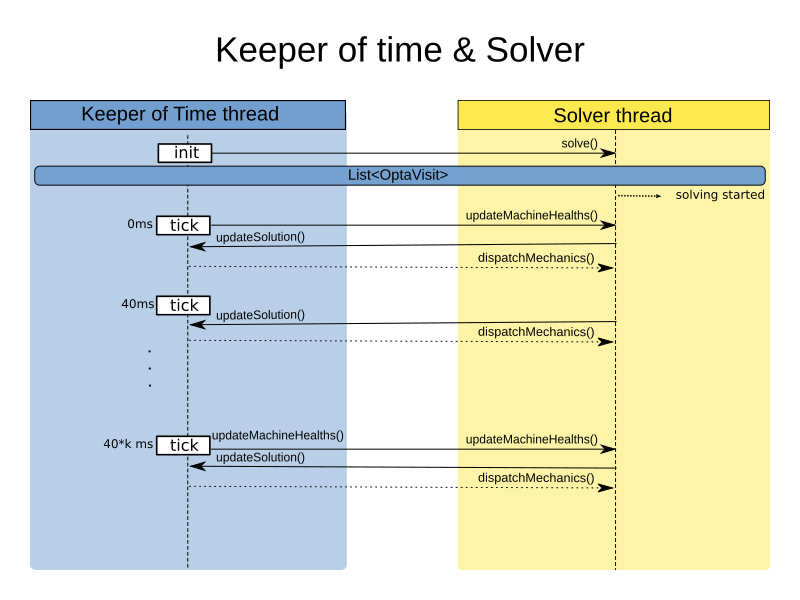

= Mechanic scheduling (part 2) - Architecture and integration
MusaTalluzi
2019-05-09
:page-interpolate: true
:jbake-type: post
:jbake-tags: integration, production, coding
:jbake-social_media_share_image: RHSummit2019OptaPlanner2MechanicsDance.gif

The more smart devices are connected to the internet, the more in need of smarter systems we are.
These systems should monitor, automate and maintain these devices in a robust and efficient way.

In this demo, we simulate a factory plant containing multiple pieces of machinery. The system we built monitors these machines
and automatically dispatches mechanics to fix them in a smart way. To learn more about the use case and challenges,
read https://www.optaplanner.org/blog/2019/05/09/RHSummit2019Part1.html[Part 1 by Geoffrey].

== Overall system architecture

image::rhdemo2019SystemDiagram.png[link="rhdemo2019SystemDiagram.png"]
To simulate damage source, we created a mobile app whose users signalize damage to machines by shaking their phones.
The shaking data is sent to a web server that filters the bad data using TensorFlow service, then exports resulting
predictions to AMQ streams. These predictions are consumed by Red Hat Integration, which processes the data and puts the result
in Infinispan. Machine healths and mechanics`' states are also stored in Infinispan.

Lastly, given the data in Infinispan, we need to decide how to schedule repairs optimally to reduce travel time and failure costs.
We used OptaPlanner to do that. OptaPlanner reads machines health from Infinispan, updates the planning problem and sends
new dispatch events back to Infinispan, then the web server gets notified and sends the dispatches to be shown on the dashboard UI.

== Mechanic Scheduling service architecture

OptaPlanner's goal is to schedule repairs in an optimal way. To accomplish this, it needs to keep track of current machines`' health,
dispatch mechanics and update healths once mechanics are done fixing the machines. There are two pitfalls here:

* Machines health can be updated thousands of times per second.

* The solver can also update its solution thousands of times per second, and it needs some time to produce an optimal solution
so it shouldn't be interrupted thousands of times per second to update healths.

Therefore, a separate keeper of time thread was used. It submits the planning problem to the solver thread, updates the solution,
submits machines health changes as problemFactChanges to Solver thread, sends mechanic dispatches,
and updates mechanics future visits in Infinispan.

In the diagram above, you see the `tick` every 40ms. This value was chosen to address the two pitfalls mentioned above.
Let's unravel how the Keeper of Time accomplishes scheduling mechanics:

* In the beginning, it creates a new planning problem and submits it to the solver thread to start solving.

* Every tick (40ms):

** Update machine healths from Infinispan.

** Every k ticks it updates machine healths in solver thread.
K is chosen so the interval in which the solver thread updates the health is less than the time it takes a mechanic to fix a machine.

** Update current solution (mainly mechanics future visits) so we can have an idea what OptaPlanner is thinking and changing its mind.

** When a mechanic finishes fixing the machine on hand, update this machine health in infinispan,
dispatch him/her to the next machine and update solver thread with this dispatch.

The solver thread receives the planning problem, solves it and can be queried for best solution. To learn more about it,
check https://docs.optaplanner.org/latestFinal/optaplanner-docs/html_single/index.html#useTheSolver[OptaPlanner documentation].
Below is a class diagram showing how we modelled the mechanic scheduling problem to be solved by OptaPlanner.

image::mechanicSchedulingClassDiagram.png[link="mechanicSchedulingClassDiagram.png"]

== Integration with Infinispan and the Dashboard UI

The last piece in the puzzle is to ensure that both the UI and OptaPlanner's states are consistent.
As mentioned earlier, OptaPlanner sends dispatch events (containing mechanic, machine to be fixed, travel time duration and fix time duration).
Once the keeper of time ticks at a time after a mechanic has finished fixing a machine, it resets the machine health
and dispatches that mechanic to next machine, both updates are sent to Infinispan, where the UI listens to dispatch events
and polls machines health at fixed intervals.

You might have already guessed what can go wrong here, if the UI gets notified with the dispatch event before it polls
for the full health, the mechanic will start moving away from the machine while its health is still not reset,
this doesn't look good.

Therefore, we introduced “thumbs up” duration, an interval longer than the rate at which both OptaPlanner ticks
and the UI polls Infinispan, as illustrated in the figure below. This ensures that the following sequence of events occurs in order:

1. OptaPlanner resets machine health
2. UI polls the full health and displays it
3. OptaPlanner sends dispatch event
4. UI gets notified and mechanic starts moving to next machine

image::mechanicsOverTime.png[link="mechanicsOverTime.png"]

== Conclusion

In conclusion, the two main challenges in designing this microservices architecture were
adapting the inner workings to accommodate other services`' behaviour and maintaining consistency with other services.

* To learn more about scaling challenges and the benchmarks as well as the load tests we ran,
read https://www.optaplanner.org/blog/2019/05/09/RHSummit2019Part3.html[Part 3 by Radovan].

'''

Let me thank the entire team for their great work
and specifically in this part, a big thanks to
Ryan Emerson, Galder Zamarreno and Christopher Chase
for their help on the Infinispan integration.
And of course, a big thanks to our one and only captain, Burr Sutter,
who can set up a show like no other!

View the recording of our show:

video::FUu4kMc0PL8[youtube, start=5785]
