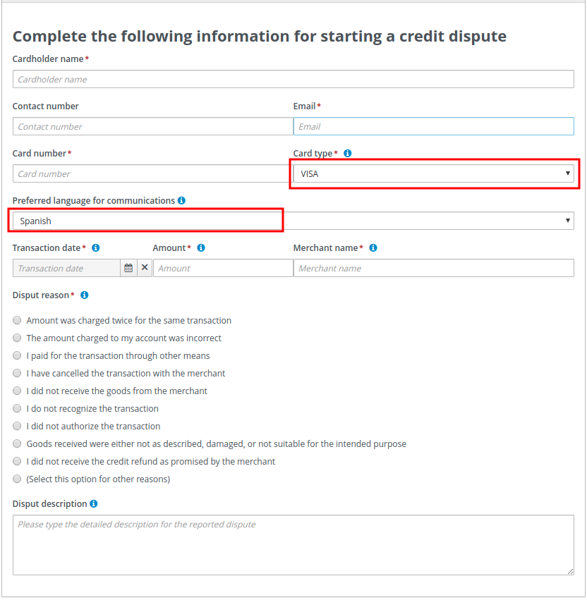

= Let's OptaPlan your jBPM tasks (part 1) - Integrating the two worlds
wmedvede
2020-07-03
:page-interpolate: true
:jbake-type: post
:jbake-tags: feature, task assignment, integration
:jbake-social_media_share_image: CreditDisputeProcessDiagram.png

Traditionally, business process management systems (BPMS) assign human tasks to users on a group basis.
This information is part of the human tasks configuration.

In the following process, notice how the Resolve Dispute and Notify Customer tasks are configured with the
CreditAnalyst and ClientRelations groups respectively:

image::CreditDisputeProcessDiagram.png[]

At runtime, every time a new instance of one of these tasks is created it is automatically assigned to the respective
group with the status Ready.

This makes the task automatically available to all users that belong to the group.
All users in the group see it in their respective *Task Inbox* but none are the actual owner or responsible for the task.
To be able to work with a particular task, a user must execute the claim operation to reserve the task for that user.
This is a completely manual procedure.

The following image shows a list of tasks with the Ready status:

image::TaskList-NoTaskIsSelected.png[]

The following image shows the result of the claim operation executed on task #74 by the user _katy_:

image::TaskList-UserKatyClaimedATask.png[]

Although this is the standard procedure for most BPMS products, it is not flexible enough for all use cases, for example:

* Scenarios with a huge set of tasks that require an optimal distribution of tasks between users by specific criteria.
For example, distribute the tasks fairly between users, minimize the time to complete all the tasks, consider the tasks priorities, and so forth.

* Scenarios where it's desired to combine business data for making the tasks assignments, because BPMS engines normally
assign tasks on a group basis but don't have the ability to include business data for making the assigning decisions.

* When instant reaction is required, new tasks are created or the existing tasks are completed. All of these events might
require a redistribution of the work to ensure the assignments are still optimal.

So in general, when using standard BPMS products, users might find a large list of tasks up-front but do not have the
knowledge to manually claim and execute them in the best or optimal way. And the responsibility for picking the tasks in
the proper order is delegated to the users.

== How about asking OptaPlanner to do some of this work?

In the last months we've been working on integrating https://www.optaplanner.org/[OptaPlanner] and https://jbpm.org/[jBPM]  with that purpose.

The concept is very simple: __ *"`let each tool do the piece of work it is good at, integrate the results, and provide a
better user experience`"* __.

The following image shows a simplified view of the integration:

image::IntegrationDiagram.png[]

. The business process runtime executes the processes and creates the human tasks.

. https://www.optaplanner.org/[OptaPlanner] consumes the available tasks and calculates an optimized plan based on a set of constraints.
The plan establishes which tasks must be assigned to whom.

. The planned assignments are executed in the https://jbpm.org/[jBPM] runtime and the tasks are finally assigned to the users.

The following image shows how the tasks are assigned when integration is enabled:

image::TaskList-TaskAssignedAfterStartingTheIntegration.png[]

The tasks marked in blue are assigned to the user _katy_ while the tasks marked in red are assigned to the user _maciek_.

== Curious about how this happens?

As part of the integration, https://www.optaplanner.org/[OptaPlanner] was able to:

. Identify that the ResolveDispute task is configured for users that belong to the CreditAnalyst group.

. Identify that the users katy and maciek belong to the CreditAnalyst group.

. Calculate an optimized plan with the following results:

* Tasks #70 and #69 should be assigned to katy.
* Tasks #75 and #73 should be assigned to maciek.

. Execute the proper assignments in the https://jbpm.org/[jBPM] runtime.

. Keep some tasks, in this example  #71, #72 and #74, unassigned.

== So, this basically means that users no longer have to manually claim the tasks?

Yes, now they can focus on executing their assigned work. But most importantly, it also means that the responsibility
and decision making was transferred from humans to optimization algorithms.

== Why are some tasks still unassigned?

Usually, a running BPMS creates many process instances and many human tasks. At the same time, users are working and
completing these human tasks. This cycle is repeated over and over.

https://www.optaplanner.org/[OptaPlanner] addresses this situation by recalculating the optimized plan when new human tasks are created or completed
and produces new assignments to reflect the new optimized plan. This is often achieved by combining different
"`Repeated Planning and Real-time Planning`" techniques.

Additionally, it might be the case that a plan that was optimal at time N is no longer optimal at time N+1. For example,
a higher priority task has arrived and must be performed as soon as possible. The direct impact of this situation is that
the programmed assignments at time N might change at time N+1, which means that tasks are routinely reassigned many times
when the new optimized plans are calculated. One of https://www.optaplanner.org/[OptaPlanner's] strengths is the ability to react to a changing context.

If not controlled, continuous task reassignment might negatively impact the user's experience because they might feel
that tasks come in and out of their workload randomly. This situation is present in other types of optimization problems
as well and is usually managed by combining different repeated and continuous planning techniques. For detailed
information see the "Repeated Planning" section of the https://www.optaplanner.org/[OptaPlanner's] User's Guide.

A simple strategy is to introduce the concept of a planning window which is a defined subset of the available work that
will not be changed or reassigned even when new plans are calculated. Only this subset is available to users.
The tasks in the planning window are called published tasks. The previous example contains a planning window with a size of two.

Users concentrate on completing these tasks and https://www.optaplanner.org/[OptaPlanner] concentrates on keeping the optimized plan updated and
assigning more work to them as soon they start completing the published tasks.

== How was the plan calculated?

The following constraints were used for the plan calculation:

* A task must be assigned to one of its "Potential Owners" (for example, users that belong to the task's configured group),
or to the "Planning User" in cases where no "Potential Owners" are found.

* If a task has configured "skills" it can only be assigned to a user that has all of the skills. If no user can be found,
 it will be assigned to the "Planning User".

* Assign higher priority tasks first whenever possible.

* Reduce the time to complete all the tasks and do a fair distribution of the work.

* Assign medium and low priority tasks last.

== Integrating business data

At the beginning of this post we showed how the human tasks are configured and how the group information is set.
Then, we showed how this group is used for calculating the plan and making the assignments. But let's take a deeper look
at these tasks.

image::CreditDisputeProcessDiagramWithTaskInputs.png[]

The image shows how both tasks are configured with an input parameter skills that are assigned with some of the process
variable values. At runtime these assignments connect the process business data with the tasks information and https://www.optaplanner.org/[OptaPlanner]
can include it for the plan calculation.

The following example shows how the credit card type and language selection is entered when the process starts.
(Note that this information could have been collected by the process by using any other mechanism.)

Finally, this information will be used to establish which of the available CreditAnalyst and ClientRelations users are
best suited for each task instance.

The following users configuration was used to execute the preceding processes:

[cols="10%,40%,50%" frame="all", options="header"]
|===
|User
|Belongs the group
|Has skills in

|katy | CreditAnalyst | CITI and MASTER cards.
|maciek | CreditAnalyst | VISA and AMERICAN_EXPRESS cards.
|john | ClientRelations | Spanish and English languages.
|mary | ClientRelations | Chinese language.

|===

Let's now see the information for task #70:

We can see that "Task #70 requires a CreditAnalyst user with skills in the MASTER credit card". This is why it was assigned to katy.

As soon as this task is completed, a new instance of the Notify Customer task is created.

The following image shows the new instance information:

image::NotifyCustomerTask-76-Information.png[]

We can see that the Spanish language was selected as the "Preferred language for communications", which establishes that:

"Task #76 requires a NotifyCustomer user with skills in the Spanish language", and this is why this new task is assigned to john.

Note that the example above is quite linear, only four users are defined, and the possible assignments are direct.
This was done intentionally to show how the assignment decisions are made accordingly with the configured groups and the
tasks business data. However, in production environments usually both the set of available tasks and users are huge,
and for example at a certain point in time there might be many candidates for a task, and so forth.
Here is when https://www.optaplanner.org/[OptaPlanner's] work becomes crucial, because the optimized plan is calculated by taking into account all
the constraints described above.

== Is this a hard coded one shot integration?

No, the integration is provided as a set of Kie Server capabilities and can be easily used and integrated in other
projects and scenarios. See https://docs.jboss.org/jbpm/release/7.39.0.Final/jbpm-docs/html_single/#_ch.taskAssigning[KIE Server Task Assigning]

== Conclusions

Usually, a running BPMS creates many process instances and many human tasks. Standard BPMS products assign these tasks
following a bucket-model, making them available to a set of users named the "Potential Owners" for the tasks. None of
these users are responsible for the tasks and before working with a particular task they must claim it.

This model transfers the responsibility of the tasks selection to the users that must execute a manual procedure.
In many scenarios that selection is far from optimal.

By integrating https://www.optaplanner.org/[OptaPlanner] with https://jbpm.org/[jBPM], we can go one step further and produce direct assignments of tasks to the users
according to an optimized plan. This plan is calculated by considering the process semantics, a set of constraints,
and the business data.

Responsibility and decision making was transferred from humans to optimization algorithms.

video::ZBzzdQJDapU[youtube]
