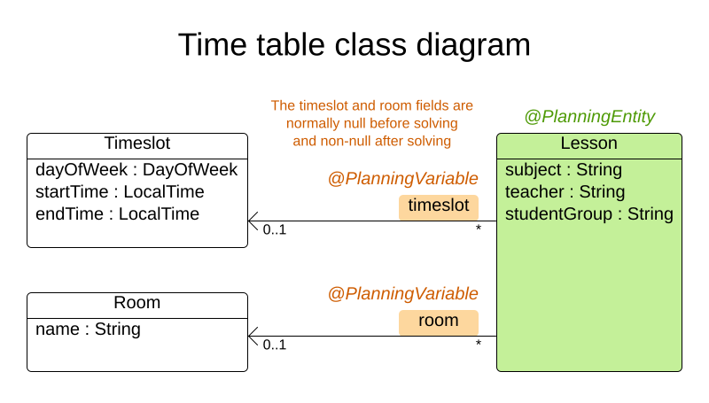
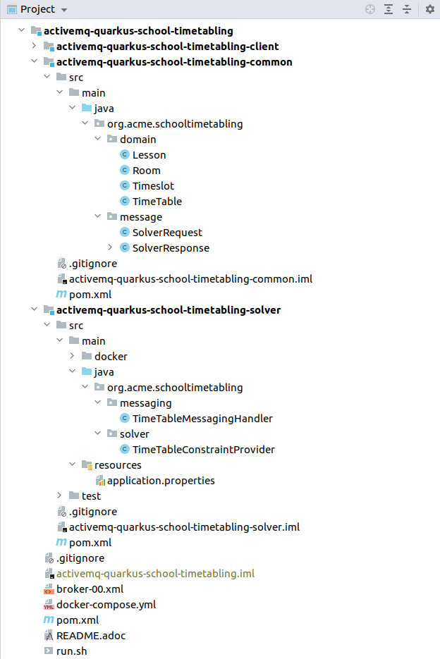

= Batch solving a ActiveMQ queue that contains planning problem data sets in a scalable way
rsynek
2021-03-25
:page-interpolate: true
:jbake-type: post
:jbake-tags: activemq, quarkus, integration
:jbake-social_media_share_image: activemqSolvingArchitecture.png

If I want to solve many data sets of a planning problem every night, what architecture can easily scale out horizontally without loss of data?
In this article, we will take a look at how to use a transactional ActiveMQ queue in front of a set of stateless https://www.optaplanner.org[OptaPlanner] pods.
Client applications can submit data sets to solve and listen to the resulting solutions without worrying about which OptaPlanner pod does the actual solving.

The source code is available in the https://github.com/kiegroup/optaplanner-quickstarts/tree/stable/technology/java-activemq-quarkus[activemq-quarkus-school-timetabling quickstart], along with the other https://github.com/kiegroup/optaplanner-quickstarts[optaplanner-quickstarts].

== Batch Solving

Very often, there are multiple instances of the same planning problem to solve.
Either these come from splitting an enormous input problem into smaller pieces, or just from the need to solve completely unrelated data sets.
Imagine independently scheduling many vehicle routes for several regions, or optimizing school timetables for numerous schools.
To take advantage of time, you run OptaPlanner every night to prepare for the next day in the business or even longer for the next semester.
On the other hand, during the day or in the middle of the semester, there is nothing to optimize and so there should be no OptaPlanner running.
In other words, these cases call for batch solving.

== School Timetabling

The quickstart focuses on the school timetabling problem, which is described in depth in the https://quarkus.io/guides/optaplanner[Quarkus guide].
Let’s just very briefly revisit the problem domain and its constraints.

In the school timetabling problem, the goal is to assign each lesson to a room and a timeslot.
To use the OptaPlanner vocabulary, the `Lesson` is a planning entity and its references to the `Room` and the `Timeslot` are planning variables.

The `TimeTableConstraintProvider` defines the following constraints on how the lessons should be assigned to timeslots and rooms:

* A room can have at most one lesson at the same time (hard).
* A teacher can teach at most one lesson at the same time (hard).
* A student can attend at most one lesson at the same time (hard).
* A teacher prefers to teach in a single room (soft).
* A teacher prefers to teach sequential lessons and dislikes gaps between lessons (soft).
* A student dislikes sequential lessons on the same subject (soft).

== Quickstart structure

The project consists of three modules:

* *activemq-quarkus-school-timetabling-common* defines the problem domain, and the `SolverRequest` and `SolverResponse` classes for messaging.
The following two modules depend on this one.
* *activemq-quarkus-school-timetabling-client* is the Client Quarkus application that contains a UI, a REST endpoint and a demo data generator.
* *activemq-quarkus-school-timetabling-solver* is the Solver Server Quarkus application that solves school timetabling problem instances coming via a message queue `solver_request`.

== Messaging

image::activemqSolvingArchitecture.png[Architecture]

The Client application serializes an unsolved `TimeTable` wrapped by the `SolverRequest` class into a JSON and sends it to the `solver_request` queue.
The Solver Server receives the request from this queue, deserializes it and solves the `TimeTable` via OptaPlanner.
After the solving finishes, the Solver Server wraps the `TimeTable` by the `SolverResponse` class, serializes it to a JSON and sends it to the `solver_response` queue.

=== Requirements

. No solver request message must be lost, even if the Solver Server crashes.
. Any error that occurs in the Solver Server must be propagated back to the Client.
. Invalid solver request message is sent to a dead letter queue.

=== ActiveMQ is a natural fit

ActiveMQ comes as a natural fit for this use case for multiple reasons.
First, it supports huge messages without extra configuration.
Second, solving may often take several hours before the Solver Server can send a response with a solution and finally approve the request message.
Last but not least, the ActiveMQ guarantees to deliver each message exactly once, provided the messages are persisted at the broker.
These properties let the Solver Server avoid keeping any state and just transform the input planning problems into solutions.

For different use cases, for example, real-time planning, other technologies like Kafka may be a better fit, but for this use case, the ActiveMQ wins.

== When messaging meets OptaPlanner

The quickstart uses Smallrye Reactive Messaging to send and receive messages.
Let’s take a look at the `TimeTableMessagingHandler` located in the Solver Server application.

[source,java]
----
    ...
    Solver<TimeTable> solver;

    @Inject
    ObjectMapper objectMapper; // <1>

    @Inject
    @Channel("solver_response") // <2>
    Emitter<String> solverResponseEmitter;

    @Inject
    TimeTableMessagingHandler(SolverFactory<TimeTable> solverFactory) {
        solver = solverFactory.buildSolver(); // <3>
    }

    @Incoming("solver_request") // <4>
    public CompletionStage<Void> solve(Message<String> solverRequestMessage) { // <5>
        return CompletableFuture.runAsync(() -> { // <6>
            SolverRequest solverRequest;
            try {
                solverRequest = objectMapper.readValue(solverRequestMessage.getPayload(), SolverRequest.class); // <7>
            } catch (Throwable throwable) {
                LOGGER.warn("Unable to deserialize solver request from JSON.", throwable);
                /* Usually a bad request, which should be immediately rejected.
                   No error response can be sent back as the problemId is unknown.
                   Such a NACKed message is redirected to the DLQ (Dead letter queue).
                   Catching the Throwable to make sure no unchecked exceptions are missed. */
                solverRequestMessage.nack(throwable);
                return;
            }

            TimeTable solution;
            try {
                solution = solver.solve(solverRequest.getTimeTable()); // <8>
                replySuccess(solverRequestMessage, solverRequest.getProblemId(), solution);
            } catch (Throwable throwable) {
                replyFailure(solverRequestMessage, solverRequest.getProblemId(), throwable); // <9>
            }
        });
    }
    ...
----
<1> Inject `ObjectMapper` to unmarshall the JSON message payload.
<2> `Emitter` sends response messages to the `solver_response` channel.
<3> Inject a `SolverFactory` and build a `Solver`.
<4> The `@Incoming` annotation makes the method listen for incoming messages from the `solver_request` channel.
<5> By accepting `Message` as a parameter, you have full control over acknowledgement of the message.
The generic type of the `Message` is `String`, because the message contains the `SolverRequest` serialized to a JSON String.
Finally, the return type `+CompletionStage<Void>+` enables an asynchronous acknowledgement.
See https://smallrye.io/smallrye-reactive-messaging/smallrye-reactive-messaging/2.8/model/model.html#consuming-messages[Consuming Messages] for more details.
<6> Return a `+CompletionStage<Void>+` to satisfy the method contract and avoid blocking the thread.
<7> Unmarshall the JSON payload. If it's not possible, reject the message.
<8> Solve the input timetabling problem and then send a reply (see the next figure).
<9> In case any exception occurs, include information about the exception into the response.

The example below shows how to reply and acknowledge the original request message:
[source,java]
----
private void replySuccess(Message<String> solverRequestMessage) {
    ...
    solverResponseEmitter.send(jsonResponse)
        .thenAccept(x -> solverRequestMessage.ack()); // <1>
    ...
}
----
<1> `thenAccept()` defines what happens when the ActiveMQ broker acknowledges the response message sent via the `Emitter`.
In this case, the request message is acknowledged.
This way, the request message is never lost even if the Solver Server dies.

To understand how the channels correspond to messaging queues, see the `application.properties` file located in `src/main/resources`:
[source,properties]
----
# Configure the ActiveMQ source
mp.messaging.incoming.solver_request.connector=smallrye-amqp # <1>
mp.messaging.incoming.solver_request.durable=true # <2>
mp.messaging.incoming.solver_request.failure-strategy=reject # <3>

# Configure the ActiveMQ sink
mp.messaging.outgoing.solver_response.connector=smallrye-amqp
mp.messaging.outgoing.solver_response.durable=true
----
<1> Use the `smallrye-amqp` connector for the `solver_request` channel.
<2> To have the ActiveMQ broker persist messages, make the queue durable.
<3> If a message is rejected, the broker redirects it to a dead letter queue and proceeds with the next message.

Every property contains the channel name. By default, it matches the name of the queue at the ActiveMQ broker.

== Running the quickstart
*Prerequisites:* install https://docs.docker.com/get-docker/[docker] and https://docs.docker.com/compose/install[docker-compose].

. git clone https://github.com/kiegroup/optaplanner-quickstarts && cd optaplanner-quickstarts
. git checkout development && cd activemq-quarkus-school-timetabling
. ./run.sh
. Open http://localhost:8080 in a browser and click the Solve button.
