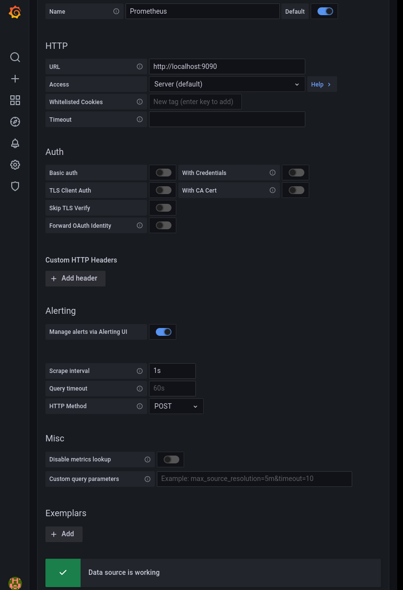

= Monitor OptaPlanner solvers through Micrometer
Christopher-Chianelli
2021-10-12
:page-interpolate: true
:jbake-type: post
:jbake-tags: monitoring, production
:jbake-social_media_share_image: GrafanaGraphExample.png

It's 11 PM on Friday evening. Everything was working fine -- until now.
Suddenly services are failing left and right, and your boss wants to know why.
One tool in achieving a diagnosis is to use a monitoring system. Let's enable monitoring to the OptaPlanner nodes and see if we can diagnose this issue.

== What is monitoring?

_Monitoring_ is observing the quality of a service over time.
Monitoring is similar to logging, except its output is more easily analyzed by a machine and can be aggregated across multiple nodes.
The software being monitored outputs _metrics_, a numerical measurement of some aspect of the software.
The metrics are then recorded in a monitoring system, where they can be graphed, trigger alerts, and be correlated with events.

For instance, you can monitor an OptaPlanner service.
You can check how many solvers ran last night, and how many are currently running.
If you notice the count is higher than usual, than maybe the failures are caused by CPU starvation since OptaPlanner utilizes most of the CPU.
Additionally, you can also check how long each solver ran.
If a solver ran abnormally long or short, there might be an anomaly that should be investigated.
You might also want to check if the solver threw any errors. Perhaps the issue is caused by bad data being passed to the solver.

== Connecting monitoring systems to OptaPlanner

OptaPlanner uses https://micrometer.io/[Micrometer] to collect its metrics.
Micrometer then sends the metrics to different monitoring systems using _registries_.
Every monitoring system supported by Micrometer has its own registry.
In Quarkus, to connect OptaPlanner to https://prometheus.io/[Prometheus], you would add its extension as a dependency in the `pom.xml`:

[source,xml]
----
<dependency>
  <groupId>io.quarkus</groupId>
  <artifactId>quarkus-micrometer-registry-prometheus</artifactId>
</dependency>
----

In Spring Boot, add the Spring Boot actuator to your project along with the registry dependency:

[source,xml]
----
<dependency>
  <groupId>org.springframework.boot</groupId>
  <artifactId>spring-boot-starter-actuator</artifactId>
</dependency>
<dependency>
  <groupId>io.micrometer</groupId>
  <artifactId>micrometer-registry-prometheus</artifactId>
</dependency>
----
and enable the metrics endpoint in `application.properties`:
[source,properties]
----
management.endpoints.web.exposure.include=metrics,prometheus
----

For information on how to connect Micrometer to other monitoring systems, visit https://micrometer.io/docs[the Micrometer documentation].

== Monitoring the Solver

Now that we know what monitoring is and how it can be useful, let's walk through an actual example.
We'll be running a modified version of the https://github.com/kiegroup/optaplanner-quickstarts/tree/stable/use-cases/school-timetabling[school timetabling quickstart] with support for multitenancy.
You can find the complete source code, along with scripts for running it on the https://github.com/Christopher-Chianelli/optaplanner-micrometer-blog[optaplanner-micrometer-blog] GitHub page.

== Starting the application

Clone the example code:

[source,bash]
----
git clone https://github.com/Christopher-Chianelli/optaplanner-micrometer-blog
cd optaplanner-micrometer-blog
----

Start the application in development mode:

[source,bash]
----
mvn quarkus:dev
----

After the application is started, you can access the application at http://localhost:8080.
To see available metrics for the application, visit http://localhost:8080/q/metrics.

image:ExampleMonitoringApp.png[Example Application]

== Starting Prometheus

Prometheus has a prebuilt Docker image on Dockerhub that can be used for running Prometheus.
We'll need to modify its configuration so it'll scrape our metrics endpoint.

Create the `prometheus.yml` file with the following text:

[source,yaml]
----
scrape_configs:
- job_name: local application
  scrape_interval: 1s
  metrics_path: /q/metrics
  static_configs:
  - targets:
    - localhost:8080
----

This configures Prometheus to scrape metrics from `localhost:8080/q/metrics` every second.

Start Prometheus with the preceding configuration:

[source,bash]
----
docker run \
    --network host \
    --mount type=bind,source=prometheus.yml,destination=/etc/prometheus/prometheus.yml,ro=true,relabel=shared \
     prom/prometheus
----

You can see the Prometheus UI by visiting http://localhost:9090.

image::PrometheusUI.png[Prometheus UI]

== Starting Grafana

https://grafana.com/[Grafana] provides a much more robust UI with additional features.
Grafana has a prebuilt image on Dockerhub that you can use to run Grafana locally. Start it using the following command:

[source,bash]
----
docker run --network host grafana/grafana
----

It might take a while to start.
After it starts, visit http://localhost:3000 to see the Grafana UI.
Log in with the username "admin" and the password "admin".

== Connecting Grafana to Prometheus

. Click the Gear icon to go to the Configuration page.
. Click the "Add data source" button.
. Select "Prometheus".
. Enter "http://localhost:9090" for the URL field.
. (Optional) Set the Scrape Interval to be equal to the one set for Prometheus (1s).
. Click "Save & Test".

If it is set up correctly, a green textbox will appear above "Save & Test" with text "Data source is working".

== Create a dashboard to monitor metrics

With all that setup, we can finally graph some metrics.

. Click the "+" icon on the left sidebar.
. Click "Add an empty panel".
. Beneath "A", in the text box to the right of "Metrics", enter "optaplanner_solver_solve_duration_seconds_active_count". This adds a graph for the number of active solvers. It might say "No data" if no solvers were started yet.
. Click the clock icon in the top right, and select "Last 15 minutes" under "Relative time range". This makes the dashboard show data that occurred during the past 15 minutes.

Go to "http://localhost:8080" and start some solvers. Use the "School Id" selector to change schools, and click the "Solve" button to start solving the current school timetable.

The dashboard should display a graph similar to this one depending on how many solvers were started:

image::GrafanaGraphExample.png[Grafana Graph]

== Metrics available

Beside "optaplanner_solver_solve_duration_seconds_active_count", there are several other metrics available by default:

- optaplanner_solver_errors_total: the total number of errors that occurred while solving since the start of the measuring.

- optaplanner_solver_solve_duration_seconds_max: run time of the longest-running currently active solver.

- optaplanner_solver_solve_duration_seconds_duration_sum: the sum of each active solver’s solve duration. For example, if there are two active solvers, one running for three minutes and the other for one minute, the total solve time is four minutes.

In 8.12.0.Final and above, additional metrics can be configured by adding a `<monitoring>` section to the solver config:

[source,xml]
----
<?xml version="1.0" encoding="UTF-8"?>
<solver xmlns="https://www.optaplanner.org/xsd/solver" xmlns:xsi="http://www.w3.org/2001/XMLSchema-instance"
        xsi:schemaLocation="https://www.optaplanner.org/xsd/solver https://www.optaplanner.org/xsd/solver/solver.xsd">
  <monitoring>
    <metric>BEST_SCORE</metric>
    <metric>CONSTRAINT_MATCH_TOTAL_BEST_SCORE</metric>
    <!-- ... -->
  </monitoring>
</solver>
----

For more infomation about OptaPlanner monitoring support, see the https://docs.optaplanner.org/latest/optaplanner-docs/html_single/index.html#monitoring[Monitoring] section of the OptaPlanner documentation.

== What next?

This tutorial covers the basics of what you can do with Grafana. Additional things you can do:

- https://grafana.com/docs/grafana/latest/alerting/old-alerting/create-alerts/[Create alerts that trigger whenever a certain condition is met]
- https://grafana.com/docs/grafana/latest/panels/transformations/[Perform transformations on queries]
- https://grafana.com/docs/grafana/latest/visualizations/[Visualize data in a variety of graphs and charts]

== Conclusion

Monitoring systems are a helpful tool for diagnosing and alerting us to issues.
https://www.optaplanner.org/[OptaPlanner] integrates with monitoring systems using https://micrometer.io/[Micrometer], providing useful metrics such as active solver count.
One example of a monitoring system is https://prometheus.io/[Prometheus], which scrape metrics from an endpoint.
https://grafana.com/[Grafana] is an analytics visualization platform that allows us to visualize data and create alerts when certain conditions are met.
As always, the complete source code for this example is https://github.com/Christopher-Chianelli/optaplanner-micrometer-blog[available on GitHub].
