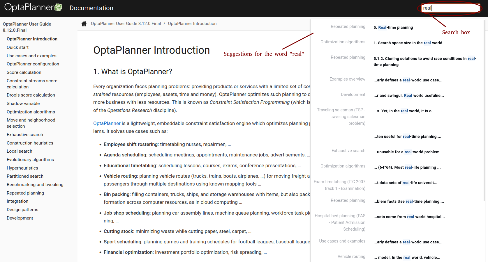
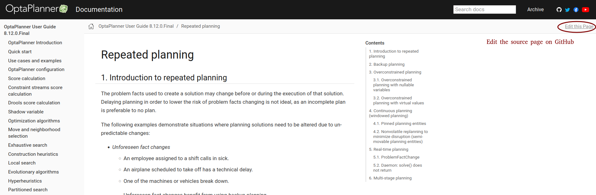
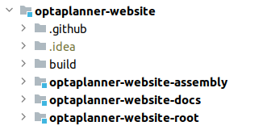

= OptaPlanner documentation turns over a new leaf
rsynek
2021-10-26
:page-interpolate: true
:jbake-type: post
:jbake-tags: documentation, website
:jbake-social_media_share_image: DocsSearch.png

For years, https://www.optaplanner.org[OptaPlanner] has been offering the documentation in two formats:
single-page HTML and PDF.
This now changes with the launch a new documentation website, built using https://antora.org/[Antora].

What's so exciting about the new documentation?

First and foremost, it loads instantly as opposed to the old single-page HTML documentation.
For example, if I want to read about _repeated planning_,
I open the single-page HTML docs and wait nearly half a minute for the page to load, despite having a very good cable connection.
With the new documentation, it took me only 2 seconds as each chapter has its own HTML page and thus
the content that has to be loaded is limited.

This also means it's now easier to effectively share links to a particular section.

Second, now you can search through the entire docs:

The search box at the top of the page shows suggestions as soon as you start typing. Each suggestion consists of
the chapter and a link to where the search term occurs.

Third, if you spot a discrepancy in the documentation and would like to improve it, contributing was never easier:

Finally, this new documentation website is much friendlier to search engines, which should make it show up in Google search results more often than before.

== Building the documentation website

The documentation sources remain in
the https://github.com/kiegroup/optaplanner/tree/main/optaplanner-docs[optaplanner-docs module in the optaplanner repository],
but the website assembly, named `optaplanner-website-docs`, became a part of the https://github.com/kiegroup/optaplanner-website[optaplanner-website]:

Similarly to the entire `optaplanner-website`, the `optaplanner-website-docs` is built using Maven. The Maven module
acts as a wrapper over Antora, which generates the static site from AsciiDoc sources.

There are two Antora playbooks referring to documentation sources. The first one, used by default, is `antora-playbook.yml`
that refers to the latest OptaPlanner release.

[source,yaml]
----
...
content:
  edit_url: '{web_url}/edit/main/{path}'
  sources:
    - url: git@github.com:kiegroup/optaplanner.git
      # Updates with every release to point to the latest release branch.
      branches: [8.12.x]
      start_path: optaplanner-docs/src
...
----

To render the latest documentation:

. `cd optaplanner-website/optaplanner-website-docs`
. `mvn clean package`
. Open the `index.html` located in `target/website/docs` in your browser.

The second Antora playbook, `antora-playbook-author.yml`, is activated by the `author` maven profile and
refers to the current optaplanner local Git repository HEAD.

[source,yaml]
----
...
content:
  edit_url: '{web_url}/edit/main/{path}'
  sources:
    # Assuming the optaplanner local repository resides next to the optaplanner-website.
    - url: ../../optaplanner
      branches: [HEAD]
      start_path: optaplanner-docs/src
...
----

To preview local changes in the documentation:

. Make sure the optaplanner and optaplanner-website Git repositories are located in the same directory or change the local URL accordingly.
. `cd optaplanner-website/optaplanner-website-docs`
. `mvn clean package -Pauthor`
. Open the `index.html` located in `target/website/docs` in your browser.

== Supported documentation formats

Introducing new formats does not have to result in abandoning the old ones, and in our case it does not.
While I encourage everyone to visit the new documentation website, the existing formats continue to be published with
every release as before.

Also, should you need to have a look at a particular version of the documentation,
it's still at your hand in the https://docs.optaplanner.org/[archive].

== Conclusion

Since the `8.12.0.Final` release, there is a new documentation website available under https://www.optaplanner.org/docs.
The documentation is now structured into pages by chapters and searchable. The single-page HTML and PDF documentation
remains available for every release.