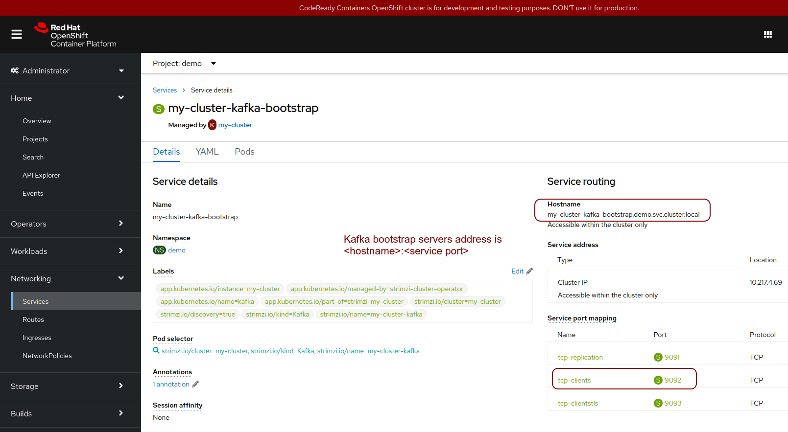
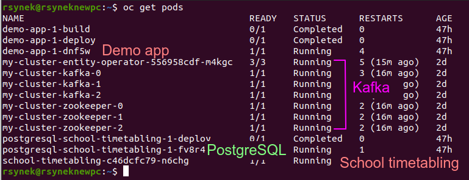
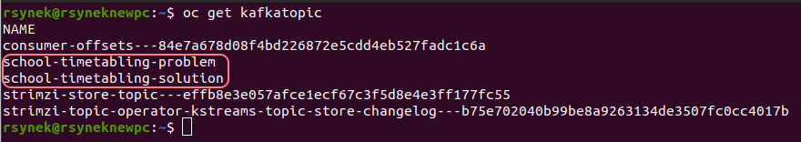

= Run OptaPlanner workloads on OpenShift, part I.
rsynek
2022-06-09
:page-interpolate: true
:jbake-type: post
:jbake-tags: cloud, openshift, kubernetes

After you have defined the problem domain model, implemented constraints and benchmarked the best configuration
for your planning problem, you might be thinking that you are done. In fact, yet another fun is just about to begin.

OptaPlanner does not exist in an isolated world of ready-to-be-executed datasets.
You have to deploy the solver project to the target environment, these days likely some kind of cloud platform.
Another question immediately pops up in one's mind: can OptaPlanner leverage the cloud platform and scale horizontally?

Recently, we have added a new (experimental) `optaplanner-operator` module that will simplify running OptaPlanner workloads
on Kubernetes.

In this article I am going to show how to use the OptaPlanner Operator to deploy and scale a school timetabling solver on https://www.redhat.com/en/technologies/cloud-computing/openshift[OpenShift].

The source code is available in the https://github.com/kiegroup/optaplanner-quickstarts/tree/development/technology/kubernetes[Kubernetes demo],
along with the other https://github.com/kiegroup/optaplanner-quickstarts[Optaplanner Quickstarts].

== Architecture

image::demoArchitecture.svg[OpenShift demo architecture diagram]

The demo consists of two projects - the School Timetabling, which defines the optimization problem, and the Demo App,
which generates datasets and sends requests to the School Timetabling. Both these projects are https://quarkus.io/[Quarkus] applications.

These two parts communicate via Kafka topics created by the OptaPlanner Operator: the `school-timetabling-problem`
and the `school-timetabling-solution`. The Demo App stores a dataset into the PostgreSQL database and sends a message
to the `school-timetabling-problem` topic. The School Timetabling reads the message, loads the dataset from the database
and solves it. After that, it stores the solution back to the database and sends a message to the `school-timetabling-solution`
topic to let the Demo App know the solution is ready for taking.

=== Solver Operator

The OptaPlanner Operator is a Quarkus application developed on top of the https://javaoperatorsdk.io[Java Operator SDK].
Its job is to ensure all the Kubernetes resources needed by the solver are in place: it creates Kafka topics and a deployment that
runs the solver project, in this case, the School Timetabling.

== Running the demo

=== Get your environment running

Use an existing OpenShift cluster or download and start the https://developers.redhat.com/products/codeready-containers/overview[RedHat CodeReady Containers].

WARNING: Be sure to pick the _Red Hat OpenShift Local_, as the other option, the _Developer Sandbox for Red Hat OpenShift_ does not
allow installing new operators.

The CodeReady Containers need more resources to run this demo. Before starting the local cluster, increase the available memory
at least to 16 384 MiB by running `crc config set memory 16384`.

Next, install the https://docs.openshift.com/container-platform/latest/cli_reference/openshift_cli/getting-started-cli.html[OpenShift CLI (`oc`)]
to be able to interact with the OpenShift cluster.

Login as a user with the `cluster-admin` role using the `oc login` command.

[#installStrimzi]
=== Install Strimzi

The OptaPlanner Operator uses https://strimzi.io/[Strimzi] to create Kafka topics, thus, as the first step, install
Strimzi to your OpenShift instance.

. in the OpenShift console, navigate to the menu _Operators -> Operator Hub_. Find the _Strimzi_ operator and install it
. now, create a new `demo` project by running `oc new-project demo`
. open the _Strimzi_ operator, select the _Kafka_ tab and create a new Kafka cluster. You will need the Kafka cluster name
to create the `Solver` custom resource later

NOTE: The Strimzi topic operator watches the project the Kafka cluster resides in. The rule of thumb is to create
a separate project that contains the Solver resource together with its dependent resources, like Kafka cluster and topics.
For additional options, please refer to https://strimzi.io/documentation/[Strimzi documentation].

=== Deploy the OptaPlanner Operator

The OptaPlanner operator is Quarkus application developed on top of the https://javaoperatorsdk.io. As such,
it's container image can be built and pushed directly to OpenShift using the
https://quarkus.io/guides/deploying-to-openshift[`io.quarkus:quarkus-openshift` extension].

. create the `optaplanner-operator` project by running `oc new-project optaplanner-operator`
. run `mvn clean package -Dopenshift`
. apply the generated CRD by running `oc create -f target/kubernetes/solvers.org.optaplanner.solver-v1.yml`
. apply the prepared template by running `oc apply -f src/k8s/openshift.yml`

TIP: If you encounter the `Caused by: javax.net.ssl.SSLHandshakeException: sun.security.validator.ValidatorException: PKIX path building failed` exception due to self-signed certificate during the build, add the `-Dquarkus.kubernetes-client.trust-certs=true` property.

=== Deploy the Demo App

The Demo App also relies upon the `quarkus-openshift` extension to deploy to OpenShift. The extension also picks up additional
resources defined in the `src/main/kubernetes/openshift.yml`; in this case, there is a template that creates
the PostgreSQL database to store input problems and solutions.

. change directory to `demo-app`
. create new project called _demo_ by running `oc new-project demo`
. deploy the demo-app via a maven command: `mvn clean package -Dopenshift -Dquarkus.openshift.namespace=demo -Dquarkus.openshift.env.vars.kafka-bootstrap-servers=<kafka bootstrap servers address>`

The `-Dquarkus.openshift.env.vars.kafka-bootstrap-servers` property results in an environment variable `KAFKA_BOOTSTRAP_SERVERS`
in the running container, which Quarkus converts to the `kafka.bootstrap.servers` property, effectively overriding the
`kafka.bootstrap.servers=localhost:9092` in the `application.properties`.

TIP: If you encounter the `Caused by: javax.net.ssl.SSLHandshakeException: sun.security.validator.ValidatorException: PKIX path building failed` exception due to self-signed certificate during the build, add the `-Dquarkus.kubernetes-client.trust-certs=true` property.

To find the address of the Kafka bootstrap servers:

. login to the OpenShift UI console
. open the _openshift-operators_ project and navigate to _Networking -> Services_
. open the _<kafka-cluster-name>-kafka-bootstrap_ service and notice its hostname and service port mapping for TCP clients under the _Service routing_ section
. the address is a compound of the `<hostname>:<service port>`

=== Create the school-timetabling solver

Now, when all the other pieces of the puzzle are already in place, it's time to make the school-timetabling running.

[#buildSolverImage]
==== Build and push the school-timetabling container image

In order for the OptaPlanner Operator to create a deployment of the solver project, you need to push it to any container image registry accessible
by your OpenShift instance.

Quarkus comes in handy again, this time with one of the https://quarkus.io/guides/container-image[Quarkus container image extensions], which
builds a container image locally and pushes it to a container image registry.

Build and push the School Timetabling container image to a registry of your choice:

. change directory to `school-timetabling`
. run `mvn clean package -Dopenshift -Dquarkus.container-image.group=<image group> -Dquarkus.container-image.registry=<container registry>
-Dquarkus.container-image.username=<container registry username> -Dquarkus.container-image.password=<container registry password>`

The container registry in the command above is a repository used to store and access container images (e.g. docker.io) and the image group is an organization or a personal account in that registry.

[TIP]
.Pushing an image to a container image registry
====
You can use https://quay.io[quay.io] as a container image registry.

. open https://quay.io in the browser and login with your Red Hat account
. create a new repository called _school-timetabling_, switch its visibility to _Public_ and click the _Create Public Repository_ button
. the image is identified by quay.io/<login>/<image name>:<tag>
====

==== Create the Solver custom resource

The Solver custom resource describes the problem to solve on OpenShift and the infrastructure it requires.
In this case, the `Solver` custom resource might look like follows:

[source yaml]
----
apiVersion: org.optaplanner.solver/v1
kind: Solver
metadata:
  name: school-timetabling <1>
spec:
  kafkaCluster: my-cluster <2>
  kafkaBootstrapServers: my-cluster-kafka-bootstrap.demo.svc.cluster.local:9092 <3>
  solverImage: quay.io/example/school-timetabling:latest  <4>
  scaling:
    replicas: 1 <5>
----

<1> the solver name
<2> the name of the Kafka cluster created during the <<#installStrimzi, Strimzi installation>>
<3> Kafka bootstrap servers address
<4> the school-timetabling container image <<#buildSolverImage, built and pushed>> to a registry of your choice
<5> the number of running school-timetabling pods

Create the `Solver` resource via `oc apply -f <file>`.

Let's check the active pods in the `demo` project by running the `oc get pods` command:

To see what Kafka topics there are in the `demo` project, run `oc get kafkatopic`:

Both the `school-timetabling-problem` and `school-timetabling-solution` have been created and there is
a single running `school-timetabling` pod.

The nice thing about this architecture is that if you have another planning problem, you just create a new Solver resource
pointing to a different container image and you get a separate deployment and a separate pair of the problem-solution topics.

=== Run the demo-app

. find out the Demo App address by running `oc get route`; see the _HOST/PORT_ column of its output
. open the address in the browser
. change the number of lessons, if needed, and click the _Create & send_ button

=== Scaling the School Timetabling

To be able to solve multiple datasets in parallel, we have to start mode School Timetabling pods and increase the number
`school-timetabling-problem` partitions.
The property `mp.messaging.incoming.solver_in.group.id=default` in the `school-timetabling/src/resources/application.properties` ensures that each pod belongs to the same consumer group, and thus may consume different messages from the same topic.

Both these conditions are met be updating the number of replicas of the Solver resource:

[source yaml]
----
apiVersion: org.optaplanner.solver/v1
kind: Solver
metadata:
  name: school-timetabling
spec:
  ...
  scaling:
    replicas: 3
----

. delete the existing solver resource via `oc delete solver school-timetabling`
. create the updated Solver resource via `oc apply -f <file>`
. check if the `school-timetabling-problem` Kafka topic now has 3 partitions via `oc get kafkatopic school-timetabling-problem`
. check if there are 3 running School Timetabling pods via `oc get pod`

In the Demo App, create and send multiple datasets.
Check the logs of individual School Timetabling pods by running `oc logs <pod name>` to find out whether they solved some datasets.
The following messages should appear in the logs for each solver dataset:

----
2022-05-27 11:12:21,336 INFO  [org.opt.cor.imp.sol.DefaultSolver] (Thread-3) Solving started: time spent (76), best score (-80init/0hard/0soft), environment mode (REPRODUCIBLE), move thread count (NONE), random (JDK with seed 0).
...
2022-05-27 11:12:31,249 INFO  [org.opt.cor.imp.sol.DefaultSolver] (Thread-3) Solving ended: time spent (10001), best score (0hard/18soft), score calculation speed (40162/sec), phase total (2), environment mode (REPRODUCIBLE), move thread count (NONE).
----

== Conclusion

OptaPlanner is starting its journey towards Kubernetes and OpenShift.
There is still a lot of things users have to do themselves, things I would like the OptaPlanner Operator to take care of in the future.

Stay tuned, this is just the beginning!