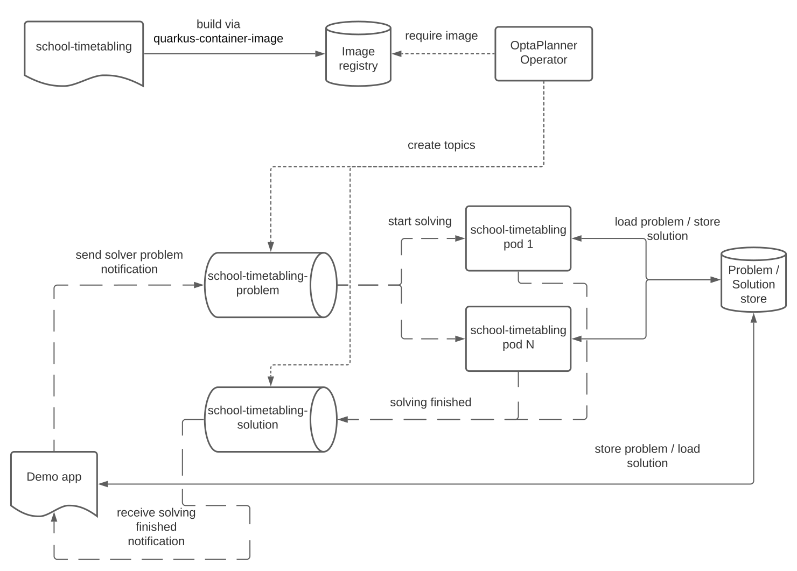

= Run OptaPlanner workloads on OpenShift, part I.
rsynek
2022-06-09
:page-interpolate: true
:jbake-type: post
:jbake-tags: cloud, openshift, kubernetes

Have you ever wondered if OptaPlanner can leverage any cloud platform and scale horizontally?
Recently, we have added a new (experimental) `optaplanner-operator` module that will simplify running OptaPlanner workloads on Kubernetes.

In this article I am going to show how to use the OptaPlanner Operator to deploy and scale https://www.redhat.com/en/technologies/cloud-computing/openshift[school timetabling on OpenShift].

The source code is available in the https://github.com/kiegroup/optaplanner-quickstarts/tree/development/technology/kubernetes[Kubernetes demo],
along with the other https://github.com/kiegroup/optaplanner-quickstarts[Optaplanner Quickstarts].

== Architecture

The demo consists of two projects - the School Timetabling, which defines the optimization problem, and the Demo App,
which generates datasets and asks the School Timetabling to solve them. Both these projects are https://quarkus.io/[Quarkus] applications.

These two parts communicate via Kafka topics created by the OptaPlanner Operator: the `school-timetabling-problem`
and the `school-timetabling-solution`. The Demo App stores a dataset into the PostgreSQL database and sends a message
to the `school-timetabling-problem` topic. The School Timetabling reads the message, loads the dataset from the database
and solves it. After that, it stores the solution back to the database and sends a message to the `school-timetabling-solution`
topic to let the Demo App know the solution is ready for taking.

On the face of it, the PostgreSQL makes the architecture more complex, as the Demo App could have sent the dataset directly in a Kafka message.
However, Kafka has been designed to process huge amounts of small messages, which is not exactly our case.
The datasets, although not coming in millions, might possibly be huge, requiring some sort of storage to be paired up with the Kafka messages.

=== Solver Operator

The OptaPlanner Operator is a Quarkus application developed on top of the https://javaoperatorsdk.io[Java Operator SDK].
Its job is to ensure all the Kubernetes resources needed by the solver are in place: it creates Kafka topics and a deployment that
runs the solver project; in this case, the School Timetabling.

== Running the demo

To run the demo, just clone the https://github.com/kiegroup/optaplanner-quickstarts[Optaplanner Quickstarts] and follow the https://github.com/kiegroup/optaplanner-quickstarts/blob/development/technology/kubernetes/README.adoc[README].

=== Scaling the School Timetabling

Once you've got the demo running and the School Timetabling pod solves datasets you throw at it, it's time to take it a bit further.
Remember, the main reason for deploying all the pieces to OpenShift was to be able to scale horizontally.

To solve multiple datasets in parallel, we have to start more School Timetabling pods and increase the number
`school-timetabling-problem` partitions.
The `spec.scaling.replicas` in the Solver custom resource defines the number of pods and topic partitions.

In order to have multiple consumers reading different messages from the same Kafka topic without duplication, the consumers must belong to the same consumer group.
The property `mp.messaging.incoming.solver_in.group.id=default` in the `school-timetabling/src/resources/application.properties` ensures that each pod belongs to the `default` consumer group.

Let's see how the custom resource changes if we want to have three School Timetabling pods:

[source, yaml]
----
apiVersion: org.optaplanner.solver/v1beta1
kind: Solver
metadata:
  name: school-timetabling
spec:
  ...
  scaling:
    replicas: 3
----

To update the Solver resource:

. delete the existing Solver resource via `oc delete solver school-timetabling`
. create the updated Solver resource via `oc apply -f <file>`
. check if the `school-timetabling-problem` Kafka topic now has 3 partitions via `oc get kafkatopic school-timetabling-problem`
. check if there are 3 running School Timetabling pods via `oc get pod`

In the Demo App, create and send multiple datasets.
Check the logs of individual School Timetabling pods by running `oc logs <pod name>` to find out whether they solved some datasets.
The following messages should appear in the logs for each solver dataset:

----
2022-05-27 11:12:21,336 INFO  [org.opt.cor.imp.sol.DefaultSolver] (Thread-3) Solving started: time spent (76), best score (-80init/0hard/0soft), environment mode (REPRODUCIBLE), move thread count (NONE), random (JDK with seed 0).
...
2022-05-27 11:12:31,249 INFO  [org.opt.cor.imp.sol.DefaultSolver] (Thread-3) Solving ended: time spent (10001), best score (0hard/18soft), score calculation speed (40162/sec), phase total (2), environment mode (REPRODUCIBLE), move thread count (NONE).
----

== Conclusion

OptaPlanner is starting its journey towards Kubernetes and OpenShift.
The nice thing about the outlined architecture is that if you have another planning problem, you just create a new Solver resource  pointing to a different container image, and you get a separate deployment and a separate pair of the problem-solution topics.

There is still a lot of things users have to do themselves, things I would like the OptaPlanner Operator to take care of in the future.

Stay tuned, this is just the beginning!
