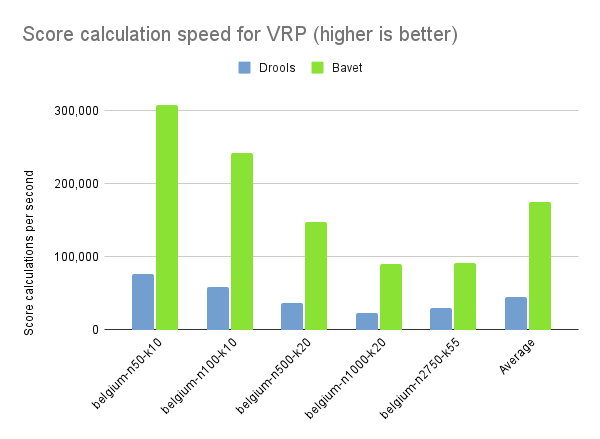
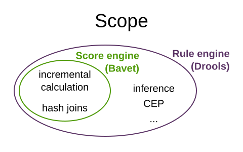
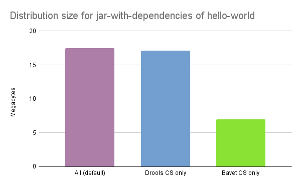

= Bavet - A faster score engine for OptaPlanner
ge0ffrey
2022-09-01
:page-interpolate: true
:jbake-type: post
:jbake-tags: performance, benchmark, constraint streams
:jbake-social_media_share_image: ruleEngineScoreEngineScope.png

Drools is an extremely fast _rule engine_.
Under the hood, OptaPlanner has used Drools as a _score engine_ for ages.
Today, we're announcing *a faster, lightweight alternative*: Bavet.

Bavet is a feature of OptaPlanner. It is *not a rule engine*.
It is a pure, single-purpose, incremental *score calculation implementation*
of the https://www.optaplanner.org/blog/2020/04/07/ConstraintStreams.html[ConstraintStreams API].
Bavet is _feature complete_ as of OptaPlanner `8.27.0.Final`.
You can switch from Drools to Bavet in a single line of code.

Twice as fast score calculation. Zero API changes.

== Faster

For 20 diverse use cases, we compared Bavet and Drools for OptaPlanner score calculation.
We ran JMH benchmarks
on OpenJDK 17 (`ParallelGC`, `Xmx1G`)
on a stable benchmark machine (`Intel® Xeon® Silver (12 cores total / 24 threads)` and `128 GiB` RAM memory)
without any other computational demanding processes running.

On average, *Bavet is twice as fast as Drools* for score calculation.
In the https://www.optaplanner.org/learn/useCases/vehicleRoutingProblem.html[Vehicle Routing Problem],
Bavet is even three times as fast as Drools:

// TODO Update table, put Drools first, percentage -= 100, switch rows/columns?

// TODO Graph!

.Score calculation speed on different use cases
|===
|Use case |Bavet |Drools |Speed up +100%

|cheaptime >|18,270 >|7,949 >|230%
|cloudbalancing >|822,613 >|245,069 >|336%
|coachShuttleGathering >|134,522 >|47,455 >|283%
|conferenceScheduling >|1,566 >|1,534 >|102%
|curriculumCourse >|56,685 >|54,021 >|105%
|examination >|28,260 >|20,130 >|140%
|flightCrewScheduling >|186,906 >|163,184 >|115%
|investment >|606,111 >|127,119 >|477%
|machineReassignment >|28,678 >|21,204 >|135%
|meetingscheduling >|3,034 >|4,181 >|73%
|nQueens >|419,201 >|309,581 >|135%
|nurserostering >|33,123 >|17,460 >|190%
|pas >|59,049 >|79,651 >|74%
|projectjobscheduling >|128,209 >|41,125 >|312%
|rockTour >|282,508 >|62,018 >|456%
|taskAssigning >|31,814 >|15,733 >|202%
|tennis >|407,459 >|168,607 >|242%
|travelingtournament >|118,370 >|72,143 >|164%
|tsp >|435,091 >|284,803 >|153%
|vehicleRouting >|38,686 >|12,565 >|308%
|*Average* >|192,008 >|87,777 >|205%
|===

Bavet is faster than Drools for almost every use case.
Of course, your mileage may vary.
Turn on Bavet and if it's not faster in your use case, https://groups.google.com/g/optaplanner-dev[let us know].

Drools and Bavet are both still improving.
And we have some crazy ideas for a nextgen score calculation implementation
that uses https://github.com/quarkusio/gizmo[Gizmo]
to generate domain-specific Bavet-like nodes.
This performance race is far from over.

== Scaling

Does Bavet scale well?

On commodity hardware, we ran a 5 minutes VRP benchmark on different dataset sizes,
to compare how Drools and Bavet scale up:

.Score calculation speed on different dataset sizes of VRP
|===
| >|belgium-n50-k10 >|belgium-n100-k10 >|belgium-n500-k20 >|belgium-n1000-k20 >|belgium-n2750-k55 >|Average

|Drools >|76,919/s >|58,365/s >|36,609/s >|23,394/s >|29,770/s >h|45,011/s
|Bavet >|307,290/s >|242,400/s >|147,595/s >|89,850/s >|91,115/s >h|175,650/s
|Speed up >|+299.50% >|+315.32% >|+303.17% >|+284.07% >|+206.06% >h|+290.24%
|===

Same story, but the performance gap does close as the scale goes up.

== Not a rule engine

*Bavet is _not_ a rule engine.*
It deliberately doesn't support _inference_, nor Complex Event Processing (CEP),
nor other common business rule engine features:

OptaPlanner only requires a score engine.
Its Drools implementation only uses a small subset of Drools's features.
Bavet on the other hand, is a score engine tailored to OptaPlanner.
It's part of OptaPlanner. It has no use outside of OptaPlanner.

For incremental score calculation, Bavet borrows techniques from https://en.wikipedia.org/wiki/Rete_algorithm[the RETE algorithm]
and Drools's Phreak algorithm.
For example, the https://github.com/kiegroup/optaplanner/blob/main/core/optaplanner-constraint-streams-bavet/src/main/java/org/optaplanner/constraint/streams/bavet/common/AbstractJoinNode.java[JoinNode in Bavet]
contains `insert()`, `update()` and `retract()`  methods.
But below the surface, it's a very different implementation.
Compare it with the method signatures of similar methods in the https://github.com/kiegroup/drools/blob/main/drools-core/src/main/java/org/drools/core/phreak/PhreakJoinNode.java[JoinNode in Drools].

== History and naming

I created Bavet as a https://github.com/ge0ffrey/bavet-experiment[POC] in 2019
and added it into OptaPlanner as an experimental, fast, incomplete feature.
There it sat frozen. For 3 years.
Until recently, when Lukáš Petrovický and me completed all missing features
and refactored it to the performance sensation is today.

Naming wise, _bavet_ is a Flemish (Dutch) slang word for a _bib_.
Very useful if your baby is drooling.
I came up with that name when we were eating with our kids at a spaghetti restaurant called Bavet,
while facing this mural:

Ok, maybe I didn't put much effort into that.

But it doesn't really need a good name.
It's just one of OptaPlanner's score calculation options.
An implementation detail, really.

== Stability

We believe Bavet is very stable.
We successfully run our 48+ hours stress tests on Bavet regularly.
These stress tests stomp out score corruption by solving a lot of datasets across many use cases.

== More lightweight

In OpenShift and Kubernetes clouds, the size of pods matter.
By using Bavet, you can slim down OptaPlanner's classpath
to exclude the Drools dependencies.

On the OptaPlanner https://github.com/kiegroup/optaplanner-quickstarts/tree/stable/hello-world[hello-world quickstart],
a Maven assembly of `jar-with-dependencies` is 60% smaller with Bavet only:

.Distribution size of jar-with-dependencies on OptaPlanner's hello-world
[cols="2,>1,>1,4"]
|===
|Core dependencies |Size |Reduction |Core exclusions

|All (default) |17.5{nbsp}MB |0% |none
|Drools CS only |17.1{nbsp}MB |-2% |`optaplanner-constraint-drl`, `optaplanner-constraint-streams-bavet`
|Bavet CS only |7.0{nbsp}MB |-60% |`optaplanner-constraint-drl`, `optaplanner-constraint-streams-drools`
|===

By default, `optaplanner-core` includes both Drools and Bavet,
so you have to explicitly exclude it in Maven or Gradle:

[source, xml]
----
    <dependency>
      <groupId>org.optaplanner</groupId>
      <artifactId>optaplanner-core</artifactId>
      <exclusions>
        <exclusion>
          <groupId>org.optaplanner</groupId>
          <artifactId>optaplanner-constraint-drl</artifactId>
        </exclusion>
        <exclusion>
          <groupId>org.optaplanner</groupId>
          <artifactId>optaplanner-constraint-streams-drools</artifactId>
        </exclusion>
      </exclusions>
    </dependency>
----

This reduces `optaplanner-core` from 42 to 17 transitive dependencies.
Specifically, all these jars are removed from your classpath:

[source]
----
\- org.optaplanner:optaplanner-constraint-streams-drools:...
   +- org.drools:drools-engine:...
   |  +- org.kie:kie-api:...
   |  +- org.kie:kie-internal:...
   |  +- org.drools:drools-core:...
   |  |  +- org.kie:kie-util-xml:...
   |  |  +- org.drools:drools-wiring-api:...
   |  |  +- org.drools:drools-wiring-static:...
   |  |  +- org.drools:drools-util:...
   |  |  \- commons-codec:commons-codec:...
   |  +- org.drools:drools-wiring-dynamic:...
   |  +- org.drools:drools-kiesession:...
   |  +- org.drools:drools-tms:...
   |  +- org.drools:drools-compiler:...
   |  |  +- org.drools:drools-drl-parser:...
   |  |  +- org.drools:drools-drl-extensions:...
   |  |  +- org.drools:drools-drl-ast:...
   |  |  +- org.kie:kie-memory-compiler:...
   |  |  +- org.drools:drools-ecj:...
   |  |  +- org.kie:kie-util-maven-support:...
   |  |  \- org.antlr:antlr-runtime:...
   |  +- org.drools:drools-model-compiler:...
   |  |  \- org.drools:drools-canonical-model:...
   |  \- org.drools:drools-model-codegen:...
   |     +- org.drools:drools-codegen-common:...
   |     +- com.github.javaparser:javaparser-core:...
   |     +- org.drools:drools-mvel-parser:...
   |     \- org.drools:drools-mvel-compiler:...
   \- org.drools:drools-alphanetwork-compiler:...
----

Bavet (`optaplanner-constraint-streams-bavet`) has no transitive dependencies
(except for `optaplanner-constraint-streams-common`).

== Try it out

First upgrade to OptaPlanner `8.27.0.Final` or later, if you haven't already.
If you're using the deprecated `scoreDRL` approach, https://www.optaplanner.org/download/upgradeRecipe/drl-to-constraint-streams-migration.html[migrate from scoreDRL to constraint streams] first.

*By default, OptaPlanner still uses Drools for constraint streams.*
To use Bavet instead, explicitly switch the `ConstraintStreamImplType` to `BAVET`:

=== Plain Java

Switch to Bavet in either your `*.java` file:

[source, java]
----
SolverFactory<TimeTable> solverFactory = SolverFactory.create(new SolverConfig()
        ...
        .withConstraintStreamImplType(ConstraintStreamImplType.BAVET)
        ...);
----

or in your `solverConfig.xml`:

[source, xml]
----
  <scoreDirectorFactory>
    ...
    <constraintStreamImplType>BAVET</constraintStreamImplType>
  </scoreDirectorFactory>
----

=== Quarkus

Switch to Bavet in `src/main/resources/application.properties`:

[source, java]
----
quarkus.optaplanner.solver.constraintStreamImplType=BAVET
----

=== Spring

Switch to Bavet in `src/main/resources/application.properties`:

[source, java]
----
optaplanner.solver.constraintStreamImplType=BAVET
----

== Share your results

Help us out. Try Bavet and *https://groups.google.com/g/optaplanner-dev/c/BqwbHbBJbns[let us know here]
how your _score calculation speed_ changes*.
Look for the score calculation speed in the `INFO` log: it's part of the `Solving ended` message.

== Red Hat support

A Red Hat support subscription will not offer support for Bavet.
Drools intends to catch up performance wise.
