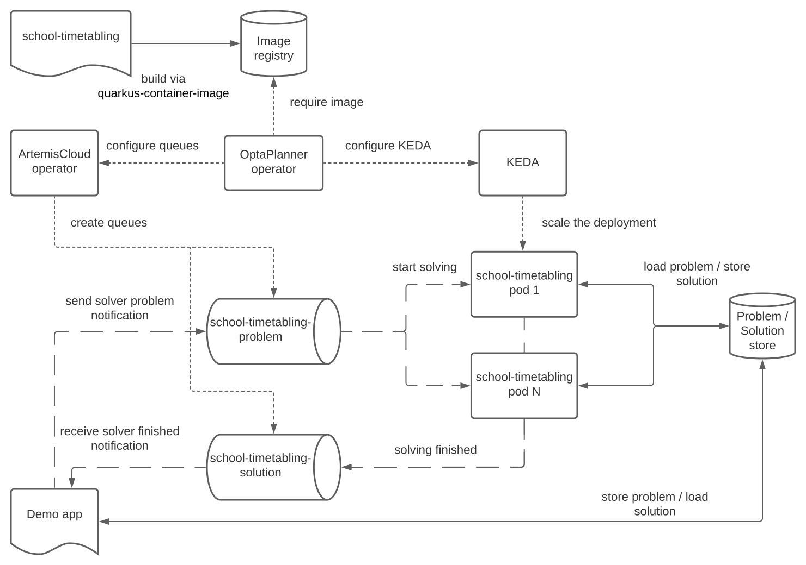

= Run OptaPlanner workloads on OpenShift, part II.
rsynek
2022-09-26
:page-interpolate: true
:jbake-type: post
:jbake-tags: cloud, openshift, kubernetes, scaling

In the first https://www.optaplanner.org/blog/2022/06/09/RunOptaPlannerWorkloadOnOpenShift.html[article about running OptaPlanner workloads on OpenShift],
I've shown how to use the OptaPlanner operator to solve multiple datasets of the same planning problem by starting several pods on OpenShift.

That implementation kept a number of nodes always around, even if they were idle. But why pay the bills for those? Since the previous article, the OptaPlanner operator supports dynamic scaling driven by the number of input datasets.

The https://github.com/kiegroup/optaplanner-quickstarts/tree/development/technology/kubernetes[Kubernetes demo],
based on the https://www.optaplanner.org/learn/useCases/schoolTimetabling.html[school timetabling] use case,
has been updated to show the dynamic scaling.

== Architecture

The architecture has evolved, replacing some existing components and adding a new one, too.

The OptaPlanner operator depends on two other operators: https://artemiscloud.io/[ArtemisCloud] operator, which creates ActiveMQ Artemis broker and queues,
and https://keda.sh/[KEDA] for scaling the solver deployment, represented by the `school-timetabling` pods in the picture.

The Demo App generates datasets, stores them in the PostgreSQL database, and sends a message to the `school-timetabling-problem` queue per each dataset.
The School Timetabling, which defines the optimization problem, reads a single message from the `school-timetabling-problem` queue, loads the dataset
from the database, and solves it. After that, it saves the solution back to the database and sends a message to the `school-timetabling-solution` queue to let the Demo App know that the solution is ready for taking.

=== ActiveMQ

The use case for messaging in this architecture is a shared job queue. ActiveMQ Artemis is a good fit here as it provides the exactly-once delivery.
If a solver pod dies, the ActiveMQ Artemis broker detects a broken connection and redelivers the message to any other available pod.

==== Batch delivery

By default, the ActiveMQ Artemis distributes messages in batches to reduce needless network round trips.
While this is a favorable behavior for large amounts of messages requiring relatively short processing time, our case is different.

We expect fewer messages that, on the other hand, take a long time to process, as it involves optimizing a dataset by OptaPlanner.
Also, we have a different goal; instead of minimizing the latency, we aim to parallelize solving of multiple datasets as much as possible.
Each active solver pod must be solving one dataset at any moment.

Batch message delivery hinders scalability because if the first solver pod prefetches multiple messages, the other pods may sit idle.

The message prefetch is switched off by using the client-side JMS connection parameter `jms.prefetchPolicy.queuePrefetch=0`.
See the `quarkus.qpid-jms.url` property in https://github.com/kiegroup/optaplanner-quickstarts/blob/development/technology/kubernetes/school-timetabling/src/main/resources/application.properties[application.properties] of the School Timetabling.

==== Atomicity

Receiving the input problem message and sending the output message informing that solving has ended must happen in a transaction
to ensure atomicity.
Only when the transaction is committed does the ActiveMQ Artemis broker remove the input problem message from the queue.

[NOTE]
.Use the right tool for the job.

====
In the previous article, Kafka was used to distribute messages representing tasks to solve.
However, Kafka is not a good fit for this scenario.

Every time a new pod is started or deleted as a result of scaling up or down, Kafka reacts by rebalancing
topic partitions among the current consumers. Any message that has not been acknowledged and committed in
the topic partition before the rebalancing starts, is redelivered.

Due to the long processing of every message, the risk of redelivery is high.

That's certainly not the efficiency we strove for.
====

=== KEDA

KEDA is the cornerstone of the dynamic scaling feature.
The KEDA controller observes the input problem queue size, in this case, the `school-timetabling-problem`,
via a REST API of the ActiveMQ Artemis broker and modifies the number of replicas of the `school-timetabling` deployment.

=== OptaPlanner operator

The OptaPlanner operator creates three kinds of Kubernetes resources: Deployment, ActiveMQArtemisAddress, and ScaledObject.

* The Deployment is based on a user-defined container image.
* ActiveMQArtemisAddress resources represent the ActiveMQ queues; it's a responsibility of the ArtemisCloud operator to react when these resources appear and create the corresponding queues within the broker.
* The ScaledObject describes what and how KEDA should scale.

== Running the demo

To run the demo, clone the https://github.com/kiegroup/optaplanner-quickstarts[OptaPlanner Quickstarts] and follow the https://github.com/kiegroup/optaplanner-quickstarts/blob/development/technology/kubernetes/README.adoc[README].

== Conclusion

OptaPlanner operator now supports dynamic scaling of workloads in a shared queue by utilizing ArtemisCloud and KEDA.
