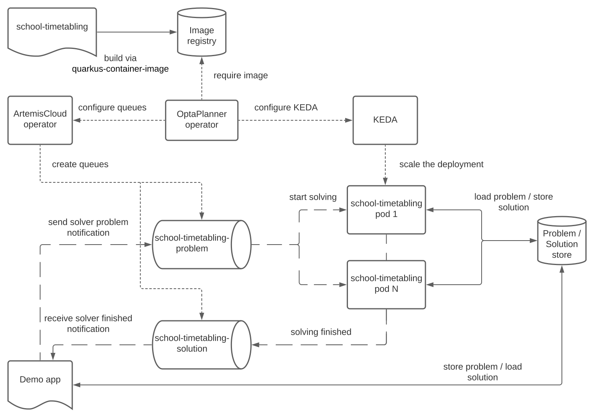

= Run OptaPlanner workloads on OpenShift, part II
rsynek
2022-09-26
:page-interpolate: true
:jbake-type: post
:jbake-tags: cloud, openshift, kubernetes, scaling

In the first https://www.optaplanner.org/blog/2022/06/09/RunOptaPlannerWorkloadOnOpenShift.html[article about running OptaPlanner workloads on OpenShift], I've shown how to use the OptaPlanner operator to solve multiple data sets of the same planning problem by starting several pods on OpenShift.

That implementation required a number of nodes to be retained, even when they were idle. But why pay for unused nodes? Since the previous article, the OptaPlanner operator introduced support for dynamic scaling driven by the number of input datasets.

The https://github.com/kiegroup/optaplanner-quickstarts/tree/development/technology/kubernetes[Kubernetes demo], based on the https://www.optaplanner.org/learn/useCases/schoolTimetabling.html[school timetabling] use case, has been updated to show dynamic scaling.

== Architecture

The OptaPlanner architecture has evolved by replacing some existing components and adding a new component.

The OptaPlanner operator depends on two other operators:

* https://artemiscloud.io/[ArtemisCloud] operator, which creates ActiveMQ Artemis broker and queues
* https://keda.sh/[KEDA] operator for scaling the solver deployment, represented by the `school-timetabling` pods in the picture

The _Demo App_ generates data sets, stores them in the PostgreSQL database, and sends a message to the `school-timetabling-problem` queue per each data set.
The _School Timetabling_ project, which defines the optimization problem, reads a single message from the `school-timetabling-problem` queue, loads the data set from the database, and solves it.
After that, it saves the solution back to the database and sends a message to the `school-timetabling-solution` queue to let the _Demo App_ know that the solution is ready for taking.

=== ActiveMQ

The use case for messaging in this architecture is a shared job queue.
ActiveMQ Artemis is a good fit here as it provides the exactly-once delivery.
If a solver pod becomes unresponsive, the ActiveMQ Artemis broker detects a broken connection and redelivers the message to any other available pod.

==== Batch delivery

By default, the ActiveMQ Artemis distributes messages in batches to reduce needless network round trips.
While this is a favorable behavior for large amounts of messages requiring relatively short processing time, our case is different.

We expect fewer messages that, on the other hand, take a long time to process, as processing each message involves optimizing a data set by OptaPlanner.
Also, we have a different goal; instead of minimizing the latency, we aim to parallelize solving of multiple data sets as much as possible.
Each active solver pod must be solving one data set at any moment.

Batch message delivery hinders scalability because if the first solver pod prefetches multiple messages, the other pods might remain idle.

The message prefetch is switched off by using the client-side JMS connection parameter `jms.prefetchPolicy.queuePrefetch=0`.
See the `quarkus.qpid-jms.url` property in https://github.com/kiegroup/optaplanner-quickstarts/blob/development/technology/kubernetes/school-timetabling/src/main/resources/application.properties[application.properties] of the _School Timetabling_ project.

==== Atomicity

The https://github.com/kiegroup/optaplanner-quickstarts/blob/stable/technology/kubernetes/school-timetabling/src/main/java/org/acme/schooltimetabling/messaging/MessageHandler.java[`MessageHandler`] receives the input problem message and sends the output message informing that solving has ended in a transaction to ensure atomicity.
Only when the transaction is committed does the ActiveMQ Artemis broker remove the input problem message from the queue.

[NOTE]
.Use the right tool for the job.

====
In the previous article, Kafka was used to distribute messages representing tasks to solve.
However, Kafka is not a good fit for this scenario.

Every time a new pod is started or deleted as a result of scaling up or down, Kafka reacts by rebalancing topic partitions among the current consumers.
Any message that has not been acknowledged and committed in the topic partition before the rebalancing starts is redelivered.

Due to the long time processing of every message, the risk of redelivery is high.

That's certainly not the efficiency we strove for.
====

=== KEDA

KEDA is the cornerstone of the dynamic scaling feature.
The KEDA controller observes the input problem queue size, in this case, the `school-timetabling-problem`, through a REST API of the ActiveMQ Artemis broker, and modifies the number of replicas of the `school-timetabling` deployment.

=== OptaPlanner operator

The OptaPlanner operator creates three kinds of Kubernetes resources: _Deployment_, _ActiveMQArtemisAddress_, and _ScaledObject_.

* The _Deployment_ is based on a user-defined container image.
* _ActiveMQArtemisAddress_ resources represent the ActiveMQ queues; it's a responsibility of the ArtemisCloud operator to react when these resources appear and create the corresponding queues within the broker.
* The _ScaledObject_ describes what and how KEDA should scale.

== Running the demo

To run the demo, clone the https://github.com/kiegroup/optaplanner-quickstarts[OptaPlanner Quickstarts] and follow the https://github.com/kiegroup/optaplanner-quickstarts/blob/development/technology/kubernetes/README.adoc[README].

== Conclusion

OptaPlanner operator now supports dynamic scaling of workloads in a shared queue by using ArtemisCloud and KEDA.
