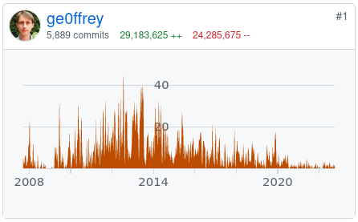

= Farewell - a new lead
ge0ffrey
2022-11-15
:page-interpolate: true
:jbake-type: post
:jbake-tags: community
:jbake-social_media_share_image: ge0ffreyCommits2006-2022.png

It's been a wild ride.
In 2006, I created OptaPlanner as a hobby project.
For 7 years I worked on it in my spare time.
Early 2013, Red Hat commercialized it as _Decision Manager_
and OptaPlanner became my day job. My hobby became my job.
As of today, https://github.com/kiegroup/optaplanner/graphs/contributors[I wrote 85% of the OptaPlanner code].
And all of it is open source.
Red Hat is truly an amazing company to work for.

Here's how 16 years of coding looks like:

In 2019, IBM acquired Red Hat.
Early this year, https://access.redhat.com/articles/6968468[Decision Manager moved to IBM].
OptaPlanner has now found a new home in Red Hat,
following a new path in Application Foundations and OpenShift.

My path lies elsewhere.

I 've decided to leave Red Hat, to focus on solving and optimizing business problems.
So, I am passing the OptaPlanner lead role to *Lukáš Petrovický*,
our talented, smart, long-term core developer.
He'll do great.

Of course, I 'll still be active in the community.
Don't hesitate to contact me on https://twitter.com/GeoffreyDeSmet[Twitter] or https://www.linkedin.com/in/ge0ffrey[LinkedIn].
