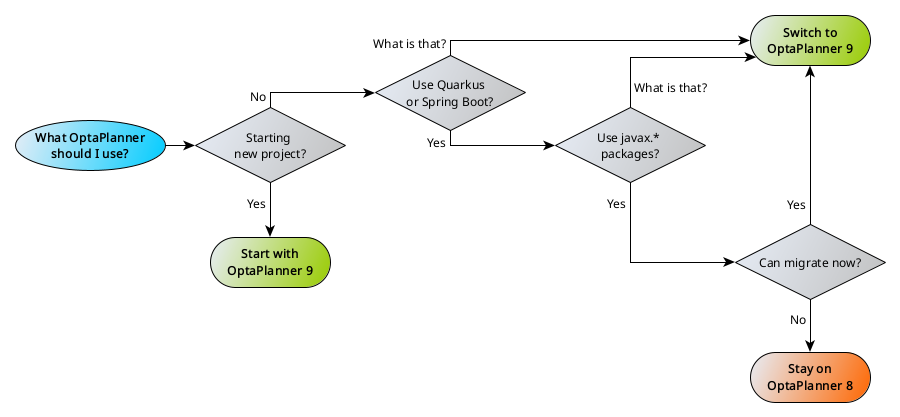

= OptaPlanner 9 is coming
triceo
2023-02-21
:page-interpolate: true
:jbake-type: post
:jbake-tags: migration, jakarta, javax, javaee, quarkus, spring boot
:jbake-social_media_share_image: migration-flowchart.png

OptaPlanner 9 is on the way, and today we've made available its first Alpha release. But do not worry! Unless you use Quarkus or Spring Boot, absolutely nothing will change for you. Continue reading to find out what it is that we're doing, why, and how you can participate.

== Why do OptaPlanner 9?

OptaPlanner 8 was released in November 2020, not even three years ago.
Surely there is no reason to bring a new major version so early, you might say.
And you would be right, but some things changed which are outside our control.

Specifically, projects that we love and depend on (such as Quarkus) started migrating away from the old Java EE APIs towards the new Jakarta EE.
We spent a lot of time thinking about ways of integrating these changes without impacting you, our users.
However, that quickly turned out to be impossible.
Instead, we set out to making this transition as smooth as possible for as many people as possible.

== What does it mean?

From now on and until further notice, the OptaPlanner project will be releasing two binary streams:

* OptaPlanner 8.x as you know and love it.
* OptaPlanner 9.x adapted to the new world.

OptaPlanner 9.x will be our latest and greatest, but there will be no difference between these two streams, unless strictly necessary for the switch to the new Jakarta APIs.
We are not removing any deprecated APIs, we are making no functional changes.

The two streams will also have the same minor version, to indicate that they belong together.
For this reason, the first release of the 9.x stream won't be OptaPlanner 9.0.0.Final.
Instead it will (likely) be 9.37.0.Final, to go along with 8.37.0.Final.

== How do I choose?

It is simple, and we've created a flow chart to help you:

To summarize, switch to OptaPlanner 9:

* If you're starting a new project,
* or if you don't know what Quarkus and Spring Boot are,
* or if you don't use them.

Otherwise stay on OptaPlanner 8, but be advised:
OptaPlanner 8 will not be around forever, and you should plan for migration.
Maintaining two streams presents a considerable effort for our team,
and we will only do it until Quarkus 3 and Spring Boot 3 gain enough traction.
It may take 6 months, it may take a year, but most likely not longer.

== How do I migrate to OptaPlanner 9?

Everything in `optaplanner-core` works exactly as it has before.
For the vast majority of our users, we believe that switching to OptaPlanner 9 will require just a single line change in your Maven POM file.

[source,xml]
----
<dependency>
    <groupId>org.optaplanner</groupId>
    <artifactId>optaplanner-bom</artifactId>
    <version>9.34.0.Beta1</version> <!-- Used to say 8.33.0.Final -->
    <type>pom</type>
    <scope>import</scope>
</dependency>
----

For users of `optaplanner-quarkus` or `optaplanner-spring-boot-starter`, the changes will be larger:

* All imports of `javax.*` packages will need to be replaced by their `jakarta.*` equivalents, including changes to dependencies.
* Dependencies on Quarkus 2 need to be changed to Quarkus 3.
* Dependencies on Spring Boot 2 need to be changed to Spring Boot 3. In case of Spring Boot 3, a migration to Java 17 is also necessary. That is the decision of the Spring framework team, and we can not influence that.

However, we have created tooling to simplify this transition to a point where it is also a single line of code. Simply run the following command while in the root directory of your project:

[source,shell]
----
rewrite:run \
  -Drewrite.configLocation="${optaplanner_file}" \
  -Drewrite.recipeArtifactCoordinates=org.optaplanner:optaplanner-migration:"$project_version" \
  -Drewrite.exclusions=optaplanner-operator/**,optaplanner-examples/data/** \
  -Drewrite.activeRecipes=org.optaplanner.openrewrite.Quarkus3 \
  -Dfull \
  -Dquickly \
  -Dmigration
----

== When will OptaPlanner 9 be Final?

At this point, we are aiming to release a Final version of OptaPlanner 9 shortly after Quarkus 3 releases theirs.
All signs point to spring of 2023.

== How can I help?

We would appreciate if you could try to migrate your projects to the 9.34.0.Beta1 version we've released today.
Known issues include broken native builds,
and quickstarts not yet having been converted to the new version.
If you run into any other issues, https://www.optaplanner.org/community/getHelp.html[reach out to us] and let us know.