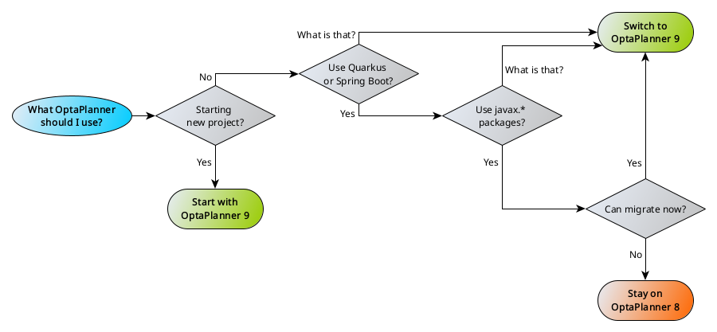

= OptaPlanner 9 has been released
rsynek
2023-04-24
:page-interpolate: true
:jbake-type: post
:jbake-tags: migration, jakarta, javax, javaee, quarkus, spring boot
:jbake-social_media_share_image: migration-flowchart.png

In the previous article link:../../02/21/OptaPlanner-9-is-coming.adoc[OptaPlanner 9 is coming] we explained why we are doing OptaPlanner 9.
Now OptaPlanner 9.37.0.Final has been released to enable users migrate to Jakarta EE, Quarkus 3 and Spring Boot 3.

== Differences between OptaPlanner 8 and 9

OptaPlanner 8 and 9 are fully compatible regarding their APIs and equal feature-wise.
The differences are coming from package-level changes brought by Jakarta EE 10 that impact the entire Java ecosystem.
OptaPlanner has to react, too.
We decided to make the transition smooth by releasing two parallel streams: 8 and 9.

The following table summarizes the compatibility of both OptaPlanner streams:

[cols="1,1,1"]
|===
| ^|OptaPlanner 8 ^|OptaPlanner 9

|Jakarta EE
>|8 (via Quarkus)
>|10 (via Quarkus)

|Quarkus
>|2
>|3

|Spring Boot
>|2
>|3
|===

Apart from those, OptaPlanner 9 currently does not support DRL score calculation when used together with Quarkus.
If you use the DRL score calculation, link:https://www.optaplanner.org/download/upgradeRecipe/drl-to-constraint-streams-migration.html[migrate to the Constraint Streams API] as DRL has long since been deprecated.
Also, OptaPlanner 9 no longer supports the `AbstractScoreHibernateType` and its subtypes.
Please see the https://www.optaplanner.org/download/upgradeRecipe/upgradeRecipe8.html[upgrade recipe] for more details.

== Which one to use?

The link:../../02/21/OptaPlanner-9-is-coming.adoc[previous article] covers this question; let me shortly repeat the recommended approach:

To summarize, switch to OptaPlanner 9:

* If you're starting a new project,
* or if you don't use Quarkus and Spring Boot.

== What's next

Both OptaPlanner 8 and 9 are going to be released together under the same minor version.
Every new feature will be available in both streams.

Will it stay like that forever?
No.
At some point, when there is enough adoption of OptaPlanner 9, the release train of OptaPlanner 8 will stop, as it will have served its purpose: help transition users to the new version.

The important message is: even if you decide to stay on OptaPlanner 8 for now, do plan your migration.

== How do I migrate to OptaPlanner 9?

For those who don't use Quarkus or Spring Boot, the migration is likely just about changing a version of the `optaplanner-bom`:

[source,xml]
----
<dependency>
    <groupId>org.optaplanner</groupId>
    <artifactId>optaplanner-bom</artifactId>
    <version>9.37.0.Final</version>
    <type>pom</type>
    <scope>import</scope>
</dependency>
----

For users of `optaplanner-quarkus` or `optaplanner-spring-boot-starter`, the changes will be larger:

* All imports of `javax.*` packages will need to be replaced by their `jakarta.*` equivalents, including changes to dependencies.
* Dependencies on Quarkus 2 need to be changed to Quarkus 3.
* Dependencies on Spring Boot 2 need to be changed to Spring Boot 3. In case of Spring Boot 3, a migration to Java 17 is also necessary. That is the decision of the Spring framework team, and we can not influence that.

We have created tooling to simplify this transition. Simply run the following commands while in the root directory of your project:

[source,shell]
----
mvn clean org.openrewrite.maven:rewrite-maven-plugin:4.43.0:run \
   -Drewrite.recipeArtifactCoordinates=org.optaplanner:optaplanner-migration:9.37.0.Final \
   -Drewrite.activeRecipes=org.optaplanner.migration.ToLatest9
----

== Summary

OptaPlanner 9 has been released and, with few exceptions, remains functionally equivalent with OptaPlanner 8.
We will continue releasing OptaPlanner 8 as well for the time being, but at some point there will be only OptaPlanner 9.
There is an automated script to help you with the migration.
