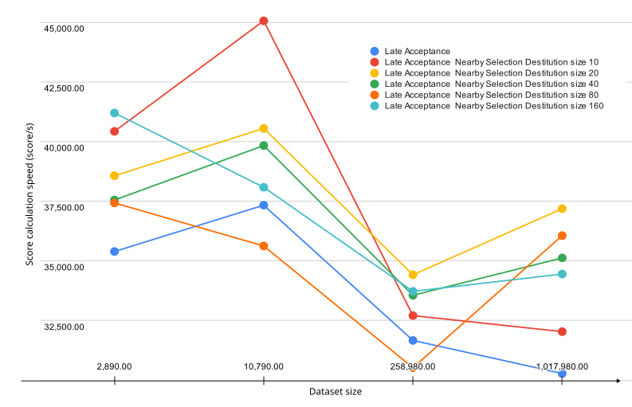
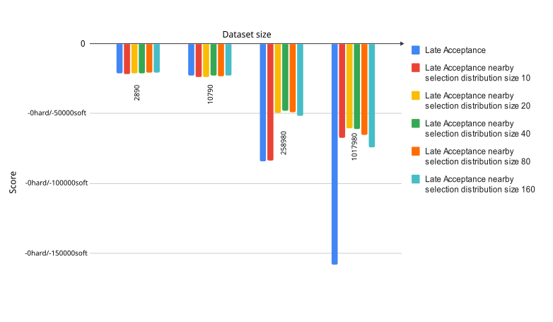
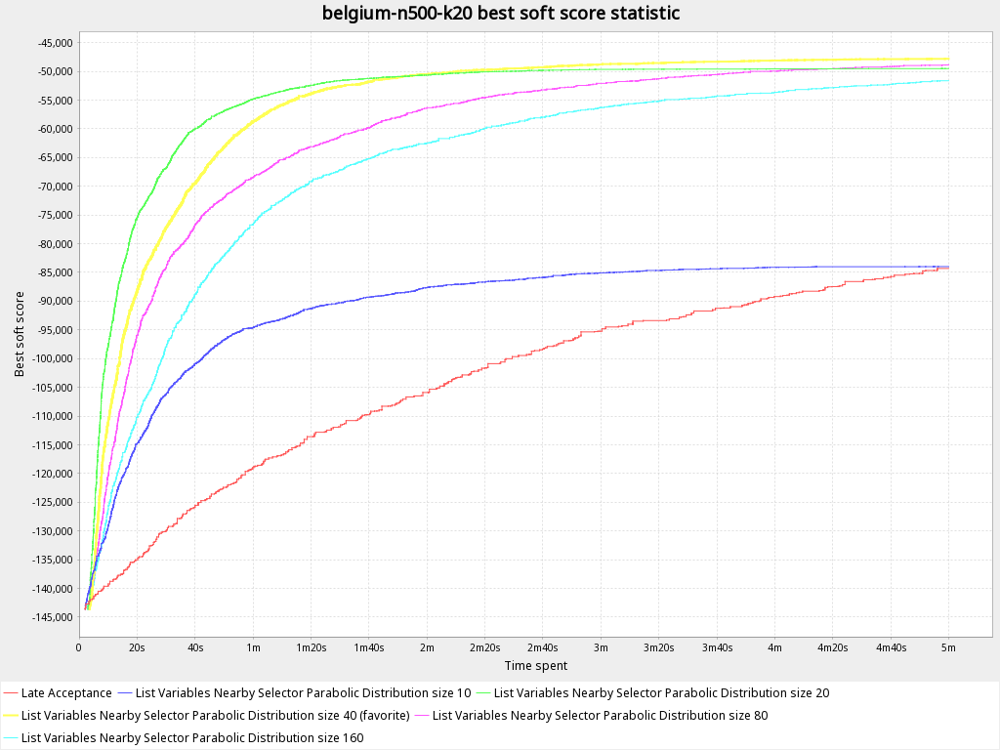
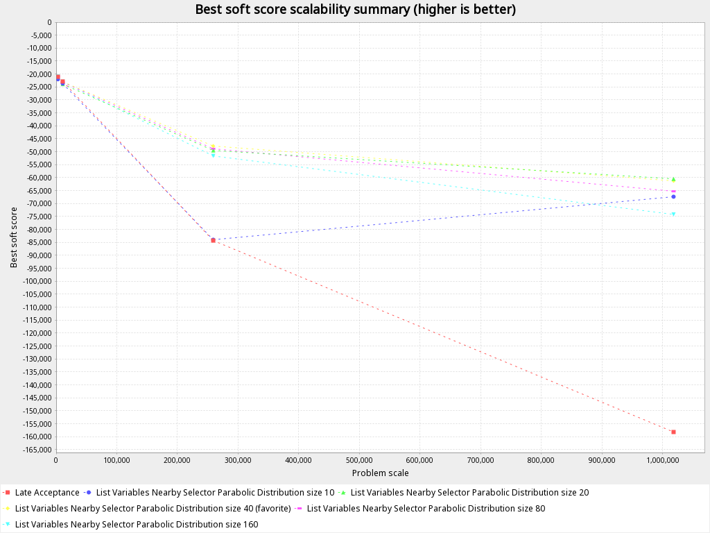

= Scaling Up Vehicle Routing Problem with planning list variable and Nearby Selector
dupliaka
2023-04-27
:page-interpolate: true
:jbake-type: post
:jbake-tags: insight, design, vehicle routing. move selector
:jbake-social_media_share_image: nearby-selection.png

https://www.optaplanner.org/docs/optaplanner/latest/use-cases-and-examples/use-cases-and-examples.html#vehicleRouting[Vehicle routing problem (VRP)] is a type of optimization problem that involves finding the most efficient route for a Vehicle to take when delivering goods to different Customers.

== What is the planning list variable and why is it useful for modeling the VRP?

The planning list variable is an alternative to the https://www.optaplanner.org/docs/optaplanner/latest/planner-configuration/planner-configuration.html#chainedPlanningVariable[chained variable] used in OptaPlanner to model problems such as VRP.
Instead of modeling the problem as a chain of variables, the planning list variable allows a vehicle to contain a list of customers, removing the need for chaining.

== What is nearby selection and why is it important for the planning list variable?

https://www.optaplanner.org/docs/optaplanner/latest/move-and-neighborhood-selection/move-and-neighborhood-selection.html#nearbySelection[Nearby selection] is a move selection strategy used in OptaPlanner to improve scalability by limiting the number of moves considered during the search.
It works by selecting moves that are nearby in the solution space, rather than considering all possible moves.
This is important for the planning list variable because it helps address scalability issues that arise when dealing with large problem sizes.
Recently, nearby selection was enabled for the planning list variable, making it a more powerful tool for solving complex optimization problems.

VRP move selection faces a significant challenge when it comes to scalability.
With each additional node in the problem, the complexity of the algorithm increases exponentially, making it difficult to find feasible solutions within a reasonable amount of time.

== How nearby selection addresses the scalability issues?

By pre-calculating a distance matrix and using different distributions to limit the number of moves that need to be considered, this selector improves the scalability of the algorithm, making it possible to tackle larger and more complex problems.

But what is the underlying analysis behind the success of the nearby selection, and where might bottlenecks arise in the optimization process?

At its core, the nearby selection is a tool for reducing the complexity of the optimization process.
By limiting the number of moves that need to be considered, it reduces the number of comparisons required, ultimately leading to a reduction in execution time.
This is achieved by pre-calculating a distance matrix, which allows the algorithm to quickly identify the closest nodes and *focus its attention on those that are most relevant*.
Imagine you're a delivery company trying to deliver packages to different cities with the minimum driving time spent.
Suppose you need to deliver a package from Berlin to Paris.
Does it make sense to put a stop in Tokyo in the middle?

== How does nearby selection improve the calculation?

Let's compare the solver progress over time for plain Late Acceptance solver and Late Acceptance solver with the nearby move selector.
On the graphs below you can see the https://github.com/kiegroup/optaplanner/blob/main/optaplanner-examples/src/main/resources/org/optaplanner/examples/vehiclerouting/optional/benchmark/vehicleRoutingBenchmarkConfigListNearby.xml[optaplanner-benchmark] results for different amount of samples.
You can find out more about optaplanner-benchmarks https://www.optaplanner.org/docs/optaplanner/latest/benchmarking-and-tweaking/benchmarking-and-tweaking.html[here].

== Execution time

How fast each algorithm improves the solution score?

Graph below represents the speed of score calculation for different selector options for a certain amount of samples.

The results indicate that the Late Acceptance with nearby selection consistently outperforms the Late Acceptance algorithm.
In particular, you can see that Late Acceptance with nearby selection with parabolic distribution of size 20 was the fastest on average, while the Late Acceptance was the slowest.

[#table1]
.Score calculation count per second comparing Late Acceptance with nearby selection vs Late Acceptance
|===
| ^.^|Belgium-n50-k10
(2,890.00 samples)|Belgium-n100-k10 (10,790.00 samples)|Belgium-n500-k20
(258,980.00 samples)|Belgium-n1000-k20 (1,017,980.00 samples)
|Late Acceptance                      >|35,393.00/s >|37,334.00/s >|31,667.00/s >|30,282.00/s
|Late Acceptance Nearby Selection Distribution size 10  >|40,428.00/s >|45,059.00/s >|32,708.00/s >|32,036.00/s
|Late Acceptance Nearby Selection Distribution size 20  >|38,567.00/s >|40,552.00/s >|34,418.00/s >|37,188.00/s
|Late Acceptance Nearby Selection Distribution size 40  >|37,551.00/s >|39,833.00/s >|33,558.00/s >|35,125.00/s
|Late Acceptance Nearby Selection Distribution size 80  >|37,428.00/s >|35,625.00/s >|30,523.00/s >|36,060.00/s
|Late Acceptance Nearby Selection Distribution size 160 >|41,197.00/s >|38,086.00/s >|33,724.00/s >|34,451.00/s
|===

== Solution quality

Despite the fact that nearby selection improves the speed of calculation, it could potentially decrease the quality of the best solution.

The image above represents the overall best score archived with different move selectors and datasets for the same amount of time (5 minutes).
The less is better.

You may see how much the nearby selection improves the score calculation while the dataset increases.
For the biggest dataset any Late Acceptance with nearby selection variation gain twice better score then Late Acceptance.

From the other side look at the Late Acceptance nearby selection distribution size 10 bars.
Despite being the fastest solution of all with the small dataset, it somehow dramatically lose the score gain for the case of 500 customers and 20 vehicles.

The graph below shows how in this case best score (y-axis) changes in time during the calculation . The less is better.

You can clearly see that at some point due to the small distribution size it fails to reach better solution and not able to get out of the local optimum providing the same result as Late Acceptance.

== Scalability

The graph is suggesting that for small datasets with a low number of customers (less than 500), the switch between different selectors does not have a significant impact on the best score achieved.
However, as the dataset size and number of customers increases (e.g., to 250,000 samples for 500 customers and 20 vehicles), the difference in performance between the selectors becomes more pronounced, with the best-performing Late Acceptance with nearby selection selector with parabolic distribution of size 40 achieving a score almost 1.7 times better than the worst-performing Late Acceptance default selectors.
As the dataset size continues to increase, the difference in performance between move selectors becomes even greater, with the best-performing selector achieving a score 2.63 times better than the worst-performing one when dealing with 1 million samples.

== Conclusion

Nearby Move selector is a great choice for the problems that require `@PlanningListVariable`.
It speeds up score calculation and scales better, which allows for tackling even more complex problems in the future, but it requires careful consideration of the trade-off between speed and quality.
