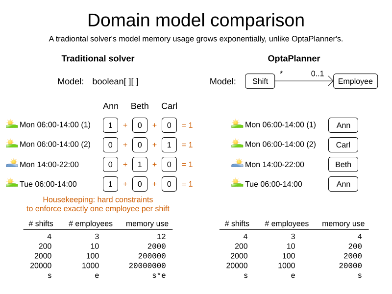

= Gurobi versus OptaPlanner comparison
:jbake-type: competitorBase
:jbake-description: OptaPlanner is a fast, open source alternative to Gurobi for mathematical optimization.
:jbake-priority: 1.0
:jbake-related_tag: gurobi
:jbake-featured_youtube_id: -7ips_GMFmo

[.lead]
Gurobi and OptaPlanner are mathematical optimization solvers.
They are both used across the globe in production.
But there are notable differences between OptaPlanner and Gurobi.

[.lead]
OptaPlanner is <<openSource,open source>>,
<<fasterAndMoreScalable,fast>>, <<fasterAndMoreScalable,scalable>> and
<<easyToUse,easy to use>> because of
<<objectOrientedProgrammingModel,OO models>>,
<<codeConstraint,constraints as code>> and
<<flexibleScoring,flexible scoring>>.
OptaPlanner is also <<noNumericalInstability,less error prone>>,
<<easyToIntegrate, integration friendly>> (including REST)
and <<cloudReady,cloud ready>>. It runs on <<operationSystemIndependent,all operating systems>>.

*Try it yourself.* No license needed. +
*https://www.optaplanner.org/docs/optaplanner/latest/quickstart/quickstart.html[Get started with OptaPlanner today]*
for Java, Kotlin or Scala.
Or https://www.optapy.org[try OptaPy] for Python.

[#openSource]
== OptaPlanner is Open Source

Gurobi is closed source software.

OptaPlanner is enterprise open source software under the link:../code/license.html[Apache License],
which allows free reuse for commercial purposes.
_All_ of OptaPlanner's source code is available on https://github.com/kiegroup/optaplanner[GitHub].
Its community is _open_. its decision making is _open_.

A dedicated link:../community/team.html[core team] of optimization experts
(employed by https://www.redhat.com[Red Hat]) works full-time on OptaPlanner.
Also hundreds of external developers have contributed to OptaPlanner.
Regardless of who wrote the code, an(other) OptaPlanner core developer has reviewed it
before it is merged into the main repository.

Red Hat also offers link:../product/services.html[support and consulting services]
for customers who want to take their OptaPlanner implementation to the next level.

[#fasterAndMoreScalable]
== OptaPlanner is fast and scalable

// TODO Change to "OptaPlanner is both faster and more scalable than Gurobi" after adding the open benchmarks as proof.
OptaPlanner is both fast and scalable
for planning and scheduling use cases, such as the link:../learn/useCases/vehicleRoutingProblem.html[Vehicle Routing Problem],
link:../learn/useCases/employeeRostering.html[Employee Rostering] and link:../learn/useCases/maintenanceScheduling.html[Maintenance scheduling].

OptaPlanner delivers better results, in the same amount of CPU time.
It also consumes less memory when scaling out. Why? Because:

=== OptaPlanner uses a more efficient model

Under the covers, Gurobi and OptaPlanner use very different optimization technologies,
which impacts your modeling flexibility, which in turn impacts performance and scalability.

For example, in employee rostering, to assign shifts to employees:

* Gurobi creates a `boolean` variable for every `(shift, employee)` combination.
Given `2000` shifts and `100` employees, that's an array of `200 000` elements.
* On the other hand, OptaPlanner creates an `Employee` variable for every `Shift`.
Given `2000` shifts and `100` employees, that's an array of `2000` elements.

The OptaPlanner approach doesn't just scale better,
it also omits the _one shift per employee_ hard constraint which the model naturally enforces by design.
For VRP, the difference is even more stark.

=== OptaPlanner handles constraints more efficiently

Gurobi can handle billions of constraints.

OptaPlanner counts the number of constraints differently.
It handles the same use case with only a few dozen constraints.

For example, to ensure each shift is assigned to an employee with the correct skill
for `2000` shifts and `100` employees:

* Gurobi has almost `200 000` constraints.
* OptaPlanner has `1` constraint and a handful of _constraint matches_ internally.

This allows OptaPlanner to scale to 100 000+ of non-binary optimization variables in only 2GB RAM
for use cases such as country-wide vaccination scheduling.

[#easyToUse]
== OptaPlanner is easy to use

Any software developer can implement an optimization use case with OptaPlanner.
*There's no need to hire expensive consultants to write complex mathematical equations.*
It's OOP friendly.

Later, when your business reality changes, you can quickly adjust the OptaPlanner constraints.
It is maintenance friendly.

OptaPlanner supports both Object-Oriented Programming and Functional Programming:

[#objectOrientedProgrammingModel]
=== An OptaPlanner model is Object-Oriented Programming (OOP) friendly

Both Gurobi and OptaPlanner require you to define your model, with _optimization variables_,
so the mathematical optimization software knows which decisions it needs to make.

Gurobi supports 3 types of optimization variables: booleans, integers and floating point numbers.
You must transform your domain model into those types.
For example:

[source,java]
----
// Input
Model model = ...
Variable[][] assignments = new Variable[shifts.size()][employees.size()];
for (int s = 0; s < shifts.size(); s++) {
    for (int e = 0; e < employees.size(); e++) {
        assignments[s][e] = model.addVar(BINARY);
    }
}
... // Add constraints to enforce no shift is assigned to multiple employees

// Solve
model.solve();

// Output
for (int s = 0; s < shifts.size(); s++) {
    for (int e = 0; e < employees.size(); e++) {
        if (assignments[s][e].get() > 0.99) {
            print(shifts[s] + " is assigned to " + employees[e]);
        }
    }
}
----

OptaPlanner supports any type of optimization variables,
including your custom classes (`Employee`, `Vehicle`, ...) or standard classes (`Boolean`, `Integer`, `BigDecimal`, `LocalDate`, ...).
You can reuse your existing domain model, to avoid costly data transformations.
For example:

[source,java]
----
@PlanningEntity
class Shift { // User defined class
    ... // Shift id, date, start time, required skills, ...

    @PlanningVariable
    Employee employee;
}
@PlanningSolution
class TimeTable { // User defined class
    List<Employee> employees;
    List<Shift> shifts;
}

// Input
Timetable timetable = new Timetable(shifts, employees);

// Solve
timetable = Solver.solve(timetable);

// Output
for (Shift shift : timetable.shifts) {
    print(shift + " is assigned to " + shift.employee);
}
----

Neither of these 2 classes (`Shift` and `Timetable`) exist in OptaPlanner itself: you define and shape them.
Your code doesn't deal with booleans and numbers, but uses `Employee`, `Shift` and `DayOfRequest` instances.
Your code reads naturally.

OptaPlanner even supports polymorphism.

[#codeConstraint]
=== OptaPlanner constraints are code, not equations

Gurobi constraints are implemented as *mathematical equations*.
For example, to assign _at most one shift per day_,
you add an equation `s1 + s2 + s3 \<= 1` for all shifts on day 1,
an equation `s4 + s5 \<= 1` for all shifts on day 2, and so forth:

[source,java]
----
for (int e = 0; e < employees.size(); e++) {
    for (int d = 0; d < dates.size(); d++) {
        Expression expr = ...
        for (int s = 0; s < shifts.size(); s++) {
            // If the shift is on the date
            if (shifts[s].date == dates[d])) {
                expr.addTerm(1.0, assignments[s][e]);
            }
        }
        model.addConstraint(expr, LESS_EQUAL, 1.0);
    }
}
----

OptaPlanner constraints are implemented as *programming code*.
If you use _ConstraintStreams_, a Functional Programming (FP) approach,
OptaPlanner automatically applies incremental score calculation with deltas
for maximum scalability and performance.

For example, to assign _at most one shift per day_,
select every pair of `Shift` instances
that have the same `date` and the same `employee`,
to penalize matching pairs as a hard constraint:

[source,java]
----
// For every shift ...
constraintFactory.forEach(Shift.class)
    // ... combined with any other shift ...
    .join(Shift.class,
        // ... on the same date ...
        equal(shift -> shift.date),
        // ... assigned to the same employee ...
        equal(shift -> shift.employee))
    // ... penalize one broken hard constraint per pair.
    .penalize(HardSoftScore.ONE_HARD)
    .asConstraint("One shift per day");
----

That `equal()` method accepts _any_ code as a parameter to return _any_ type (not just booleans and numbers).

For example, because `date` is an instance of `LocalDate` (an advanced Date and Time API),
use `LocalDate.isDayOfWeek()` to select 2 shifts on the same day of week:

[source,java]
----
        // ... on the same day of week ...
        equal(shift -> shift.date.getDayOfWeek())
----

https://www.youtube.com/watch?v=-5wpm-gesOY[Date and times arithmetic is notoriously difficult,]
because of Daylight Saving Time (DST), timezones, leap years and other semantics that only a few programmers on this planet actually understand.
OptaPlanner empowers you to directly use their APIs (such as `LocalDate`) in your constraints.

Besides the `equal()` joiner, OptaPlanner supplies `lessThan()`, `greaterThan()`, `lessThanOrEqual()`, `greaterThanOrEqual()`,
`overlapping()`, etc.
OptaPlanner automatically applies indexing (hashtable techniques) on joiners for performance.

For example, select two overlapping shifts with the `overlapping()` joiner
(even if they start or end at different times):

[source,java]
----
        // ... that overlap ...
        overlapping(shift -> shift.startDateTime, shift -> shift.endDateTime)
----

Besides the `join()` construct, OptaPlanner supports `filter()`, `groupBy()`, `ifExists()`, `ifNotExists()`, `map()`, etc.
This rich API empowers you to implement any constraint.

For example, allow employees that can work double shifts to work double shifts
by filtering out all employees that work double shifts with a `filter()`:

[source,java]
----
// For every shift ...
constraintFactory.forEach(Shift.class)
    // ... assigned to an employee that does not work double shifts ...
    .filter(shift -> !shift.employee.worksDoubleShifts)
    // ... combined with any other shift ...
    .join(Shift.class,
        equal(shift -> shift.date),
        // ... assigned to that same employee that does not work double shifts ...
        equal(shift -> shift.employee))
    .penalize(HardSoftScore.ONE_HARD)
    .asConstraint("One shift per day");
----

The `groupBy()` construct supports `count()`, `sum()`, `average()`, `min()`, `max()`, `toList()`, `toSet()`, `toMap()`, etc.
You can also plug in custom collectors.

For example, don't assign more than 10 shifts to any employee by counting their shifts with `count()`:

[source,java]
----
constraintFactory.forEach(Shift.class)
    // Group shifts by employee and count the number of shifts per employee ...
    .groupBy(shift -> shift.employee, count())
    // ... if more than 10 shifts for one employee ...
    .filter((employee, shiftCount) -> shiftCount > 10)
    // ... penalize as a hard constraint ...
    .penalize(HardSoftScore.ONE_HARD,
            // ... multiplied by the number of excessive shifts.
            (employee, shiftCount) -> shiftCount - 10)
    .asConstraint("Too many shifts");
----

OptaPlanner allows weighting constraints dynamically.
It has *no linear limitations*.

For example, avoid overtime and distribute it *fairly* by penalizing the number of excessive hours *squared*:

[source,java]
----
constraintFactory.forEach(Shift.class)
    // Group shifts by employee and sum the shift duration per employee ...
    .groupBy(shift -> shift.employee, sum(shift -> shift.getDurationInHours()))
    // ... if an employee is working more hours than his/her contract ...
    .filter((employee, hoursTotal) -> hoursTotal > employee.contract.maxHours)
    // ... penalize as a soft constraint of weight 1000 ...
    .penalize(HardSoftScore.ofSoft(1000),
            // ... multiplied by the number of excessive hours squared.
            (employee, hoursTotal) -> {
                    int excessiveHours = hoursTotal - employee.contract.maxHours;
                    return excessiveHours * excessiveHours;
            })
    .asConstraint("Too many shifts");
----

This penalizes outliers more.
It automatically load balances overtime in fair manner across the employees,
whenever possible. https://www.optaplanner.org/blog/2017/02/03/FormulaForMeasuringUnfairness.html[Learn more.]

OptaPlanner also supports positive constraints: use `reward()` instead of `penalize()`.

Gurobi sometimes recommends the `M is a very large number` trick to implement challenging constraints.
OptaPlanner never needs that hack.

[#flexibleScoring]
=== OptaPlanner has flexible scoring

Gurobi supports 2 score levels: hard constraints as _constraints_
and soft constraints as an _objective function_ that returns a floating point number.

If one soft constraint takes total priority over another soft constraint,
for example service quality constraints over productivity constraints,
Gurobi multiplies the first soft constraint by a big weight and sums that with the second.
This can lead to overflow or underflow.

OptaPlanner supports any number of score levels:

* 2 levels (default): hard and soft constraints with `HardSoftScore`
* 3 levels: hard, medium and soft constraints with `HardMediumSoftScore`
* n levels with `BendableScore`

This allows users to prioritize operational constraints (such as _assign all shifts_)
over financial constraints (such as _reduce cost_), without multiplication with a big number.

The OptaPlanner constraint weights can use:

* 32-bit integer (`int`) arithmetic (default) with `HardSoftScore`, etc.
* 64-bit integer (`long`) arithmetic with `HardSoftLongScore`, etc.
* Decimal number (`BigDecimal`) arithmetic with `HardSoftBigDecimalScore`, etc.

OptaPlanner actually no longer supports floating point (`double`) arithmetic
because of the numerical instability issues involved for incremental score calculation.

[#noNumericalInstability]
== OptaPlanner does not suffer from numerical instability by design

Gurobi internally solves a set of equations using the simplex algorithm.
These equations are represented by a matrix of 64-bit floating point numbers.

_Floating point arithmetic inherently suffers from mathematical instability._
For example, `0.01 + 0.09` does not return `0.10` in all major programming languages.
Try it out. It's off by `0.00000000000000001`.

In iterating algorithms, these small rounding errors can compound to a significant rounding error.
Gurobi minimizes its rounding errors by ordering its arithmetic operations intelligently.
Still, by default *Gurobi tolerates going over hard constraints by margin of a `0.000001` to ignore compounded rounding errors*.
Users tweak the infamous tolerance settings for use cases or datasets in which the tolerances are either too high or too low.

Gurobi's output for binary variables also suffers from mathematical instability.
For example, to check if an optimization variable is `true`, compare it to `0.99` instead of `1.0`:

[source,java]
----
if (assignments[s][e].get() > 0.99) {
    // Shift s is assigned to employee
    ...
}
----

OptaPlanner does not suffer from numerical instability.
There are no tolerance settings. There is no arithmetic operations ordering.
It does not use floating point arithmetic in any way that could compound rounding errors.
OptaPlanner internally uses Local Search metaheuristics (such as Late Acceptance), other heuristics
and orthogonal features (such as multithreaded solving).
None of these algorithms compound rounding errors by design.

[#easyToIntegrate]
== OptaPlanner is easy to integrate with the REST, databases, etc

The https://github.com/kiegroup/optaplanner-quickstarts[OptaPlanner Quickstarts]
show how to integrate OptaPlanner with various technologies to quickly:

* Expose a REST service and JSON data with link:../compatibility/quarkus.html[Quarkus] or link:../compatibility/springBoot.html[Spring].
* Connect to a relational database with link:../compatibility/quarkus.html[Quarkus] or link:../compatibility/springBoot.html[Spring].
* Load balance solvers across multiple nodes with ActiveMQ.

[#cloudReady]
== OptaPlanner is cloud ready

OptaPlanner runs on all major clouds, such as Amazon AWS, Microsoft Azure, Google Compute Engine and IBM Cloud.
It works on all major cloud technologies, such as Kubernetes, OpenShift, Docker and Virtual Machines.

But it just runs as fine on your local development machine without internet access,
or embedded in a process on-premise.

With link:../compatibility/quarkus.html[Quarkus] it can compile Java and Kotlin code natively for serverless use cases
that need to start up in milliseconds.

[#operationSystemIndependent]
== OptaPlanner runs on all major operating systems

OptaPlanner runs on all major operating systems, such as Linux, Windows and macOS.

== Get started

To get started with OptaPlanner, read the https://www.optaplanner.org/docs/optaplanner/latest/quickstart/quickstart.html[quick start guide]
or copy-paste the source code of one of the https://github.com/kiegroup/optaplanner-quickstarts[OptaPlanner Quickstarts].
