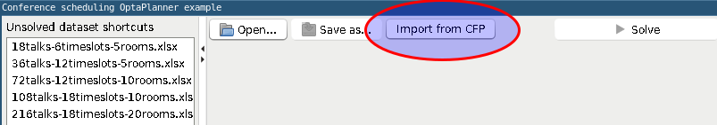
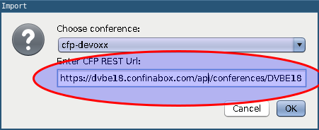
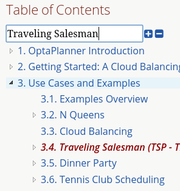
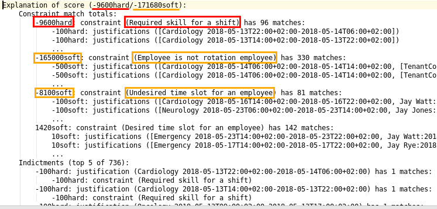
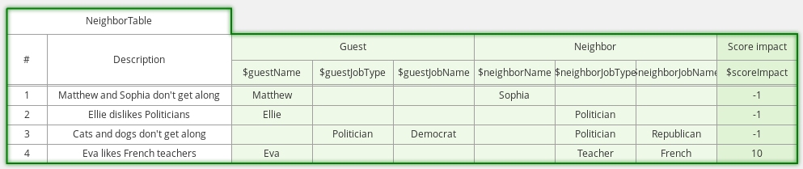
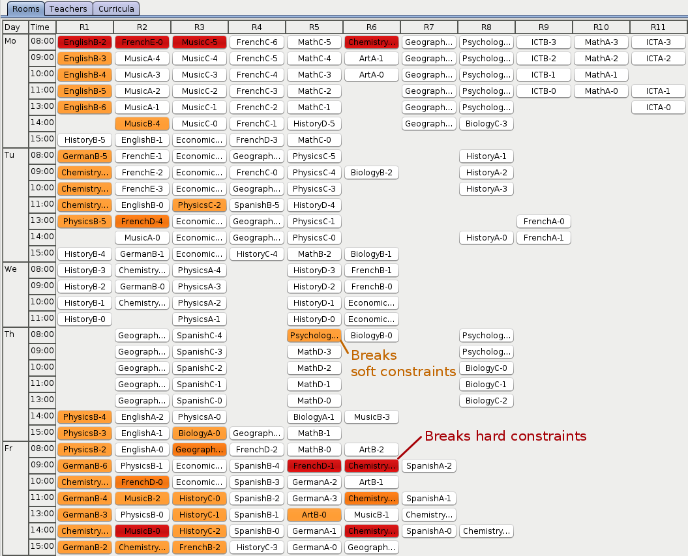
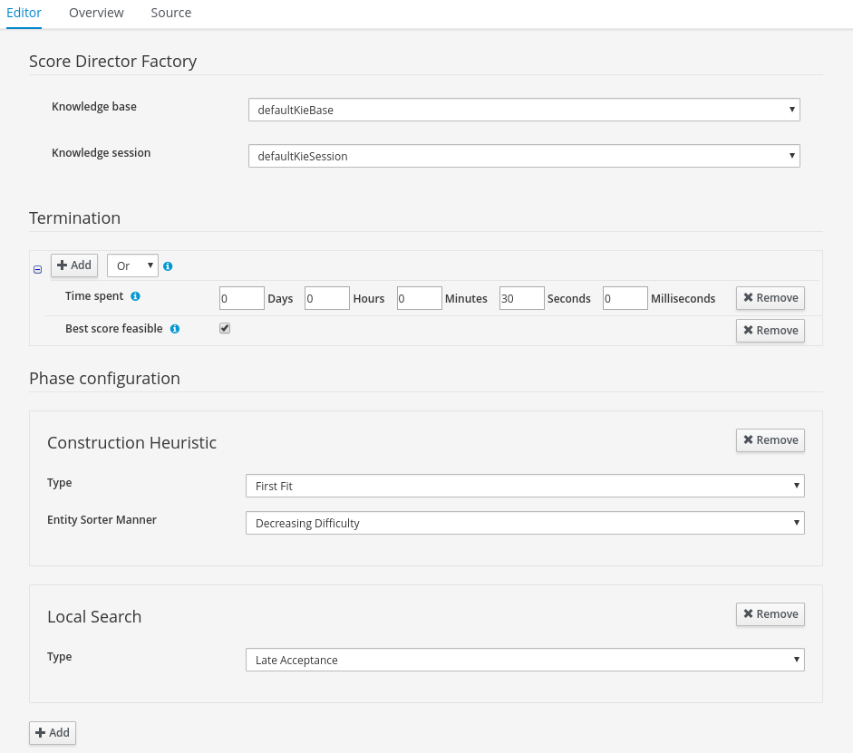
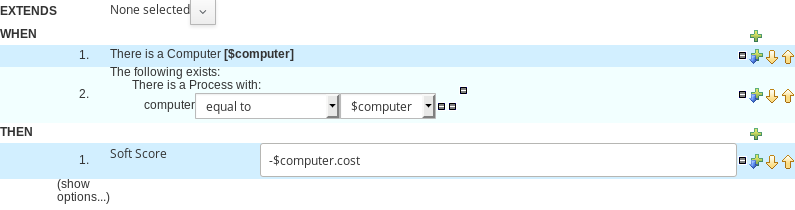
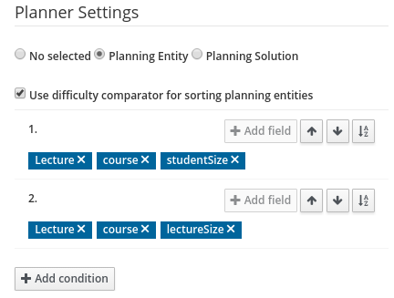

= Release Notes 7
:jbake-type: releaseNotesBase
:jbake-description: New and noteworthy, demos and status for OptaPlanner 7.
:jbake-priority: 1.0
:jbake-release_notes_version: 7
:jbake-release_notes_version_qualifier: Final

== New and noteworthy: Engine 7.39.0.Final

=== More deprecations

In this release, we continue deprecating some rarely used methods for which there are now better alternatives.
We encourage everyone to check out our link:../upgradeRecipe/upgradeRecipe7.html[updated upgrade recipe] to adapt accordingly.

== New and noteworthy: Engine 7.38.0.Final

=== Deprecation effort

With this release, we are deprecating some rarely used methods for which there are now better alternatives.
We encourage everyone to check out our link:../upgradeRecipe/upgradeRecipe7.html[updated upgrade recipe] to adapt accordingly.

That said, we remain committed to our existing API compatibility guarantees
and we will not remove any of the deprecated APIs on the 7.x stream of OptaPlanner.

== New and noteworthy: Engine 7.37.0.Final

=== Run script for OptaWeb Vehicle Routing

The run script automates setup steps that would otherwise have to be carried out manually and simplifies the run command.

Before:

[source,shell]
----
java -jar optaweb-vehicle-routing-standalone-7.36.0.Final.jar \
  --app.persistence.h2-dir=$HOME/.optaweb-vehicle-routing/db \
  --app.routing.gh-dir=$HOME/.optaweb-vehicle-routing/graphhopper
  --app.routing.osm-dir=$HOME/.optaweb-vehicle-routing/openstreetmap \
  --app.routing.osm-file=belgium-latest.osm.pbf \
  --app.region.country-codes=BE
----

After:

[source]
----
./runLocally.sh belgium
----

To learn more about the run script, read the
https://docs.optaplanner.org/latestFinal/optaweb-vehicle-routing-docs/html_single/#run-locally-sh[documentation]
or watch this video:

video::rEeAML74oWo[youtube]

== New and noteworthy: Engine 7.36.0.Final

=== Constraint Verifier allows for unit testing Constraint Streams

We have introduced the Constraint Verifier API, allowing you to easily test constraints developed using the Constraint Streams API. Consider the following constraint:

[source,java,options="nowrap"]
----
    protected Constraint horizontalConflict(ConstraintFactory factory) {
        return factory
                .fromUniquePair(Queen.class, equal(Queen::getRowIndex))
                .penalize("Horizontal conflict", SimpleScore.ONE);
    }
----

The following example uses the Constraint Verifier API to create a simple unit test for the preceding constraint stream:

[source,java,options="nowrap"]
----
    private ConstraintVerifier<NQueensConstraintProvider, NQueens> constraintVerifier
            = ConstraintVerifier.build(new NQueensConstraintProvider(), NQueens.class, Queen.class);

    @Test
    public void horizontalConflictWithTwoQueens() {
        Row row1 = new Row(0);
        Column column1 = new Column(0);
        Column column2 = new Column(1);
        Queen queen1 = new Queen(0, row1, column1);
        Queen queen2 = new Queen(1, row1, column2);
        constraintVerifier.verifyThat(NQueensConstraintProvider::horizontalConflict)
                .given(queen1, queen2)
                .penalizesBy(1);
    }
----

== New and noteworthy: Engine 7.34.0.Final

=== Various improvements to constraint streams

We have added several new constraint collectors: `toList()`, `toSet()`, `toSortedSet()`, `toMap()` and `toSortedMap()`.
Also, the `min()` and `max()` collectors have been extended to `BiConstraintStream`, TriConstraintStream` and
`QuadConstraintStream` as well.
To use these collectors, look for the `ConstraintCollectors` class.

=== More examples now support constraint streams

With recent improvements to the constraint streams API, we have been able to add `ConstraintProvider` implementations
to more and more examples.
This release brings constraint stream support to the following examples: `investment`, `machinereassignment` and
`scrabble`.

== New and noteworthy: Engine 7.33.0.Final

=== Conditional propagation in constraint streams

The constraint streams API continued to evolve, gaining support for conditional propagation.
The following example penalizes computers which have at least one process running:

[source,java,options="nowrap"]
----
    private Constraint runningComputer(ConstraintFactory constraintFactory) {
        return constraintFactory.from(CloudComputer.class)
                .ifExists(CloudProcess.class, Joiners.equal(Function.identity(), CloudProcess::getComputer))
                .penalize("runningComputer",
                        HardSoftScore.ONE_SOFT,
                        computer -> ...);
    }
----

Note the use of the `ifExists()` building block. Conversely, the `ifNotExists()` building block is also available.

== New and noteworthy: Engine 7.32.0.Final

=== SolverManager

A `SolverManager` is a facade for one or more `Solver` instances
to simplify solving planning problems in REST and other enterprise services.
Its `solve(...)` methods differ from the normal `Solver.solve(...)` method:

* *`SolverManager.solve(...)` returns immediately*: it schedules a problem for asynchronous solving without blocking the calling thread.
This avoids timeout issues of HTTP and other technologies.
* *`SolverManager.solve(...)` solves multiple planning problems* of the same domain, in parallel.

SolverManager supports batch solving, but also live solving that shows progress to the end-user, for example:

[source,java,options="nowrap"]
----
public class TimeTableService {

    private SolverManager<TimeTable, Long> solverManager;

    // Returns immediately, ok to expose as a REST service
    public void solve(Long timeTableId) {
        solverManager.solveAndListen(timeTableId,
                // Called once, when solving starts
                this::findById,
                // Called multiple times, for every best solution change
                this::save);
    }

    public TimeTable findById(Long timeTableId) {...}

    public void save(TimeTable timeTable) {...}

    public void stopSolving(Long timeTableId) {
        solverManager.terminateEarly(timeTableId);
    }

}
----

=== Spring Boot starter

OptaPlanner now includes a Spring Boot starter out of the box.
This avoids common pitfalls in the Spring ecosystem (such as classloading)
and enables `application.properties` to overwrite the solver configuration:

[source,properties,options="nowrap"]
----
# The solver runs for 30 seconds. To run for 5 minutes use "5m" and for 2 hours use "2h".
optaplanner.solver.termination.spent-limit=30s
----

In fact, *a `solverConfig.xml` file is no longer needed* on Spring Boot.
The starter automatically detects `@PlanningSolution` and `@PlanningEntity` annotations,
so the solver config XML file is optional, used only for rare use cases that do power tweaking.

Furthermore, it automatically injects a `SolverManager`, `SolverFactory` and/or `SolverConfig` in your code:

[source,java,options="nowrap"]
----
public class TimeTableController {

    @Autowired
    private SolverManager<TimeTable, Long> solverManager;

    @PostMapping("/solve")
    public void solve() {
        solverManager.solveAndListen(...);
    }

    ...
}
----

To use the starter with Maven, add this dependency to your `pom.xml` file:

[source,xml,options="nowrap"]
----
<dependency>
    <groupId>org.optaplanner</groupId>
    <artifactId>optaplanner-spring-boot-starter</artifactId>
</dependency>
----

For Gradle, add this dependency to your `build.gradle` file:

[source,gradle,options="nowrap"]
----
implementation "org.optaplanner:optaplanner-spring-boot-starter"
----

For more information on how to use this starter, https://github.com/spring-guides/getting-started-guides/pull/126[read the detailed guide on spring.io].

=== `groupBy()` support for constraint streams of bi, tri and quad cardinality

The constraint streams API improved further.
You can now modify your streams using the https://docs.optaplanner.org/latestFinal/optaplanner-docs/html_single/index.html#constraintStreamsGroupingAndCollectors[`groupBy()` building block].

=== OpenShift support for both OptaWeb applications

To run OptaWeb Vehicle Routing or OptaWeb Employee Rostering on OpenShift, use the new script in their distribution zips:

[source,bash,options="nowrap"]
----
./runOnOpenShift.sh
----

=== OptaWeb distribution and documentation

Two new tabs for OptaWeb Employee Rostering and OptaWeb Vehicle Routing have been added to Download and Documentation pages.

Go to link:../download.html[Download]
and switch to Employee Rostering or Vehicle Routing tab to download a full distribution.

Go to link:../../learn/documentation.html[Documentation]
and switch to Employee Rostering or Vehicle Routing tab to access documentation.

== New and noteworthy: Engine 7.31.0.Final

=== QuadStreams

The constraint streams API received a major update, introducing support for streams of 4 facts.
Please refer to https://docs.optaplanner.org/latestFinal/optaplanner-docs/html_single/index.html#constraintStreamsCardinality[constraint streams documentation] for details.

== New and noteworthy: Engine 7.28.0.Final

=== OptaPlanner Web Examples are no more

The `optaplanner-webexamples` module was removed from distribution and the Git repository.
It has been superseded by https://github.com/kiegroup/optaweb-vehicle-routing[OptaWeb Vehicle Routing].

== New and noteworthy: Engine 7.27.0.Final

=== Pillar moves are faster

`PillarSwapMove` and `PillarChangeMove` improved under the hood and are now faster. We observed increases in throughput
of around 5 %. Your mileage may vary.

=== Sequential sub pillars

`PillarSwapMove` and `PillarChangeMove` now support sequential sub pillars, bringing better scores on examples with
clear entity succession, such as employee shift rostering. The simplest configuration of sequential sub pillars looks
like this:

[source,xml,options="nowrap"]
----
<pillar...MoveSelector>
  <subPillarType>SEQUENCE</subPillarType>
</pillar...MoveSelector>
----

For more information, please refer to link:../../learn/documentation.html[Documentation].

== New and noteworthy: Engine 7.20.0.Final

=== Programmatic API made more convenient

The programmatic API now supports a more fluent form too, because of the new `with*()` methods:

[source,java,options="nowrap"]
----
solverFactory.getSolverConfig().withTerminationConfig(
        new TerminationConfig().withMinutesSpentLimit(userInput));
----

=== Other

* `@PlanningId` is now supported on primitive types such as `int` or `long` too, not just wrapper classes.
* `Instant`, `Duration`, `Period` and other temporal classes in `java.time` can now be used as planning values in multithreaded solving.
** Because they are now compatible with `ScoreDirector.lookUpWorkingObject()`.

== New and noteworthy: Workbench 7.15.0.Final

The KIE Workbench (which includes OptaPlanner support) has been
http://blog.athico.com/2018/11/workbench-is-now-business-central.html[renamed to Business Central].

== New and noteworthy: Engine 7.14.0.Final

=== Weight parametrization standardized as `@ConstraintConfiguration` and `@ConstraintWeight`

Deciding the correct weight and level for each constraint is difficult.
It often involves negotiating with different stakeholders and their priorities.
Furthermore, quantifying the impact of soft constraints is often a new experience for business managers,
so they'll need a number of iterations to get it right.

So don't hard-code the constraint weights. Put them in a new constraint configuration class:

[source,java,options="nowrap"]
----
@ConstraintConfiguration
public class ConferenceConstraintConfiguration {

    @ConstraintWeight("Theme track conflict")
    private HardMediumSoftScore themeTrackConflict = HardMediumSoftScore.ofSoft(10);
    @ConstraintWeight("Content conflict")
    private HardMediumSoftScore contentConflict = HardMediumSoftScore.ofSoft(100);

    ...
}
----

Here, the _theme track conflict_ constraint has a default weight of `10soft`
and the _content conflict_ constraint of `100soft`.
When we expose these properties in a UI, the business manager can change those numbers,
based on negotiations with the different stakeholders.

In DRL, call the new `reward()` and `penalize()` methods to change the score
by the constraint weight (optionally multiplied a match weight parameter):

[source,drl,options="nowrap"]
----
rule "Theme track conflict"
    when
        ...
    then
        scoreHolder.penalize(kcontext);
end

rule "Content conflict"
    when
        ...
    then
        scoreHolder.penalize(kcontext, ...);
end
----

=== Conference Scheduling devoxx-cfp importer

Devoxx and Voxxed organizers can now import conference data directly from the CFP REST API,
just by specifying the conference instance's api url
(e.g. `http://dvbe18.confinabox.com/api/conferences/dvbe18` for Devoxx Belgium 2018).
OptaPlanner will then take care of importing all the data and you can start solving and generating
the schedule right away.

=== Other

* JDK 11 compatibility improved
** The minimum required version to build and run remains Java 8 for the foreseeable future.

== New and noteworthy: Engine 7.13.0.Final

=== Other

* Score corruption analysis fixed for multithreaded incremental solving.

== New and noteworthy: Engine 7.12.0.Final

=== Unimproved termination now supports a score difference threshold

Optionally, configure a score difference threshold by which the best score must improve in the specified time.
For example, if the score doesn't improve by at least `100` soft points every 30 seconds or less, it terminates:

[source,xml,options="nowrap"]
----
  <localSearch>
    <termination>
      <unimprovedSecondsSpentLimit>30</unimprovedSecondsSpentLimit>
      <unimprovedScoreDifferenceThreshold>0hard/100soft</unimprovedScoreDifferenceThreshold>
    </termination>
  </localSearch>
----

=== Other

* Important bugfixes for multithreaded incremental solving, especially with chained variables.

== New and noteworthy: Engine 7.9.0.Final

=== Multithreaded incremental solving

OptaPlanner can now solve one dataset (without partitioning)
with multiple threads to take advantage of multiple CPU cores.

Even with just a few CPU cores, it triples the score calculation speed:

image:7.9/multithreadedSolvingVrpTabuSearch.png[searchTableOfContents]

Multithreaded incremental solving is easy to activate.
Just add a `<moveThreadCount>` line in your solver config:

[source,xml,options="nowrap"]
----
<solver>
  <moveThreadCount>4</moveThreadCount>
  ...
</solver>
----

This basically donates 4 extra CPU cores to the solver.
Use `AUTO` to have OptaPlanner deduce it automatically.
Optionally, specify a `<threadFactoryClass>` for environments that don't like arbitrary thread creation.

For more information about the complex challenges behind this feature,
https://www.optaplanner.org/blog/2018/07/03/AGiantLeapForwardWithMultithreadedIncrementalSolving.html[read this blog post].

=== Documentation: table of contents (TOC) improvements

The TOC is now collapsed by default for a better overview.

Use the new search field to find a phrase in the TOC:

== New and noteworthy: Engine 7.8.0.Final

=== Solver.explainBestScore()

To make it easier to understand why a solution is infeasible during development
(before the UI makes use of the ConstraintMatch API),
use `explainBestScore()` after solving:

[source,java,options="nowrap"]
----
EmployeeRoster solution = solver.solve();
System.out.println(solver.explainBestScore());
----

For example, it might print:

== New and noteworthy: Engine 7.7.0.Final

=== @PlanningPin to pin down planning entities

To pin down an assignment and force OptaPlanner to leave it untouched,
simply add the `@PlanningPin` annotation on a planning entity's boolean property
and make it `true` for those that are immovable:

[source,java,options="nowrap"]
----
@PlanningEntity
public class Lecture {

    private boolean pinned;
    ...

    @PlanningPin
    public boolean isPinned() {
        return pinned;
    }

    ...
}
----

This is syntactic sugar for the more flexible and more verbose `movableEntitySelectionFilter`.

== New and noteworthy: Engine 7.6.0.Final

=== New example: Conference Scheduling

Assign each conference talk to a timeslot and a room.
Timeslots can overlap. Read/write to/from an `*.xlsx` file that can be edited with LibreOffice or Excel too.

image:7.6/conferenceSchedulingExampleScreenshot.png[Conference scheduling example]

Hard constraints:

* Talk type of timeslot: The type of a talk must match the timeslot's talk type.
* Room unavailable timeslots: A talk's room must be available during the talk's timeslot.
* Room conflict: Two talks can't use the same room during overlapping timeslots.
* Speaker unavailable timeslots: Every talk's speaker must be available during the talk's timeslot.
* Speaker conflict: Two talks can't share a speaker during overlapping timeslots.
* Speaker required timeslot tag: If a speaker has a required timeslot tag, then all his/her talks must be assigned to a timeslot with that tag.
* Talk required timeslot tag: If a talk has a required timeslot tag, then it must be assigned to a timeslot with that tag.
* Speaker required room tag: If a speaker has a required room tag, then all his/her talks must be assigned to a room with that tag.
* Talk required room tag: If a talk has a required room tag, then it must be assigned to a room with that tag.

Soft constraints:

* Theme track conflict: Minimize the number of talks that share a same theme tag during overlapping timeslots.
* Sector conflict: Minimize the number of talks that share a same sector tag during overlapping timeslots.
* Content audience level flow violation: For every content tag, schedule the introductory talks before the advanced talks.
* Audience level diversity: For every timeslot, maximize the number of talks with a different audience level.
* Language diversity: For every timeslot, maximize the number of talks with a different language.
* Speaker preferred timeslot tag: If a speaker has a preferred timeslot tag, then all his/her talks should be assigned to a timeslot with that tag.
* Speaker undesired timeslot tag: If a speaker has an undesired timeslot tag, then all his/her talks should not be assigned to a timeslot with that tag.
* Talk preferred timeslot tag: If a talk has a preferred timeslot tag, then it should be assigned to a timeslot with that tag.
* Talk undesired timeslot tag: If a talk has an undesired timeslot tag, then it should not be assigned to a timeslot with that tag.
* Speaker preferred room tag: If a speaker has a preferred room tag, then all his/her talks should be assigned to a room with that tag.
* Speaker undesired room tag: If a speaker has an undesired room tag, then all his/her talks should not be assigned to a room with that tag.
* Talk preferred room tag: If a talk has a preferred room tag, then it should be assigned to a room with that tag.
* Talk undesired room tag: If a talk has an undesired room tag, then it should not be assigned to a room with that tag.

video::R0JizNdxEjU[youtube]

=== Open the benchmark report automatically

`PlannerBenchmark` has a new method `benchmarkAndShowReportInBrowser()`
to automatically open the benchmark report in the default browser after the benchmark has finished.

=== Other engine improvements

* Support for cloning arrays: a solution or planning entity field can now be an array

== New and noteworthy: Engine 7.5.0.Final

=== New algorithm: Variable Neighborhood Descent

Variable Neighborhood Descent is useful for certain use cases with a limited scale.
To use it, configure it like this:

[source,xml,options="nowrap"]
----
  <localSearch>
    <localSearchType>VARIABLE_NEIGHBORHOOD_DESCENT</localSearchType>
  </localSearch>
----

== New and noteworthy: Engine 7.3.0.Final

=== Benchmark a solver configuration quickly

*There isn't a valid excuse anymore to not use the benchmarker.*
You can now run it in just a few lines of Java code (no XML code):

[source,java,options="nowrap"]
----
    SolverFactory<TennisSolution> solverFactory = SolverFactory.createFromXmlResource(...);
    // Set up the benchmarkFactory in 1 line (no XML)
    PlannerBenchmarkFactory benchmarkFactory = PlannerBenchmarkFactory.createFromSolverFactory(
            solverFactory);

    // Fetch or generate your input problem(s)
    TennisSolution problem1 = generateProblem1();
    TennisSolution problem2 = generateProblem2();
    ...
    // Run the benchmark
    PlannerBenchmark plannerBenchmark = benchmarkFactory.buildPlannerBenchmark(problem1, problem2, ...);
    plannerBenchmark.benchmark();
----

This builds and runs a vanilla benchmark
that gives insight in the performance and scalability of your implementation.
To get more insight, switch to the XML configuration.

== New and noteworthy: Workbench 7.3.0.Final

=== Guided decision tables integration
OptaPlanner now integrates with the Guided decision table editor.
Modify the score with a build-in OptaPlanner actions that can be accessed in the `Action BRL fragment` column type.

== New and noteworthy: Execution Server 7.2.0.Final

=== Real-time planning
The KIE Server now exposes an interface to update a problem dataset while the solver is running.
Use Java client or REST interface to submit your `ProblemFactChange` implementations.

==== Java Client
[source,java,options="nowrap"]
----
    void addProblemFactChange(String containerId,
            String solverId,
            ProblemFactChange problemFactChange);

    void addProblemFactChanges(String containerId,
            String solverId,
            List<ProblemFactChange> problemFactChange);

    Boolean isEveryProblemFactChangeProcessed(String containerId,
            String solverId);
----

==== REST API
The following methods are now supported:

- POST `/containers/containerId/solvers/solverId/problemfactchanges`
- GET `/containers/containerId/solvers/solverId/problemfactchanges/processed`

== New and noteworthy: Engine 7.1.0.Final

=== Construction Heuristic power tweaking made simpler

It's now easier to power tweak the Construction Heuristic's move selectors if desired.
This especially useful to improve scaling for use cases with multiple planning variables.

For example, in course scheduling this will first assign a period to lecture and then a room to a lecture
(instead of the combination of both which is the default behaviour):

[source,xml,options="nowrap"]
----
  <constructionHeuristic>
    <constructionHeuristicType>FIRST_FIT_DECREASING</constructionHeuristicType>
    <changeMoveSelector>
      <valueSelector variableName="period"/>
    </changeMoveSelector>
    <changeMoveSelector>
      <valueSelector variableName="room"/>
    </changeMoveSelector>
  </constructionHeuristic>
----

This means that it will evaluate a lot less moves, resulting in a Construction Heuristic that end much quicker
at the cost of solution quality (which Local Search can usually make up for in the time gained).

== New and noteworthy: Workbench 7.1.0.Final

=== Guided decision table integration example
The Workbench examples now include the `dinnerparty` project, which uses a Guided decision table to define score constraints.

== New and noteworthy: Engine 7.0.0.Final

=== Java 8 or higher

OptaPlanner 7.x now requires Java 8 or higher to run. The 6.x releases remain compatible with Java 6 or higher.

The API and implementation now make use of Java 7 and Java 8 features (such as lambdas).

=== Multithreaded partitioned search

OptaPlanner now has out of the box support for solving a single dataset by partitioning across multiple threads.
So it makes use of multiple CPU cores for a single problem.

Partitioned Search can implement geo-fencing for Vehicle Routing use cases.
For example, we can split up Great Britain into 4 parts and solve those parts separately:

image:7.0/partitionedSearchThreading.png[Partitioned Search Threading]

This can potentially https://www.optaplanner.org/blog/2014/03/03/CanMapReduceSolvePlanningProblems.html[reduce solution quality],
but for big datasets (usually above 5000 entities) the performance gains normally outweighs the long-term quality loss,
because when a result is needed within hours or less, the solution quality is still higher.

Especially for Construction Heuristics, it can deliver an initial, feasible solution in a fraction of the time.
For example, *we've benchmarked a 30 time speed increase by partitioning Construction Heuristics in 4 parts
running on 4 CPU cores*, on an 8 core machine for a dataset with 4800 entities and 1200 planning values.
This speed is attributed not just to the utilization of more CPU cores (at most a times 4 increase),
but mainly to the problem search space size reduction per part thread.

Partitioned Search is configured like any other solver phase:

[source,xml,options="nowrap"]
----
<solver>
  ...
  <partitionedSearch>
    <!-- The SolutionParititioner splits a dataset into parts -->
    <solutionPartitionerClass>...CloudBalancePartitioner</solutionPartitionerClass>

    <!-- Optionally configure which phase to run on each part -->
    <constructionHeuristic>...</constructionHeuristic>
    <localSearch>...</localSearch>
  </partitionedSearch>
</solver>
----

There is support to limit the number CPU cores OptaPlanner consumes (to avoid CPU starving other processes and thread)
through `runnablePartThreadLimit`. Furthermore, it is also possible to configure a `threadFactoryClass`.

For now, you still need to implement the `SolutionPartitioner` interface,
but we'll add out of the box strategies (such as geo-fencing) soon:

[source,java,options="nowrap"]
----
public interface SolutionPartitioner<Solution_> {

    List<Solution_> splitWorkingSolution(ScoreDirector<Solution_> scoreDirector, Integer runnablePartThreadLimit);

}
----

=== Heat map to visualize the score

To explain a score in your UI, use the `Indictment` API to visualize the broken constraints:

Call `ScoreDirector.getIndictmentMap()` to extract the score per planning entity:

[source,java,options="nowrap"]
----
Map<Object, Indictment> indictmentMap = guiScoreDirector.getIndictmentMap();
for (Lecture lecture = courseSchedule.getLectureList()) {
    Indictment indictment = indictmentMap.get(lecture);
    if (indictment != null) {
        // The score impact of that lecture
        Score scoreTotal = indictment.getScoreTotal();
        ...
    }
}
----

It's even possible to break it down further,
to see which specific constraints that lecture actually triggered.

=== No longer needed to implement the `Solution` interface

Your solution class no longer needs both have the `@PlanningSolution` annotation and implement the `Solution` interface.
No need to repeat yourself anymore.
The `Solution` interface is now deprecated (but still works for backwards compatibility):
only the `@PlanningSolution` annotation suffices.

Instead of implementing the old interface methods, annotate your `Score` getter with `@PlanningScore`.
If you're using Drools score calculation, annotate all problem fact getters (or fields)
with `@ProblemFactCollectionProperty` or `@ProblemFactProperty`.

[source, java]
----
@PlanningSolution
public class CloudBalance {

    private List<CloudComputer> computerList;
    ...

    private HardSoftScore score;

    @ValueRangeProvider(id = "computerRange")
    @ProblemFactCollectionProperty
    public List<CloudComputer> getComputerList() {...}

    @PlanningScore
    public HardSoftScore getScore() {...}
    public void setScore(HardSoftScore score) {...}

}
----

Solving hasn't changed:

[source,java]
----
    SolverFactory<CloudBalance> solverFactory = SolverFactory.createFromXmlResource(...);
    Solver<CloudBalance> solver = solverFactory.buildSolver();
    CloudBalance solvedCloudBalance = solver.solve(unsolvedCloudBalance);
----

Contributed by Lukáš Petrovický.

=== No longer needed to define the score type in the solver configuration

Planner now picks it up automatically from the domain model.

=== New JAXB and Jackson support and improved XStream support

To marshall a `Score` from or to XML or JSON, use the appropriate binder
for XStream, JAXB or Jackson in `optaplanner-persistence-xstream`, `optaplanner-persistence-jaxb` and `optaplanner-persistence-jackson`.

These will create pretty XML:

[source,xml]
----
<CloudBalance>
   ...
   <score>0hard/-200soft</score>
</CloudBalance>
----

And beautiful JSON:

[source,json]
----
{
   ...
   "score":"0hard/-200soft"
}
----

See the documentation on how to configure them.

=== New module `optaplanner-test` with JUnit testing support

To test each score rule individually, to assure it does what the business expects it to do,
use the new `ScoreVerifier` support classes in `optaplanner-test`.

=== New example: Task assigning

Assign tasks to employee and take into account required skills, affinity with the customer and task priority.
This example also demonstrates real-time producing and consuming of tasks.

video::ksXjQ851RAU[youtube]

=== Other Engine improvements

* Chained entities (used in Vehicle Routing) can now be immovable entities too
* Booleans are now supported by `ValueRangeFactory` too: `createBooleanValueRange()`
* Dates and time are now supported by `ValueRangeFactory` too: `createTemporalValueRange()`. Contributed by Kevin Wallis.
* `@ValueRangeProvider` now supports methods that return an array too.
* The log now outputs the score calculation speed for each solver phase too.
* The documentation is now in AsciiDoc, which improves output quality and makes it easier to contribute.
* `HardMediumSoftBigDecimalScore`: 3 score levels of BigDecimal scores. Contributed by Brad Hards.
* `Score.toShortString()`: simplifies `0hard/0medium/-7soft` to `-7soft`
* Fairness / load balancing: Tennis example now shows how to give them a scalable weight against other constraints
* A planning solution's fields/getter can now be automatically get their annotations through `@PlanningSolution(autoDiscoverMemberType = ...)`
* The public API is now a solid foundation for the 7.x years.

== New and noteworthy: Workbench 7.0.0.Final

=== Enhanced solver editor

OptaPlanner Solver editor screen now supports adding all termination types, including composite termination.
Phase configuration section allows to tweak Construction Heuristic settings and select Local Search algorithm
to optimize your planning problem.

=== Guided rule editor integration

OptaPlanner now integrates with the Guided rule editor.
Modify the score with a build-in OptaPlanner action.

=== Improved example import dialog

Examples are now part of the Workbench and they work offline too.
Leverage tag-based filtering to quickly access projects from the field you are interested in.

image:7.0/exampleImport.png[Example import dialog]

=== Difficulty comparator definition

OptaPlanner domain editor can now specify a planning entity difficulty.
Navigate through the object hierarchy and define the sorting attributes.
Several Construction Heuristic algorithms use this information to construct a better initial solution.

=== Other Workbench improvements

* OptaPlanner Workbench now fully supports bendable score types
* It is no longer required to define `plannermgmt` role for the Workbench user to access OptaPlanner UI items.
Use a role-based permission management screen instead to control the access.
+
image:7.0/permissionScreen.png[Permission screen]

* Two new examples have been added:
** A course scheduling example models lecture scheduling at universities.
** Employee rostering example optimizes task assigning to employees based on their skill.

== New and noteworthy: Execution Server 7.0.0.Final

=== Simplified REST API

`ServiceResponse` wrapper has been removed from OptaPlanner service responses returned by KIE Execution Server.
This allows an easier processing of the responses on the client side.

[source,xml,options="nowrap"]
----
<solver-instance>
    ...
    <status>SOLVING</status>
    <score scoreClass="org.optaplanner.core.api.score.buildin.hardsoft.HardSoftScore">0hard/-10soft</score>
    <best-solution class="curriculumcourse.curriculumcourse.CourseSchedule">
        ...
    </best-solution>
</solver-instance>
----
